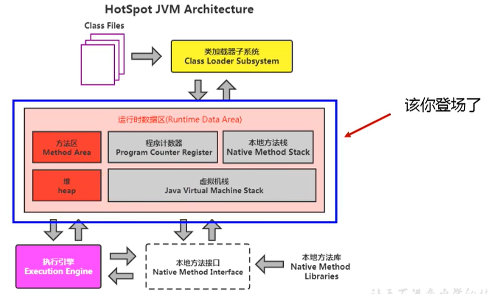
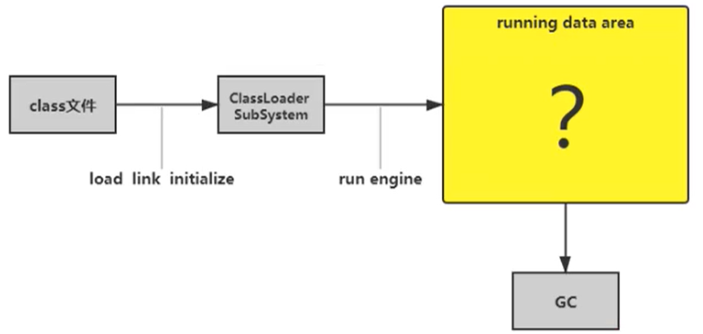
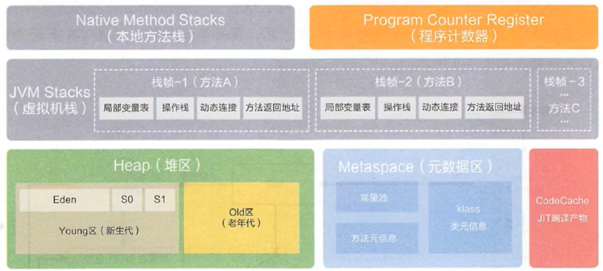
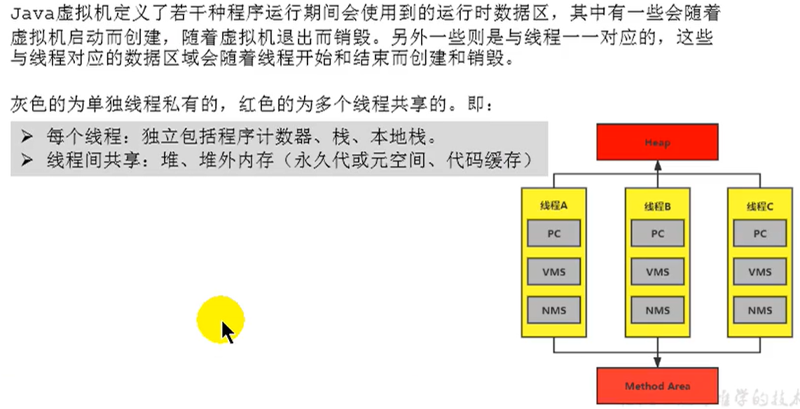
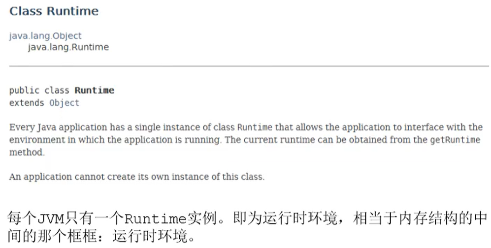
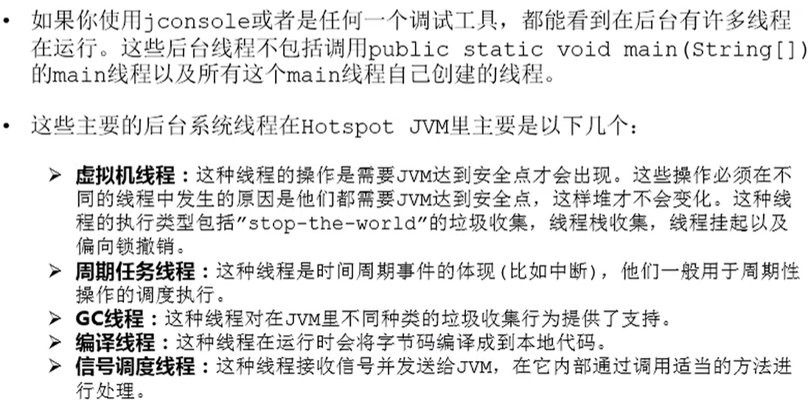

# 第3章 运行时数据区

## 1 概述

* 内存是非常重要的系统资源，是硬盘和CPU的中间仓库及桥梁，承载着操作系统和应用程序的实时运行。JVM内存布局规定了Java在运行过程中内存申请、分配、管理的策略，保证了JVM的高效稳定运行。**不同的JVM对于内存的划分方式和管理机制存在着部分差异**。结合JVM虚拟机规范，来探讨一下经典的JVM内存布局。

* GC调优95%都在堆区，5%在方法区（JDK8之前叫做永久代，JDK8及以后叫做元空间）

## 2 线程

* 线程是一个程序里的运行单元。JVM允许一个应用有多个线程并行的执行。
* 在Hotsopt JVM里，每个线程都与操作系统的本地线程直接映射。
  * 当一个Java线程准备好执行以后，此时一个操作系统的本地线程也同时创建。Java线程执行终止后，本地线程也会回收。
* 操作系统负责所有线程的安排调度到任何一个可用的CPU熵。一旦本地线程初始化成功，它就会调用Java线程中的run()方法。

