# 第5章 虚拟机栈

## 1 虚拟机栈概述

* 官网：https://docs.oracle.com/javase/specs/jvms/se8/html/jvms-2.html#jvms-2.5.2

  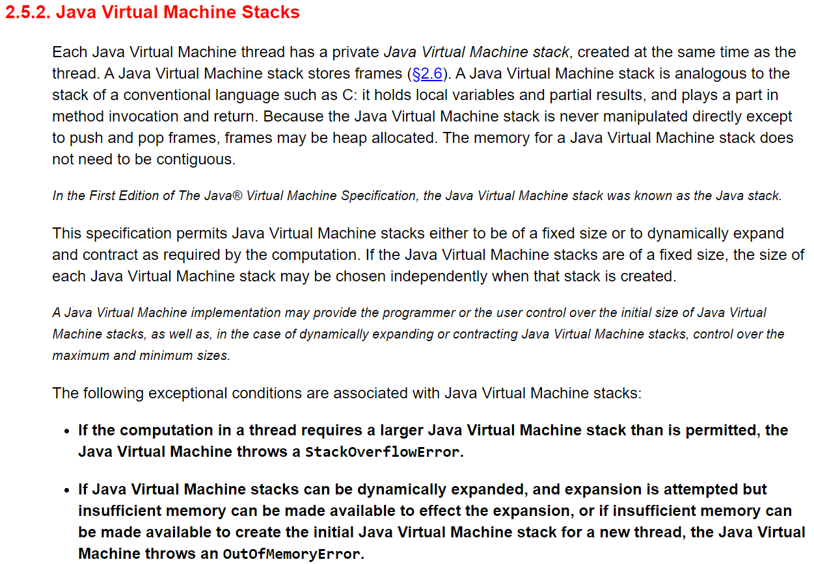

* 虚拟机栈出现的背景

  * 由于跨平台性的设计，Java的指令都是根据栈来设计的。不同平台CPU架构不同，所以不能设计为基于寄存器的。
  * <font color=red>**优点是扩平台，指令集小，编译器容易实现；缺点是性能下降，实现同样的功能需要更多的指令**</font>。

* 初步印象：有不少Java开发人员一提到Java内存结构，就会非常粗粒度地将JVM中的内存理解为仅有Java堆（heap）和Java栈（stack）,为什么？因为C语言就是这样划分的

* 内存中的栈和堆

  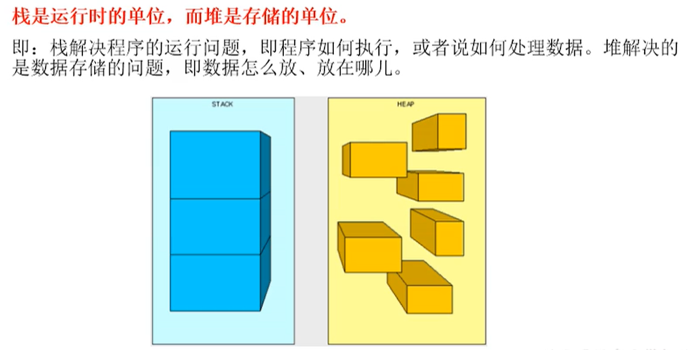

* 虚拟机栈基本内容

  * Java虚拟机栈是什么？
    * Java虚拟机栈（Java Virtual Machine Stack），早期也叫Java栈。每个线程在创建时都会创建一个虚拟机栈，其内部保存一个个的栈帧（Stack Frame）
    * 是线程私有的
  * 声明周期：与线程一致。
  * 作用：主管Java程序的运行，它保存方法的局部变量（8种基本数据类型、对象的引用地址）、部分结果，并参与方法的调用和返回。
    * 局部变量  *vs*  成员变量（或属性）
    * 基本数据类型  *vs*  引用数据类型（类、数组、接口）

  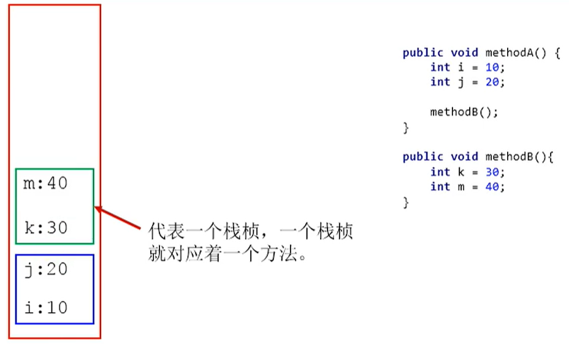

  * 栈的特点（优点）

    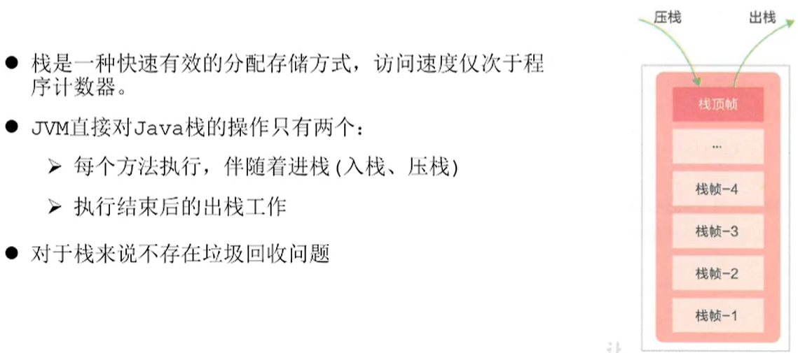

    对于程序寄存器：不存在GC、不存在OOM

    对于虚拟机栈：不存在GC、只存在OOM

    对于堆和方法区：存在GC、存在OOM

* 面试题：开发中遇到的异常有哪些？

  * 空指针异常、数组越界异常、类型转换异常等

  * 虚拟机栈中可能存在的异常

    * Java虚拟机规范允许<font color=red>**Java虚拟机栈的大小是动态的或者是固定不变的**</font>。

      * 如果采用固定大小的Java虚拟机栈，那么每一个线程的Java虚拟机栈容量容量可以在线程创建的时候独立选定。如果线程请求分配的栈容量超过Java虚拟机栈允许的最大容量，Java虚拟机将会抛出一个<font color=red>**StackOverflowError**</font>异常。
      * 如果Java虚拟机栈可以动态扩展，并且在尝试扩展的时候无法申请到足够的内存，或者在创建新的线程的时候没有足够的内存去创建对应的虚拟机栈，那Java虚拟机将会抛出一个<font color=red>**OutOfMemoryError**</font>异常。

    * StackOverflowError演示

      ```java
      public class StackErrorTest {
          private static int count = 1;
          public static void main(String[] args) {
              main(args);
          }
      }
      ```

      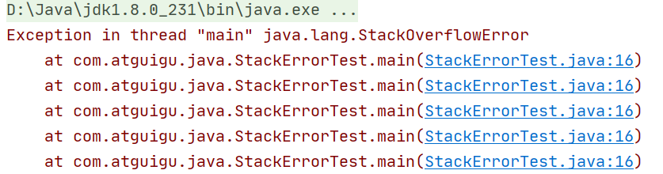

* 设置栈内存大小

  * 我们可以使用参数-Xss 选项来设置线程的最大栈空间，栈的大小直接决定了函数调用的最大可达深度

  * 参考网址：https://docs.oracle.com/en/java/javase/11/tools/java.html#GUID-3B1CE181-CD30-4178-9602-230B800D4FAE

  * idea设置运行时参数：Run--->Edit Configurations    找到当前程序，在VM options中写入参数即可

    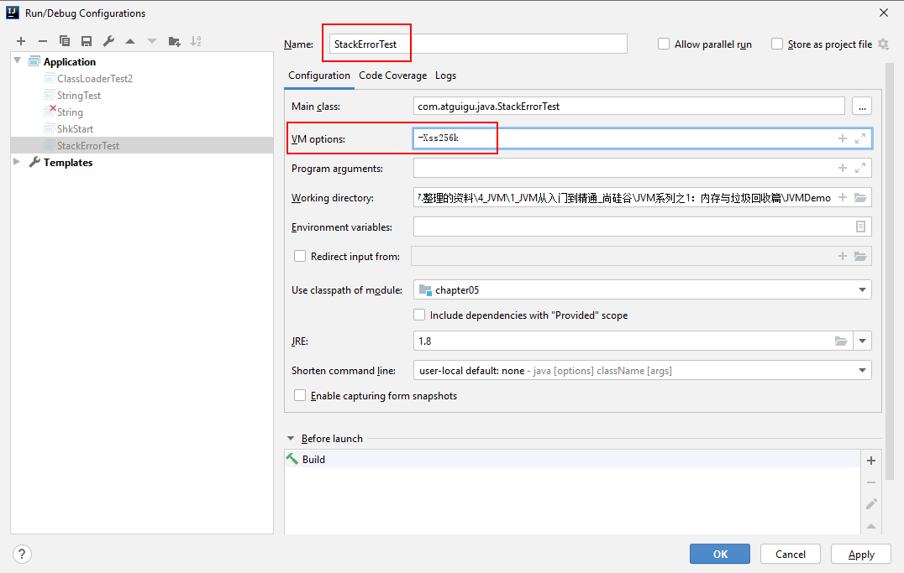

## 2 栈的存储单位

* 栈中存储什么？

  * 每个线程都有自己的栈，栈中的数据都是以<font color=red>**栈帧（Stack Frame）**</font>的格式存在。
  * 在这个线程上正在执行的每个方法都各自对应一个栈帧（Stack Frame）。
  * 栈帧是一个内存区块，是一个数据集，维系着方法执行过程中的各种数据信息。

* 复习

  * OOP的基本概念：类、对象
  * 类中的基本结构：field（属性、字段、域）、method

* 栈运行原理

  * JVM直接对Java栈的操作只有两个，就是对栈帧的<font color=red>**入栈**</font>和<font color=red>**出栈**</font>，遵循<font color=blue>**"先进后出"/“后进先出”原则**</font>。

  * 在一条活动现场中，一个时间点上，只会有一个活动的栈帧。即只有当前正在执行的方法的栈帧（栈顶栈帧）是有效的，这个栈帧被称为<font color=red>**当前栈帧（Current Frame）**</font>，与当前栈帧对应的方法就是<font color=red>**当前方法（Current Method）**</font>，定义这个方法的类就是<font color=red>**当前类（Current Class）**</font>。

    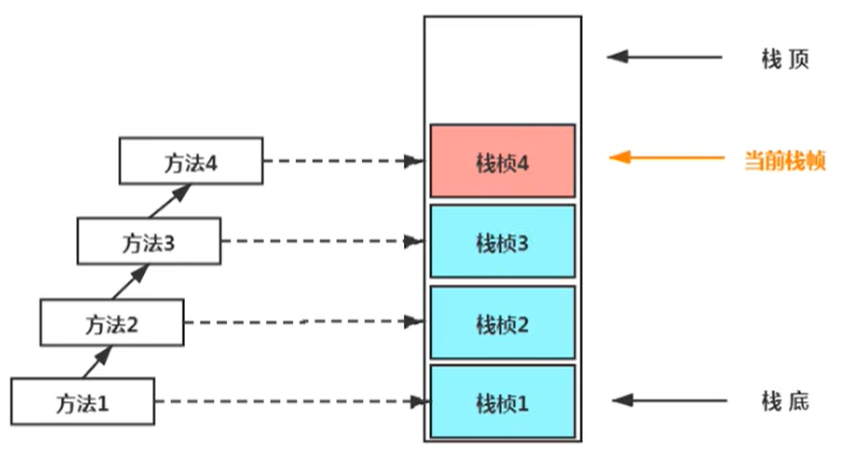

  * 执行引擎运行的所有字节码指令只针对当前栈帧操作。

  * 如果在改方法中调用了其他方法，对应的新的栈帧就会被创建出来，放在栈的顶端，称为新的当前帧。
  
  * 不同线程中锁包含的栈帧是不允许存在相互引用的，即不可能在一个栈帧之中引用另外一个线程的栈帧。
  
  * 如果当前方法调用了其他方法，方法返回之际，当前栈帧会传回此方法的执行结果给前一个栈帧，接着，虚拟机会对齐当前栈帧，使得前一个栈帧重新成为当前栈帧。
  
  * Java方法有两种放回函数的方式，<font color=red>**一种是正常的函数返回，使用return指令**</font>；<font color=red>**另一种是抛出异常**</font>。不管使用哪种方式，都会导致栈帧被弹出。
  
* 栈帧的内部结构

  * <font color=red>**局部变量表（Local Variables）**</font>

  * <font color=red>**操作数栈（Operand Stack）（或表达式栈）**</font>

  * 动态链接（Dynamic Linking）（或指向运行时常量池的方法引用）

  * 方法返回地址（Return Address）（或方法长长退出或者异常退出的定义）

  * 一些附加信息

    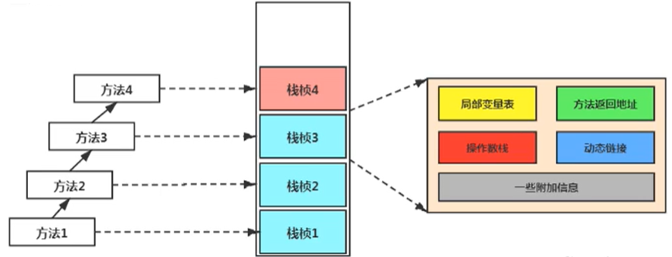

    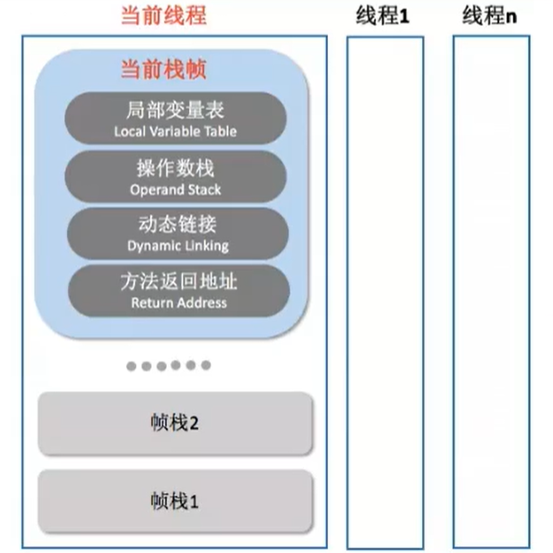

## <font color=red>**3 局部变量表**</font>

* 局部变量表也被称为 **局部变量数组** 或 **本地变量表**

* <font color=red>**定义为一个数字数组，主要用于存储方法参数和定义在方法体内的局部变量**</font>，这些数据类型包括各种基本数据类型、对象引用（reference），以及returnAddress类型。

* 由于局部变量表是建立在线程的栈上，是线程的私有数据，因此<font color=red>**不存在数据安全问题**</font>

* <font color=red>**局部变量表所需要的容量大小是在编译期（前端编译）确定下来的**</font>，并保存在方法的Code属性的maximun local variables数据项中。在方法运行期间是不会改变局部变量表的大小的。

* 代码演示（代码1）

  ```java
  public class LocalVariablesTest {
      private int count = 0;
  
      public static void main(String[] args) {
          LocalVariablesTest test = new LocalVariablesTest();
          int num = 10;
          test.test1();
      }
  
      // 练习：
      public static void testStatic() {
          LocalVariablesTest test = new LocalVariablesTest();
          Date date = new Date();
          int count = 10;
          System.out.println(count);
          // 因为this变量不存在于当前方法的局部变量表中！！
          // System.out.println(this.count);
      }
  
      //关于Slot的使用的理解
      public LocalVariablesTest() {
          this.count = 1;
      }
  
      public void test1() {
          Date date = new Date();
          String name1 = "atguigu.com";
          test2(date, name1);
          System.out.println(date + name1);
      }
  
      public String test2(Date dateP, String name2) {
          dateP = null;
          name2 = "songhongkang";
          double weight = 130.5;  // 占据两个slot
          char gender = '男';
          return dateP + name2;
      }
  
      public void test3() {
          this.count++;
      }
  
      public void test4() {
          int a = 0;
          {
              int b = 0;
              b = a + 1;
          }
          // 变量c使用之前已经销毁的变量b占据的slot的位置
          int c = a + 1;
      }
  
      /*
      变量的分类：按照数据类型分：① 基本数据类型  ② 引用数据类型
                按照在类中声明的位置分：① 成员变量：在使用前，都经历过默认初始化赋值
                                                类变量： linking的prepare阶段：给类变量默认赋值  ---> initial阶段：给类变量显式赋值即静态代码块赋值
                                                实例变量：随着对象的创建，会在堆空间中分配实例变量空间，并进行默认赋值
                                       ② 局部变量：在使用前，必须要进行显式赋值的！否则，编译不通过
       */
      public void test5Temp() {
          int num;
          // System.out.println(num);  // 错误信息：变量num未进行初始化
      }
  }
  ```

  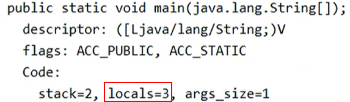

  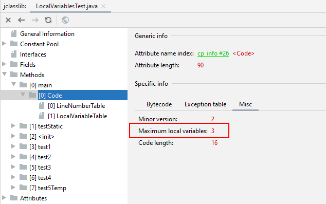

  我们可以看到局部变量表的大小为3（Maximum local variables）

* <font color=red>**方法嵌套调用的次数由栈的大小决定**</font>。一般来说，栈越大，方法嵌套调用的次数越多。对于一个函数而言，它的参数和局部变量越多，使得局部变量表膨胀，它的栈帧越大，以满足方法调用锁需要传递的信息增大的需求。进而函数调用就会占用更多的栈空间，导致其嵌套调用的次数会减少。

* <font color=red>**局部变量表中的变量只在当前方法中有效**</font>。在方法执行时，虚拟机通过使用局部变量表完成参数值到参数变量列表的传递过程。<font color=red>**当方法调用结束后，随着方法栈帧的销毁，局部变量表也会随之销毁**</font>。

* 字节码内部结构剖析：依据代码1

  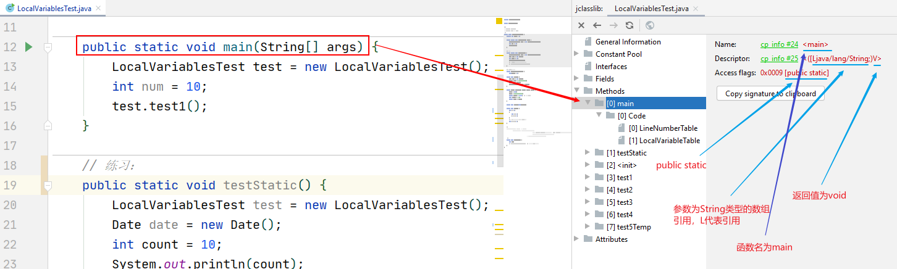

  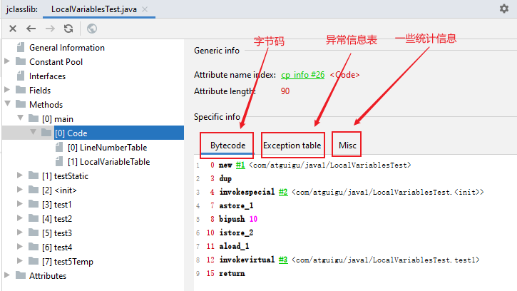

  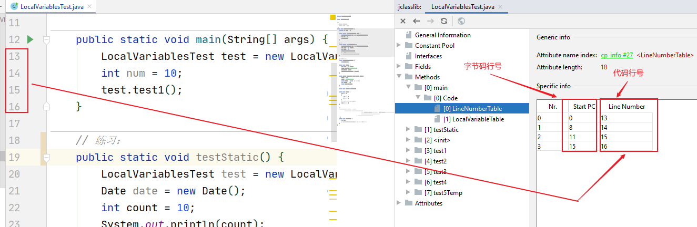

  

* 关于Slot的理解

  * 参数值的存放总是在局部变量数组的index0开始，到数组长度-1的索引结束。

  * 局部变量表，<font color=red>**最基本的存储单元是Slot（变量槽）**</font>

  * 局部变量表中存放编译（前端编译）期可知的各种数据类型（8种），引用类型（reference），returnAddress类型的变量。

  * 在局部变量表里，<font color=red>**32位以内的类型只占用一个slot（包括returnAddress类型），64位的类型（long和double）占用两个slot**</font>.

    * byte、short、char在存储前转化为int，boolean也被转换成int，0表示false，非0表示true。

    * long 和double则占据两个Slot

      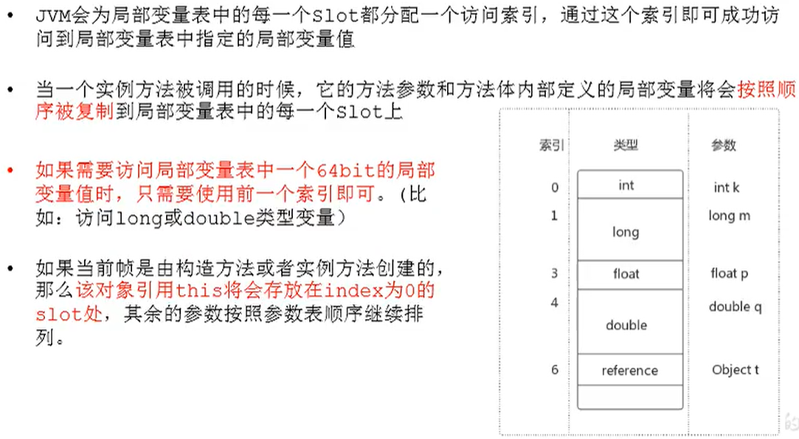

* 关于非静态方法（实例方法）和构造函数局部变量表中的this

  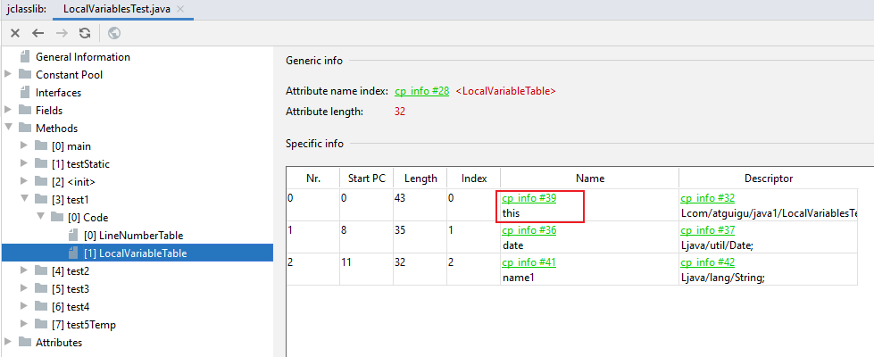

  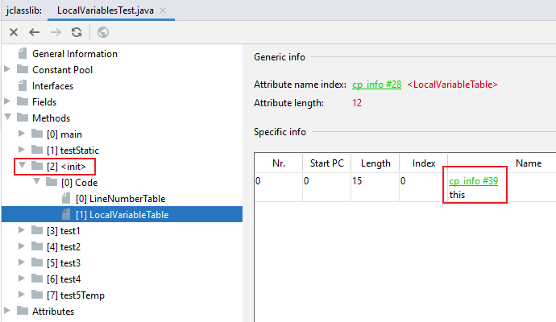

* 关于long和double占用两个slot

  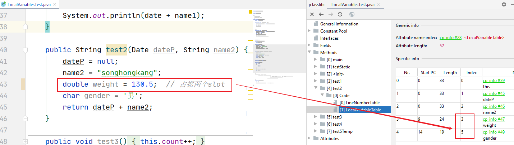

* Slot的重复利用

  * <font color=red>**栈帧中的局部变量表中的曹魏是可以重复利用的**</font>，如果一个局部变量过了其作用域，那么在其作用域之后申明的新的局部变量就很有可能会复用过期局部变量的曹魏，从而<font color=red>**达到节省资源的目的**</font>。

  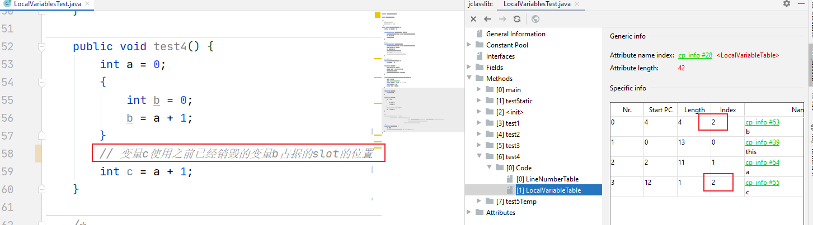

* 变量的分类方式

  * 按照数据类型分：① 基本数据类型  ② 引用数据类型
  * 按照在类中声明的位置分：
    * ① 成员变量：在使用前，都经历过默认初始化赋值
      * 类变量： linking的prepare阶段：给类变量默认赋值  ---> initial阶段：给类变量显式赋值即静态代码块赋值
      * 实例变量：随着对象的创建，会在堆空间中分配实例变量空间，并进行默认赋值
    *  ② 局部变量：在使用前，必须要进行显式赋值的！否则，编译不通过

* 补充说明

  * 在栈帧中，与性能调优关系最为密切的部分就是前面提到的局部变量表。在方法执行时，虚拟机栈使用局部变量表完成方法的传递。
  * <font color=red>**局部变量表中的变量也是重要的垃圾回收根节点，只要被局部变量直接或间接引用的对象都不会被回收**</font>。

## <font color=red>**4 操作数栈（Operand Stack）**</font>

* 栈的实现：可以使用数组或链表来实现，JVM中的操作数栈使用数组实现

* 每一个独立的栈帧处理包含局部变量表以外，还包含一个<font color=red>**后进先出**</font>（Last - In - First Out）的操作数栈，也可以称之为<font color=red>**表达式栈**</font>（Expression Stack）。

* <font color=red>**操作数栈：在方法执行过程中，根据字节码指令，往栈中写入数据或提取数据，即入栈（push）/出栈（pop）**</font>。

  * 某些字节码指令将值亚茹操作数栈，其余的字节码指令将操作数取出栈。使用它们后再将结果压入栈。

  * 比如：执行赋值、交换、求和等操作

    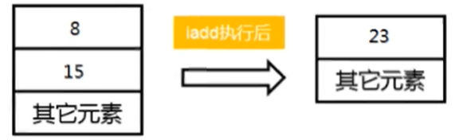

* 操作数栈：<font color=red>**主要用于保存计算过程的中间结果，同时作为计算过程中的变量临时的存储空间**</font>。

* 操作数栈就是JVM执行引擎的一个工作区，当一个方法刚开始执行的时候，一个新的栈帧也会随之被创建出来，<font color=red>**这个方法的操作栈式空的**</font>。

* 每一个操作数栈都会拥有一个明确的站深度用于存储数值，其所需的最大深度在<font color=red>**编译期间（前端编译）**</font>就定义好了，保存在方法的Code属性中，为max_stack的值。

  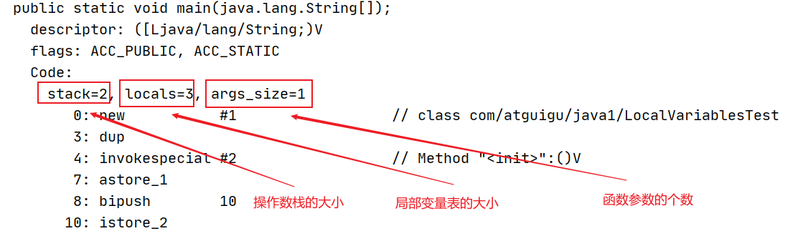

* 栈中的任意一个元素都可以是任意类型的Java数据类型。

  * 32bit的类型占用一个栈单位深度
  * 64bit的类型占用两个栈单位深度

* 操作数栈<font color=red>**并非采用访问索引的方式来进行数据访问的**</font>，而是只能通过标准的入栈和出栈操作来完成数据的一次数据访问。

* <font color=red>**如果被调用的方法带有返回值的话，其返回值将会被压入当前栈帧的操作数栈中**</font>，并更新PC寄存器中下一条需要执行的字节码指令。

  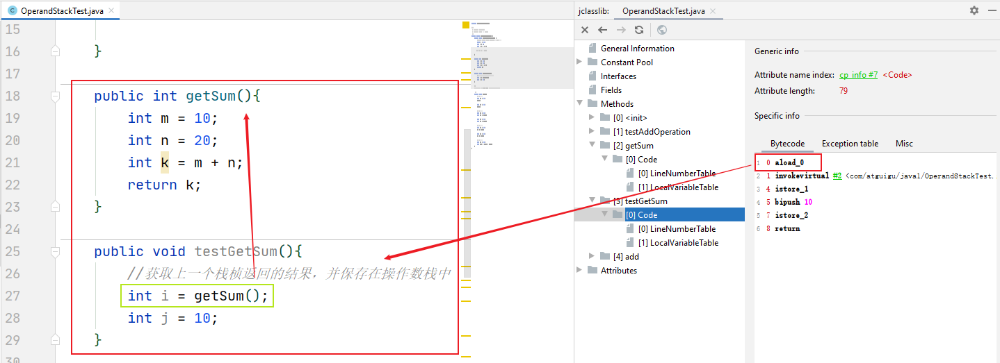

* 操作数栈中元素的数据类型必须与字节码的序列严格匹配，这由编译器在编译期间进行验证，同时在类加载过程中的类检验阶段的数据流分析阶段要再次验证。

* 另外，我们说Java虚拟机的<font color=red>**解释引擎是基于栈的执行引擎**</font>，其中的栈指的就是操作数栈。

## 5 代码追踪

```java
public class OperandStackTest {
    public void testAddOperation() {
        //byte、short、char、boolean：都以int型来保存
        byte i = 15;
        int j = 8;
        int k = i + j;
    }
}
```

javap解析后的结果如下：

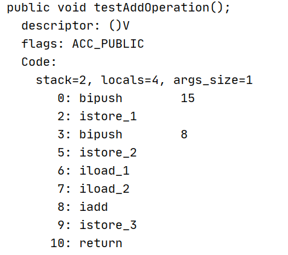

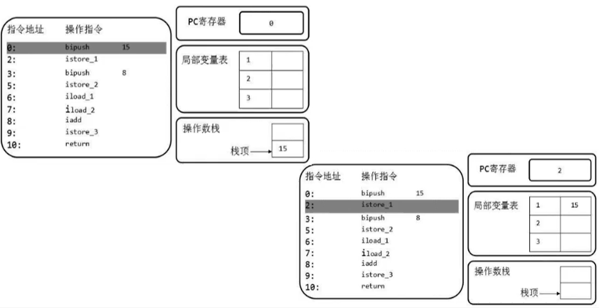

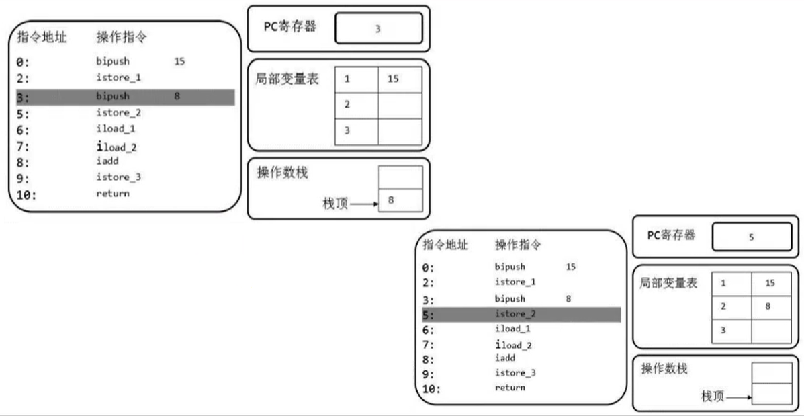

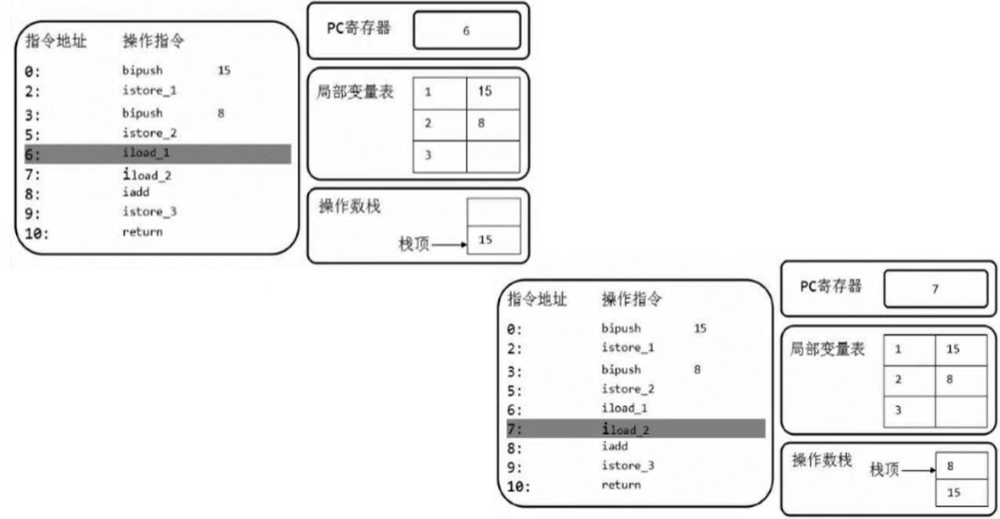

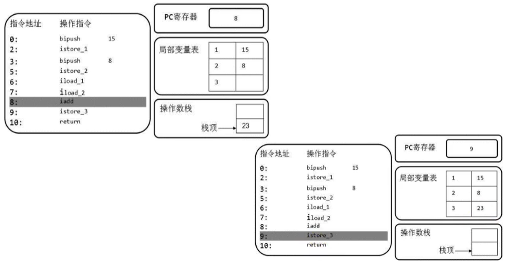

* 程序员面试过程中， 常见的i++和++i 的区别，放到字节码篇章时再介绍。

  ```java
  public class OperandStackTest {
      public void add(){
          //第1类问题：
          int i1 = 10;
          i1++;
  
          int i2 = 10;
          ++i2;
  
          //第2类问题：
          int i3 = 10;
          int i4 = i3++;
  
          int i5 = 10;
          int i6 = ++i5;
  
          //第3类问题：
          int i7 = 10;
          i7 = i7++;
  
          int i8 = 10;
          i8 = ++i8;
  
          //第4类问题：
          int i9 = 10;
          int i10 = i9++ + ++i9;
      }
  }
  ```

## 6 栈顶缓存（Top - of - Stack Cashing）技术

* 前面提过,基于栈式架构的虚拟机所使用的零地址指令更加紧凑,但完成一项操作的时候必须需要使用更多的入栈和出栈指令,这同时也就意味着将需要更多的指令分派(instruction dispatch)次数和内存读/写次数。
* 由于操作数是存储在内存中的,因此频繁地执行内存读/写操作必然会影响执行速度。为了解决这个问题,HotSpot JVM的设计者提出了栈顶缓存(ToS, Top-of-Stack Cashing)技术，**将栈顶元素全部缓存在物理CPU的寄存器中,以此降低对内存的读/写操作,提升执行引擎的执行效率。**

## <font color=red>**7 动态链接**</font>

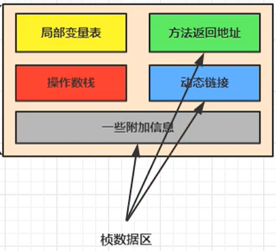

如上图，我们已经讲过了 **局部变量表** 和 **操作数栈**

* 动态链接：又称为指向运行时常量池的方法引用

  * 每一个栈帧内部都包含一个指向<font color=blue>**运行时常量池**</font>中<font color=red>**该栈帧所属方法的引用**</font>。包含这个引用的目的就是为了支持当前方法能够实现<font color=red>**动态链接（Dynamic Linking）**</font>。比如invokedynamic指令

  * 在Java原文件被编译成字节码文件中，所有的变量和方法引用都作为符号引用（Symbolic Referemce）保存在class文件的常量池里。比如：描述一个方法掉调用了另外的方法时，就是通过常量池中指向这些方法的符号引用来表示的，那么<font color=red>**动态链接的做作用就是为了将这些符号引用转换为调用方法的直接引用**</font>。

    ```java
    public class DynamicLinkingTest {
    
        int num = 10;
    
        public void methodA(){
            System.out.println("methodA()....");
        }
    
        public void methodB(){
            System.out.println("methodB()....");
            methodA();
            num++;
        }
    }
    ```

    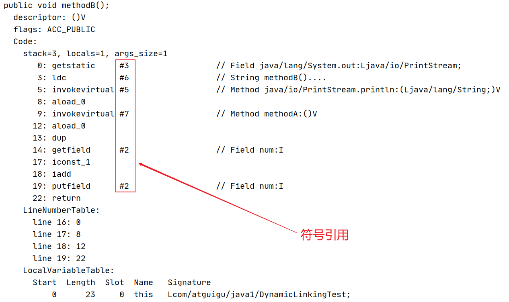

    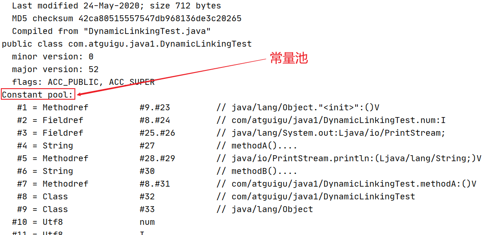

* 动态链接图解

  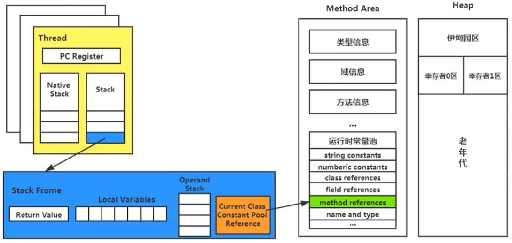

* 动态链接的优点

  * 节省空间，因为多个动态链接可能指向同一个引用
  * 方便动态的实现，编写的时候是父类，运行的时候是子类，方便对子类的调用

* 为什么需要常量池呢？

  * 节省存储，否则编译出的.class文件会很大
  * 提供一些符号和常量，便于指令的识别

## 8 方法的调用：解析与分派

* 在JVM中，将符号引用转化为调用方法的直接引用于方法的绑定机制相关。

  * <font color=red>**动态链接：**</font>
    * 当一个字节码文件被装在近JVM内部时，如果调用的目标方法在<font color=blue>**编译期间（后端编译）**</font>可知，且运行期间保持不变。这种情况下将调用方法的符号引用转为直接引用的过程称之为静态链接。
  * <font color=red>**静态链接：**</font>
    * 如果被调用的方法在编译期间（后端编译）无法被确定下来，也就是说，只能够在程序<font color=blue>**运行期间**</font>将调用的符号引用转为直接引用，由于这种转换过程具备动态性，因此也被称之为动态链接

* 对应的方法的绑定机制为：早期绑定（Early Binding）和晚期绑定（Late Binding）。绑定是一个字段、方法、类在符号引用被替换成直接引用的过程，这仅仅发生一次。

  * <font color=red>**早期绑定：**</font>
    * 早期绑定就是指被调用的目标方法如果在<font color=blue>**编译期间（后端编译）**</font>可知，且运行期间保持不变时，即可将这个方法与所属的类型进行绑定，这样一来，由于明确了被调用的目标方法究竟是哪一个，因此也就可以使用静态链接的方式将符号引用被替换成直接引用。
  * <font color=red>**晚期绑定：**</font>
    * 如果被调用的方法在编译期间（后端编译）无法被确定下来，只能够在程序<font color=blue>**运行期间**</font>根据实际的类型绑定相关的方法，这种绑定方式被称之为晚期绑定。

  ```java
  class Animal {
      public void eat() {
          System.out.println("动物进食");
      }
  }
  
  interface Huntable {
      void hunt();
  }
  
  class Dog extends Animal implements Huntable {
      @Override
      public void eat() {
          System.out.println("狗吃骨头");
      }
  
      @Override
      public void hunt() {
          System.out.println("捕食耗子，多管闲事");
      }
  }
  
  class Cat extends Animal implements Huntable {
  
      public Cat() {
          super();  // 表现为：早期绑定  invokespecial
      }
  
      public Cat(String name) {
          this();  // 表现为：早期绑定  invokespecial
      }
  
      @Override
      public void eat() {
          super.eat();  // 表现为：早期绑定  invokespecial
          System.out.println("猫吃鱼");
      }
  
      @Override
      public void hunt() {
          System.out.println("捕食耗子，天经地义");
      }
  }
  
  public class AnimalTest {
      public void showAnimal(Animal animal) {
          animal.eat();  // 表现为：晚期绑定  invokevirtual
      }
  
      public void showHunt(Huntable h) {
          h.hunt();  // 表现为：晚期绑定  invokevirtual
      }
  }
  ```

* 随着高级语言的横空出世，类似于Java一样的基于面向对象的编程语言如今越来越多，尽管这类编程语言在语法风格上存在一定的差别，但是它们彼此之间始终保持着一个共性，那就是支持<font color=red>**封装、继承、多态**</font>等面向对象特性，既然<font color=red>**这一类编程语言具备多态特性，那么自然也就具备早期绑定和晚期绑定两种绑定方式**</font>。

* Java中的任何一个普通方法（不用static修饰，或final修饰）其实都具备虚函数的特征，他们相当于C++语言中的虚函数（C++中则需要使用关键字virtual来显式定义）。如果Java程序不希望某个方法拥有虚函数特征时，则可以使用final来标记这个方法。

* 虚方法和非虚方法

  * 非虚方法
    * 如果方法在编译期间就确定了具体的调用版本，这个版本在运行时时不可变的。这样的方法属于<font color=red>**非虚方法**</font>。
    * 静态方法、私有方法、final方法、实例构造器、父类方法都是非虚方法。
  * 虚方法：其他的都为虚方法。

* 虚拟机中提供 了以下几条方法调用指令：

  * 普通调用指令
    1. invokestatic：调用静态方法，解析阶段确定唯一方法版本
    2. invokespecial：调用\<init>方法、私有及父类方法，解析阶段确定唯一版本
    3. invokevirtual：调用所有的虚方法
    4. invokeinterface：调用接口方法
  * 动态调用指令
    5. invokedynamic：动态解析出需要调用放入方法，然后执行

  前四条指令固话在虚拟机内部，方法的调用执行不可认为敢于，而invokedynamic指令则支持用户确定方法版本，其中<font color=red>**invokestatic和invokespecial指令调用的方法称为非虚方法，其余的（final修饰的除外）称为虚方法**</font>。

  ```java
  /**
   * 解析调用中非虚方法、虚方法的测试
   * invokestatic指令和invokespecial指令调用的方法称为非虚方法
   */
  class Father {
      public Father() {
          System.out.println("father的构造器");
      }
  
      public static void showStatic(String str) {
          System.out.println("father " + str);
      }
  
      public final void showFinal() {
          System.out.println("father show final");
      }
  
      public void showCommon() {
          System.out.println("father 普通方法");
      }
  }
  
  public class Son extends Father {
      public Son() {
          //invokespecial
          super();
      }
  
      public Son(int age) {
          //invokespecial
          this();
      }
  
      //不是重写的父类的静态方法，因为静态方法不能被重写！
      public static void showStatic(String str) {
          System.out.println("son " + str);
      }
  
      private void showPrivate(String str) {
          System.out.println("son private" + str);
      }
  
      public void show() {
          //invokestatic
          showStatic("atguigu.com");
          //invokestatic
          super.showStatic("good!");
          //invokespecial
          showPrivate("hello!");
          //invokespecial
          super.showCommon();
  
          //invokevirtual
          showFinal();//因为此方法声明有final，不能被子类重写，所以也认为此方法是非虚方法。
          //虚方法如下：
          //invokevirtual
          showCommon();
          info();
  
          MethodInterface in = null;
          //invokeinterface
          in.methodA();
      }
  
      public void info() { }
  
      public void display(Father f) { f.showCommon(); }
  
      public static void main(String[] args) {
          Son so = new Son();
          so.show();
      }
  }
  
  interface MethodInterface {
      void methodA();
  }
  ```

* 关于invokedynamic指令

  * JVM字节码指令集一致比较稳定，直到Java7中才增加了一个invokedynamic指令，这是<font color=red>**Java为了实现[动态类型语言]支持而做的一种改进**</font>。
  * 但是在Java7中并没有直接生成invokedynamic指令，需要借助ASM这种底层字节码工具来产生invokedynamic指令。<font color=blue>**直到Java8的Lambda表达式的出现，invokedynamic指令的生成，在Java中才有了直接的生成方式**</font>。
  * Java7中增加的动态语言类型支持的本质是对Java虚拟机规范的修改，而不是对Java语言规则的修改，这一块相对来讲比较复杂，增加了虚拟机中的方法调用，最直接的受益者就是运行在Java平台的动态语言的编译器。
  * 动态类型语言 *vs.* 静态类型语言
    * 动态类型语言：对于变量类型的检查在编译期间；
    * 静态类型语言：对于变量类型的检查在运行期间；
    * 说的再直白一点就是，<font color=blue>**静态类型语言是判断变量自身的类型信息；动态类型语言是判断变量值的类型信息，变量没有类型信息，变量值才有类型信息，**</font>这是动态语言的一个重要特征。

  ```java
  /**
   * 体会invokedynamic指令
   */
  @FunctionalInterface
  interface Func {
      public boolean func(String str);
  }
  
  public class Lambda {
      public void lambda(Func func) {
          return;
      }
  
      public static void main(String[] args) {
          Lambda lambda = new Lambda();
  
          Func func = s -> {
              return true;
          };
  
          lambda.lambda(func);
  
          lambda.lambda(s -> {
              return true;
          });
      }
  }
  ```

  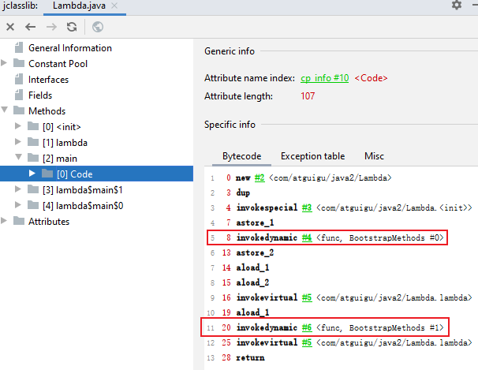

* 方法重写的本质

  * Java语言中方法重写的本质
    1. 找到操作数栈顶的第一个元素所执行的对象的实际类型，记作C。
    2. 如果在在类型C中找到与常量中的描述符合简单名称都相符的方法，则进行访问权限校验，如果通过则返回这个方法的直接引用，查找过程结束；如果不通过，则返回java.lang.IllegalAccessError异常。
    3. 否则，按照继承关系从下往上依次对C的各个父类进行第2步的搜索和验证过程。
    4. 如果始终没有找到合适的方法，则抛出java.lang.AbstractMethodError异常。
  * IllegalAccessError介绍
    * 程序试图访问或修改一个属性或调用一个方法，这个属性或方法，你没有权限访问。一般的，这个会引起编译器异常。这个错误如果发生在运行时，则说明一个类发生了不兼容的改变。

* 虚方法表

  * 在面向对象的编程中，会很频繁的使用到动态分派，如果每次动态分派的过程找那个都要重新在类的方法元数据区中搜索合适的目标的话就可能影响到执行效率。因此，<font color=blue>**为了提高性能，**</font>JVM采用在类的方法区建立一个虚方法表<font color=red>**(virtual method table)(非虚方法不会出现在表中)来实现**</font>。使用索引表来代替查找。

  * 每个类中都有一个虚方法表，表中存放着各个方法的实际入口。

  * 那么虚方法表什么时候被创建？

    * 虚方法表会在类加载子系统的第二大阶段（链接阶段）中的第三小阶段（解析）被创建并开始初始化，类变量初始化准备完成之后，JVM会把该类的方法表也初始化完毕。

  * 举例1

    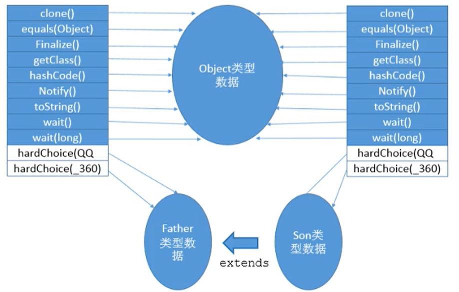

  * 举例2

    ```java
    /**
     * 虚方法表的举例
     */
    interface Friendly {
        void sayHello();
        void sayGoodbye();
    }
    
    class Dog {
        public void sayHello() { }
        public String toString() { return "Dog"; }
    }
    
    class Cat implements Friendly {
        public void eat() { }
        public void sayHello() { }
        public void sayGoodbye() { }
        protected void finalize() { }
        public String toString(){ return "Cat"; }
    }
    
    class CockerSpaniel extends Dog implements Friendly {
        public void sayHello() { super.sayHello(); }
        public void sayGoodbye() { }
    }
    
    public class VirtualMethodTable {
    }
    ```

    

    Dog：

    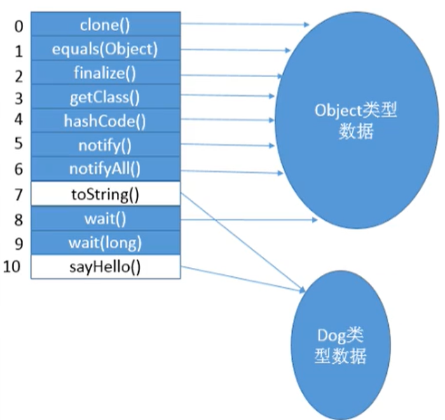

    CockerSpaniel

    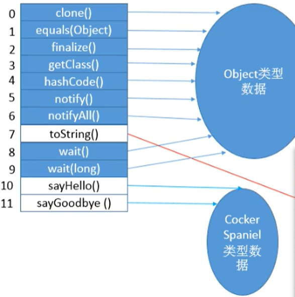

    Cat

    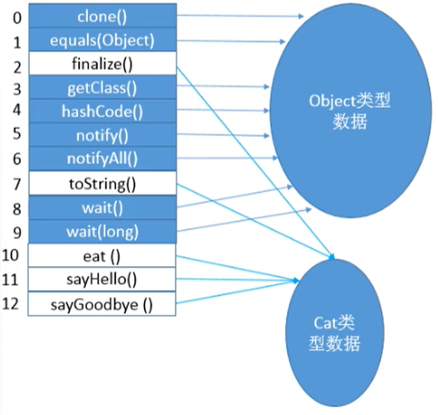

## <font color=red>**9 方法返回地址（return address）**</font>

* 存放调用该方法的pc寄存器的值。

* 一个方法的结束，有两种方式：

  * 正常执行完成
  * 出现未处理的异常，非正常退出

* 无论通过哪种方式退出，在方法退出后都返回到该方法被调用的位置。方法正常退出时，<font color=red>**调用者的pc寄存器的值作为返回地址，即调用该方法的指令的下一条指令的地址**</font>。而通过异常退出的，返回地址时要通过异常表来确定，栈帧一般不会保存这部分信息。

* 当一个方法开始执行后，只有两种方式可以退出这个方法：

  1. 执行引擎遇到一个方法返回的字节码指令（return），会有返回值传递给上层的方法调用者，简称<font color=red>**正常完成出口**</font>。

     * 一个方法在正常调用完成之后究竟需要使用哪一个返回指令还需要根据方法返回值的实际数据类型而定。
     * 在字节码指令中，返回指令包含ireturn（当返回值是boolean、byte、char、short和int类型时使用）、lreturn、freturn、dreturn以及areturn，另外还有一个return指令工声明为void的方法、实例初始化方法、雷和接口的初始化方法使用。

  2. 在方法执行过程中遇到了异常（Exception），并且这个异常没有在方法内进行处理，也就是只要在本方法的异常表中没有搜索到匹配的异常处理器，就会导致方法退出。简称<font color=red>**异常完成出口**</font>。

     * 方法执行过程中抛出异常的异常处理，存储在一个异常处理表，方便在发生异常的时候找到处理异常的代码。

     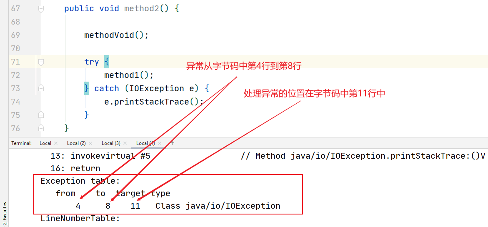

* 本质上，方法的退出就是当前栈帧出栈的过程。此时，需要恢复上层方法的局部变量表、操作数栈、将返回值压入调用者栈帧的操作数栈、设置PC寄存器值等，让调用者方法继续执行下去。

* <font color=red>**正常完成出口和异常完成出口的区别在于：通过异常完成出口退出的不会给他的上层调用者产生任何返回值**</font>。

## 10 一些附加信息

* 栈帧中还允许携带与Java虚拟机实现相关的一些附加信息。例如，对程序调试提供支持的信息。

## 11 栈的相关面试题

* 举例栈溢出的情况？

  * 栈溢出报错：StackOverflowError；
  * 通过-Xss设置栈的大小；
  * 若栈的大小是动态变化的，当因为内存限制无法扩容时，会报出OutOfMemoryError错误。

* 调整栈大小，就能保证不出现溢出吗？

  * 不能，比如递归调用没有终止条件。

* 分配的栈内存越大越好吗？

  * 不是，栈大了其他内容就小了

* 垃圾回收是否会涉及到虚拟机栈？

  * 垃圾回收不会涉及到虚拟机栈
  * 扩展
    * 对于程序寄存器：不存在GC、不存在OOM
    * 对于虚拟机栈和本地方法栈：不存在GC、只存在OOM
    * 对于堆和方法区：存在GC、存在OOM

* 方法中定义的局部变量是否是线程安全？

  * 具体问题具体分析

  * 例子

    ```java
    /**
     * 面试题：
     * 方法中定义的局部变量是否线程安全？具体情况具体分析
     * 
     * 何为线程安全？
     * 如果只有一个线程才可以操作此数据，则必是线程安全的。
     * 如果有多个线程操作此数据，则此数据是共享数据。如果不考虑同步机制的话，会存在线程安全问题。
     *
     */
    public class StringBuilderTest {
    
        int num = 10;
    
        // s1的声明方式是线程安全的
        public static void method1() {
            // StringBuilder:线程不安全
            StringBuilder s1 = new StringBuilder();
            s1.append("a");
            s1.append("b");
            // ...
        }
    
        // sBuilder的操作过程：是线程不安全的
        public static void method2(StringBuilder sBuilder) {
            sBuilder.append("a");
            sBuilder.append("b");
            // ...
        }
    
        // s1的操作：是线程不安全的
        public static StringBuilder method3() {
            StringBuilder s1 = new StringBuilder();
            s1.append("a");
            s1.append("b");
            return s1;
        }
    
        // s1的操作：是线程安全的
        public static String method4() {
            StringBuilder s1 = new StringBuilder();
            s1.append("a");
            s1.append("b");
            return s1.toString();
        }
    
        public static void main(String[] args) {
            StringBuilder s = new StringBuilder();
            
            new Thread(() -> {
                s.append("a");
                s.append("b");
            }).start();
    
            method2(s);
            System.out.println(s);
        }
    }
    ```

    