# 第8章 堆

* 整个系列学习路线


## 1 堆的核心概述

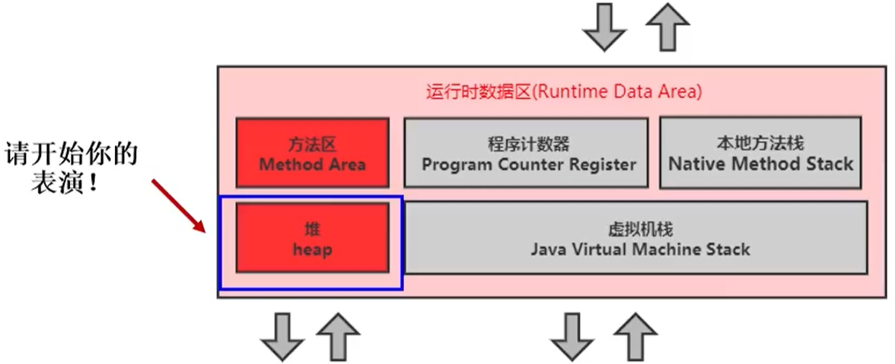

* 每个进程对应一个JVM实例，对应一个Runtime；一个进程对应多个线程，一个线程对应一个程序计数器、虚拟机栈、本地方法栈。一个进程中的线程要共享堆空间和方法区

* 一个JVM实例只存在一个堆内存，堆也是Java内存管理的核心区域，演示如下：

  ```java
  /**
   * -Xms10m -Xmx10m
   */
  public class HeapDemo {
      public static void main(String[] args) {
          System.out.println("start...");
          try {
              Thread.sleep(1000000);
          } catch (InterruptedException e) {
              e.printStackTrace();
          }
          System.out.println("end...");
      }
  }
  ```

  ```java
  /**
   * -Xms20m -Xmx20m
   */
  public class HeapDemo1 {
      public static void main(String[] args) {
          System.out.println("start...");
          try {
              Thread.sleep(1000000);
          } catch (InterruptedException e) {
              e.printStackTrace();
          }
          System.out.println("end...");
      }
  }
  ```

  运行程序后，使用jdk8自带的jvisualvm.exe查看程序的详细信息

  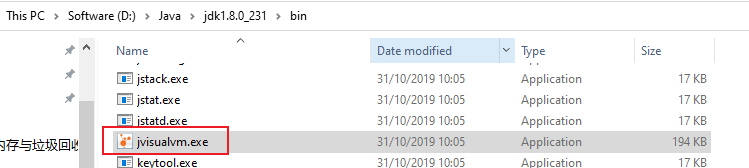

  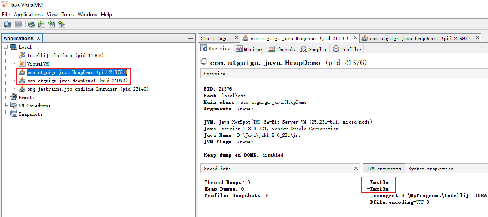

  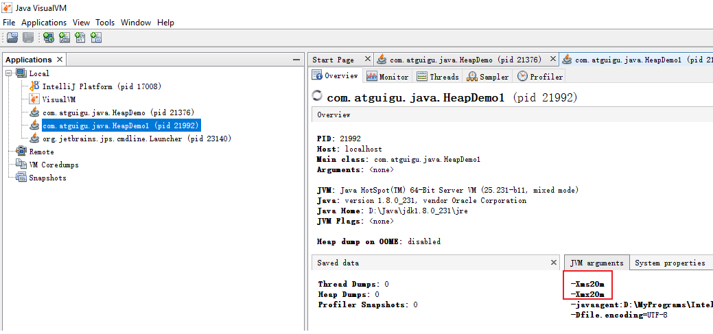

  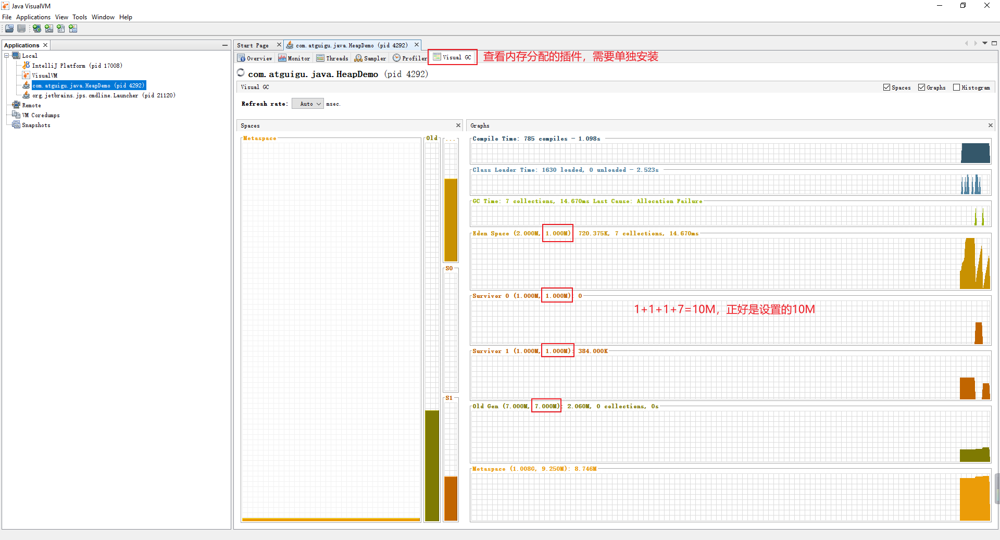

* Java堆区在JVM启动的时候即被创建，其空间大小也就确定了。是JVM管理的最大一块内存空间

  * 堆内存的大小是可以调节的

* 《Java虚拟机规范》规定，堆可以处于物理上不连续的内存够空间中，但是逻辑上它应该被视为连续的。

* 所有的线程共享Java堆，在这里还可以划分线程私有的缓冲区（Thread Local Allocation Buffer，TLAB），这样可以提高并发性

---

* 《Java虚拟机规范》中对Java堆的描述是：<font color=red>**所有的对象实例以及数组**</font>都应当在运行时分配到堆上。（The heap is the run-time data area from which memory for all class instances and arrays is allocated）

  * 我要说的是：“几乎”所有的对象实例都是在堆上分配内存。------从实际使用角度看的。

* 数组和对象可能永远不会存储在沾上，因为栈帧中保存引用，这个引用指向对象或者数组在堆中的位置。

* 在方法结束后，堆中的对象不会马上被移除，仅仅在垃圾回收的时候才会被移除。

* 堆，是GC（Garbage Collection）执行垃圾回收的重点区域

* 代码演示

  ```java
  public class SimpleHeap {
      private int id;  // 属性、成员变量
  
      public SimpleHeap(int id) {
          this.id = id;
      }
  
      public void show() {
          System.out.println("My ID is " + id);
      }
  
      public static void main(String[] args) {
          SimpleHeap sl = new SimpleHeap(1);
          SimpleHeap s2 = new SimpleHeap(2);
  
          int[] arr = new int[10];
          Object[] arr1 = new Object[10];
      }
  }
  ```

  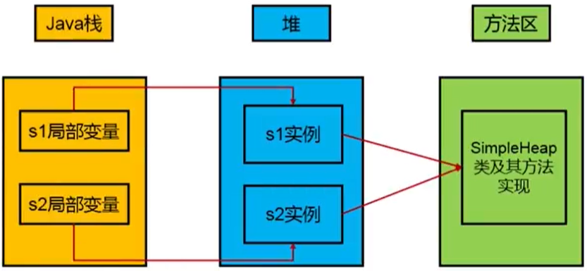

  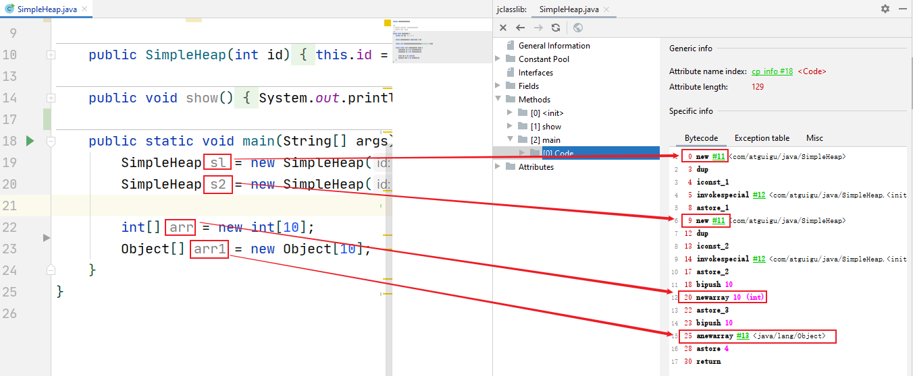

---

* 内存细分

  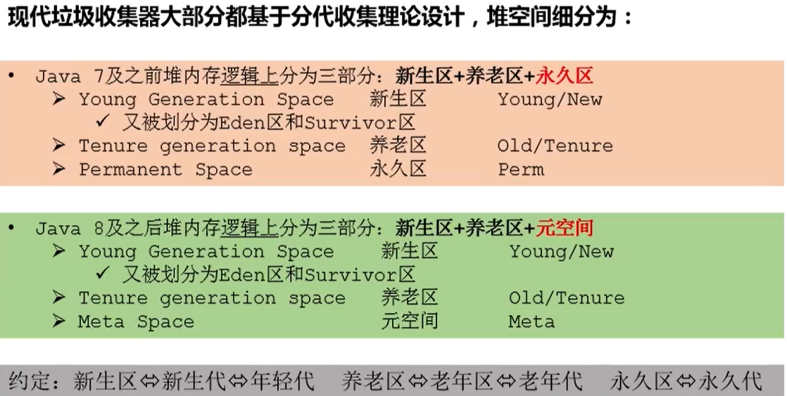

  * 堆空间内部结构（JDK7）

    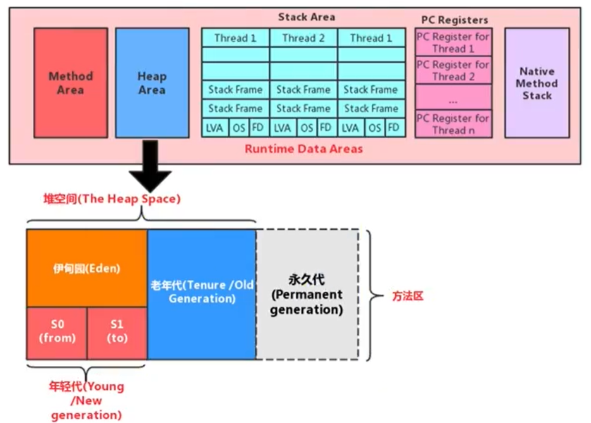

    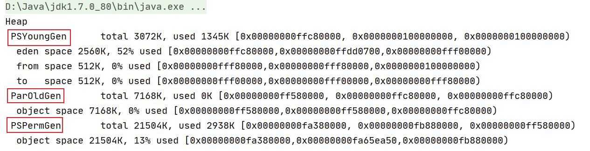

  * 堆空间内部结构（JDK8）

    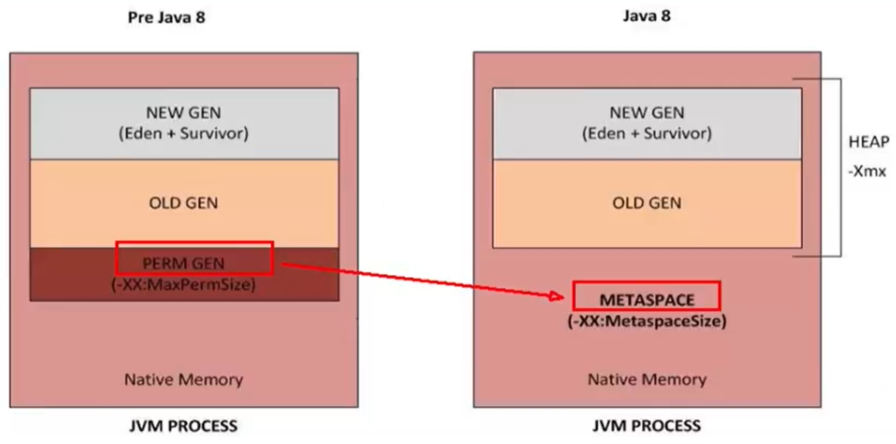

    对于前面的SimpleHeap，设置参数：-Xms10m -Xmx10m -XX:+PrintGCDetails	运行后的结果如下：

    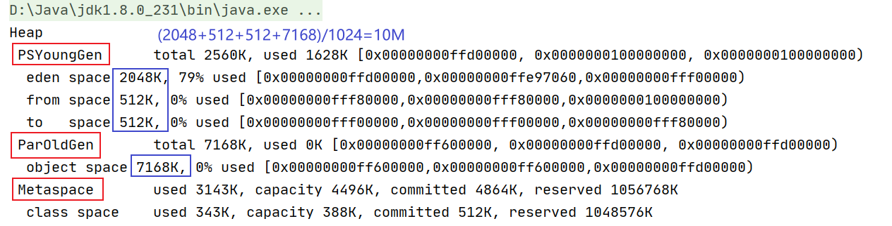

## 2 设置堆内存大小与OOM

* 堆空间大小的设置

  * Java堆空间用于存储Java对象实例，那么堆的大小在JVM启动时就已经设定好了，大家可以通过选项“-Xms”和"-Xmx"来进行设置。

    * “-Xms”用于标识堆区的起始内存，等价于-XX:InitialHeapSize
    * “-Xmx”则用于标识堆区的最大内存，等价于-XX:MaxHeapSize

  * 一旦堆区的内存大小超过“-Xmx”所指定的最大内存时，将会抛出OutOfMemoryError异常。

  * 通常会将“-Xms”和“-Xmx”两个参数设置成相同的值，其<font color=red>**目的是为了能够在java垃圾回收机制清理完堆区后不需要重新分隔计算堆区的大小，从而提高性能**</font>。

  * 默认情况下，初始内存大小：物理电脑内存大小 / 64

    ​						最大内存大小：物理电脑内存大小 / 4

  ```java
  /**
   * 1. 设置堆空间大小的参数
   * -Xms 用来设置堆空间（年轻代+老年代）的初始内存大小
   *      -X 是jvm的运行参数
   *      ms 是memory start
   * -Xmx 用来设置堆空间（年轻代+老年代）的最大内存大小
   *
   * 2. 默认堆空间的大小
   *    初始内存大小：物理电脑内存大小 / 64
   *             最大内存大小：物理电脑内存大小 / 4
   * 3. 手动设置：-Xms600m -Xmx600m
   *     开发中建议将初始堆内存和最大的堆内存设置成相同的值。原因是扩容缩容会造成服务器不必要的压力
   *
   * 4. 查看设置的参数：方式一： jps   /  jstat -gc 进程id
   *                  方式二：-XX:+PrintGCDetails
   */
  public class HeapSpaceInitial {
      public static void main(String[] args) {
  
          // 返回Java虚拟机中的堆内存总量
          long initialMemory = Runtime.getRuntime().totalMemory() / 1024 / 1024;
          // 返回Java虚拟机试图使用的最大堆内存量
          long maxMemory = Runtime.getRuntime().maxMemory() / 1024 / 1024;
  
          System.out.println("-Xms : " + initialMemory + "M");
          System.out.println("-Xmx : " + maxMemory + "M");
  
          System.out.println("系统内存大小为：" + initialMemory * 64.0 / 1024 + "G");
          System.out.println("系统内存大小为：" + maxMemory * 4.0 / 1024 + "G");
  
          try {
              Thread.sleep(1000000);
          } catch (InterruptedException e) {
              e.printStackTrace();
          }
      }
  }
  ```

  **如果没有设置任何参数，则结果：**

  ​			-Xms : 245M

  ​			-Xmx : 3614M

  ​			系统内存大小为：15.3125G

  ​			系统内存大小为：14.1171875G

  **如果设置参数-Xms600m -Xmx600m，此时值关注前两项结果：**

  ​			-Xms : 575M

  ​			-Xmx : 575M

  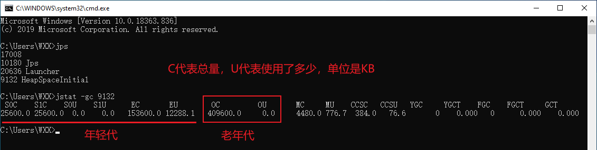

  不是600M，因为幸存者区有两个，但是只计算了一个

  (25600+25600+153600+409600) / 1024 = 600M

  (25600+153600+409600) / 1024 = 575M

  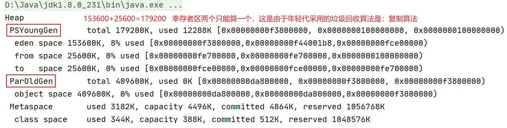

* OOM：OutOfMemoeyError

  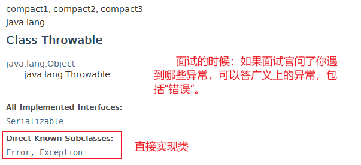

  * 代码演示

  ```java
  public class OOMTest {
      public static void main(String[] args) {
          ArrayList<Picture> list = new ArrayList<>();
          while (true) {
              try {
                  Thread.sleep(20);
              } catch (InterruptedException e) {
                  e.printStackTrace();
              }
              list.add(new Picture(new Random().nextInt(1024 * 1024)));
          }
      }
  }
  
  class Picture {
      private byte[] pixels;
  
      public Picture(int length) {
          this.pixels = new byte[length];
      }
  }
  ```

  **结果：**

  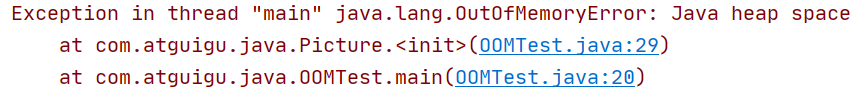

  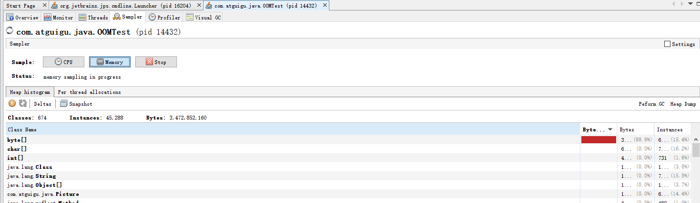

## 3 年轻代与老年代

* 存储在JVM中的Java对象可以被划分为两类：
  * 一类是声明周期较短的瞬时对象，这类对象的创建和消亡都非常迅速
  * 另一类对象的声明周期非常长，在某些极端的情况下还能够与JVM的生命周期保持一致。
* Java堆区进一步细分的话，可以划分为年轻代（YoungGen）和老年代（OldGen）
* 其中年轻代又可以划分为Eden空间、Survivor0空间和Survivor1空间（有时也叫做from区、to区，谁空谁为to区）

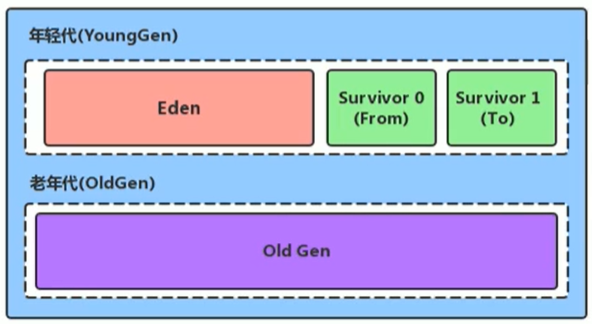

---

* 下面的参数开发中一般不会调：

  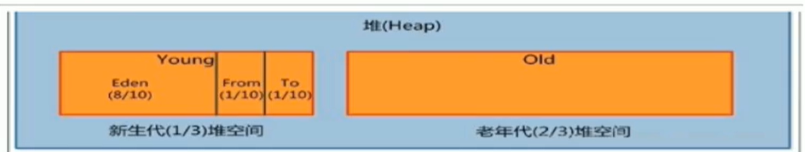

* 配置新生代和老年代在堆结构的占比

  * 默认**-XX:NewRatio=2**，表示新生代占1，老年代占2，新生代占整个堆的1/3

  * 可以修改**-XX:NewRatio=4**，表示新生代占1，老年代占4，新生代占整个堆的1/5

  * 代码演示

    ```java
    /**
     * -Xms600m -Xmx600m
     *
     * -XX:NewRatio ： 设置新生代与老年代的比例。默认值是2.
     * -XX:SurvivorRatio ：设置新生代中Eden区与Survivor区的比例。默认值是8
     * -XX:-UseAdaptiveSizePolicy ：关闭自适应的内存分配策略  （暂时用不到）
     * -Xmn:设置新生代的空间的大小。 （一般不设置）
     */
    public class EdenSurvivorTest {
        public static void main(String[] args) {
            System.out.println("我只是来打个酱油~");
            try {
                Thread.sleep(1000000);
            } catch (InterruptedException e) {
                e.printStackTrace();
            }
        }
    }
    ```

    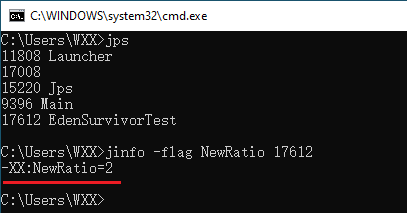

---

* 在HotSpot中，Eden空间和另外两个Survivor空间缺省所占的比例是8:1:1

  * 但实际上比例是6:1:1，即使关闭自适应机制（-XX:-UseAdaptiveSizePolicy）也是6:1:1，即使通过命令（jinfo -flag NewRatio）查看看到的数值是8

    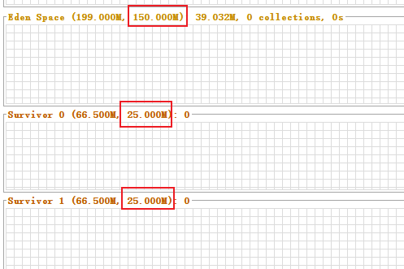

    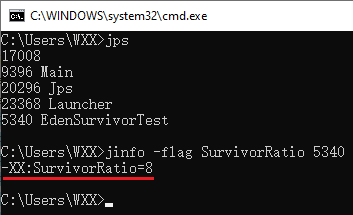

    想要变成8:1:1可以通过设置“-XX:SurvivorRatio=8”实现

* 当然开发人员可以通过选项“-XX:SurvivorRatio”调整这个空间比例。比如-XX:SurvivorRatio=8

* <font color=red>**几乎所有的**</font>Java对象都是在Eden去被new出来的。

  * 如果对象太大，Eden放不下，需要直接放到老年区，仍然放不下的话，会报错。

* 绝大部分Java对象的销毁都在新生代进行了。

  * IBM公司的专门研究表明，新生代中80%的对象都是“朝生夕死”的。

* 可以使用选项“-Xmn”设置新生代最大内存大小

  * 这个参数一般使用默认值就可以了。
  * 如果这个参数和"-XX:NewRatio"产生矛盾，以“-Xmn”为准

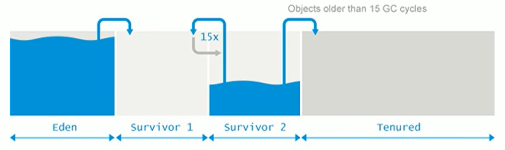

## 4 图解对象分配过程

* 概述：为新对象分配内存是一件非常严谨和复杂的任务，JVM的设计者们不仅需要考虑内存如何分配、在哪里分配等问题，并且由于内存分配算法与内存回收算法密切相关，所以还需要考虑GC执行完内存回收后是否会在内存空间中产生内存碎片。

  1. new的对象首先放到伊甸园区。此区有大小限制。

  2. 当伊甸园区的空间填满时，程序又需创建对象，JVM的垃圾回收器会对伊甸园区进行垃圾回收（Minor GC / Young GC），将伊甸园区中的不再被其他对象所引用的对象进行销毁。再加载新的对象到伊甸园区

  3. 然后将伊甸园区中的剩余对象移动到幸存者0区。

  4. 如果再次出发垃圾回收，此时上次幸存下来的放到幸存者0区，如果没有回收，就会放到幸存者1区。

  5. 如果再次经历垃圾回收，此时会重新放回幸存者0区，接着再去幸存者1区。

  6. 啥时候能去养老区呢？可以设置次数。默认是15次。

     * <font color=red>**可以设置参数：-XX:MaxTenuringThreshold=<N>进行设置**</font>。

       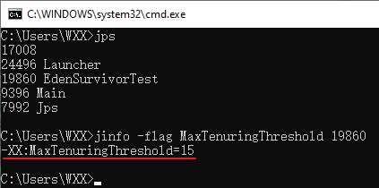

  7. 在养老区，相对悠闲。当养老区内存不足时，再次出发：Major GC，进行养老区的内存清理。

  8. 若养老区执行了Major GC之后发现依然无法进行对象的保存，就会产生OOM异常

     * <font color=red>**java.lang.OutOfMemoryError: Java heap space**</font>

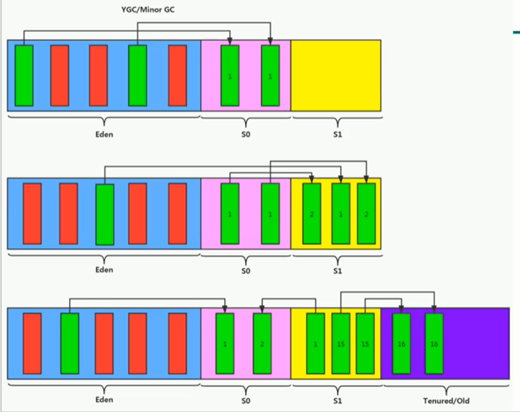

* 注意点：当幸存者区满的时候不会出发Young GG；但是当伊甸园区满的时候，会出发Young GC，同时也会对幸存者区进行GC；幸存者区被动GC
* 总结：
  * <font color=red>**针对幸存者s0，s1区的总结：复制之后有交换，谁空谁是to**</font>。
  * <font color=red>**关于垃圾回收：频繁收集新生代，较少收集老年代，几乎不动永久区/元空间**</font>。

* 对象分配详细过程

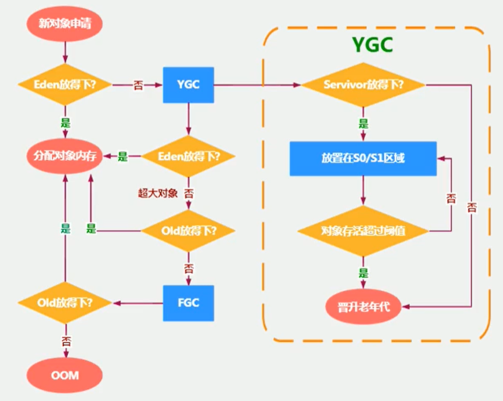

---

* 常用的调优工具
  * JDK命令行：jstat、jinfo、javap、jmap等命令
  * Eclipse：Memory Analyzer Tool
  * Jconsole
  * VisualVM
  * Jprofiler
  * Java Flight Recorder
  * GCViewer
  * GC Easy

## 5 Minor GC、Major GC、Full GC

* JVM在进行GC时，并非每次都对上面三个内存（新生代、老年代；方法区）区域一起回收的，大部分时候回收的都是指新生代。
* 针对HotSpot VM的实现，它里面的GC按照回收区域又分为两大种类型：一种是部分收集（Partial GC），一种是整堆收集（Full GC）
  * 部分收集：不是完整收集整个Java堆的垃圾收集，其中又分为：
    * 新生代收集（Minor GC / Young GC）：知识新生代（Eden / S0，S1）的垃圾收集
    * 老年代收集（Major GC / Old GC）：知只是老年代的垃圾收集。
      * 目前，只有CMS GC（一个并发的垃圾回收器）会有单独收集老年代的行为。
      * <font color=red>**注意，很多时候Major GC会和Full GC混淆使用，需要具体分辨是老年代回收还是整堆回收**</font>。
    * 混合收集（Mixed GC）：收集整个新生代以及部分老年代的垃圾回收
      * 目前，只有G1 GC才会有这种行为，这是由于G1是分为region的
  * 整堆回收（Full GC）：收集整个java堆和方法区的垃圾回收。

---

* 最简单的分代式GC策略的出发条件

  * 年轻代GC（Minor GC / Young GC）触发机制：
    * 当新生代空间不足时，就会触发Minor GC，这里的年轻代满指的是Eden代满，Survivor满不会引发GC。（每次Minor GC会清理年轻代的内存）。
    * 因为Java对象<font color=red>**大多都具备朝生夕灭**</font>的特性，所以Minor GC会非常频繁，一般回收速度也比较快。这一定义既清晰又利于理解。
    * Minor GC会引发STW，暂停其他用户的线程，等垃圾回收结束，用户线程才回复运行。

  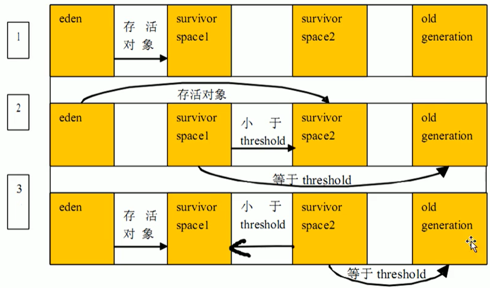

  * 老年代GC（Major GC / Full GC）触发机制：
    * 指发生在老年代的GC，对象从老年代消失时，我们说"Major gc"或“Full GC"发生了。
    * 出现了Major GC，经常会伴随至少一次Minor GC（但非绝对的，在Parallel Scavenge收集器的收集策略里就有直接进行Major GC的策略选择过程）。
      * 也就是在老年代空间不足时，会先尝试触发Minor GC。如果之后空间还不足，则会触发Major GC
    * Major GC的速度一般会比Minor GC慢10倍以上，STW的时间更长。
    * 如果Major GC后，内存还不足，就报OOM了。

* Full GC触发机制：（<font color=red>**后面细讲**</font>）

  * 触发Full GC执行的情况有如下5种：
    1. 调用System.gc()时，系统建议执行Full GC，但是不必然执行
    2. 老年代空间不足
    3. 方法区空间不足
    4. 通过Minor GC后进入老年代的平均大小大于老年代的可用内存
    5. 由Eden区、From Space区向To Space区复制时，对象的大小大于To Space可用内存，则把该对象转存到老年代，且老年代的可用内存小于该对象大小
  * 说明：<font color=red>**Full GC 是开发或调优中尽量要避免的。这样暂停时间会短一些**</font>。

---

* 代码例子

  ```java
  /**
   * 测试MinorGC 、 MajorGC、FullGC
   * -Xms9m -Xmx9m -XX:+PrintGCDetails
   */
  public class GCTest {
      public static void main(String[] args) {
          int i = 0;
          try {
              List<String> list = new ArrayList<>();
              String a = "atguigu.com";
              while (true) {
                  list.add(a);
                  a = a + a;
                  i++;
              }
          } catch (Throwable t) {
              t.printStackTrace();
              System.out.println("遍历次数为：" + i);
          }
      }
  }
  ```

  **设置参数-Xms9m -Xmx9m -XX:+PrintGCDetails后的运行效果：**

  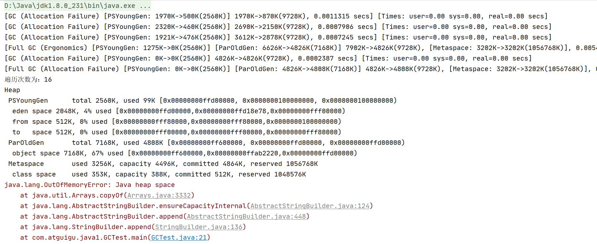

## 6 堆空间分代思想

* <font color=red>**为什么需要把Java堆分代？不分代就不能正常工作了吗？**</font>

  * 经研究，不同对象的生命周期不同。70%-99%的对象是临时对象。
    * 新生代：有Eden、两块大小相同的Survivor（又称为from/to，s0/s1）构成，to总为空。
    * 老年代：存放新生代中经历多次GC仍然存活的对象。

  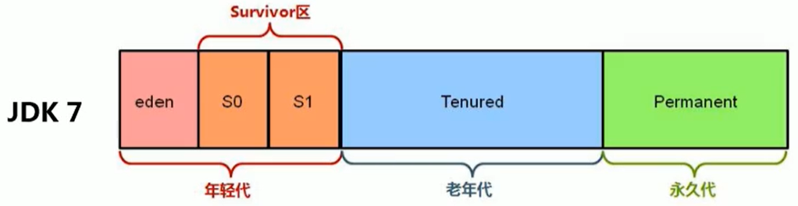

  * 其实不分代完全可以，<font color=red>**分代的唯一理由就是优化GC性能。**</font>如果没有分代，那所有的对象都在一块，就如同把一个学校的人都关在一个教室。GC的时候要找到哪些对象没用，这样就会对堆的所有区域进行扫描。而很多对象都是朝生夕死的，如果分代的话，把新创建的对象放到某一地方，当GC的时候先把这块存储“朝生夕死”对象的区域进行回收，这样就会腾出很大的空间出来。

  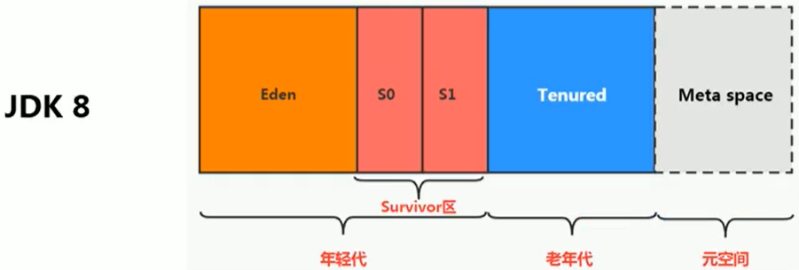

## 7 内存分配策略（对象提升（Promotion）规则）

* 如果对象在Eden出生并经过第一次Minor GC后仍然存活，并且能被Survivor容纳的话，将被移动到Survivor空间中，并将对象年龄设为1。对象在Survivor区每熬过一个Monor GC，年龄就增加1.对象年龄增加到一定程度（默认15岁，其实每个JVM，每个GC有所不同）时，就会被晋升到老年代。

  * 对象晋升老年代的年龄阈值，可以通过选项**-XX:MaxTenuringThreshold**来设置

* 针对不同年龄段的对象分配原则如下：

  * 优先分配到Eden
  * 大对象（指大小大于Eden区总大小的对象）直接分配到老年代
    * 尽量避免程序中出现过多的大对象
    * <font color=red>**世界上最痛苦的事情是创建过多大对象，世界最最痛苦的事情是创建过多大对象并且还是朝生夕死的**</font>。
  * 长期存活的对象分配到老年代
  * 动态对象年龄判断
    * 如果Survivor区中相同年龄的所有对象的总和大于Survivor空间的一半，年龄大于或者等于该年龄的对象可以直接进入老年代，无需等到MaxTenuringThreshold中要求的年龄。
  * 空间分配担保
    * -XX:HandlePromotionFailure

* 大对象直接放入老年代代码演示：

  ```java
  /** 测试：大对象直接进入老年代
   * -Xms60m -Xmx60m -XX:NewRatio=2 -XX:SurvivorRatio=8 -XX:+PrintGCDetails
   * Eden : 16m ;    Survivor0 : 2m ;    Survivor1 : 2m ;    Old : 40m
   */
  public class YoungOldAreaTest {
      public static void main(String[] args) {
          byte[] buffer = new byte[1024 * 1024 * 20];  // 20m
      }
  }
  ```

  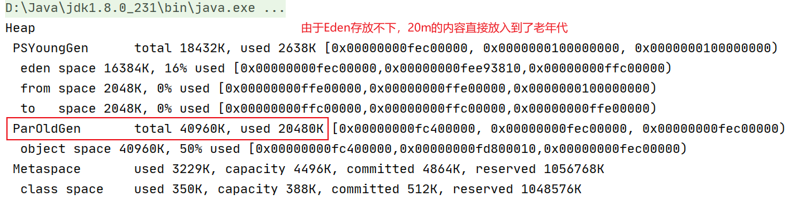

## 8 为对象分配内存：TLAB

* <font color=red>**为什么有TLAB（Thread Local Allocation Buffer）？**</font>

  * 堆区是线程共享区域，任何线程都可以访问到堆区中的共享数据
  * 由于对象实例的创建在JVM中非常频繁，因此开发环境下从堆区中划分内存空间是线程不安全的
  * 为避免多个线程操作统一地址，需要使用加锁等机制，进而影响分配速度。

* <font color=red>**什么是TLAB？**</font>

  * 从内存模型而不是垃圾收集的角度，对Eden区域继续进行划分，JVM为<font color=red>**每个线程分配一个私有缓存区域**</font>，它包含在Eden空间中。
  * 多线程同时分配内存时，使用TLAB可以避免一系列的非线程安全问题，同时还能够提升内存分配的吞吐量，因此我们可以将这种内存分配策略称为<font color=red>**快速分配策略**</font>。
  * 据我所知所有的OpenJDK衍生出来的JVM都提供了TLAB的设计。

  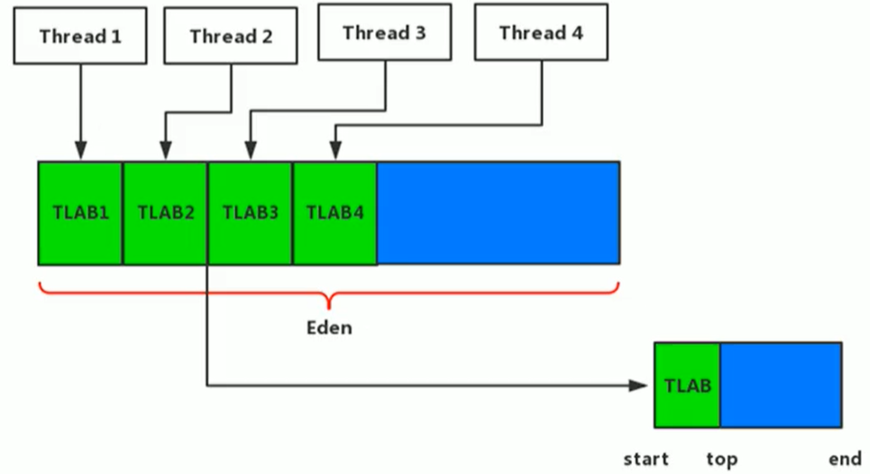

* TLAB再说明：

  * 尽管不是所有的对象实例都能够在TLAN中成功分配内存，但<font color=red>**JVM确实将TLAB作为内存分配的首选**</font>。

  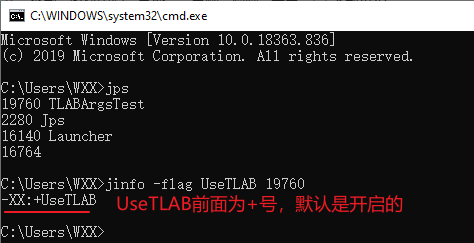

  * 在程序中，开发人员可以通过选项“-XX:UserTlab”设置是否开启TLAB空间。
  * 默认情况下，TLAB空间的内存非常小，<font color=red>**仅占有整个Eden空间的1%**</font>，当然我们可以通过选项“-XX:TLABWasteTargetPercent"设置TLAB空间的百分比大小。
  * 一旦对象在TLAB空间内存分配失败时，JVM就会尝试着通过<font color=red>**使用加锁机制**</font>确保数据操作的原子性，从而直接在Eden空间中分配内存。

## 9 小结堆空间的参数设置

```java
/**
 * 测试堆空间常用的jvm参数：
 * -XX:+PrintFlagsInitial : 查看所有的参数的默认初始值
 * -XX:+PrintFlagsFinal  ：查看所有的参数的最终值（可能会存在修改，不再是初始值）
 *      具体查看某个参数的指令： jps：查看当前运行中的进程
 *                           jinfo -flag SurvivorRatio 进程id
 *
 * -Xms：初始堆空间内存 （默认为物理内存的1/64）
 * -Xmx：最大堆空间内存（默认为物理内存的1/4）
 * -Xmn：设置新生代的大小。(初始值及最大值)
 * -XX:NewRatio：配置新生代与老年代在堆结构的占比，默认为2
 * -XX:SurvivorRatio：设置新生代中Eden和S0/S1空间的比例，默认为8
 * -XX:MaxTenuringThreshold：设置新生代垃圾的最大年龄，默认为15，最大值也为15
 * -XX:+PrintGCDetails：输出详细的GC处理日志
 * 打印gc简要信息：① -XX:+PrintGC   ② -verbose:gc
 * -XX:HandlePromotionFailure：是否设置空间分配担保
 */
public class HeapArgsTest {
    public static void main(String[] args) {

    }
}
```

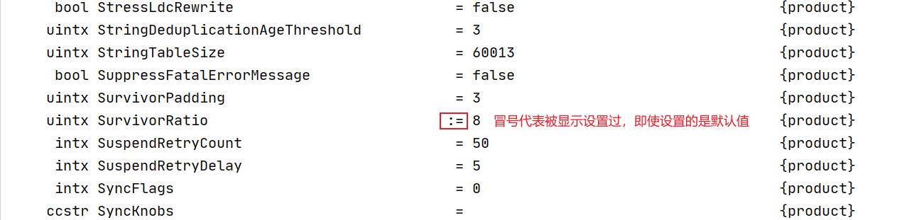

* "-XX:SurvivorRatio"设置的过大会有什么影响？

  * 会导致s0/s1很小，以至于Minor GC的时候to区放不下，直接进入到了老年代，导致Minor GC的没有什么意义，分代也没有什么意义了。

* "-XX:SurvivorRatio"设置的过小会有什么影响？

  * 会导致Young GC过于频繁，导致STW更长，影响性能。

* “-XX:MaxTenuringThreshold”的取值范围是多少？为什么？

  * 取值范围为0~15，包含0和15，因为对象头中只有4位（bits）存放该值的信息

  * 设置参数"-XX:MaxTenuringThreshold=20"后运行性程序会出现下述错误：

    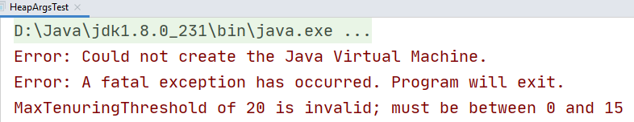

* "-XX:HandlePromotionFailure"说明

  * 在发生Minor GC之前，虚拟机会<font color=red>**检查老年代最大可用的连续空间是否大于新生代所有对象的总空间**</font>。
    * 如果大于，则此次Minor GC是安全的
    * 如果小于，则虚拟机会查看-XX:HandlePromotionFailure设置值是否允许担保失败
      * 如果HandlePromotionFailure=true，那么会继续<font color=red>**检查老年代最大可用连续空间是否大于历次晋升到老年代的对象的平均大小**</font>。
        * 如果大于，则尝试进行一次Minor GC，但这次Minor GC依然是由风险的；
        * 如果小于，则改为Full GC.
      * 如果HandlePromotionFailure=false，则改为一次Full GC
  * 在JDK6 Update24（JDK7）之后，HandlePromotionFailure参数不会再影响到虚拟机的空间分配担保策略，观察OpenJDK中源码的变化，虽然源码中还定义了HandlePromotionFailure参数，但是在代码中已经不会再使用它，JDK6 Update24之后的规则变为<font color=red>**只要老年代的连续空间大于新生代总对象大小**</font>或者<font color=red>**历次晋升的平均大小**</font>就会进行Minor GC，否则进行Full GC。

## 10 堆是分配对象的唯一选择吗？

* 首先上述答案：<font color=red>**堆不是分配对象的唯一选择**</font>。

* 在《深入理解Java虚拟机》中关于Java堆内存有这样一段描述：
  * 随着JIT编译器的发展与<font color=red>**逃逸分析技术**</font>逐渐成熟，<font color=red>**栈上分配、标量替换优化技术**</font>将会导致一些微妙的变化，所有的对象都分配到堆上也渐渐变得不是那么“绝对”了。
* 在Java虚拟机中，对象是在Java堆中分配内存的，这是一个普遍的尝试。但是，有一种特殊的情况，那就是<font color=red>**如果经过逃逸分析（Escape Analysis）后发现，一个对象并没有逃出方法的话，那么就可能会被优化成栈上分配**</font>。这样就无需在堆上分配，也无需进行垃圾回收了。这也是最常见的对外存储技术。
* 此外，前面提到的基于OpenJDK深度定制的TaoBaoVM，其中创新的GCIH（GC invisiable heap）技术实现off-heap，将生命周期较长的Java对象从heap中移至heap外，并且GC不能管理GCIH内部的Java对象，以此达到降低GC的回收频率和提升GC的回收效率。

---

* 逃逸分析

  * 如何将堆上的对象分配到栈，需要使用逃逸分析手段。

  * 这是一种可以有效减少Java程序中<font color=red>**同步负载和内存分配压力的跨函数全局流分析算法**</font>

  * 通过逃逸分析，Java HotSpot编译器能够分析出一个新的对象的引用的使用范围从而决定是否要将这个对象分配到堆上。

  * 逃逸分析的基本行为就是分析对象的动态作用域：

    * 当一个对象在方法中被定义后，对象只在方法内部使用，则认为没有发生逃逸。
    * 当一个对象在方法中被定义后，它被外部方法所引用，则认为发生逃逸。例如作为参数传递到其他地方中。

  * 例子

    ```java
    /**
     * 逃逸分析
     * 如何快速的判断是否发生了逃逸，大家就看new的对象实体是否有可能在方法外被调用。
     */
    public class EscapeAnalysis {
    
        public EscapeAnalysis obj;
    
        // 方法返回EscapeAnalysis对象，发生逃逸
        public EscapeAnalysis getInstance() {
            return obj == null ? new EscapeAnalysis() : obj;
        }
        
        // 为成员属性赋值，发生逃逸
        public void setObj() {
            this.obj = new EscapeAnalysis();
        }
        // 思考：如果当前的obj引用声明为static的？仍然会发生逃逸。
        
        // 对象的作用域仅在当前方法中有效，没有发生逃逸
        public void useEscapeAnalysis() {
            EscapeAnalysis e = new EscapeAnalysis();
        }
        
        // 引用成员变量的值，发生逃逸
        public void useEscapeAnalysis1() {
            EscapeAnalysis e = getInstance();
            // getInstance().xxx()同样会发生逃逸
        }
    }
    ```

  * 参数设置：

    * 在JDK 6U23版本之后，HotSpot中默认就已经开启了逃逸分析。
    * 如果使用的是较早的版本，开发人员可以通过：
      * 选项“-XX:DoEscapeAnalysis”显示开启逃逸分析
      * 通过选项“-XX:+PrintEscapeAnalysis”来查看逃逸分析的筛选结果

  * 结论：<font color=red>**开发中能使用局部变量的，就不要使用在方法外定义**</font>。

---

* 基于逃逸分析的代码优化：使用逃逸分析，编译器可以对代码做如下优化
  * <font color=red>**栈上分配**</font>。将堆分配转化为占分配。如果一个对象在子程序中被分配，要使指向该对象的指针永远不会逃逸，对象可能是占分配的候选，而不是堆分配。
  * <font color=red>**同步省略**</font>。如果一个对象被发现只能从一个线程被访问到，那么对于这个对象的操作可以不考虑同步。
  * <font color=red>**分离对象或标量替换**</font>。有的对象可能不需要作为一个连续的存储结构存在也可以被访问到那么对象的部分（或全部）可以不存储在内存，而是存储在CPU寄存器中。对于Java来说，就是对象可以不必存储在堆空间，可以存储在栈空间。

---

* 栈上分配

  * JIT编译器在编译期间根据逃逸分析的结果，发现如果一个对象并没有逃逸出方法的话，就可能被优化成栈上分配。分配完成后，继续在调用栈内执行，最后形成结束，栈空间被回收，局部变量对象也被回收。这样就无需进行垃圾回收了。

  * 常见的栈上分配的场景

    * 在逃逸分析中，已经说明了。分别是给成员变量赋值、方法返回值、实例引用传递。

  * 代码例子：逃逸分析可以加快代码运行时间

    ```java
    /**
     * 栈上分配测试
     * -Xmx1G -Xms1G -XX:-DoEscapeAnalysis -XX:+PrintGCDetails
     */
    public class StackAllocation {
        public static void main(String[] args) {
            long start = System.currentTimeMillis();
    
            for (int i = 0; i < 10000000; i++) {
                alloc();
            }
            // 查看执行时间
            long end = System.currentTimeMillis();
            System.out.println("花费的时间为： " + (end - start) + " ms");
            // 为了方便查看堆内存中对象个数，线程sleep
            try {
                Thread.sleep(1000000);
            } catch (InterruptedException e1) {
                e1.printStackTrace();
            }
        }
    
        private static void alloc() {
            User user = new User();  // 未发生逃逸
        }
    
        static class User {
        }
    }
    ```

    **参数为“-Xmx1G -Xms1G -XX:-DoEscapeAnalysis -XX:+PrintGCDetails”时结果：**

    ​			花费的时间为： 100 ms

    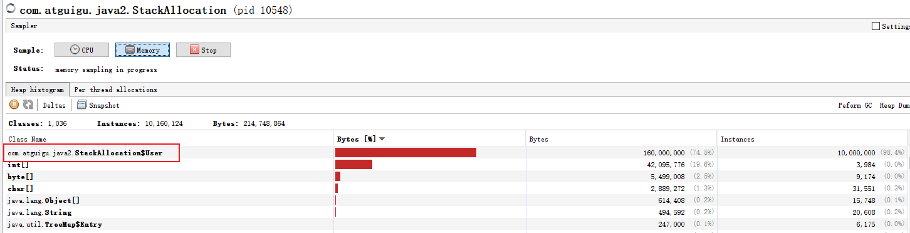

    **参数为“-Xmx1G -Xms1G -XX:+DoEscapeAnalysis -XX:+PrintGCDetails”时结果：**

    ​			花费的时间为： 5 ms

    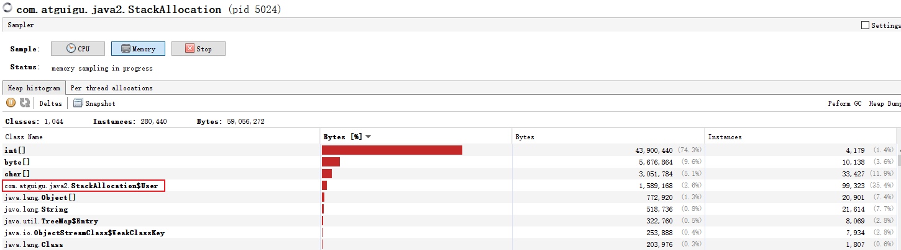

    **参数为“-Xmx256m -Xms256m -XX:-DoEscapeAnalysis -XX:+PrintGCDetails”时结果：**

    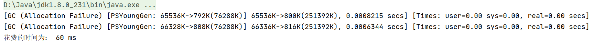

    **参数为“-Xmx256m -Xms256m -XX:+DoEscapeAnalysis -XX:+PrintGCDetails”时结果：**

    ​			花费的时间为： 5 ms

---

* 同步省略 / 同步消除

  * 线程同步的代价是相当高的，同步的后果是降低并发性和性能。
  * 在动态编译同步块的时候，JIT编译器可以借助逃逸分析来<font color=red>**判断同步块所使用的锁对象是否只能够被一个线程访问而没有被发布到其他线程**</font>。如果没有，那么JIT编译器在编译（后端编译）这个同步代码块的时候就会取消对这部分代码的同步。这样就能大大提高并发性和性能。这个取消同步的过程就叫同步省略，也叫作<font color=red>**锁消除**</font>。

  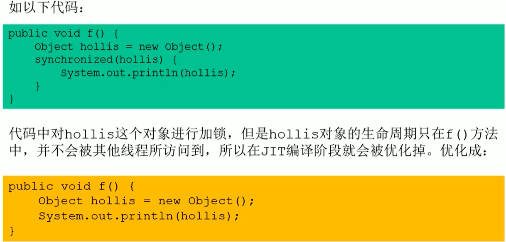

  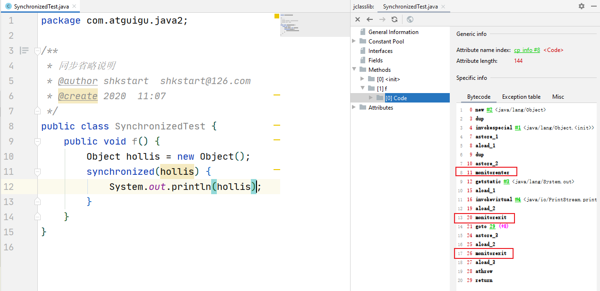

  我们可以看到字节码文件中仍然有monitorexter和monitorexit，在运行时会被消除（JIT编译器编译（后端编译）运行时会被消除）

---

* 分离对象或标量替换

  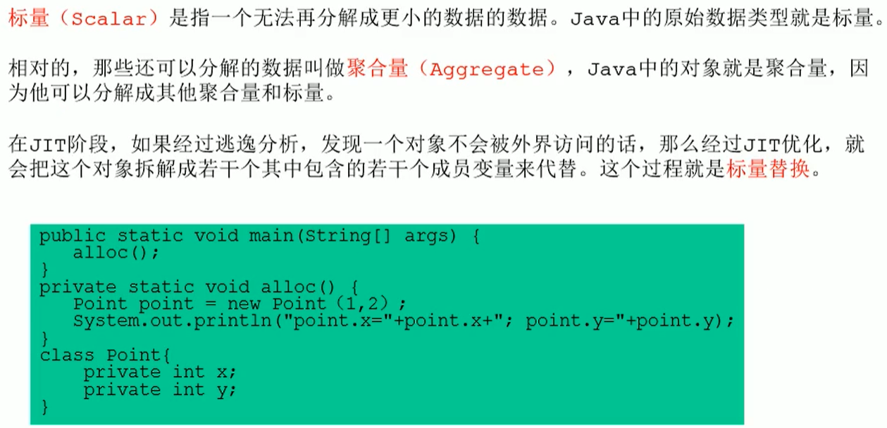

  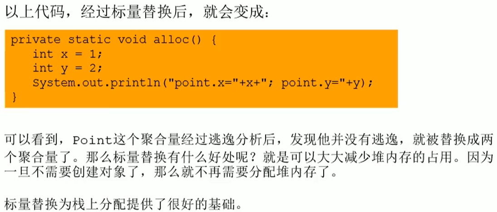

  * 标量替换参数设置：参数-XX:EliminateAllocations  开启了标量替换（默认打开），允许将对象打散分配在栈上

  * 代码演示：

    ```java
    /**
     * 标量替换测试
     *  -Xmx100m -Xms100m -XX:+DoEscapeAnalysis -XX:+PrintGC -XX:-EliminateAllocations
     */
    public class ScalarReplace {
        public static class User {
            public int id;
            public String name;
        }
    
        public static void alloc() {
            User u = new User();  // 未发生逃逸
            u.id = 5;
            u.name = "www.atguigu.com";
        }
    
        public static void main(String[] args) {
            long start = System.currentTimeMillis();
            for (int i = 0; i < 10000000; i++) {
                alloc();
            }
            long end = System.currentTimeMillis();
            System.out.println("花费的时间为： " + (end - start) + " ms");
        }
    }
    ```

    **参数为“-Xmx100m -Xms100m -XX:+DoEscapeAnalysis -XX:+PrintGC -XX:-EliminateAllocations”时结果：**

    

    **参数为“-Xmx100m -Xms100m -XX:+DoEscapeAnalysis -XX:+PrintGC -XX:+EliminateAllocations”时结果：**

    ​			花费的时间为： 5 ms

---

* 总结

  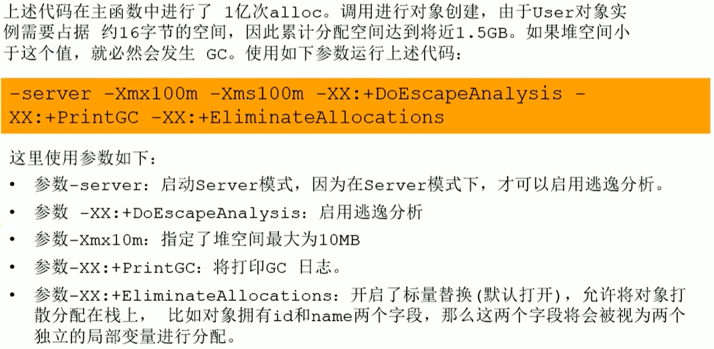

  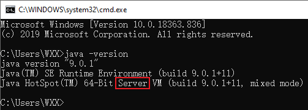

  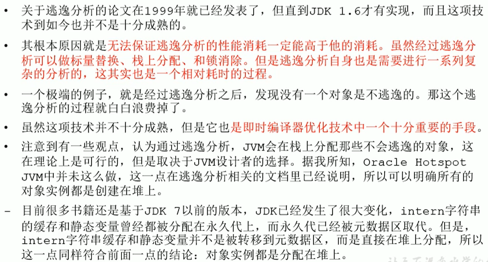

---

* 本章小结

  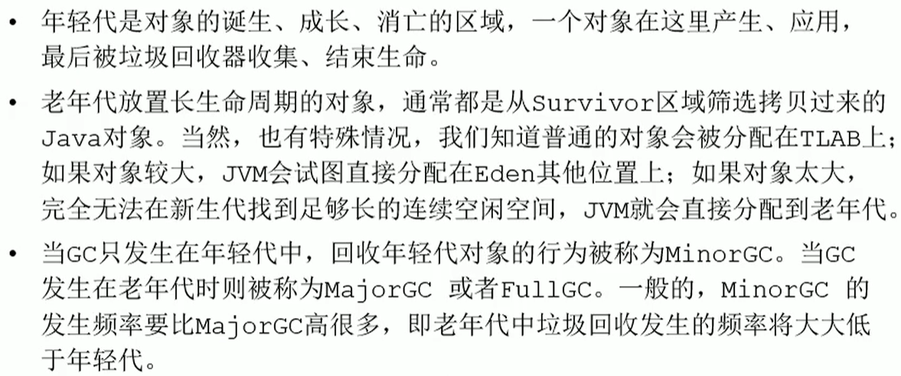