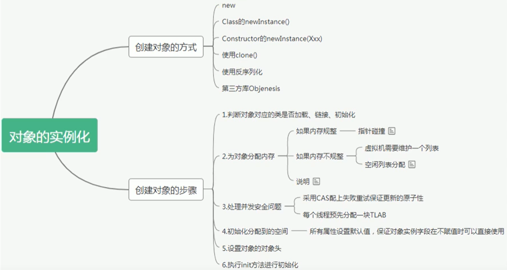
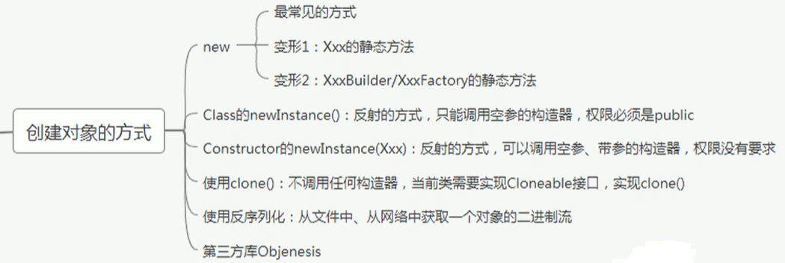
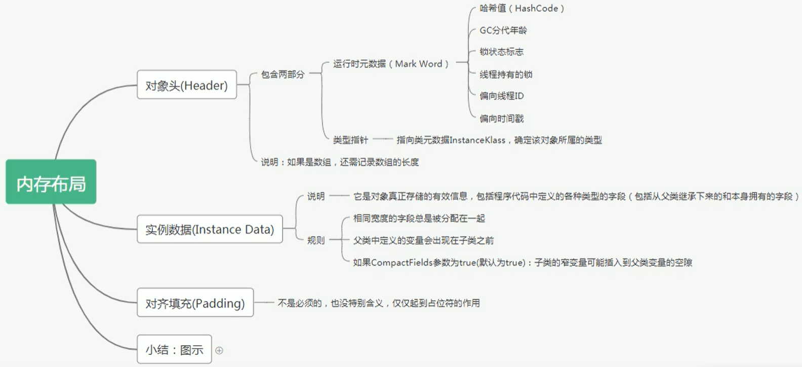
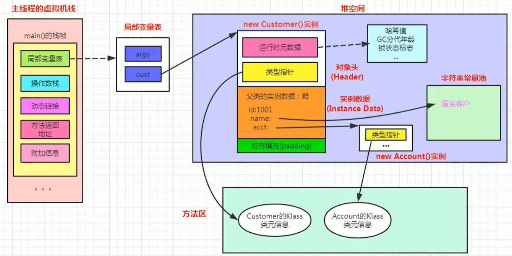
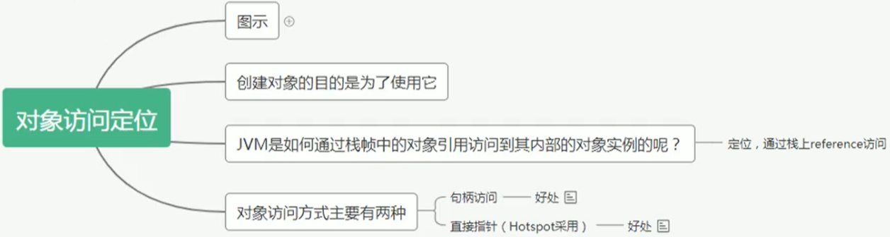
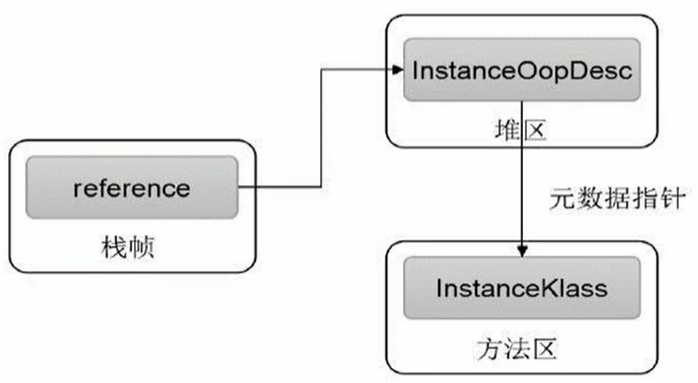
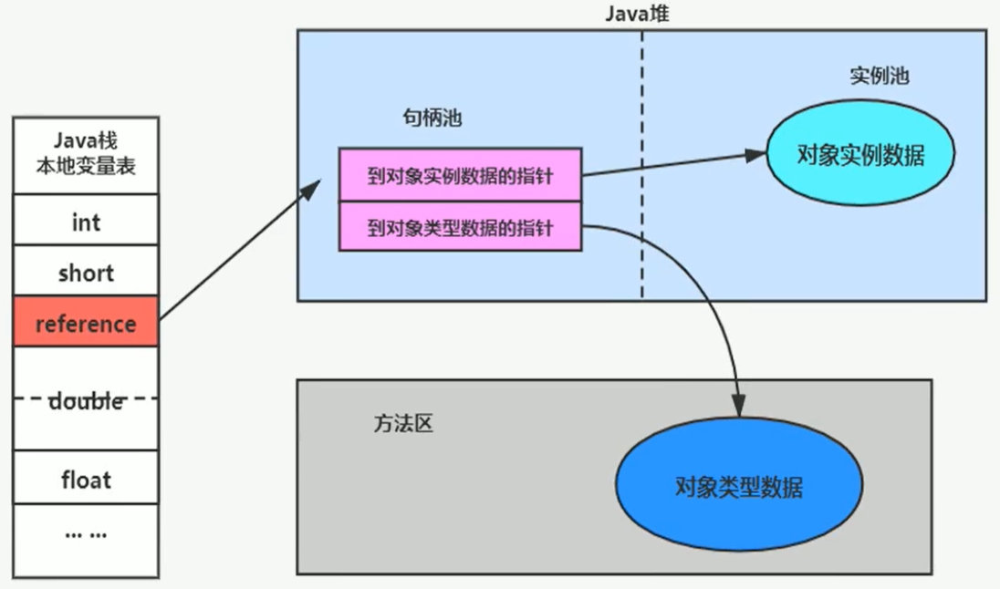
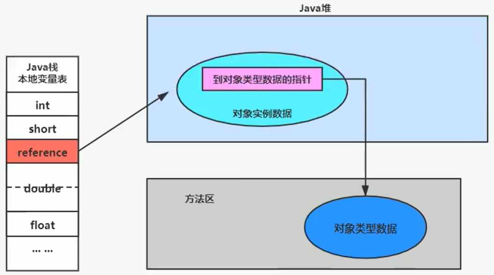

# 第10章 对象的实例化内存布局与访问定位

## 1 对象的实例化

* 面试题
  * <font color=red>**美团**</font>
    * 对象在JVM中是怎么存储的？
    * 对象头信息里面有哪些东西？
  * <font color=red>**蚂蚁金服**</font>
    * 二面：java对象头里有什么？

---





---

* 创建对象的步骤

  1. <font color=red>**判断对象对应的类是否加载、链接、初始化**</font>

     虚拟机遇到一条new指令，首先去检查这个指令的参数能否在Metaspace的常量池中定位到一个类的符号引用，并且检查这个符号引用代表的类是否已经被加载、解析和初始化。（即判断类元信息是否存在）。如果没有，那么在双亲委派模式下，使用当前类加载器以ClassLoader+包名+类名 为Key进行查找对应的.class文件。如果没有找到文件，则抛出ClassNotFoundException异常，如果找到，则进行类加载，并生成对应的Classs对象

  2. <font color=red>**为对象分配内存**</font>

     首先计算对象占用空间大小，接着再堆中分配一块内存给新对象。如果实例成员变量是引用变量，仅分配引用变量空间即可，即4个字节大小。

     * 如果内存规整，使用**指针碰撞**

       如果内存是规整的，那么虚拟机将采用指针碰撞法（Bump The Pointer）来为对象分配内存。意思是所有用过的内存在一边，空闲的内存在另外一边，中间放着一个指针作为分界点的指示器，分配内存就仅仅是把指针向空闲那边挪动一段与对象大小相等的距离罢了。如果垃圾收集器选择的是Serial、ParNew这种基于标记-压缩算法的，虚拟机采用这种分配方式。一般使用带有compact（整理）过程的收集器时，使用指针碰撞。

     * 如果内存不规整，虚拟机需要维护一个列表，使用**空闲列表**分配

       如果内存不是规整的，已使用的内存和未使用的内存相互交错，那么虚拟机将采用的是空闲列表法来为对象分配内存。意思是虚拟机维护一个列表，记录上哪些内存块是可用的，再分配的时候从列表中找到一块足够大的空间划分给对象实例，并更新列表上的内容。这种分配方式称为“空闲列表（Free List）”。

       <font color=blue>**说明**</font>：选择哪种分配方式由Java堆是否规整决定，而Java堆是否规整又由所采用的垃圾回收器是否带有压缩整理功能决定。

  3. <font color=red>**处理并发安全问题**</font>

     在分配内存空间时，另外一个问题是及时保证new对象时候的线程安全性：创建对象是非常频繁的操作，虚拟机需要解决并发安全问题。虚拟机采用了两种方式解决并发安全问题：

     * CAS（Compare And Swap）失败重试、区域加锁：保证指针更新操作的原子性；
     * TLAB吧内存分配的动作按照线程划分在不同的空间之中进行，即每个线程在Java堆中预先分配一小块内存，称为**本地线程分配缓冲区**（TLAB，Thread Local Allocation Buffer），虚拟机是否使用TLAB，可以通过-XX:+/-UseTLAB参数来设定。

  4. <font color=red>**初始化分配到的空间**</font>

     内存分配结束，虚拟机将分配到的内存空间都初始化为零值（不包括对象头）。这一步保证了对象的实例字段在Java代码中可以不用赋初值就可以直接使用，程序能访问到这些字段的数据类型所对应的零值。

  5. <font color=red>**设置对象的对象头**</font>

     将对象的所属类（即类的元数据信息）、对象的HashCode和对象的GC信息、锁信息等数据存储在对象的对象头中。这个过程的具体设置方式取决于JVM实现。

  6. <font color=red>**执行init方法进行初始化**</font>

     在Java程序的视角来看，初始化才正式开始。初始化成员变量，执行实例化代码块，调用类的构造方法，并把堆内对象的首地址赋值给引用变量。

     因此一般来说（由字节码中是否跟随有invokespecial指令所决定），new指令之后会接着就是执行方法，吧对象按照程序员的意愿进行初始化，这样一个真正可用的对象才算完全创建出来。

## 2 对象的内存布局

* 创建的对象在堆中的含有哪些内容

  

  并不是所有的对象都会保存类型指针

* 例子

  ```java
  /**
   * 测试对象实例化的过程
   *  ① 加载类元信息 - ② 为对象分配内存 - ③ 处理并发问题  - ④ 属性的默认初始化（零值初始化）
   *  - ⑤ 设置对象头的信息 - ⑥ 属性的显式初始化、代码块中初始化、构造器中初始化
   *
   *
   *  给对象的属性赋值的操作：
   *  ① 属性的默认初始化 - ② 显式初始化 / ③ 代码块中初始化 - ④ 构造器中初始化
   */
  
  public class Customer{
      int id = 1001;  // ② 显式初始化
      String name;
      Account acct;
  
      {
          name = "匿名客户";  // ③ 代码块中初始化
      }
      public Customer(){
          acct = new Account();  // ④ 构造器中初始化
      }
  
  }
  class Account{
  
  }
  ```

  ```java
  public class CustomerTest {
      public static void main(String[] args) {
          Customer cust = new Customer();
      }
  }
  ```

  

## 3 对象的访问定位



* JVM是如何通过栈帧中的对象引用访问到其内部的对象实例的呢？

  * 通过栈上reference访问

  

* 对象访问的两种方式

  * 句柄访问

    

    * 优点：GC之后只需要改变句柄池中的地址即可
    * 缺点：访问效率低，访问实例数据和元数据均需要中转一次

  * 直接指针（Hotspot采用）

    

    优点：访问效率高，访问实例数据一步到位

    缺点：GC之后需要更改虚拟机栈中本地变量表中的引用地址