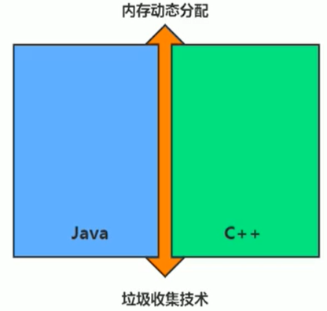

# 第14章 垃圾回收概述

## 1 什么是垃圾



Java = (C++)--

---

* 垃圾收集，不是Java语言的伴生产物。早在1960年，第一门开始使用内存动态分配和垃圾收集技术的Lisp语言诞生。
* 关于垃圾收集有三个经典问题：
  * 哪些内存需要收集？
  * 什么时候回收垃圾？
  * 如何回收垃圾？
* 垃圾回收机制是Java的招牌能力，<font color=blue>**极大地提高了开发效率**</font>。如今，垃圾收集几乎成为现代语言的标配，即使经过如此长时间的发展，Java的垃圾收集机制仍然在不断的演进中，不同大小的设备、不同特征的应用场景，对垃圾收集提出了新的挑战，这当然也是<font color=blue>**面试的热点**</font>。

---

* 大厂面试题
  * <font color=red>**蚂蚁金服**</font>：
    * 你知道哪几种垃圾回收器，各自的优缺点，重点讲一下CMS和G1。
    * 一面：JVM GC算法有哪些，目前的JDK版本采用什么回收算法。
    * 一面：G1回收器讲下回收过程
    * GC是什么？为什么需要GC？
    * 一面：GC的两种判定方法？CMS收集器与G1收集器的特点。
  * <font color=red>**百度**</font>：
    * 说一下GC算法，分代回收说下
    * 垃圾回收策略和算法
  * <font color=red>**天猫**</font>：
    * 一面：JVM GC原理，JVM怎么回收内存？
    * 一面：CMS特点，垃圾回收算法有哪些？各自的优缺点，他们共同的缺点是什么？
  * <font color=red>**滴滴**</font>：
    * 一面：java的垃圾回收器都有哪些，说下G1的应用场景，平时你是如何搭配使用垃圾回收器的。
  * <font color=red>**京东**</font>：
    * 你知道哪几种垃圾回收器，各自的优缺点，重点讲一下CMS和G1，包括原理，流程，优缺点，垃圾回收算法的实现原理。
  * <font color=red>**阿里**</font>：
    * 讲一讲垃圾回收算法
    * 什么情况下触发垃圾回收？
    * 如何选择合适的垃圾回收算法？
    * JVM有哪三种主要的垃圾回收器？
  * <font color=red>**字节跳动**</font>：
    * 常见的垃圾回收器算法有哪些，各有什么优劣？
    * system.gc()和runtime.gc()会做什么事情？
    * 一面：Java GC机制？GC Roots有哪些？
    * 二面：Java对象的回收方式，回收算法。
    * CMS和G1了解吗，CMS解决了什么问题，说一下回收的过程。
    * CMS回收停顿了几次，为什么需要停顿两次？

---

* 什么是垃圾（Garbage）？
  * 垃圾是指<font color=red>**在运行程序中没有任何指针指向的对象**</font>，这个对象就是需要被回收的垃圾。
  * 外文：An object is considered garbage when it can no longer be reached from any pointer in the running program.
* 如果不及时对内存中的垃圾进行清理，那么，这些垃圾对象所占的内存空间会一直保留到应用程序结束，被保留的空间无法被其他对象使用。甚至可能导致内存溢出。

## 2 为什么需要GC

* 对于高级语言来说，一个基本认知是如果不进行垃圾回收，<font color=blue>**内存迟早都会被消耗完**</font>，因为不断地分配内存空间而不进行回收，就好像不停地生产生活垃圾而从来不打扫一样。
* 处理释放没用的对象，垃圾回收也可以清除内存里的记录碎片。碎片整理将所占用的堆内存一道堆的一端，一遍<font color=blue>**JVM将整理出的内存分给新的对象**</font>。
* 随着应用程序所应付的业务越来越庞大、复杂，用户越来越多，<font color=blue>**没有GC就不能保证应用程序的正常进行**</font>。而经常造成 STW的GC又跟不上实际的需求，所以才会不断地尝试对GC优化。

## 3 早期垃圾回收

* 在早期的C/C++时代，垃圾回收基本上是手工进行的。开发人员可以使用new关键字进行申请，并使用delete关键字进行内存释放。比如以下代码：

  ```c++
  MibBridge *pBridge = new cmBaseGroupBridge();
  // 如果注册失败，使用delete释放该对象所占内存区域
  if (pBridge->Register(kDestroy) != NO_ERROR)
      delete pBridge;
  ```

* 这种方式可以灵活控制内存释放的时间，但是会给开发人员带来<font color=blue>**频繁申请和释放内存的管理负担**</font>。倘若有一处内存区间由于程序员编码的问题忘记被回收，那么就会产生<font color=blue>**内存泄露**</font>，垃圾对象永远无法被清除，随着系统运行时间的不断增长，垃圾对象所耗内存可能持续上升，直到出现内存溢出并造成<font color=blue>**应用程序崩溃**</font>。

* 有了垃圾回收机制后，上述代码极有可能变成这样：

  ```c++
  MibBridge *pBridge = new cmBaseGroupBridge();
  pBridge->Register(kDestroy
  ```

* 现在，处理Java以外，C#、Python、Ruby等语言都是用了自动垃圾回收的思想，也是未来发展趋势。可以说，这种自动化的内存分配和垃圾回收的方式已经成为现代语言必备的标准。

## 4 Java垃圾回收机制

* 自动内存管理，无需开发人员手动参与内存分配与回收，这样<font color=red>**降低内存泄露和内存溢出的风险**</font>。
  * 没有垃圾回收器，java也会和cpp一样，各种悬垂指针，野指针，泄露问题让你头疼不已。
* 自动内存管理机制，将程序员从繁重的内存管理中释放出来，可以<font color=red>**更专心地专注于业务开发**</font>。
* oracle官网关于垃圾回收的介绍：https://docs.oracle.com/javase/8/docs/technotes/guides/vm/gctuning/toc.html

---

* 担忧

  * 对于Java开发人员而言，自动内存管理就像是一个黑匣子，如果过度依赖于“自动”，那么这将会是异常灾难，最严重的就会<font color=blue>**弱化Java开发人员在程序出现内存溢出时定位问题和解决问题的能力**</font>。
  * 此时，了解JVM的自动内存分配和内存回收原理就显得非常重要，只有在真正了解JVM是如何管理内存后，我们才能够在遇见OutOfMemoryError时，快速地根据错误日志定位问题和解决问题。
  * 当需要排查各种内存溢出、内存泄露问题时，当垃圾收集称为系统达到更高并发量的瓶颈时，我们就必须对这些“自动化”的技术<font color=blue>**实施比亚的监控和调节**</font>。

* 应该关心哪些区域的回收？

  

---

* 垃圾回收器可以对年轻代回收，也可以对老年代回收，甚至是全堆和方法区（Java虚拟机规范没有规定必须对方法区进行回收）的回收。
  * 其中，<font color=red>**Java堆是垃圾回收器的工作重点**</font>。
* 从次数上讲：
  * <font color=red>**频繁收集新生代**</font>
  * <font color=red>**较少 收集老年代**</font>
  * <font color=red>**基本不动方法区**</font>