# 第16章 垃圾回收相关概念

## 1 System.gc()

* 默认情况下，通过System.gc()或者Runtime.getRuntime().gc()的调用，<font color=blue>**会显式触发Full GC**</font>，同时对老年代和新生代以及方法区进行回收，尝试释放被丢弃对象占用的内存。

* 然而System.gc()调用附带一个免责声明，无法保证对垃圾回收器的调用。

* JVM实现者可以通过System.gc()调用来决定JVM的GC行为。而一般情况下，垃圾回收应该是自动进行的，<font color=blue>**无需手动触发，否则就过于麻烦了**</font>。在一些特殊情况下，如我们正在编写一个基准测试，我们可以在运行之间调用System.gc()。

  ```java
  public class SystemGCTest {
      public static void main(String[] args) {
          new SystemGCTest();
          System.gc();  // 提醒jvm的垃圾回收器执行gc,但是不确定是否马上执行gc
          // 与Runtime.getRuntime().gc();的作用一样。
  
          System.runFinalization();  // 强制调用失去引用的对象的finalize()方法
      }
  
      @Override
      protected void finalize() throws Throwable {
          super.finalize();
          System.out.println("SystemGCTest 重写了finalize()");
      }
  }
  ```

* 一个例子

  ```java
  /**
   * -XX:+PrintGCDetails
   *
   * @author shkstart  shkstart@126.com
   * @create 2020  14:57
   */
  public class LocalVarGC {
      public void localvarGC1() {
          byte[] buffer = new byte[10 * 1024 * 1024];  // 10MB
          System.gc();
      }
  
      public void localvarGC2() {
          byte[] buffer = new byte[10 * 1024 * 1024];
          buffer = null;
          System.gc();
      }
  
      public void localvarGC3() {
          {
              byte[] buffer = new byte[10 * 1024 * 1024];
          }
          System.gc();
      }
  
      public void localvarGC4() {
          {
              byte[] buffer = new byte[10 * 1024 * 1024];
          }
          int value = 10;
          System.gc();
      }
  
      public void localvarGC5() {
          localvarGC1();
          System.gc();
      }
  
      public static void main(String[] args) {
          LocalVarGC local = new LocalVarGC();
          local.localvarGC1();
      }
  }
  ```

  **如果主函数中调用localvarGC1()，结果：**

  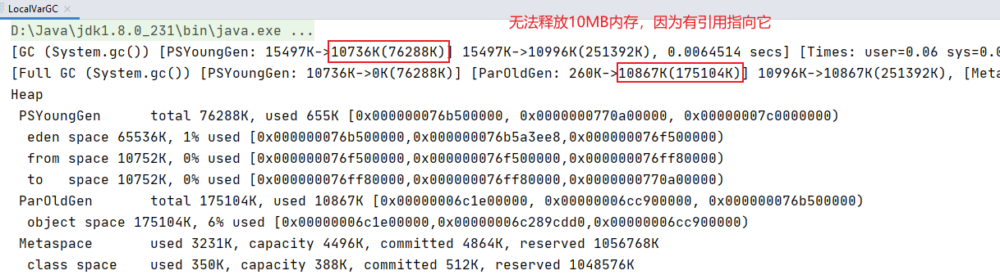

  **如果主函数中调用localvarGC2()，结果：**

  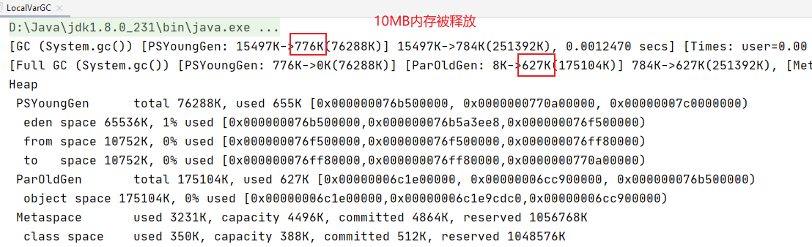

  **如果主函数中调用localvarGC3()，结果：**

  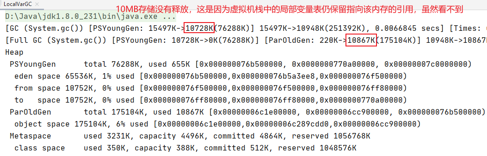

  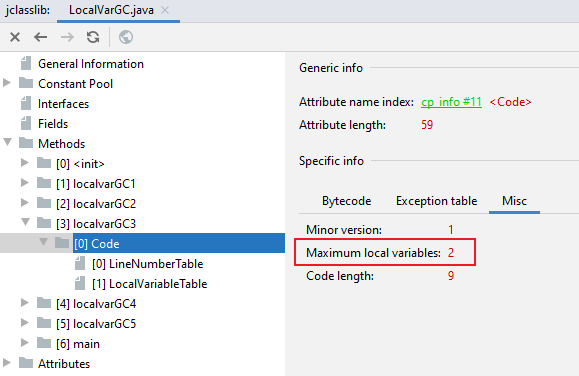

  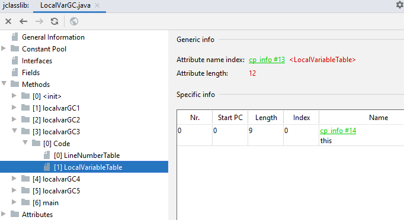

  **如果主函数中调用localvarGC4()，结果：**

  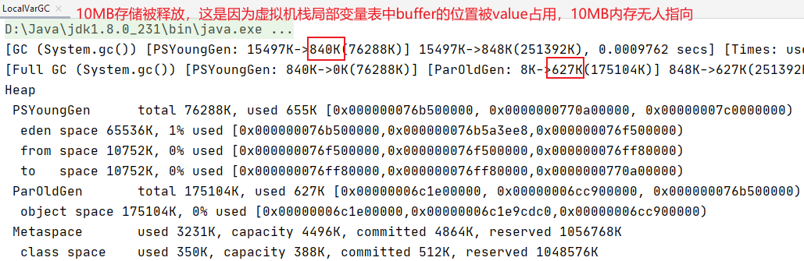

  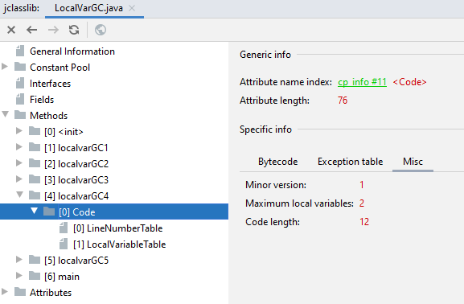

  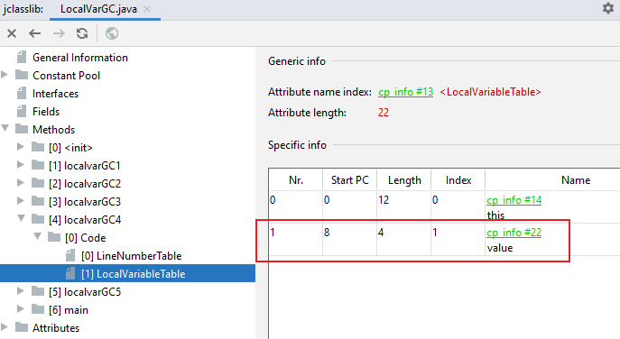

  **如果主函数中调用localvarGC5()，结果：**

  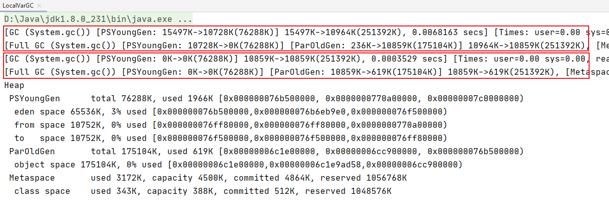

## 2 内存溢出（OOM）与内存泄露（Memory Leak）

* 内存溢出相对于内存泄露来说，尽管更容易被理解，但是同样的，内存溢出也是引发程序崩溃的罪魁祸首之一。
* 由于GC一直在发展，所有一般情况下，除非应用程序占用的内存增长速度非常快，在成垃圾回收已经跟不上内存消耗的速度，否则不太容易出现OOM的情况。
* 大多数情况下，GC会进行各种年龄段的垃圾回收，是在不行了就放大招，来一次独占式的Full GC操作，这时候会回收大量的内存，供应用程序继续使用。
* javadoc中对OutOfMemoryError的解释是：<font color=blue>**没有空闲内存，并且垃圾回收器也无法提供更多内存**</font>。

---

* 首先说没有空闲内存的情况：说明Java虚拟机的堆内存不够。原因有二：

  1. **Java虚拟机的堆内存设置不够。**

     比如：可能的内存泄露问题；也很有可能就是堆的大小不合适，比如我们要处理比价可观的数据量，但是没有显示指定JVM堆大小或者指定数值偏小。我们可以通过-Xms、-Xmx来调整。

  2. **代码中创建了大量大对象，并且长时间不能被垃圾回收器收集（存在被引用）。**

     对于老版本的Oracle JDK，因为永久代的大小是有限的，并且JVM对永久代垃圾回收（如，常量池回收、卸载不在需要的类型）非常不积极，所以当我们不断添加新类型的时候，永久代出现OutOfMemoryError也非常常见，尤其是在运行时存在大量动态类型生成的场合；类似intern字符串缓存占用太多空间，也会导致OOM问题。对应的异常信息，会被编辑出来和永久代相关：“<font color=blue>**java.lang.OutOfMemoryError:PermGen space**</font>”。

     随着元数据区的引入，方法区内存已经不再那么窘迫，所以相应的OOM有所改观，出现OOM，异常信息则变成了“<font color=blue>**java.lang.OutOfMemoryError:Metaspace**</font>”。直接内存不足，也会导致OOM。

* 这里面隐含着一层意思是，在抛出OutOfMemoryError之前，通常垃圾收集器会被触发，尽其所能去清理出空间。

  * 例如：在引用机制分析中，设计JVM回去尝试回收<font color=red>**软引用指向的对象等**</font>。
  * 在java.nio.BIts.reserveMemory()方法中，我们能清楚地看到，System,gc()会被调用，以清理空间。

* 当然，也不是在任何情况下垃圾收集器都会被触发的。

  * 比如，我们去分配一个超大对象，累死一个超大数组超过堆的最大值，JVM可以判断出垃圾回收并不能解决这个问题，所以直接抛出OutOfMemoryError。

---

* 内存泄露

  * 也称作“存储渗漏”。<font color=red>**严格来说**</font>，<font color=blue>**只有对象不会再被程序用到了，但是GC又不能回收他们的情况，才叫做内存泄露**</font>。

  * 但实际情况很多时候一些不太好实践（或疏忽）会导致对象的生命周期变得很长甚至OOM，也可以叫做<font color=red>**宽泛意义上的“内存泄露”**</font>。

  * 尽管内存泄露并不会立刻引起程序的崩溃，但是一旦发生内存泄露，程序中的可用内存就会被逐步蚕食，直到耗尽所有内存，最终出现OutOfMemory异常，导致程序崩溃。

  * 注意，这里的存储空间并不是指物理内存，而是值虚拟机内存的大小，这个虚拟内存大小取决于磁盘交换区设定的大小。

  * 内存泄露的例子

    

    不要举“引用计数”导致内存泄露的例子，这是因为Java没有使用引用计数作为标记的算法。

    1. 单例模式

       单例的生命周期和应用程序时一样长，所以单例应用程序中，如果持有对外部对象的引用的话，那么这个外部对象是不能被回收的，则会导致内存泄露的产生。

    2. 一些提供close的资源未关闭导致内存泄露

       数据库连接（dataSource.getConnection()），网络连接（socket）和io连接必须手动close，否则是不能被回收的。

## 3 Stop The World

* Stop The World，简称STW，指的是GC事件发生过程中，会产生应用程序的停顿。<font color=blue>**停顿产生时整个应用恒旭线程都会被暂停，没有任何响应**</font>，有点像卡死的感觉，这个停顿称为STW.
  * 可达性分析算法中枚举根节点（GC Roots）会导致所以Java执行线程停顿。
    * 分析工作必须在一个能确保一致性的快照中进行。
    * 一致性指整个分析期间整个执行系统看起来像被冻结在某个时间点上。
    * <font color=blue>**如果出现分析过程中对象引用关系还在不断变化，则分析结果的准确定无法保证**</font>
* 被STW中断的应用程序线程会在完成GC之后恢复，频繁中断会让用户感觉像是网速不快造成电影卡带一样，所以我们要减少STW的发生。
* STW事件和采用哪款GC无关，所有的GC都有这个事件。
* 哪怕是G1也不能完全避免Stop The World情况发生，只能说垃圾回收器越来越优秀，回收效率越来越高，尽可能地缩短了暂停时间。
* STW是JVM<font color=blue>**在后台自动发起和自动完成**</font>的。在用户不可见的情况下，把用户正常的工作线程全部停掉。
* 开发中不用用System.gc()；会导致Stop The World的发生。

---

* STW代码演示：启动两个线程，一个一秒钟打印出一条信息，另一个负责执行System.gc()等，这会导致第一个线程不能一秒钟打印出一条信息。

  ```java
  public class StopTheWorldDemo {
      public static class WorkThread extends Thread {
          List<byte[]> list = new ArrayList<byte[]>();
  
          @Override
          public void run() {
              try {
                  while (true) {
                      for (int i = 0; i < 1000; i++) {
                          byte[] buffer = new byte[1024];
                          list.add(buffer);
                      }
  
                      if (list.size() > 10000) {
                          list.clear();
                          System.gc();  // 会触发full gc，进而会出现STW事件
                      }
                  }
              } catch (Exception ex) {
                  ex.printStackTrace();
              }
          }
      }
  
      public static class PrintThread extends Thread {
          public final long startTime = System.currentTimeMillis();
  
          public void run() {
              try {
                  while (true) {
                      // 每秒打印时间信息
                      long t = System.currentTimeMillis() - startTime;
                      System.out.println(t / 1000 + "." + t % 1000);
                      Thread.sleep(1000);
                  }
              } catch (Exception ex) {
                  ex.printStackTrace();
              }
          }
      }
  
      public static void main(String[] args) {
          WorkThread w = new WorkThread();
          PrintThread p = new PrintThread();
          w.start();
          p.start();
      }
  }
  ```

  **结果：**

  ​			0.1

  ​			1.37

  ​			2.39

  ​			3.44

  ​			......

## 4 垃圾回收的并行与并发

* 并发（Concurrent）

  * 在操作系统中，是指<font color=blue>**一个时间段中**</font>有几个程序都处于已启动运行到运行完毕之间，且这几个程序都是在同一个处理器上运行。

  * 并发不是真正意义上的“同时进行”，只是CPU把一个时间段划分成几个时间片段（时间区间），然后在这几个时间区间之间来回切换，由于CPU处理速度非常快，只要时间间隔处理得当，即可让用户感觉是多个应用程序同时在进行。图下图，三个程序在运行

    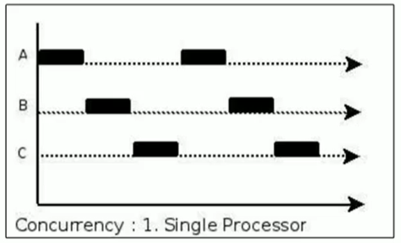

* 并行（Parallel）

  * 当系统有有一个以上CPU时，当一个CPU执行一个进程时，另一个CPU可以执行另一个进程，当两个进程互不抢占CPU资源，可以同时进行，我们称之为并行（Parallel）。

  * 其实决定并行的因素不是CPU的数量，而是CPU的核心数量，比如一个CPU多个核也可以并行。

  * 适用于科学计算，后台处理等若交互场景。

    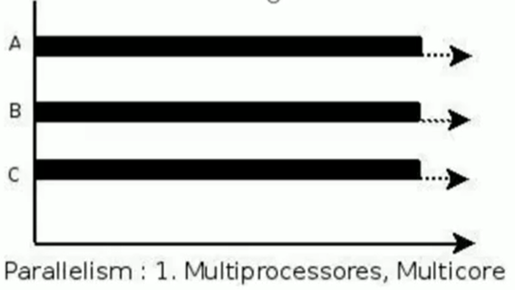

* 并发 ***vs*** 并行

  * 并发，**指的是多个事情**，<font color=red>**在同一时间段内同时发生了**</font>。
  * 并行，**指的是多个事情**，<font color=red>**在同一时间点上同时发生了**</font>。
  * 并发的多个任务之间是相互抢占资源的。
  * 并行的多个任务之间是不相互抢占资源的。
  * 只有在多个CPU或者一个CPU多核的情况中，才会发生并行。否则，看似同时发生的事情，其实都是并发执行的。

---

* 垃圾回收的并发和并行

  并发和并行，在谈论垃圾收集器的上下文语境中，他们可以解释如下：

  * 并行（Parallel）：指<font color=blue>**多条垃圾收集线程并行工作**</font>，但此时用户线程处于等待状态

    * 例如ParNew、Parallel Scavenge、Parallel Old；

  * 串行（Serial）

    * 相对于并行的概念，单线程执行。
    * 如果内存不够，则程序暂停，启动JVM垃圾回收器进行垃圾回收。回收万，再启动程序的线程。

    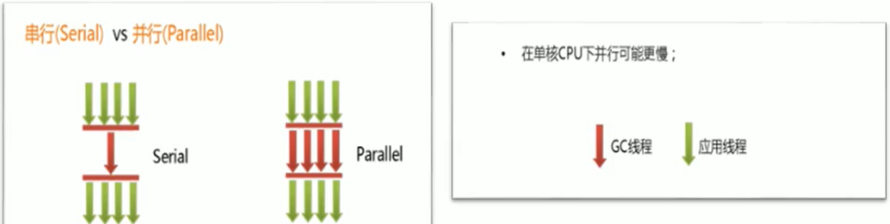

  * 并发（Concurrent）：指用户线程与垃圾收集线程同时执行（但不一定是并行的，可能会交替执行），垃圾回收线程在执行时不会停顿用户程序的运行。

    * 用户程序继续运行，而垃圾收集程序运行在另一个CPU上；
    * 如：CMS、G1

## 5 安全点与安全区域

* 安全点（Safepoint）

  * 程序执行时并非在所有地方都能停顿下来GC，只有在特定的位置才能停顿下来开始GC，这些位置称为“安全点（Safepoint）”。

  * Safe Point的选择很重要，<font color=blue>**如果太少可能会导致GC等待的时间太长，如果太频繁可能会导致运行时的性能问题**</font>。大部分指令的执行时间都非常短暂，通常会根据“<font color=red>**是否具有让程序长时间执行的特征**</font>”为标准。比如：选择一些执行时间比较长的指令作为Safe Point，如<font color=blue>**方法调用、循环跳转和异常跳转**</font>等。

  * **如何在GC发生时，检查所有线程都跑到最近的安全点停顿下来呢？**

    * 抢先式中断：（目前没有虚拟机采用了）

      首先中断所有线程。如果还有线程不在安全点，就恢复线程，让线程跑到安全点。

    * 主动式中断：

      设置一个中断标志，各个线程运行到Safe Point的时候主动轮询这个标志，如果中断标志位真，则让自己进行中断挂起。

---

* 安全区域（Safe Region）
  * Safepoint机制保证了线程执行时，在不太长的时间内就会遇到可进入GC的Safepoint。但是，程序“不执行”的时候呢？例如线程处于Sleep状态或Blocked状态，这时候线程无法响应JVM的中断请求，“走”到安全点去中断挂起，JVM也不太可能等待线程被唤起。对于这种情况，就需要安全区域（Safe Region）来解决。
  * <font color=blue>**安全区域是指在一段代码片段中，对象的引用关系不会发生变化，在这个区域中的任何位置开始GC都是安全的**</font>。我们也可以把Safe Region看做被扩展了的Safepoint。实际执行时：

* 1. 当线程运行到Safe Region的代码时，首先表示已经进入了Safe Region，如果这段时间内发生了GC，JVM会忽略表示为Safe Region状态的线程；
  2. 当线程即将离开Safe Region时，会检查JVM是否已经完成GC，如果完成了，则继续运行，否则线程必须等待收到可以安全离开Safe Region的信号为止。

## 6 再谈引用：强引用

* 再谈引用

  * 我们希望能描述这样哟类对象：当内存空间还足够时，则能保留在内存中；如果内存空间在进行垃圾收集后还是很紧张，则可以抛弃这些对象。

  * [既<font color=blue>**偏门**</font>又非常<font color=blue>**高频**</font>的面试题]强引用、软引用、弱引用、虚引用有什么区别？具体使用场景是什么？

  * 在JKD1.2版本之后，Java对引用的概念进行了扩充，将引用分为强引用（Strong Reference）、软引用（Soft Reference）、弱引用（Weak Reference）、虚引用（Phantom Reference）4种，<font color=red>**这4中引用强度一次逐渐减弱**</font>。

  * 除强引用外，其他3种引用均可以在java.lang.ref包中招待他们的身影。如下图，显示了这3中引用类型对应的类，开发人员可以在应用程序中直接使用他们。

    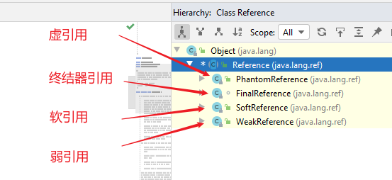

* Reference子类中只有终结器引用时保内可见的，其他3引用类型均是public，可以在应用程序中直接使用

  * <font color=blue>**强引用（String Reference）**</font>:最传统的“引用”的定义，是指程序代码之中普遍存在的引用赋值，即类似“Object obj = new Object();”这种引用关系。<font color=red>**无论任何情况下，只要强引用关系还存在，垃圾收集器永远不会回收掉被引用的对象**</font>。<font color=blue>**死也不回收**</font>。
  * <font color=blue>**软引用（Soft Reference）**</font>:在系统将要发生内存溢出之前，将会把这些对象列入回收范围中进行二次回收。如果这次回收还没有足够的内存，才会抛出内存溢出异常。<font color=blue>**内存不足即回收**</font>。
  * <font color=blue>**软引用（Weak Reference）**</font>:被弱引用关联的对象只能生存到下一次垃圾回收之前。当垃圾收集器工作时，无论内存空间是否足够，都会回收掉被弱引用关联的对象。<font color=blue>**发现即回收**</font>。
  * <font color=blue>**虚引用（Phantom Reference）**</font>:一个对象是否有虚引用的存在，完全不会对其生存时间构成影响，也无法通过虚引用来获得一个对象的实例。为对象设置虚引用关联的<font color=red>**唯一目的就是能在这个对象被垃圾回收器回收时得到一个系统通知**</font>。

---

* 强引用（Strong Reference）------死不回收

  * 在Java程序中，最常见的引用类型是强引用（<font color=blue>**普通系统99%以上都是强引用**</font>），也就是我们最常见的普通对象引用，<font color=blue>**也是默认的引用类型**</font>。
  * 当在Java语言中使用new操作符创建一个新对象，并将其赋值给一个变量的时候，这个变量就成为指向该对象的一个强引用。
  * <font color=blue>**强引用的对象是可触及的，垃圾收集器永远不会回收掉被强引用的对象**</font>。
  * 对于一个普通的对象，如果没有其他引用关系，只要超过引用的作用域或者显式地将相应（强）引用赋值为null，就是可以当做垃圾被收集了，当然具体回收时机还是要看垃圾收集策略。
  * 相对的，软引用、弱引用和虚引用的随想是软可触及、弱可触及和虚可触及的，在一定条件下，都是可以被回收的。所以，<font color=blue>**强引用是造成java内存泄露的主要原因之一**</font>。

  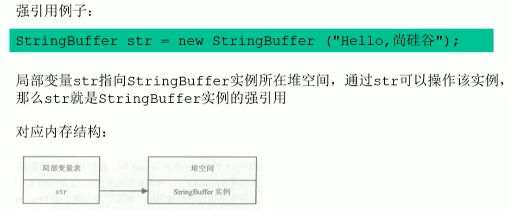

  * 强引用特点：
    * 强引用可以直接访问目标对象。
    * 强引用所指向的对象任何时候都不会被系统回收，虚拟机宁愿抛出OOM异常，也不会回收强引用锁指向的对象。
    * 强引用可能导致内存泄露。

## 7 再谈引用：软引用

* 软引用（Soft Reference）------内存不足即回收

  * 弱引用是用来描述一些还有用，但非必须的对象。<font color=blue>**只被软引用关联的对象，在系统将要发生内存溢出前，会把这些对象列入回收范围之中进行第二次回收（第一次回收就是正常回收没有引用指向的对象）**</font>，如果这次回收还没有足够的内存，才会抛出内存溢出异常。

  * 软引用通常用来实现命案的缓存。比如：<font color=blue>**告诉缓存**</font>就用到了软引用（例如mybatis源码中用到了软引用）。如果还有空闲内存，就可以暂时保留缓存，当内存不足时清理掉，这样就保证了使用缓存的同时，不会耗尽内存。

  * 垃圾回收器在某个时刻决定回收软可达的对象的时候，会清理软引用，并可选地把语言存放到一个引用队列（Reference Queue）。

  * 类似于弱引用，只不过Java虚拟机会疆良让软引用存活时间长一些，迫不得已才清理。

  * 代码演示

    ```java
    /**
     * 软引用的测试：内存不足即回收
     * -Xms10m -Xmx10m
     */
    public class SoftReferenceTest {
        public static class User {
            public User(int id, String name) {
                this.id = id;
                this.name = name;
            }
    
            public int id;
            public String name;
    
            @Override
            public String toString() {
                return "[id=" + id + ", name=" + name + "] ";
            }
        }
    
        public static void main(String[] args) {
            // 创建对象，建立软引用
            // SoftReference<User> userSoftRef = new SoftReference<User>(new User(1, "wxx"));
            // 上面的一行代码，等价于如下的三行代码
            User u1 = new User(1, "wxx");
            SoftReference<User> userSoftRef = new SoftReference<User>(u1);
            u1 = null;  // 取消强引用
    
            // 从软引用中重新获得强引用对象
            System.out.println(userSoftRef.get());
    
            System.gc();
            System.out.println("After GC:");
            //垃圾回收之后获得软引用中的对象
            System.out.println(userSoftRef.get());  // 由于堆空间内存足够，所有不会回收软引用的可达对象。
    
            try {
                // 让系统认为内存资源不够，会回收软引用
                // byte[] b = new byte[1024 * 1024 * 7];
                // 让系统认为内存资源紧张，会回收软引用
                byte[] b = new byte[1024 * 7168 - 610 * 1024];
            } catch (Throwable e) {
                e.printStackTrace();
            } finally {
                //再次从软引用中获取数据
                System.out.println(userSoftRef.get());  // 在报OOM之前，垃圾回收器会回收软引用的可达对象。
            }
        }
    }
    ```

    **结果：**

    ​			[id=1, name=wxx] 

    ​			After GC:

    ​			[id=1, name=wxx] 

    ​			null

    想要不报OOM回收软引用需要精准控制字节数组b的大小，可以增加参数-XX:+PrintGCDetails确定字节数组大小

## 8 再谈引用：弱引用

* 弱引用（Weak Reference）------发现即回收

  * 弱引用也是用来描述那些非必须对象，<font color=blue>**只被弱引用关联的对象只能生存到下一次垃圾收集发生为止**</font>。在系统GC时，只要发现弱引用，不管系统堆空间是否充足，都会回收掉被弱引用关联的对象。

  * 但是，由于垃圾回收器的线程优先级很低，因此，并不一定能很快地发现持有弱引用的对象。在这种情况下，<font color=blue>**弱引用对象可以存在较长的时间**</font>。

  * 弱引用和软引用一样，在构造弱引用时，也可以指定一个引用队列，当弱引用对象被回收时，就会加入指定的引用队列，通过这个队列可以跟踪对象的回收情况。

  * <font color=blue>**软引用、弱引用都非常适合来保存那些可有可无的缓存数据**</font>。如果这么做，当系统内存不足时，这些缓存数据会被回收，不会导致内存溢出。而当内存资源充足时，这些缓存数据又可以存在在相当长的时间，从而起到加速系统的作用。

  * 在JDK1.2版之后提供了java.lang.ref.WeakReference类来实现弱引用。

    ```java
    /**
     * 弱引用的测试
     */
    public class WeakReferenceTest {
        public static class User {
            public User(int id, String name) {
                this.id = id;
                this.name = name;
            }
    
            public int id;
            public String name;
    
            @Override
            public String toString() {
                return "[id=" + id + ", name=" + name + "] ";
            }
        }
    
        public static void main(String[] args) {
            //构造了弱引用
            WeakReference<User> userWeakRef = new WeakReference<User>(new User(1, "wxx"));
            //从弱引用中重新获取对象
            System.out.println(userWeakRef.get());
    
            System.gc();
            // 不管当前内存空间足够与否，都会回收它的内存
            System.out.println("After GC:");
            //重新尝试从弱引用中获取对象
            System.out.println(userWeakRef.get());
        }
    }
    ```

    **结果：**

    ​			[id=1, name=wxx] 

    ​			After GC:

    ​			null

  * <font color=blue>**弱引用对象与软引用对象的最大不同**</font>就在于，当GC进行回收时，需要通过算法检查是否回收软引用对象，而对于弱引用对象，GC总是进行回收。<font color=blue>**弱引用对象更容易、更快的被GC回收**</font>。

  * **面试题：你再开发中使用过WeakHashMap吗？**

    ```java
    public class WeakHashMap<K,V>
        extends AbstractMap<K,V>
        implements Map<K,V> {
        // ...
        
        private static class Entry<K,V> extends WeakReference<Object> implements Map.Entry<K,V> {
            // ...
        }
        
        // ...
    }
    ```

## 9 再谈引用：虚引用

* 虚引用（Phantom Reference）------对象回收跟踪

  * 也称为“幽灵引用”或者“幻影引用”，是所有引用类型中最弱的一个。

  * 一个对象是否有虚引用的存在，完全不会决定对象的生命周期。如果一个对象仅持有虚引用，那么塔和没有引用几乎是一样的，随时都可能 被垃圾回收期回收。

  * 它不能单独使用，也无法通过虚引用来获取被引用的对象。当试图通过虚引用的get()方法取得对象时，总是null。

  * <font color=blue>**为一个对象设置虚引用关联的唯一目的在于跟踪垃圾回收过程。比如：能在这个对象收集器回收时收到一个系统通知**</font>。

  * 虚引用必须和引用队列一起使用。虚引用在创建时必须提供一个引用队列作为参数。当垃圾回收期准备回收一个对象时，如果发现它还有虚引用，就会在回收对象后，将这个虚引用加入引用队列，以同志应用程序对象的回收情况。

  * <font color=blue>**由于虚引用可以跟踪对象的回收时间，因此，也可以将一些资源释放操作放置在虚引用中执行和记录**</font>。

  * 在JDK1.2版之后提供了PhantomReference类来实现虚引用。

    ```java
    public class PhantomReferenceTest {
        public static PhantomReferenceTest obj;  // 当前类对象的声明
        static ReferenceQueue<PhantomReferenceTest> phantomQueue = null;  // 引用队列
    
        public static class CheckRefQueue extends Thread {
            @Override
            public void run() {
                while (true) {
                    if (phantomQueue != null) {
                        PhantomReference<PhantomReferenceTest> objt = null;
                        try {
                            objt = (PhantomReference<PhantomReferenceTest>) phantomQueue.remove();
                        } catch (InterruptedException e) {
                            e.printStackTrace();
                        }
                        if (objt != null) {
                            System.out.println("追踪垃圾回收过程：PhantomReferenceTest实例被GC了");
                        }
                    }
                }
            }
        }
    
        @Override
        protected void finalize() throws Throwable {  // finalize()方法只能被调用一次！
            super.finalize();
            System.out.println("调用当前类的finalize()方法");
            obj = this;
        }
    
        public static void main(String[] args) {
            Thread t = new CheckRefQueue();
            t.setDaemon(true);  // 设置为守护线程：当程序中没有非守护线程时，守护线程也就执行结束。
            t.start();
    
            phantomQueue = new ReferenceQueue<PhantomReferenceTest>();
            obj = new PhantomReferenceTest();
            // 构造了 PhantomReferenceTest 对象的虚引用，并指定了引用队列
            PhantomReference<PhantomReferenceTest> phantomRef = new PhantomReference<PhantomReferenceTest>(obj, phantomQueue);
    
            try {
                // 不可获取虚引用中的对象
                System.out.println(phantomRef.get());
    
                // 将强引用去除
                obj = null;
                // 第一次进行GC,由于对象可复活，GC无法回收该对象
                System.gc();
                Thread.sleep(1000);
                if (obj == null) {
                    System.out.println("obj 是 null");
                } else {
                    System.out.println("obj 可用");
                }
                System.out.println("第 2 次 gc");
                obj = null;
                System.gc();  //一旦将obj对象回收，就会将此虚引用存放到引用队列中。
                Thread.sleep(1000);
                if (obj == null) {
                    System.out.println("obj 是 null");
                } else {
                    System.out.println("obj 可用");
                }
            } catch (InterruptedException e) {
                e.printStackTrace();
            }
        }
    }
    ```

    **结果：**

    ​			null

    ​			调用当前类的finalize()方法

    ​			obj 可用

    ​			第 2 次 gc

    ​			追踪垃圾回收过程：PhantomReferenceTest实例被GC了

    ​			obj 是 null

## 10 再谈引用：终结器引用（Final reference）

* 它用以实现对象的finalize()方法，也可以成为终接器引用。
* 无需手动编码，其内部配合引用 队列使用。
* 在GC时，终接器引用入队。由Finalizer线程通过终接器引用找到被引用的对象并调用它的finalize()方法，第二次GC时才能回收被引用对象。