# 第18章 Class文件结构

## 1 概述

* 作为Java程序员，为什么我们需要接触字节码文件？

  * 字节码文件的跨平台性

  1. <font color=red>**Java语言：跨平台的语言（write once, run anywhere）**</font>
     * 当Java源代码成功编译成字节码后，如果想在不同平台运行，则无需再次编译
     * 这个优势不再那么吸引人了。Python、PHP、Perl、Ruby、Lisp等有强大的编译器
     * 跨平台似乎已经快成为一门语言必选的特性了
  2. <font color=red>**Java虚拟机：跨语言的平台**</font>
     * <font color=red>**Java虚拟机不和包括Java在内的任何语言绑定，它只与“Class文件”这种特定的二进制文件格式所关联。**</font>无论使用何种语言进行软件开发，只要能将源文件编译为正确的Class文件，那么这种预压就可以在Java虚拟机上执行。可以说，统一而强大的Class文件结构，就是Java虚拟机的基石、桥梁。

  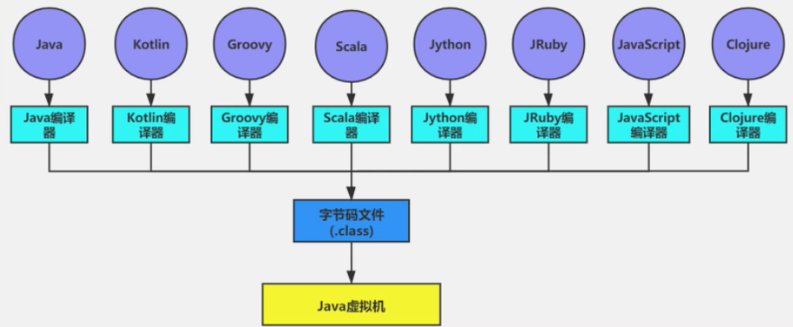

  https://docs.oracle.com/javase/specs/index.html

  所有的JVM都遵循Java虚拟机规范，也就是说所有的JVM环境都是一样的，这样一来字节码文件可以在各种JVM上运行。

  3. **想要让一个Java程序正确地运行在JVM中，Java源码就就必须要被编译为符合JVM规范的字节码。**

     * <font color=red>**前端编译器的主要任务**</font>就是负责将符合Java语法规范的Java代码转换为符合JVM规范的字节码文件。
     * javac是一种能够将Java源码编译为字节码的前端编译器。
     * javac编译器在将Java源码编译为一个有效的字节码文件过程中经历了4个步骤，分别是<font color=red>**词法解析、语法解析、语义解析以及生成字节码**</font>。

     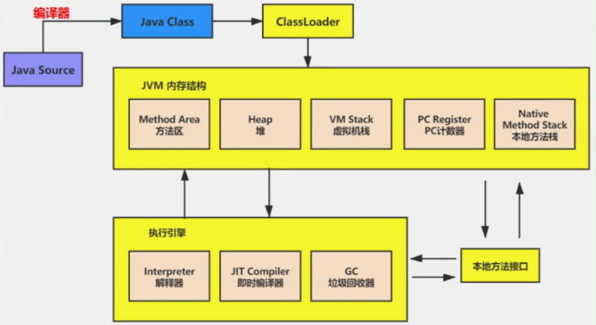

     Oracle的JDK软件包括两部分内容：

     * 一部分是将Java源代码编译成Java虚拟机的指令集的编译器
     * 另一部分是用于实现Java虚拟爱的运行时环境

  * 可以通过字节码指令看代码细节

  1. **BAT面试题**

     ①  类文件结构有几个部分？

     ②  知道字节码吗？字节码指令都有哪些？Integer x = 5; int y = 5;比较x == y 都经过哪些步骤？

  2. **代码举例**

     * 例1

     ```java
     public class IntegerTest {
         public static void main(String[] args) {
             Integer x = 5;
             int y = 5;
             System.out.println(x == y); // true
     
             Integer i1 = 10;
             Integer i2 = 10;
             System.out.println(i1 == i2);  // true
     
             Integer i3 = 128;
             Integer i4 = 128;
             System.out.println(i3 == i4);  // false
         }
     }
     ```

     * 例2

     ```java
     public class StringTest {
         public static void main(String[] args) {
             String str = new String("hello") + new String("world");
             String str1 = "helloworld";
             System.out.println(str == str1);  // false
             String str2 = new String("helloworld");
             System.out.println(str == str2);  // false
         }
     }
     ```

     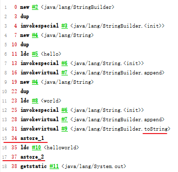

     * 例3

     ```java
     /*
     成员变量（非静态的）的赋值过程： ① 默认初始化 - ② 显式初始化 /代码块中初始化 - ③ 构造器中初始化 - ④ 有了对象之后，可以“对象.属性”或"对象.方法"
      的方式对成员变量进行赋值。
      */
     class Father {
         int x = 10;  // ② 显示初始化
         int y;  // ① 默认初始化为0
         public Father() {
             this.print();
             x = 20;  // ③ 构造器中初始化
         }
         public void print() {
             System.out.println("Father.x = " + x);
         }
     }
     
     class Son extends Father {
         int x = 30;
         public Son() {
             this.print();
             x = 40;
         }
         public void print() {
             System.out.println("Son.x = " + x);
         }
     }
     
     public class SonTest {
         public static void main(String[] args) {
             Father f = new Son();
             System.out.println(f.x);
         }
     }
     ```

     **结果：**

     ​			Son.x = 0
     ​			Son.x = 30
     ​			20

     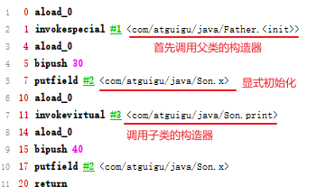

     main中的代码执行：首先会调用Father的构造器方法，然后调用到Father()中的this.print()方法，因为子类重写了该方法，所以会调用子类的方法，此时输出子类的x，为0；然后Son中的 x 进行显式初始化，赋值为30，调用Son中的this.print()后输出30；之后 x 被赋值为 40，因为 f 类型是 Father，属性不存在多态性，所以最后输出20

* Java的 前端编译器 vs. 后端编译器

  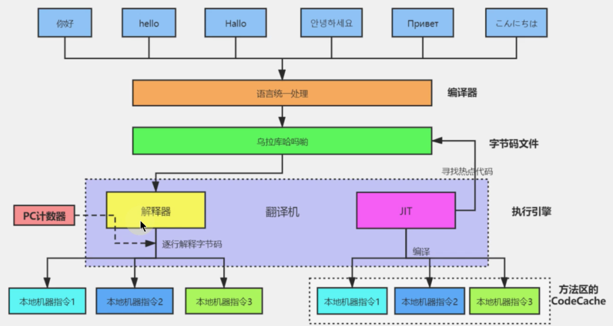

  * Java源代码的编译结果是字节码，那么肯定需要一种编译器能够将Java源码编译为字节码，承担这个重要责任的就是配置在path环境变量中的<font color=red>**javac编译器**</font>。javac是一种能够将Java源码编译为字节码的<font color=red>**前端编译器**</font>。
  * HotSpot VM并没有强制要求前端编译器只能使用javac来编译字节码，其实只要编译结果符合JVM规范都可以被JVM所识别即可。在Java的前端编译器领域，除了javac之外，还有一种被大家经常使用到的前端编译器，那就是内置在Eclipse中的<font color=red>**ECJ（Eclipse Compiler for Java）编译器**</font>。和javac的全量式编译不同，ECJ是一种增量式编译器。
    * 在Eclipse中，当开发人员编写完代码后，使用“Ctrl+S”快捷键时，ECJ编译器采取的<font color=red>**编译方案**</font>是把未编译部分的源码逐行进行编译，而非每次都全量编译。因此ECJ的编译效率会比javac更加迅速和高效，当然编译质量和javac相比大致还是一样的。
    * ECJ不仅是Eclipse的默认内置前端编译器，在Tomcat中同样也是使用ECJ编译器来编译jsp文件。由于ECJ编译器是采用GPLv2的开源协议进行源代码公开，所以大家可以登录Eclipse官网下载ECJ编译器的源码进行二次开发。
    * 默认情况下，IntelliJ IDEA使用javac编译器（还可以自己设置AspectJ编译器ajc）
  * 前端编译器并不会直接涉及编译优化等方面的技术，而是将这些具体优化细节移交给HotSpot的JIT编译器负责。
  * 复习：AOT（静态提前编译器，Ahead Of Time Compiler）


## 2 虚拟机的基石：Class文件

* 字节码文件是什么？

  * 源代码经过编译器编译之后便会生成一个字节码文件，字节码文件是一种二进制的类文件，它的内容是JVM的指令，而不像C、C++经由编译器直接生成机器码。

* 什么是字节码指令（byte code）？

  * Java虚拟机的指令由一个字节长度的、代表着某种特定操作含义的<font color=red>**操作码**</font>（opcode）以及跟随其后的零至多个代表次操作所需参数的<font color=red>**操作数**</font>（operand）所构成。虚拟机中许多指令并不包含操作数，只有一个操作码。

  

* 如何解读供虚拟机解释执行的二进制字节码？

  * 方式一：一个一个二进制的看，这里用到的是Notepad++，需要安装一个HEX-Editor插件，或者使用Binary Viewer
  * 方式二：使用javap指令：jdk自带的反解析工具
  * 方式三：使用IDEA插件：jclasslib或jclasslib bytecode viewer客户端工具。（可视化更好）

## 3 Class文件结构

* 官方文档位置：https://docs.oracle.com/javase/specs/jvms/se8/html/jvms-4.html

* Class类的本质

  * 任何一个Class文件都对应着唯一一个类或接口的定义信息，但反过来说，Class文件实际上它并不一定以磁盘文件的形式存在。Class文件是一组以8位字节为基础的<font color=red>**二进制流**</font>。

* Class文件格式

  * Class的结构不像XML等描述语言，由于它没有任何分割符号。所以在其中的数据项，无论是字节顺序还是数量，都是被严格限定的，哪个字节代表什么含义，长度时多少，先后顺序如何，都不允许改变。

  * Class文件格式采用一种类似于C语言结构体的方式进行数据存储，这种数据结构只有两种数据类型：<font color=red>**无符号数**</font>和<font color=red>**表**</font>。

    * 无符号数属于基本数据类型，以 u1、u2、u4、u8 来分别代表 1 个字节、2个字节、4个字节和 8 个字节的无符号数，无符号数可以用来描述数字、索引引用、数量值或者按照 UTF-8 编码构成的字符串值。
    * 表是由多个无符号数或者其他表作为数据项构成的符合数据类型，所有表都习惯性地以"_info"结尾。表用于描述有层次关系的符合结构的数据，整个Class文件本质上就是一张表。由于表没有固定长度，所以通常会在其前面加上个数说明。

  * 代码举例

    ```java
    package com.atguigu.java1;
    
    /**
     * @author shkstart
     * @create 2020-08-31 8:52
     * 全类名：com.atguigu.java1.Demo
     * 全限定名：com/atguigu/java1/Demo
     */
    public class Demo {
        private int num = 1;
    
        public int add(){
            num = num + 2;
            return num;
        }
    }
    ```

    生成的Demo.class里面的内容如下：

    

---

* Class文件结构概述

  Class文件的结构并不是一成不变的，随着Java虚拟机的不断发展，总是不可避免的对Class文件结构做出一些调整，但是其基本结构和框架是非常稳定的。

  * Class文件的总体结构如下：
    * 魔数
    * Class文件版本
    * 常量池
    * 访问标志
    * 类索引，父类索引，接口索引集合
    * 字段表集合
    * 方法表集合
    * 属性表集合

  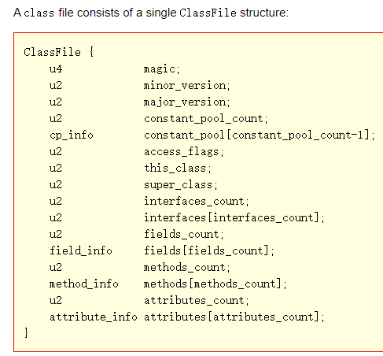

  | 类型           | 名称                | 说明                    | 长度    | 数量                  |
  | -------------- | ------------------- | ----------------------- | ------- | --------------------- |
  | u4             | magic               | 魔数，识别Class文件格式 | 4个字节 | 1                     |
  | u2             | minor_version       | 副版本号（小版本）      | 2个字节 | 1                     |
  | u2             | major_version       | 主版本号（大版本）      | 2个字节 | 1                     |
  | u2             | constant_pool_count | 常量池计数器            | 2个字节 | 1                     |
  | cp_info        | constant_pool       | 常量池表                | n个字节 | constant_pool_count-1 |
  | u2             | access_flags        | 访问标识                | 2个字节 | 1                     |
  | u2             | this_class          | 类索引                  | 2个字节 | 1                     |
  | u2             | super_class         | 父类索引                | 2个字节 | 1                     |
  | u2             | interfaces_count    | 接口计数器              | 2个字节 | 1                     |
  | u2             | interfaces          | 接口索引集合            | 2个字节 | interfaces_count      |
  | u2             | fields_count        | 字段计数器              | 2个字节 | 1                     |
  | field_info     | fields              | 字段表                  | n个字节 | fields_count          |
  | u2             | methods_count       | 方法计数器              | 2个字节 | 1                     |
  | method_info    | methods             | 方法表                  | n个字节 | methods_count         |
  | u2             | attributes_count    | 属性计数器              | 2个字节 | 1                     |
  | attribute_info | attributes          | 属性表                  | n个字节 | attributes_count      |

  

---

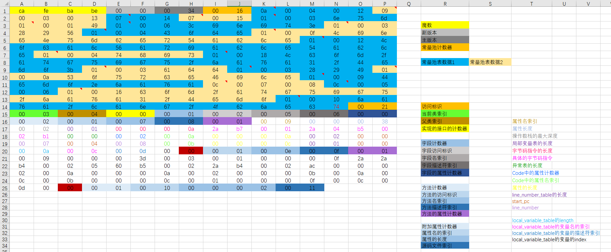

---

### <font color=red>**Magic Number（魔数）**</font>

* 每个Class文件开头的4个字节的无符号整数称为魔数（Magic Number）

* 它的唯一作用是确定这个文件是否为一个能被虚拟机接收的有效合法的Class文件。即：魔数是Class文件的标识符。

* 魔数值固定为 0xcafebabe。不会改变。

* 如果一个Class文件不是以 0xcafebabe 开头，虚拟机在进行文件校验的时候的时候就会抛出以下错误：

  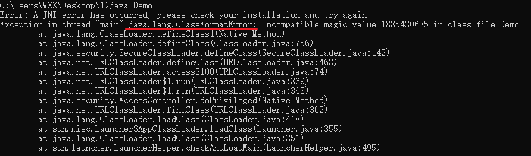

* 使用魔数而不是扩展名来进行识别主要是基于安全方面的考虑，因为文件扩展名可以随意改动。

---

### <font color=red>**Class文件版本号**</font>

* 紧接着魔数的 4 个字节存储的是Class文件的版本号。同样也是 4 个字节。第 5 个和第 6 个字节代表的含义就是编译的副版本号minor_version，而第 7 个和第 8 个字节就是编译的主版本号major_version。

* 他们共同构成了class文件的格式版本号。譬如某个Clacc文件的主版本号为M，副版本号为m，那么这个Class文件的格式版本号就确定为 M.m。

* 版本号和Java编译器的对应关系如下表：

  | 主版本（十进制） | 副版本（十进制） | 编译器版本 |
  | ---------------- | ---------------- | ---------- |
  | 45               | 3                | 1.1        |
  | 46               | 0                | 1.2        |
  | 47               | 0                | 1.3        |
  | 48               | 0                | 1.4        |
  | 49               | 0                | 1.5        |
  | 50               | 0                | 1.6        |
  | 51               | 0                | 1.7        |
  | 52               | 0                | 1.8        |
  | 53               | 0                | 1.9        |
  | 54               | 0                | 1.10       |
  | 55               | 0                | 1.11       |

* Java的版本号是从 45 开始的，JDK1.1之后的每个JDK大版本发布主版本号加1。

* <font color=red>**不同版本的Java编译器编译的Class文件对应的版本是不一样的。目前，高版本的Java虚拟机可以执行低版本编译器生成的Class文件，但是低版本的Java虚拟机不能执行由高版本编译器生成的Class文件。否则JVM会抛出java.lang.UnsupportedClassVersionError异常**</font>。

  * 演示在 JDK1.8 编译出的class文件在 1.6的环境下运行

    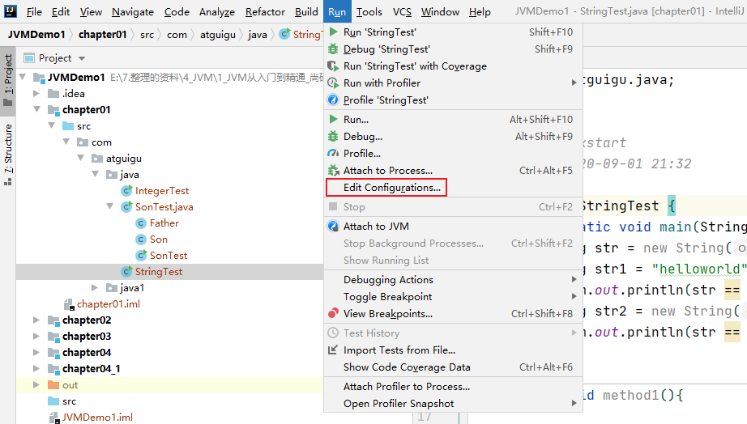

    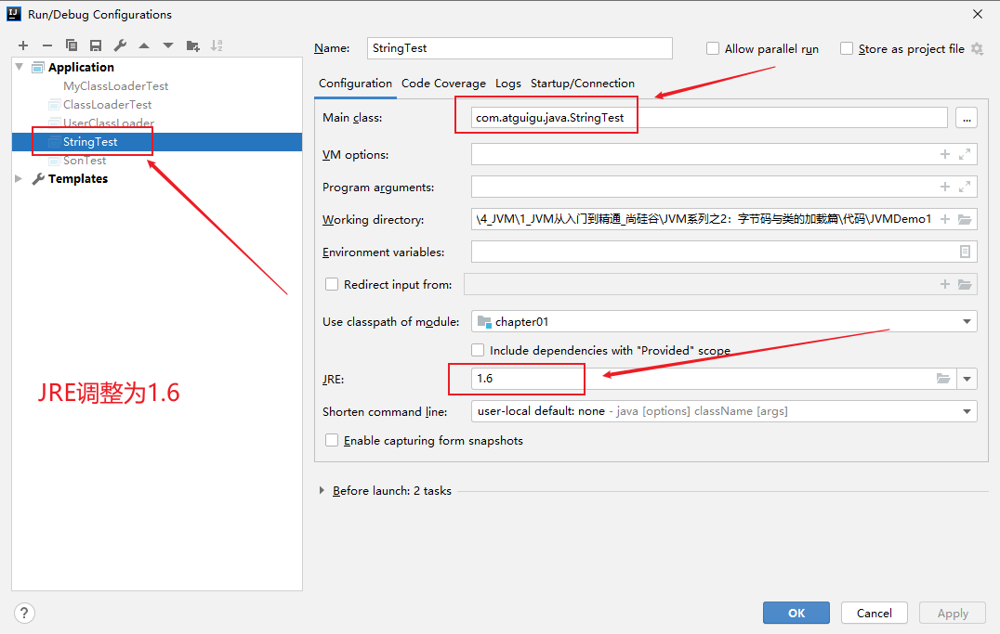

    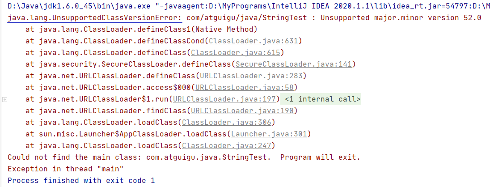

* 在实际应用中，由于开发环境和生产环境的不同。可能会导致上述问题的发生。因此，需要我们在开发时，特别注意开发编译的JDK版本和实际生产环境中的JDK版本是否一致。

  * 虚拟机JDK版本为 1.k（k >= 2）时，对应的class文件版本号范围为45.0 - 44+k.0（含两端）。

---

### <font color=red>**常量池：存放所有常量**</font>

* 常量池是Class文件中内容最为丰富的区域之一。常量池对于Class文件中的字段和方法解析也有着至关重要的作用。
* 随着Java虚拟机的不断发展，常量池的内容也日渐丰富。可以说，常量池是整个Class文件的基石。


* 在版本号之后，紧跟着的是常量池中常量的数量，以及若干个常量池表项。
* 常量池中常量的数量不是固定的，所以在常量池的入口需要放置一项 u2 类型的无符号数，代表常量池容量计数值（constant_pool_count）。与Java中语言习惯不一样的是，这个容量计数器是从1而不是从0开始的。

| 类型           | 名称                | 数量                  |
| -------------- | ------------------- | --------------------- |
| u2（无符号数） | constant_pool_count | 1                     |
| cp_info（表）  | constant_pool       | constant_pool_count-1 |

由上表可见，Class文件使用了一个前置的容量计数器（constant_pool_count）加上若干个连续的数据项（constant_pool）的形式来描述常量池内容。我们把这一系列连续常量池数据成为常量池集合。

* <font color=red>**常量池表项**</font>中，用于存放编译时期生成的各种<font color=blue>**字面量**</font>和<font color=blue>**符号引用**</font>，这部分内容将在类加载（具体是指：加载、链接（验证、初始化、解析）、初始化中的链接阶段中的解析阶段）后进入方法区的<font color=red>**运行时常量池**</font>中存放。


* **常量池计数器（constant_pool_count）**

  * 由于常量池的数量不固定，时长时短，所以需要放置两个字节来表示常量池容量计数值。
  * 常量池容量计数器（u2类型）：**从 1 开始**，表示常量池中有多少项常量。即 constant_pool_count=1 表示常量池中有0个常量项。
  * Demo的值为：

  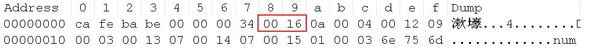

  其值为0x0016，转换为十进制是22。需要注意的是，这实际上只有21项常量。索引范围是1-21.为什么呢？

  * 通常我们写代码时都是从0开始的，但是这里的常量池却是从1开始，因为它把第0项常量空出来了。这是为了满足后面某些指向常量池的索引值的数据在特定情况下需要表达“不引用任何一个常量池项目”的含义，这种情况可以用索引0来表示。


* **常量池表（constant_pool []）**

  * constant_pool 是一种表结构，以 1 ~ constant_pool _count - 1为索引。表明后面有多少常量项。
  * 常量池主要存放两大类常量：<font color=red>**字面量（Literal）**</font>和<font color=red>**符号引用（Symbolic References）**</font>。
  * 它包含了class文件结构及其子结构中引用的所有字符串常量、类或接口名和其他常量。常量池中的每一项都具备相同的特征。第一个字节作为标记类型，用于确定该项的格式，这个字节称为**tag type**（标记字节、标签字节）：一共14个

  | 类型                             | 标志（标识） | 描述                   |
  | -------------------------------- | ------------ | ---------------------- |
  | CONSTANT_utf8_info               | 1            | UTF-8编码的字符串      |
  | CONSTANT_Integer_info            | 3            | 整形字面量             |
  | CONSTANT_Float_info              | 4            | 浮点型字面量           |
  | CONSTANT_Long_info               | 5            | 长整型字面量           |
  | CONSTANT_Double_info             | 6            | 双精度浮点型字面量     |
  | CONSTANT_Class_info              | 7            | 类或接口的符号引用     |
  | CONSTANT_String_info             | 8            | 字符串类型字面量       |
  | CONSTANT_Fieldref_info           | 9            | 字段的符号引用         |
  | CONSTANT_Methodref_info          | 10           | 类中方法的符号引用     |
  | CONSTANT_InterfaceMethodref_info | 11           | 接口中方法的符号引用   |
  | CONSTANT_NameAndType_info        | 12           | 字段或方法的的符号引用 |
  | CONSTANT_MethodHandle_info       | 15           | 表示方法句柄           |
  | CONSTANT_MethodType_info         | 16           | 标志方法类型           |
  | CONSTANT_InvokeDynamic_info      | 18           | 表示一个动态方法调用点 |

  * 字面量和符号引用

    在对这些常量解读之前，我们需要搞清楚几个概念。

    常量池主要存放两大类常量：字面量（Literal）和符号引用（Symbolic Reference）。如下表：

    |   常量   |     具体的常量      |
    | :------: | :-----------------: |
    |  字面量  |     文本字符串      |
    |          | 声明为final的常量值 |
    | 符号引用 | 类和接口的全限定名  |
    |          | 字段的名称和描述符  |
    |          | 方法的名称和描述符  |

    * 全限定名

    com/atguigu/test/Demo这个就是类的全限定名，仅仅是把包名的 “.” 替换成 “/” ，为了使连续的多个全限定名不产生混淆，在使用时最后一版会加入一个 “;” 表示全限定名结束。

    * 简单名称

    简单名称是指没有类型和参数修饰的方法或者字段名称，上面例子中的类的add()方法和num字段的简单名称分别是add 和 num。

    * 描述符

    <font color=red>**描述符的作用是用来描述字段的数据类型、方法的参数列表（包括数量、类型以及顺序）和返回值。**</font>根据描述符规则，基本数据类型（byte、char、short、boolean、int、long、float、double）以及代表无返回值的void类型都应一个大写字母来表示，而对象类型则用字符 **L** 加对象的全限定名表示，详见下表：

    | 标识符 | 含义                                                         |
    | ------ | ------------------------------------------------------------ |
    | B      | 基本数据类型byte                                             |
    | C      | 基本数据类型char                                             |
    | S      | 基本数据类型short                                            |
    | Z      | 基本数据类型boolean                                          |
    | I      | 基本数据类型int                                              |
    | J      | 基本数据类型long                                             |
    | F      | 基本数据类型float                                            |
    | D      | 基本数据类型double                                           |
    | V      | 代表void类型                                                 |
    | L      | 对象类型，比如：Ljava/lang/Object;                           |
    | [      | 数组类型，代表一维数组。比如：double[][][][][][\][\] is [[[D |

    例子：

    ```java
    public class ArrayTest {
        public static void main(String[] args) {
            Object[] arr = new Object[10];
            System.out.println(arr);  // [Ljava.lang.Object;@1540e19d
    
            String[] arr1 = new String[10];
            System.out.println(arr1);  // [Ljava.lang.String;@677327b6
    
            long[][] arr2 = new long[10][];
            System.out.println(arr2);  // [[J@14ae5a5
        }
    }
    ```

    * 补充说明：虚拟机在加载Class文件时才会进行动态链接，也就是说，Class文件不会保存各个字段和方法的最终内存布局信息，因此，这些字段和方法的符号引用不经过转换是无法直接被虚拟机使用的。<font color=red>**当虚拟机运行时，需要从常量池中获得对应的符号引用，再在类加载过程中的解析阶段将其替换为直接引用，并翻译到具体的内存地址中。**</font>这里说明下符号引用和直接引用的区别和关联：
      * 符号引用：符号引用以<font color=red>**一组符号**</font>来描述所引用的目标，符号可以是任何形式的字面量，只要使用时能无歧义地定位到目标即可。<font color=red>**符号引用与虚拟机实现的内存布局无关**</font>，引用的目标并不一定已经加载到了内存中。
      * 直接引用：直接引用可以是直接<font color=red>**指向目标的指针、相对偏移量或是一个能间接定位到目标的句柄**</font>。<font color=red>**直接引用是与虚拟机实现的内存布局相关的**</font>，同一个符号引用在不同虚拟机实例上翻译出来的直接引用一般不会相同。如果有了直接引用，那说明引用的目标必然已经存在于内存之中了。（虚拟机栈中的动态链接指向的内容：即方法区中的运行时常量池）

    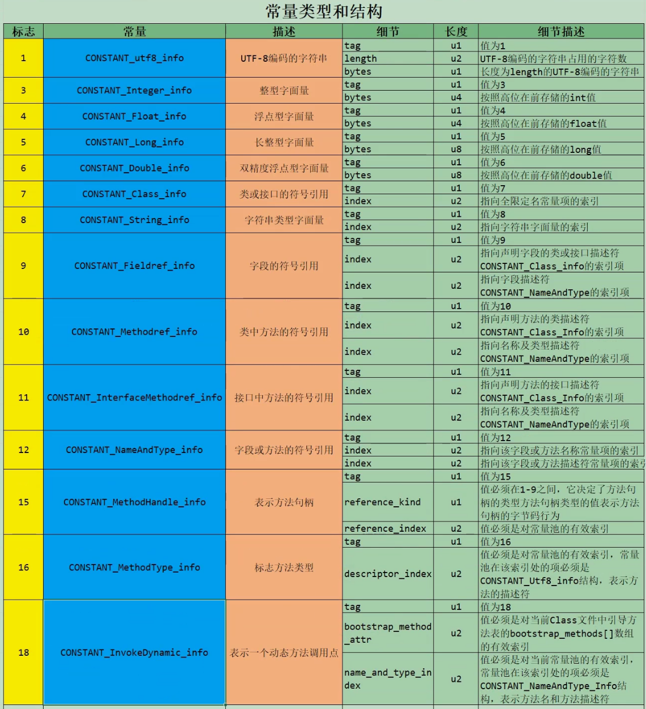

* 常量池表小结：

  * CONSTANT_Integer_info出现在常量池表中的前提是要声明一个 final int 的常量

  * 标记为15、16、18的常量项类型是用来支持动态语言调用的（jdk1.7时才加入）。

  * 细节说明：

    * CONSTANT_Class_info 结构用于表明类或接口
    * CONSTANT_Fieldref_info、CONSTANT_Methodref_info、CONSTANT_InterfaceMethodref_info 结构表示字段、方法和接口方法
    * CONSTANT_String_info 结构用于表示 String 类型的常量对象
    * CONSTANT_Integer_info和CONSTANT_Float_info 表示 4 个字节（int 和 float）的数值常量
    * CONSTANT_Long_info 和 CONSTANT_Double_info 结构表示 8 字节（long 和 double）的数值常量
      * 在class文件的常量池表中，所有的 8 字节常量均占两个表成员（项）的空间。如果一个CONSTANT_Long_info 或 CONSTANT_Double_info 结构的项在常量池中的索引位置为n，则常量池表中的下一个可用项的索引位置为n+2，此时常量池表中索引位n+1的项仍然有效但必须视为不可用的。
    * CONSTANT_NameAndType_info 结构用于表示字段或方法，但是和之前的三个结构不同。CONSTANT_NameAndType_info结构没有指明该字段或方法所属的类或接口。
    * CONSTANT_utf8_info 用于表示字符串常量的值
    * CONSTANT_MethodHandle_info 结构用于表示方法句柄
    * CONSTANT_MethodType_info 结构用于表示方法类型
    * CONSTANT_InvokeDynamic_info 结构用于表示 invokedynamic指令所用到的引导方法（bootstrap method）、引导方法所用到的动态调用名称（dynamic invocation name）、参数和返回类型。并可以给引导方法传入一系列称为静态参数（static argument）的常量。

  * 解析方式：一个字节一个字节的解析

    

  * 总结1：

    * 这14种表（或者常量项结构）的共同点是：表开始的第一位是一个u1类型的标志位（tag），代表当前这个常量项使用的是哪种表结构，即哪种常量类型。
    * 在常量池列表中，CONSTANT_String_info 常量项是一种使用改进过得UTF-8编码格式来存储的如文字字符串、类或者接口的全限定名、字段或者方法的简单名称以及描述符等常量字符串信息。
    * 这14中常量项结构还有一个特点是，其中13项占用的字节数固定，只有CONSTANT_utf8_info 占用字节数不固定，其大小由length决定。为什么呢？<font color=red>**因为从常量池存放的内容可知，其存放的是字面量和符号引用，最终这些内容都会是一个字符串，这些字符串的大小是在编写程序时才确定**</font>，比如你定义一个类，类名可以取长取短，所以在没编译前，大小不固定，编译后，通过utf-8编码，就可以知道其长度。

  * 总结2：

    * 常量池：可以理解为Class文件之中的资源仓库，它是Class文件结构中与其他项目关联最多的数据类型（后面的很多数据类型都会指向此处），也是占用Class文件空间最大的数据项目之一。
    * **常量池中为什么要包含这些内容？**
      * Java代码在进行javac编译的时候，并不像C和C++那样有“链接”这一步骤，而是在虚拟机加载Class文件的时候才进行动态链接。也就是说，<font color=red>**在Class文件中不会保存各个方法、字段的最终内存布局信息，因此这些字段、方法的符号引用不经过运行期转换的话无法得到真正的内存入口地址，也就无法直接被虚拟机使用。**</font>当虚拟机运行时，需要从常量池获得对应的符号引用，再在类创建或运行时解析、翻译到具体的内存地址之中。关于类的创建和动态链接的内容，在虚拟机类加载过程时再进行详细讲解。

---

### <font color=red>**访问标识（access_flag、访问标志、访问标记）**</font>

* 在常量池后，紧跟着访问标记。该标记使用两个字节标识，用于识别一些类或者接口层次的访问信息，包括：这个Class是类还是接口；是否定义为 public 类型；是否定义为 abstract 类型；如果是类的话，是否被声明为 final 等。各种访问标记如下所示：

| 标志名称       | 标志值 | 含义                                                         |
| -------------- | ------ | ------------------------------------------------------------ |
| ACC_PUBLIC     | 0x0001 | 标志位public类型                                             |
| ACC_FINAL      | 0x0010 | 标志被声明为final，只有类可以设置                            |
| ACC_SUPER      | 0x0020 | 标志允许使用invokespecial字节码指令的新语义，JDK1.0.2之后编译出来的类这个标志默认为真。（使用增强的方法调用父类方法） |
| ACC_INTERFACE  | 0x0200 | 标志这是一个接口                                             |
| ACC_ABSTRACT   | 0x0400 | 是否为abstract类型，对于接口或者抽象类来说，此标志值为真，其他类型为假 |
| ACC_SYNTHETIC  | 0x1000 | 标志此类并非由用户产生（即：由编译器产生的类，没有源码对应） |
| ACC_ANNOTATION | 0x2000 | 标志这是一个注解                                             |
| ACC_ENUM       | 0x4000 | 标志这是一个枚举                                             |

* 类的访问权限通常为 ACC_ 开头的常量
* 每一种类型的表示都是通过设置访问标识的32位中的特定位来实现的。比如，若是 public final 的类，则该标记为 ACC_PUBLIC | ACC_FINAL。
* 使用 ACC_SUPER 可以让类更准确地定位到父类的方法 super.method()，现代编译器都会设置并且使用这个标记。
* 补充说明：
  * 带有 ACC_INTERFACE 标志的 class 文件表示的是接口而不是类，反之则表示是类而不是接口。
    * 如果一个 class 文件被设置了 ACC_INTERFACE 标志，那么同时也得设置 ACC_ABSTRACT 标志。同时它不能再设置 ACC_FINAL、ACC_SUPER 或 ACC_ENUM 标志。
    * 如果没有设置 ACC_INTERFACE 标志，那么这个 class 文件中可以具有上表除 ACC_ANNOTATION 外的其他所有标志。当然，ACC_FINAL 和 ACC_ABSTRACT 这类互斥的标志除外，这两个标志不得同时设置。
  * ACC_SUPER 标志用于确定类里面的 invokespecial 指令使用的是哪一种执行语义。<font color=red>**针对Java虚拟机指令集的编译器都应该设置这个标志。**</font>对于Java SE 8及后续版本来说，无论class文件中这个标志的实际值是什么，也不管class文件的版本号是多少，Java虚拟机都认为每个class文件均设置了ACC_SUPER标志。
    * ACC_SUPER 标志是为了向后兼容由旧的Java编译器锁编译的代码而设计的。目前的 ACC_SUPER 标志由 JDK 1.0.2之前的编译器所生成的access_flags中的没有明确含义的，如果设置了该标志，那么Oracle的Java虚拟机实现会将其忽略。
  * ACC_SYNTHETIC 标志意味着该类或接口是由编译器生成的，而不是源代码生成的。
  * 注解类型必须设置为 ACC_ANNOTATION 标志。如果设置了 ACC_ANNOTATION 标志，那么也必须设置 ACC_INTERFACE 标志，从而也要设置 ACC_ABSTRACT 标志。
  * ACC_ENUM 标志表明该类或其父类为枚举类型。

---

### <font color=red>**类索引、父类索引、接口索引集合**</font>

* 在访问标识之后，会指定该类的类别、父类类别以及实现的接口，格式如下：

| 长度 | 含义                         |
| ---- | ---------------------------- |
| u2   | this_class                   |
| u2   | super_class                  |
| u2   | interfaces_count             |
| u2   | interfaces[interfaces_count] |

* 这三项数据来确定这个类的继承关系。

  * 类索引用于确定这个类的全限定名。
  * 父类索引用于确定这个类的父类的全限定名。由于Java语言不允许多重继承，所有父类索引只有一个，除了java.lang.Object之外，所有的Java类都有父类，因此除了java.lang.Object外，所有Java类的父类索引都不为0.
  * 接口索引集合就是用来描述这个类实现了哪些接口，这些被实现的接口将按 implements 语句（如果这个类本身是接口，则应该是 extends 语句）后的接口顺序从左到右排列在接口索引集合中。

* this_class（类索引）

  2 字节无符号整数，指向常量池的索引。它提供了类的全限定名，如 com/atguigu/java1/Demo。this_class的值必须是对常量池中某项的一个有效索引值。常量池在这个索引处的成员必须为 CONSTANT_Class_info 类型结构体，该结构体表示这个 class 文件所定义的类或接口。

* super_class（父类索引）

  * 2 字节无符号整数，指向常量池的索引。它提供了当前类的父类的全限定名。如果我们没有继承任何类，其默认继承的是 java/lang/Object 类。同时，由于 Java 不支持多继承，所以其父类只有一个。
  * super_class 的父类不能是 final。

* interface

  * 指向常量池索引集合，它提供了一个符号引用到所有已实现的接口
  * 由于一个类可以实现多个接口，因此需要以数组形式保存多个接口的索引，表示接口的每个索引也是一个指向常量池的CONSTANT_Class（当然这里就必须是接口，而不是类）。
  * interfaces_count ：表示当前类或接口的直接接口数量
  * interfaces[] ：接口索引集合，其中的每个成员的值必须是对常量池表中某项的有效索引，它的长度为 interfaces_count。每个成员interfaces[i] 必须为 CONSTANT_Class_info 结构，其中 0 <= i < interfaces_count。在interfaces[] 中，各成员所表示的接口顺序和对应的源代码中给定的接口顺序（从左至右）一样，即 interfaces[0] 对应的是源代码中最左边的接口。

---

### <font color=red>**字段表集合**</font>

* fields

* 用于描述接口或类中声明的变量。字段（field）包括<font color=red>**类级变量**</font>以及<font color=red>**实例级变量**</font>，但是不包括方法内部、代码块内部声明的局部变量。

* 字段叫什么名字、字段被定义为 什么数据类型，这些都是无法固定的，只能引用常量池中的常量来描述。

* 它指向常量池索引集合，它描述了每个字段的完整信息。比如<font color=red>**字段标识符、访问修饰符（public、private或protected）、是类变量还是实例变量（static修饰）、是否是常量（final修饰）**</font>等。

* 注意事项

  * 字段表集合中不会列出父类或者实现的接口中继承来的字段，但是可能列出原本Java代码之中不存在的字段，譬如在内部类中为了保持对外部类的访问性，会自动添加指向外部类实例的字段。
  * 在Java语言字段是无法重载的，两个字段的数据类型、修饰符不管是否相同，都必须使用不一样的名称，但是对于字节码来说，如果两个字段的描述符不一致，那字段重名就是合法的。

  

* **fields_count（字段计数器）**

* 表示当前class文件fields表的成员个数。使用两个字节来表示。

* fields表中每个成员变量都是 field_info 结构，用于表示该类或接口所声明的所有类字段或者实例字段，不包括方法内部声明的变量，也不包括从父类或负借口继承的那些字段。
  
  * **fields[] （字段表）**
  
    * fields表中的每个成员都必须是一个 field_info 结构，用于表示当前类或接口某个字段的完整描述。
    * 一个字段的信息包括下面这些信息。这些信息中，<font color=red>**各个修饰符都是布尔值，要么有，要么没有。**</font>
      * 作用域（public、private、protected修饰符）
      * 是实例变量还是类变量（static修饰符）
      * 可变性（final）
      * 并发可见性（volatile修饰符，是否强制从主内存读写）
      * 可否序列化（transient修饰符）
      * 字段数据类型（基本数据类型、对象、数组）
    * 字段名称
    * field_info 的结构
  
    |      类型      |       名称       |    含义    |       数量       |
    | :------------: | :--------------: | :--------: | :--------------: |
    |       u2       |   access_flags   |  访问标识  |        1         |
    |       u2       |    name_index    | 字段名索引 |        1         |
    |       u2       | descriptor_index | 描述符索引 |        1         |
  |       u2       | attributes_count | 属性计数器 |        1         |
  | attribute_info |    attributes    |  属性集合  | attributes_count |
  
  * field_info 访问标志
  
      我们知道，一个字段可以被各种关键字去修饰，比如：作用域修饰符（public、private、protected）、static修饰符、final修饰符、volatile修饰符等等。因此，其可像类的访问标识那样，使用一些标识来标记字段。字段的访问标识（访问标志）有如下这些：
  
      |   标志名称    | 标志值 |            含义            |
      | :-----------: | :----: | :------------------------: |
      |  ACC_PUBLIC   | 0x0001 |      字段是否为public      |
      |  ACC_PRIVATE  | 0x0002 |     字段是否为private      |
      | ACC_PROTECTED | 0x0004 |    字段是否为protected     |
      |  ACC_STATIC   | 0x0008 |      字段是否为static      |
      |   ACC_FINAL   | 0x0010 |      字段是否为final       |
      | ACC_VOLATILE  | 0x0040 |     字段是否为volatile     |
      | ACC_TRANSIENT | 0x0080 |    字段是否为transient     |
    | ACC_SYNCHETIC | 0x1000 | 字段是否为由编译器自动生成 |
    |   ACC_ENUM    | 0x4000 |       字段是否为enum       |
  
  * field_info 字段名索引
  
    根据字段名索引的值，查询常量池中指定索引项即可
  
  * field_info 描述符索引
  
      描述符的作用是用来藐视数据类型、方法的参数列表（包括数量、类型以及顺序）和返回值。根据描述符规则，基本数据类型（byte、char、short、boolean、int、long、float、double）以及代表无返回值的void类型都应一个大写字母来表示，而对象类型则用字符 **L** 加对象的全限定名表示，详见下表：
  
      | 标识符 | 含义                                                         |
      | ------ | ------------------------------------------------------------ |
      | B      | 基本数据类型byte                                             |
      | C      | 基本数据类型char                                             |
      | S      | 基本数据类型short                                            |
      | Z      | 基本数据类型boolean                                          |
      | I      | 基本数据类型int                                              |
      | J      | 基本数据类型long                                             |
      | F      | 基本数据类型float                                            |
      | D      | 基本数据类型double                                           |
      | V      | 代表void类型                                                 |
    | L      | 对象类型，比如：Ljava/lang/Object;                           |
    | [      | 数组类型，代表一维数组。比如：double[][][][][][\][\] is [[[D |
  
  * field_info 属性表集合
  
    一个字段还可能拥有一些属性，用于存储更多的额外信息。比如初始化值、一些注释信息等。属性个数存放在attributes_count中，属性具体内容存放在 attributes 中。
  
    以常量属性为例（被final修饰），结构为：
  
    ConstantValue_attribute {
  
    ​		u2  attribute_name_index;
  
    ​		u4  attribute_length;
  
    ​		u2  constantvalue_index;
  
      }
  
      说明：对于常量属性而言，attribute_length的值恒为2。

---

### <font color=red>**方法表集合**</font>

* methods：指向常量池索引集合，它完整描述了每个方法的签名。

* 在字节码文件中，<font color=red>**每一个 method_info 项都对应着一个类或者接口中的方法信息。**</font>比如方法的访问修饰符（public、private和protected），方法的返回值类型以及方法的参数信息等。

* 如果这个方法不是抽象的或者不是native的，那么字节码中会体现出来。

* 一方面，methods表只描述当前类或接口中声明的方法，不包括从父类或者父接口继承的方法。另一方面，methods表有可能会出现由编译器自动添加的方法，最典型的便是编译器产生的方法信息（比如：类（接口）初始化方法\<clinit>()和实例初始化方法\<init>() )。

* 使用注意事项

  在Java语言中，要重载（Overload）一个方法，除了要与原方法具有相同的简单名称之外，还要求必须拥有一个与原方法不同的特征签名，特征签名就是一个方法中各个参数在常量池中的字段符号引用的集合，也就是因为返回值不会包含在特征签名之中，因此Java语言里无法仅仅依靠返回值的不同来对一个方法进行重载。但是在Class文件中，特征签名的范围更大一些，只要描述符不是完全一致的两个方法就可以共存。也就是说，如果两个方法有相同的名称和特征签名，但返回值不同，那么也是可以合法共存在同一个 class 文件中。

  也就是说，尽管Java语法规范并不允许在一个类或者接口中声明多个方法签名相同的方法，但是和Java语法规范相反，字节码文件只能够却恰恰允许存放多个方法签名相同的方法，唯一的条件就是这些方法之间的返回值不能相同。

  

* **methods_count（方法计数器）**

  methods_count的值表示当前class文件methods表的成员个数。使用两个字节表示。

  methods 表中每一个成员都是一个 method_info结构。

* **methods []（方法表）**

  * methods 表中的每个成员都必须是一个method_info 结构，用于表示当前类或接口中某个方法的完整描述。如果某个 method_info 结构的 access_flags 项既没有设置 ACC_NATIVE 标志也没有设置 ACC_ABSTRACT标志，那么该结构中也应包含实现这个方法所用的所有的Java虚拟机指令。

  * method_info 结构可以表示类和接口中定义的所有方法，包括类方法、实例方法、类或接口初始化方法、实例初始化方法。

  * 方法表（method_info）的结构实际跟字段表是一样的，方法表结构如下：

    |      类型      |       名称       |    含义    |       数量       |
    | :------------: | :--------------: | :--------: | :--------------: |
    |       u2       |   access_flags   |  访问标识  |        1         |
    |       u2       |    name_index    | 方法名索引 |        1         |
    |       u2       | descriptor_index | 描述符索引 |        1         |
    |       u2       | attributes_count | 属性计数器 |        1         |
    | attribute_info |    attributes    |  属性集合  | attributes_count |

  * method_info 访问标志（访问标识）

    跟字段表一样，方法表也有访问标志，而且他们的标志有部分相同，部分则不同，方法表的具体访问标志如下：

    |     标志名称     | 标志值 |                含义                 |
    | :--------------: | :----: | :---------------------------------: |
    |    ACC_PUBLIC    | 0x0001 |     public，方法可以从包外访问      |
    |   ACC_PRIVATE    | 0x0002 |     private，方法只能本类中方法     |
    |  ACC_PROTECTED   | 0x0004 | protected，方法在自身和子类可以访问 |
    |    ACC_STATIC    | 0x0008 |          static，静态方法           |
    |    ACC_FINAL     | 0x0010 |    final，方法不能被重写（覆盖）    |
    | ACC_SYNCHRONIZED | 0x0020 |   synchronized，调用由监视器使用    |
    |    ACC_BRIDGE    | 0x0040 |         由编译器生成的方法          |
    |   ACC_VARARGS    | 0x0080 |         可变数量的参数声明          |
    |    ACC_NATIVE    | 0x0100 |    native，非Java语言实现的代码     |
    |   ACC_ABSTRACT   | 0x0400 |         abstract，抽象方法          |
    |    ACC_STRICT    | 0x0800 |   strictfp，浮点数模式为FP-strict   |
    |  ACC_SYNTHETIC   | 0x1000 |      synthetic，源代码中不存在      |

    

---

### <font color=red>**属性表集合**</font>

* 方法表集合之后是属性表集合，<font color=red>**指的是class文件所携带的辅助信息**</font>，比如class文件的源文件的名称。以及任何带有RetentionPolicy.CLASS 或者 RetentionPolicy.RUNTIME的注解。这类信息通常被用于Java虚拟机的验证和运行，以及Java程序的调试，<font color=red>**一般无须深入了解**</font>。

* 此外，字段表、方法表都可以有自己的属性表。用于描述某些场景专用的信息。

* 属性表集合的限制没有那么严格，不再要求各个属性表具有严格的顺序，并且只要不与已有的属性名重复，任何人实现的编译器都可以向属性表中写入自己定义的属性信息，但Java虚拟机运行时会忽略掉它不认识的属性。

  

* **attributes_count（属性计数器）**

  * attributes_count 的值表示当前class文件属性表的成员个数。属性表中每一项都是一个 attribute_info 结构。

* **attributes []（属性表）**

  属性表的每个项的值必须是 attribute_info 结构。属性表的结构比较灵活，各种不同的属性只要满足以下结构即可。

  * attribute_info 属性的通用格式

    | 类型 | 名称                 | 数量             | 含义       |
    | ---- | -------------------- | ---------------- | ---------- |
    | u2   | attribute_name_index | 1                | 属性名索引 |
    | u4   | attribute_length     | 1                | 属性长度   |
    | u1   | info                 | attribute_length | 属性表     |

    即只需说明属性的名称以及占用位数的长度即可，属性表具体的结构可以自己去定义。

  * 属性类型

    属性表实际上可以有很多类型，上面看到的Code属性只是其中的一种，Java8里面定义了23中属性。

    下面这些是虚拟机中预定义的属性：

    |              属性名称               |      使用位置      |                             含义                             |
    | :---------------------------------: | :----------------: | :----------------------------------------------------------: |
    |                Code                 |       方法表       |                  Java代码编译成的字节码指令                  |
    |            ConstantValue            |       字段表       |                   final关键字定义的常量池                    |
    |             Deprecated              |  类、方法、字段表  |                被声明为deprecated的方法和字段                |
    |             Exceptions              |       方法表       |                        方法抛出的异常                        |
    |           EnclosingMethod           |       类文件       | 仅当一个类为局部类或者匿名类时才能拥有这个属性，这个属性用于标识这个类所在的外围方法 |
    |            InnerClasses             |       类文件       |                          内部类列表                          |
    |           LineNumberTable           |      Code属性      |             Java源码的行号与字节码指令的对应关系             |
    |         LocalVariableTable          |      Code属性      |                      方法的局部变量描述                      |
    |            StackMapTable            |      Code属性      | JDK1.6新增的属性，供新的类型检查检验器检查和处理目标方法的局部变量和操作数有所需要的类是否匹配 |
    |              Signture               | 类、方法表、字段表 |                 用于支持泛型情况下的方法签名                 |
    |             SourceFile              |       类文件       |                       记录源文件的名称                       |
    |        SourceDebugExtension         |       类文件       |                    用于存储额外的调试信息                    |
    |              Synthetic              | 类、方法表、字段表 |                标志方法或字段为编译器自动生成                |
    |       LocalVariableTypeTable        |         类         | 使用特征签名代替描述符，是为了引入泛型语法之后能描述泛型参数化类型而添加 |
    |      RuntimeVisibleAnnotations      | 类，方法表，字段表 |                      为动态注解提供支持                      |
    |     RuntimeInvisibleAnnotations     | 类，方法表，字段表 |               用于指明哪些注解是运行时不可见的               |
    |  RuntimeVisibleParameterAnnotation  |       方法表       | 作用与RuntimeVisibleAnnotations属性类似，只不过作用对象为方法 |
    | RuntimeInvisibleParameterAnnotation |       方法表       | 作用与RuntimeInvisibleAnnotations属性类似，作用对象为方法参数 |
    |          AnnotationDefault          |       方法表       |                  用于记录注解类元素的默认值                  |
    |          BootstrapMethods           |       类文件       |        用于保存invokedynamic指令引用的引导方式限定符         |

    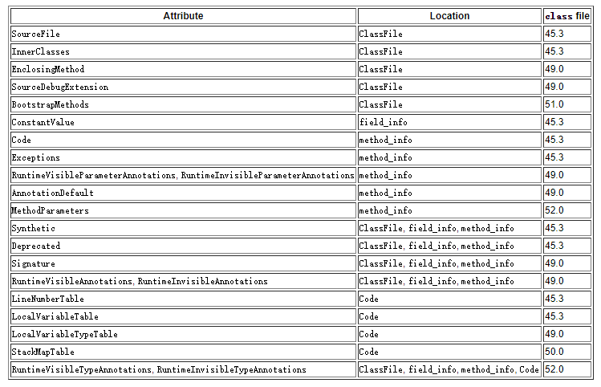

  * 部分属性详解

    * ConstantValue 属性

      ConstantValue 表示一个常量字段的值。位于 field_info 结构的属性表中

      ```
      ConstantValue_attribute {
      	u2  attribute_name_index;
      	u4  attribute_length;
      	u2  constantvalue_index;  // 字段值在常量池中的索引，常量池在该索引出的项给出该属性的常量值。（例如，值是long型的，在常量池中便是CONSTANT_Long）
      }
      ```

    * Deprecated 属性
    
      Deprecated 属性是在JDK1.1为了支持注释中的关键词 @deprecated 而引入的。
    
      ```
      Deprecated_attribute {
      	u2 attribute_name_index;
      	u4 attribute_length;
      }
      ```
    
    * Code 属性
    
      Code 属性就是存放方法体里面的代码。但是，并非所有方法表都有Code属性，像接口或者抽象方法，他们没有具体的方法体。
    
      Code 属性表的结构，如下图：
    
      |      类型      |          名称          |          数量          |            含义            |
      | :------------: | :--------------------: | :--------------------: | :------------------------: |
      |       u2       |  attribute_name_index  |           1            |         属性名索引         |
      |       u4       |    attribute_length    |           1            |          属性长度          |
      |       u2       |       max_stack        |           1            |    操作数栈深度的最大值    |
      |       u2       |       max_locals       |           1            | 局部变量表所需要的存储空间 |
      |       u4       |      code_length       |           1            |      字节码指令的长度      |
      |       u1       |          code          |      code_length       |       存储字节码指令       |
      |       u2       | exception_table_length |           1            |         异常表长度         |
      | exception_info |    exception_table     | exception_table_length |           异常表           |
      |       u2       |    attributes_count    |           1            |       属性集合计数器       |
      | attribute_info |       attributes       |    attributes_count    |          属性集合          |
    
    * InnerClasses 属性
    
      为了方便说明，特别定义一个表示类或接口的Class格式为C。如果 C 的常量池中包含某个 CONSTANT_Class_info 成员，且这个成员所表示的类或接口不属于任何一个包，那么 C 的ClassFile 属性表中就必须包含对应的 InnerClasses 属性。InnerClasses 属性是在JDK1.1中为了支持内部类和内部接口而引入的，位于 ClassFile结构的属性表。
      
    * LineNumberTable 属性
    
      LineNumberTable 属性是可选变长属性，位于 Code 结构的属性表。
    
      LineNumberTable 属性是<font color=red>**用来描述Java源代码行号与字节码之间的对应关系。**</font>这个属性可以用来在调试的时候定位代码执行的行数。
    
      * <font color=blue>**start_pc, 即字节码行号；line_number, 即Java源代码行号。**</font>
    
      在Code属性的属性表中，LineNumberTable 属性可以按照任意顺序出现。此外，多个LineNumberTable 属性可以共同表示一个行号在源文件中表示的内容，即LineNumberTable 属性不需要与源代码的行一一对应。
    
      LineNumberTable 属性表结构：
    
      ```
      LineNumberTable_attribute {
      	u2 attribute_name_index;
      	u4 attribute_length;
      	u2 line_number_table_length;
      	{
      		u2 start_pc;
      		u2 line_number;
      	} line_number_table[line_number_table_length];
      }
      ```
    
    * LocalVariableTable 属性
    
      LocalVariableTable 是可选变长属性，位于 Code 结构的属性表中。它被调试器<font color=red>**用于确定方法在执行过程中局部变量的信息。**</font>在Code属性中，LocalVariableTable 属性可以按照任意顺序出现。Code 属性中每个局部变量最多只能有一个LocalVariableTable 属性。
    
      * <font color=blue>**start_pc + length 表示这个变量在字节码中的生命周期起始和结束的偏移位置（this 生命周期从头到尾）。**</font>
      * <font color=blue>**index 就是这个变量在局部变量表中的槽位（槽位可复用）。**</font>
      * <font color=blue>**name 就是变量名称。**</font>
      * <font color=blue>**Descriptor 表示局部变量表类型描述。**</font>
    
      LocalVariableTable 属性表结构：
    
      ```
      LocalVariableTable_attribute {
      	u2 attribute_name_index;
      	u4 attribute_length;
      	u2 local_variable_table_length;
      	{
      		u2 start_pc;
      		u2 length;
      		u2 name_index;
      		u2 descriptor_index;
      		u2 index;
      	} local_variable_table[local_variable_table_length];
      }
      ```
    
    * Signture 属性
    
      Signture 属性是可选的定长属性，位于 ClassFile，field_info或 method_info 结构的属性表中。在Java语言中，任何类、接口、初始化方法或成员的泛型签名如果包含了类型变量（Type Variables）或参数化类型（Parameterized Types），则Signature属性会为它记录泛型签名信息。
    
    * SourceFile 属性
    
      SourceFile 属性结构：
    
      | 类型 |         名称         | 数量 |     含义     |
      | :--: | :------------------: | :--: | :----------: |
      |  u2  | attribute_name_index |  1   |  属性名索引  |
      |  u4  |   attribute_length   |  1   |   属性长度   |
      |  u2  |   sourcefile_index   |  1   | 源码文件索引 |
    
    * 其他属性
    
      Java虚拟机中预定义的属性有20多个，这里就不一一介绍了，通过上面几个属性的介绍，只要领会其精髓，其他属性的解读也是易如反掌。

---

* 本章主要介绍了Class文件的基本格式。
* 随着Java平台的不断发展，在将来，Class文件的内容也会做进一步的扩充，但是其基本的格式和结构不会做重大的调整。
* 从Java虚拟机的角度看，通过Class文件，可以让更多的计算机语言支持Java虚拟机平台。因此，Class文件结构不仅仅是Java虚拟机的执行入口，更是Java生态圈的基础和核心。


## 4 使用javap指令解析Class文件

* 解析字节码的作用
  * 通过反编译生成字节码文件，我们可以深入了解java代码的工作机制。但是，自己分析类文件结构太麻烦了！除了使用第三方的jclasslib工具之外，oracle官方也提供了工具：javap。
  * javap是jdk自带的反解析工具。它的作用就是根据class字节码文件，反解析出当前类对应的code区（字节码指令）、局部变量表、异常表和代码行偏移量映射表、常量池等信息。
  * 通过局部变量表，我们可以查看局部变量的作用域范围、所在槽位等信息，甚至可以看到槽位复用等信息。
* java -g 操作
  * 解析字节码得到的信息中，有些信息（如局部变量表、指令和代码行偏移量映射表、常量池中方法的参数名称等等）需要使用javac编译成class文件时，指定参数才能输出。
  * 比如，你直接javac xx.java，就不会再生成对应的局部变量表等信息，如果你使用<font color=red>**java -g xx.java**</font>就可以生成所有相关信息了。如果你使用的是eclipse或IDEA，则默认情况下，eclipse、IDEA在编译时会帮你生成局部变量表、指令和代码行偏移量映射表等信息的。

* javap的用法

  javap的用法格式：javap \<options> \<classes>

  其中，classes就是你要反编译的class文件。

  * 在命令行中直接输入javap或javap -help可以看到javap的options有如下选项：

    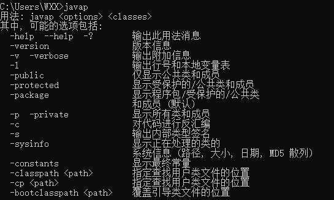

    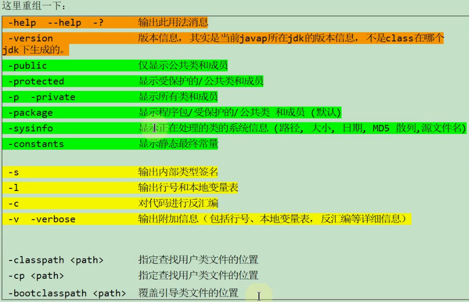
    
  * <font color=red>**一般常用的是 -v -l -c 三个选项**</font>。
  
    * java -l 会输出行号和本地变量表信息。
    * java -c 会对当前class字节码进行反编译生成汇编代码。
    * java -v classxx 除了包含 -c 内容外，还会输出行号、局部变量表信息、常量池等信息。

* 使用举例

  ```java
  package com.atguigu.java1;
  
  /**
   * @author shkstart
   * @create 2020-09-06 21:07
   */
  public class JavapTest {
      private int num;
      boolean flag;
      protected char gender;
      public String info;
  
      public static final int COUNTS = 1;
      static{
          String url = "www.atguigu.com";
      }
      {
          info = "java";
      }
      public JavapTest(){
  
      }
      private JavapTest(boolean flag){
          this.flag = flag;
      }
      private void methodPrivate(){
  
      }
      int getNum(int i){
          return num + i;
      }
      protected char showGender(){
          return gender;
      }
      public void showInfo(){
          int i = 10;
          System.out.println(info + i);
      }
  }
  
  ```

  使用javac -g JavapTest.java生成 JavapTest.class后，再使用javap -v -p JavapTest.class > Javaptest.txt，得到的文件内容如下：（其中汉语注释是人为添加的）

  ```
  Classfile /C:/Users/WXX/Desktop/1/JavapTest.class		// 字节码文件所属的路径
    Last modified 2020-9-21; size 1358 bytes				// 最后修改的时间
    MD5 checksum 526b4a845e4d98180438e4c5781b7e88			// MD5散列值
    Compiled from "JavapTest.java"						// 源文件名称
  public class com.atguigu.java1.JavapTest
    minor version: 0										// 副版本
    major version: 52										// 主版本
    flags: ACC_PUBLIC, ACC_SUPER							// 类的访问标识
  Constant pool:											// 常量池
     #1 = Methodref          #16.#46        // java/lang/Object."<init>":()V
     #2 = String             #47            // java
     #3 = Fieldref           #15.#48        // com/atguigu/java1/JavapTest.info:Ljava/lang/String;
     #4 = Fieldref           #15.#49        // com/atguigu/java1/JavapTest.flag:Z
     #5 = Fieldref           #15.#50        // com/atguigu/java1/JavapTest.num:I
     #6 = Fieldref           #15.#51        // com/atguigu/java1/JavapTest.gender:C
     #7 = Fieldref           #52.#53        // java/lang/System.out:Ljava/io/PrintStream;
     #8 = Class              #54            // java/lang/StringBuilder
     #9 = Methodref          #8.#46         // java/lang/StringBuilder."<init>":()V
    #10 = Methodref          #8.#55         // java/lang/StringBuilder.append:(Ljava/lang/String;)Ljava/lang/StringBuilder;
    #11 = Methodref          #8.#56         // java/lang/StringBuilder.append:(I)Ljava/lang/StringBuilder;
    #12 = Methodref          #8.#57         // java/lang/StringBuilder.toString:()Ljava/lang/String;
    #13 = Methodref          #58.#59        // java/io/PrintStream.println:(Ljava/lang/String;)V
    #14 = String             #60            // www.atguigu.com
    #15 = Class              #61            // com/atguigu/java1/JavapTest
    #16 = Class              #62            // java/lang/Object
    #17 = Utf8               num
    #18 = Utf8               I
    #19 = Utf8               flag
    #20 = Utf8               Z
    #21 = Utf8               gender
    #22 = Utf8               C
    #23 = Utf8               info
    #24 = Utf8               Ljava/lang/String;
    #25 = Utf8               COUNTS
    #26 = Utf8               ConstantValue
    #27 = Integer            1
    #28 = Utf8               <init>
    #29 = Utf8               ()V
    #30 = Utf8               Code
    #31 = Utf8               LineNumberTable
    #32 = Utf8               LocalVariableTable
    #33 = Utf8               this
    #34 = Utf8               Lcom/atguigu/java1/JavapTest;
    #35 = Utf8               (Z)V
    #36 = Utf8               methodPrivate
    #37 = Utf8               getNum
    #38 = Utf8               (I)I
    #39 = Utf8               i
    #40 = Utf8               showGender
    #41 = Utf8               ()C
    #42 = Utf8               showInfo
    #43 = Utf8               <clinit>
    #44 = Utf8               SourceFile
    #45 = Utf8               JavapTest.java
    #46 = NameAndType        #28:#29        // "<init>":()V
    #47 = Utf8               java
    #48 = NameAndType        #23:#24        // info:Ljava/lang/String;
    #49 = NameAndType        #19:#20        // flag:Z
    #50 = NameAndType        #17:#18        // num:I
    #51 = NameAndType        #21:#22        // gender:C
    #52 = Class              #63            // java/lang/System
    #53 = NameAndType        #64:#65        // out:Ljava/io/PrintStream;
    #54 = Utf8               java/lang/StringBuilder
    #55 = NameAndType        #66:#67        // append:(Ljava/lang/String;)Ljava/lang/StringBuilder;
    #56 = NameAndType        #66:#68        // append:(I)Ljava/lang/StringBuilder;
    #57 = NameAndType        #69:#70        // toString:()Ljava/lang/String;
    #58 = Class              #71            // java/io/PrintStream
    #59 = NameAndType        #72:#73        // println:(Ljava/lang/String;)V
    #60 = Utf8               www.atguigu.com
    #61 = Utf8               com/atguigu/java1/JavapTest
    #62 = Utf8               java/lang/Object
    #63 = Utf8               java/lang/System
    #64 = Utf8               out
    #65 = Utf8               Ljava/io/PrintStream;
    #66 = Utf8               append
    #67 = Utf8               (Ljava/lang/String;)Ljava/lang/StringBuilder;
    #68 = Utf8               (I)Ljava/lang/StringBuilder;
    #69 = Utf8               toString
    #70 = Utf8               ()Ljava/lang/String;
    #71 = Utf8               java/io/PrintStream
    #72 = Utf8               println
    #73 = Utf8               (Ljava/lang/String;)V
  {	
  #######################################字段表集合的信息#############################################
    private int num;									// 字段名
      descriptor: I									// 字段描述符
      flags: ACC_PRIVATE								// 字段的访问标识
  
    boolean flag;
      descriptor: Z
      flags:
  
    protected char gender;
      descriptor: C
      flags: ACC_PROTECTED
  
    public java.lang.String info;
      descriptor: Ljava/lang/String;
      flags: ACC_PUBLIC
  
    public static final int COUNTS;
      descriptor: I
      flags: ACC_PUBLIC, ACC_STATIC, ACC_FINAL
      ConstantValue: int 1							// 常量字段的属性：ConstantValue
  
  #######################################方法表集合的信息#############################################
    public com.atguigu.java1.JavapTest();							// 构造器1的信息
      descriptor: ()V
      flags: ACC_PUBLIC
      Code:
        stack=2, locals=1, args_size=1
           0: aload_0
           1: invokespecial #1                  // Method java/lang/Object."<init>":()V
           4: aload_0
           5: ldc           #2                  // String java
           7: putfield      #3                  // Field info:Ljava/lang/String;
          10: return
        LineNumberTable:
          line 20: 0
          line 18: 4
          line 22: 10
        LocalVariableTable:
          Start  Length  Slot  Name   Signature
              0      11     0  this   Lcom/atguigu/java1/JavapTest;
  
    private com.atguigu.java1.JavapTest(boolean);						// 构造器2的信息
      descriptor: (Z)V
      flags: ACC_PRIVATE
      Code:
        stack=2, locals=2, args_size=2
           0: aload_0
           1: invokespecial #1                  // Method java/lang/Object."<init>":()V
           4: aload_0
           5: ldc           #2                  // String java
           7: putfield      #3                  // Field info:Ljava/lang/String;
          10: aload_0
          11: iload_1
          12: putfield      #4                  // Field flag:Z
          15: return
        LineNumberTable:
          line 23: 0
          line 18: 4
          line 24: 10
          line 25: 15
        LocalVariableTable:
          Start  Length  Slot  Name   Signature
              0      16     0  this   Lcom/atguigu/java1/JavapTest;
              0      16     1  flag   Z
  
    private void methodPrivate();
      descriptor: ()V
      flags: ACC_PRIVATE
      Code:
        stack=0, locals=1, args_size=1
           0: return
        LineNumberTable:
          line 28: 0
        LocalVariableTable:
          Start  Length  Slot  Name   Signature
              0       1     0  this   Lcom/atguigu/java1/JavapTest;
  
    int getNum(int);
      descriptor: (I)I
      flags:
      Code:
        stack=2, locals=2, args_size=2
           0: aload_0
           1: getfield      #5                  // Field num:I
           4: iload_1
           5: iadd
           6: ireturn
        LineNumberTable:
          line 30: 0
        LocalVariableTable:
          Start  Length  Slot  Name   Signature
              0       7     0  this   Lcom/atguigu/java1/JavapTest;
              0       7     1     i   I
  
    protected char showGender();
      descriptor: ()C
      flags: ACC_PROTECTED
      Code:
        stack=1, locals=1, args_size=1
           0: aload_0
           1: getfield      #6                  // Field gender:C
           4: ireturn
        LineNumberTable:
          line 33: 0
        LocalVariableTable:
          Start  Length  Slot  Name   Signature
              0       5     0  this   Lcom/atguigu/java1/JavapTest;
  
    public void showInfo();
      descriptor: ()V								// 方法描述符：方法的形参列表、返回值类型
      flags: ACC_PUBLIC							// 方法的访问标识
      Code:										// 方法的Code属性
        stack=3, locals=2, args_size=1			// stack: 操作数栈的最大深度	locals: 局部变量表的长度	args_size: 方法接收参数的个数
   // 偏移量  操作码		 操作数  
  		 0: bipush        10
           2: istore_1
           3: getstatic     #7                  // Field java/lang/System.out:Ljava/io/PrintStream;
           6: new           #8                  // class java/lang/StringBuilder
           9: dup
          10: invokespecial #9                  // Method java/lang/StringBuilder."<init>":()V
          13: aload_0
          14: getfield      #3                  // Field info:Ljava/lang/String;
          17: invokevirtual #10                 // Method java/lang/StringBuilder.append:(Ljava/lang/String;)Ljava/lang/StringBuilder;
          20: iload_1
          21: invokevirtual #11                 // Method java/lang/StringBuilder.append:(I)Ljava/lang/StringBuilder;
          24: invokevirtual #12                 // Method java/lang/StringBuilder.toString:()Ljava/lang/String;
          27: invokevirtual #13                 // Method java/io/PrintStream.println:(Ljava/lang/String;)V
          30: return
  	  // 行号表: 指明Java源程序中代码的行号与字节码指令的偏移量的一一对应关系
        LineNumberTable:
          line 36: 0
          line 37: 3
          line 38: 30
  	  // 局部变量表: 描述内部局部变量的相关信息
        LocalVariableTable:
          Start  Length  Slot  Name   Signature
              0      31     0  this   Lcom/atguigu/java1/JavapTest;
              3      28     1     i   I
  
    static {};
      descriptor: ()V
      flags: ACC_STATIC
      Code:
        stack=1, locals=1, args_size=0
           0: ldc           #14                 // String www.atguigu.com
           2: astore_0
           3: return
        LineNumberTable:
          line 15: 0
          line 16: 3
        LocalVariableTable:
          Start  Length  Slot  Name   Signature
  }
  SourceFile: "JavapTest.java"					// 附加的属性: 指明当前字节码文件对应的源程序文件名
  ```

* 总结
  * 通过javap命令可以查看一个java类反汇编得到的Class文件版本号、常量池、访问标识、变量表、指令代码行号表等信息。不显示类索引、父类索引、接口索引集合、\<clinit>()、\<init>()等结构。
  * 通过对前面例子代码反汇编文件的简单分析，一个方法的执行通常会涉及一下几块内存的操作：
    * java栈中：局部变量表、操作数栈。
    * java堆。通过对象的地址引用去操作。
    * 常量池。
    * 其他如帧数据区、方法区的剩余部分情况，测试中没有显示出来，这里说明一下。
  * 平常，我们比较关注的是java类中每个方法的反汇编中的指令操作过程，这些指令都是顺序执行的，可以参考官方文档查看每个指令的含义，很简单：https://docs.oracle.com/javase/specs/jvms/se8/html/jvms-6.html


# 第19章 字节码指令集与解析举例

## 1 概述

* Java字节码对于虚拟机，就好像汇编语言对于计算机，属于基本执行指令。
* Java虚拟机的指令由<font color=red>**一个字节长度**</font>的、代表着某种特定操作含义的数字（称为操作码，Opcode）以及跟随其后的零至多个代表此操作所需参数（称为操作数，Operands）而构成。由于Java虚拟机采用面向操作数栈而不是寄存器结构，所以大多数指令都不包含操作数，只有一个操作码。
* 由于限制了Java虚拟机操作码的长度为一个字节（即0~255），这意味着指令集的操作码总数不会超过256条。
* 官方文档：https://docs.oracle.com/javase/specs/jvms/se8/html/jvms-6.html
* 熟悉虚拟机的指令对于动态字节码生成、反编译Class文件、Class文件修补都有着非常重要的价值。因此，阅读字节码作为了解Java虚拟机的基础操作，需要熟练掌握常见指令。

---

* 执行模型

  如果不考虑异常处理的话，那么Java虚拟机的解释器可以使用下面的伪代码当做最基本的执行模型来理解。

  ```
  do {
  	自动计算PC寄存器的值加1;
  	根据PC寄存器的指示位置，从字节码流中取出操作数;
  	if (字节码存在操作数)
  		从字节码流中取出操作数;
  	执行操作码所定义的操作;
  } while(字节码长度 > 0);
  ```

---

* 字节码与数据类型

  在Java虚拟机的指令集中，大多数的指令都包含了其操作所对应的数据类型信息。例如，iload指令用于从局部变量表中加载int类型的数据到操作数栈中，而fload指令加载的则是float类型数据。

  * 对于大部分与数据类型相关的字节码指令，<font color=red>**它们的操作码助记符中都有特殊的字符来表明专门为哪种数据类型服务**</font>：
    * i 代表对int类型数据操作
    * l 代表 long
    * s 代表 short
    * b 代表 byte
    * c 代表 char
    * f 代表 float
    * d 代表 double
  * 也有一些指令的助记符中<font color=red>**没有明确地指明操作类型的字母**</font>，例如arraylength指令，它没有代表数据类型的特殊字符，但是操作数永远只能是一个数组类型的对象。
  * 还有另外一些指令，如无条件跳转goto，则是与<font color=red>**数据类型无关的**</font>。
  * 大部分的指令都没有支持整数类型byte、char和short，甚至没有任何指令支持boolean类型。编译器会在编译期或运行期将byte和short类型的数据带符号扩展（Sign-Extend）为相应的int类型数据，将boolean和char类型数据零位扩展（Zero-Extend）为相应的int类型数据。与之类似，在处理boolean、byte、short和char类型的数组时，也会转换为使用对应的int类型的字节码指令来处理。因此，大多数对于boolean、byte、short和char类型数据的操作。

---

* 指令分类
  * 由于完全介绍和学习这些指令需要花费大量时间。为了让大家能够更快地熟悉和了解这些基本指令，这里将JVM中的字节码指令按照用途大致分为 9 类。
    * 加载与存储指令
    * 算数指令
    * 类型转换指令
    * 对象的创建与访问指令
    * 方法调用与返回指令
    * 操作数栈管理指令
    * 比较控制指令
    * 异常处理指令
    * 同步控制指令
  * （说在前面）在做值相关操作时：
    * 一个指令，可以从局部变量表、常量池、堆中对象、方法调用、系统调用中等获得数据，这些数据（可能是值，可能是对象的引用）被压入操作数栈。
    * 一个指令，也可以从操作数栈中取出一到多个值（pop多次），完成赋值、加减乘除、方法传参、系统调用等操作。

## 2 加载与存储指令

* 作用：加载和存储指令用于将数据从栈帧的局部变量表和操作数栈之间来回传递。
* 常用指令
  * 局部变量表压栈指令：将一个局部变量加载到操作数栈：xload、xload_\<n>（其中 x 为 i、l、f、d、a，n 为 0 到 3）
  * 常量入栈指令：将一个常量加载到操作数栈：bipush、sipush、ldc、ldc_w、ldc2_w、aconst_null、iconst_m1、iconst_\<i>、lconst\_\<l>、fconst\_\<f>、dconst\_\<d>
  * 出栈装入局部变量表指令：将一个数值从操作数栈存储到局部变量表：xstore、xstore_\<n>（其中 x 为 i、l、f、d、a，n 为 0 到 3）；xastore（其中 x 为 i、l、f、d、a、b、c、s）
  * 扩展局部变量表的访问索引的指令：wide
* 上面所列举的指令助记符中，有一部分是以尖括号结尾的（例如 iload_\<n>）。这些指令助记符实际上代表了一组指令（例如 iload\_\<n>代表了iload\_0、iload\_1、iload\_2和iload\_3这几个指令）。这几组指令都是墨盒带有一个操作数的通用指令（例如 iload）的特殊形式，<font color=red>**对于这若干组指令来说，他们表面上没有操作数，不需要进行取操作数的动作，但操作数都隐含在指令中**</font>。
* 除此之外，他们的语义与原生的通用指令完全一致（例如 iload_0的语义与操作数为 0 时的 iload 指令语义完全一致）。在尖括号之间的字母制定了指令隐含操作数的数据类型，\<n>代表非负的整数，\<i>代表是 int 类型的整数，\<l>代表long类型，\<f>代表float类型，\<d>代表double类型。
* 操作byte、char、short和boolean类型的数据时，经常用 int 类型的指令来表示。

---

* 再谈操作数栈和局部变量表

  

  * 操作数栈

    我们知道，Java字节码是Java虚拟机所使用的的指令集。因此，它与Java虚拟机基于栈的计算模型是密不可分的。

    在解释执行过程中，每当为Java方法分配栈帧时，Java虚拟机往往需要开辟一块额外的空间作为<font color=red>**操作数栈，来存放计算操作数以及返回结果**</font>。

    具体来说便是：执行每一条指令之前，Java虚拟机要求该指令的操作数已经被压入操作数栈中。在执行指令时，Java虚拟机会将该指令所需的操作数弹出，并且将指令的结果重新压入栈中。

    

    以加法指令 iadd 为例。假设在执行该指令前，栈顶的两个元素分别为 int 值 1 和 int 值 2，那么 iadd 指令将弹出两个 int，并将求得的和 int 值 3 压入栈中。

    

  * 局部变量表（Local Variables）

    Java 方法栈帧的另外一个重要组成部分则是局部变量区，<font color=red>**字节码程序可以将计算的结果缓存到局部变量区之中**</font>。

    实际上，Java 虚拟机将局部变量区<font color=red>**当成一个数组**</font>，依次存放 this 指针（非静态方法），所传入的参数，以及字节码中的局部变量。

    和操作数栈一样，long 类型以及 double 类型的值将占据两个单元，其余类型占据一个单元。

    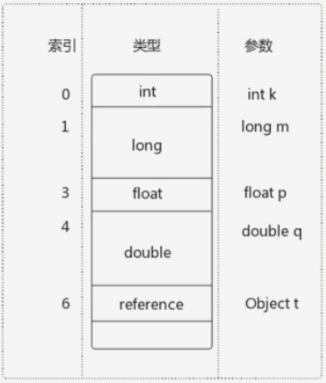

    举例：

    ```java
    public void foo(long l, float f) {
        {
            int i = 0;
        }
        {
            String s = "Hello, World!"
        }
    }
    ```

    对应的图示：

    

    在栈帧中，与性能调优最为密切的部分就是局部变量表。局部变量表中的变量也是很重要的垃圾回收根节点，只要被局部变量表中直接或者间接引用的对象都不会被回收。

    在方法执行时，虚拟机使用局部变量表完成方法的传递。

---

* 局部变量表压栈指令

  * <font color=red>**局部变量表压栈指令将给定的局部变量表中的数据压入操作数栈。**</font>

  * 这类指令大体可以分为：（这里，x 的取值表示数据类型）

    * xload_\<n>（x 为 i、l、f、d、a，n 为 0 到 3）
    * xload （x 为 i、l、f、d、a）

  * 指令 xload_n 表示将第 n 个局部变量压入操作数栈，比如iload_1、fload_0、aload_0等指令。其中aload_n 表示将一个对象引用压栈。

  * 指令xload 通过指定参数的形式，把局部变量压入操作栈，当使用这个命令时，表示局部变量可能超过了 4 个，比如指令 iload、fload等。

  * 例子：

    ```java
    //1.局部变量压栈指令
    public void load(int num, Object obj,long count,boolean flag,short[] arr) {
        System.out.println(num);
        System.out.println(obj);
        System.out.println(count);
        System.out.println(flag);
        System.out.println(arr);
    }
    ```

    对应的字节码指令如下：

    ```
     0 getstatic #2 <java/lang/System.out>
     3 iload_1
     4 invokevirtual #3 <java/io/PrintStream.println>
     7 getstatic #2 <java/lang/System.out>
    10 aload_2
    11 invokevirtual #4 <java/io/PrintStream.println>
    14 getstatic #2 <java/lang/System.out>
    17 lload_3
    18 invokevirtual #5 <java/io/PrintStream.println>
    21 getstatic #2 <java/lang/System.out>
    24 iload 5
    26 invokevirtual #6 <java/io/PrintStream.println>
    29 getstatic #2 <java/lang/System.out>
    32 aload 6
    34 invokevirtual #4 <java/io/PrintStream.println>
    37 return
    ```

---

* 常量入栈指令

  * 常量入栈指令的功能是将常数压入操作数栈，根据数据类型和入栈内容的不同，又可以分为const系列、push系列和ldc系列。

  * 指令 const 系列：

    对于特定的常量入栈，入栈的常量隐含在指令本身。指令有：iconst_\<i>（i 从-1到5）、lconst\_\<l>（l 从0到 1）、fconst\_\<f>（f 从0到2）、dconst\_\<d>（d 从0到 1）、aconst\_null。比如：

    * iconst\_m1     将-1压入操作数栈；
    * iconst_x（x 为0到5）     将 x 压入栈；
    * lconst_0、lconst_1     分别将长整数 0 和 1 压入栈；
    * fconst_0、fconst_1、fconst_2     分别将浮点数0、1、2压入栈；
    * dconst_0、dconst_1     分别将double型 0 和 1 压入栈；
    * aconst_null     将 null 压入操作数栈；

    从指令的命名上不难找出规律，指令助记符的第一个字符总是喜欢表示数据类型，i 代表整形，l 代表长整形，f 代表浮点数，d 代表双精度浮点，习惯上用 a 表示对象引用。如果指令隐含操作的参数，会以下划线形式给出。

  * 指令push系列：

    主要包括 bipush 和 sipush。他们的区别在于接收数据类型的不同，bipush 接收8位整数作为参数，sipush 接收16位整数，他们都将参数压入栈。

  * 指令ldc系列：

    如果以上指令都不能满足需求，那么可以使用万能的<font color=red>**ldc**</font>指令，它可以接收一个8位的参数，该参数指向常量池中的 int、float或者String的索引，将指定的内容压入堆栈。

    类似的还有<font color=red>**ldc_w**</font>，它接收两个8位参数，能支持的索引范围大于ldc。

    如果要压入的元素是long或者double类型的，则使用<font color=red>**ldc2_w**</font>指令，使用方式是类似的。

    |               类型                | 常数指令 |             范围              |
    | :-------------------------------: | :------: | :---------------------------: |
    | int（boolean, byte, char, short） |  iconst  |            [-1, 5]            |
    |                                   |  bipush  |          [-128, 127]          |
    |                                   |  sipush  |        [-32768, 32767]        |
    |                                   |   ldc    |         any int value         |
    |               long                |  lconst  |             0, 1              |
    |                                   |   ldc    |        any long value         |
    |               float               |  fconst  |            0, 1, 2            |
    |                                   |   ldc    |        any float value        |
    |              double               |  dconst  |             0, 1              |
    |                                   |   ldc    |       any double value        |
    |             reference             |  aconst  |             null              |
    |                                   |   ldc    | String literal, Class literal |

  * 例子：

    ```java
    //2.常量入栈指令
    public void pushConstLdc() {
        int i = -1;
        int a = 5;
        int b = 6;
        int c = 127;
        int d = 128;
        int e = 32767;
        int f = 32768;
    }
    ```

    对应的字节码指令：

    ```
     0 iconst_m1
     1 istore_1
     2 iconst_5
     3 istore_2
     4 bipush 6
     6 istore_3
     7 bipush 127
     9 istore 4
    11 sipush 128
    14 istore 5
    16 sipush 32767
    19 istore 6
    21 ldc #7 <32768>
    23 istore 7
    25 return
    ```

    ```java
    public void constLdc() {
        long a1 = 1;
        long a2 = 2;
        float b1 = 2;
        float b2 = 3;
        double c1 = 1;
        double c2 = 2;
        Date d = null;
    }
    ```

    对应的字节码指令：

    ```
     0 lconst_1
     1 lstore_1
     2 ldc2_w #8 <2>
     5 lstore_3
     6 fconst_2
     7 fstore 5
     9 ldc #10 <3.0>
    11 fstore 6
    13 dconst_1
    14 dstore 7
    16 ldc2_w #11 <2.0>
    19 dstore 9
    21 aconst_null
    22 astore 11
    24 return
    ```

---

* 出栈装入局部变量表指令

  * 出栈装入局部变量表指令用于将操作数栈中栈顶元素弹出后，装入局部变量表的指定位置，用于给局部变量表赋值。

  * 这类指令主要以 store 的形式存在，比如 xstore （x 为 i、f、l、d、a）、xstore_n（x 为 i、f、l、d、a，n 为 0到 3）

    * 其中，指令 istore_n 将从操作数栈中弹出一个整数，并把它赋值给局部变量表索引 n的位置。
    * 指令 xstore 由于没有隐含参数信息，故需要提供一个byte参数类型指令目标局部变量表的位置。

  * 说明：

    * <font color=red>**一般来说，类似像store这样的命令需要带一个参数，用来指明将弹出的元素放在局部变量表的第几个位置。**</font>但是，为了尽可能压缩指令大小，使用专门的 istore_1指令表示将弹出的元素放置在局部变量表的第一个位置。类似的还有 istore_0、istore_2、istore_3，它们分别表示从操作数栈弹出一个元素，存放在局部变量表的第0、2、3个位置。
    * 由于局部变量表的前几个位置总是非常常用，因此<font color=red>**这种做法虽然增加了指令数量，但是可以大大压缩生成的字节码的体积**</font>。如果局部变量表非常大，需要存储的槽位大于 3，那么可以使用istore指令，另外一个参数，用来表示需要存放的槽位位置。

  * 例子：

    ```java
    //3.出栈装入局部变量表指令
    public void store(int k, double d) {
        int m = k + 2;
        long l = 12;
        String str = "atguigu";
        float f = 10.0F;
        d = 10;
    }
    ```

    对应的字节码指令：

    ```
     0 iload_1
     1 iconst_2
     2 iadd
     3 istore 4
     5 ldc2_w #13 <12>
     8 lstore 5
    10 ldc #15 <atguigu>
    12 astore 7
    14 ldc #16 <10.0>
    16 fstore 8
    18 ldc2_w #17 <10.0>
    21 dstore_2
    22 return
    ```

    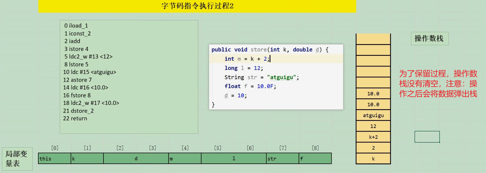

    ```java
    public void foo(long l, float f) {
        {
            int i = 0;
        }
        {
            String s = "Hello, World";
        }
    }
    ```

    对应的字节码指令：

    ```
    0 iconst_0
    1 istore 4
    3 ldc #19 <Hello, World>
    5 astore 4
    7 return
    ```

## 3 算数指令

* 作用：

  * 算数指令用于对两个操作数栈的数值进行某种特定的运算，并把结果重新压入操作数栈。

* 分类：

  * 大体上算数指令可以分为两种：对<font color=red>**整形数据**</font>进行运算的指令与对<font color=red>**浮点类型数据**</font>进行运算的指令。

* byte、short、char和boolean类型说明

  * 在每一大类中，都有针对Java虚拟机具体数据类型的专用算数指令。但是没有直接支持byte、short、char和boolean类型的算数指令，对于这些数据的运算，都是用 int 类型的指令来处理。此外，在处理byte、short、char和boolean类型的数组时，也会转换为使用对应的 int 类型的字节码指令来处理。

    

* 运算时的溢出

  * 数据运算可能会导致溢出，例如两个很大的正整数相加，结果可能是一个负数。其实Java虚拟机规范并无明确规定过整形数据溢出的具体结果，仅规定了在处理整形数据时，只有除法指令以及求余指令中当出现除数为 0 时导致虚拟机抛出异常 ArithmeticException。

* 运算模式

  * 向最近接数舍入模式：JVM要求在进行浮点数计算时，所有运算结果都必须舍入到适当的精度，非精确结果必须舍入为可被表示的最近接的精确值，如果有两种可表示的形式与该值一样接近，将优先选择最低有效位为零的；
  * 向零舍入模式：将浮点数转化为整数时，采用该模式，该模式将在目标数值类型中选择一个最接近但是不大于原值的数字作为最精确的舍入结果。

* NaN的使用

  * 当一个操作产生溢出时，将会使用有符号数的无穷大表示，如果某个操作结果没有明确的数学定义的话，将会使用 NaN值来表示。而且所有使用NaN值作为操作数的算数操作，结果都会返回 NaN。

  * 例子：

    ```java
    @Test
    public void method1(){
        int i = 10;
        double j = i / 0.0;
        System.out.println(j);  // 无穷大
    
    
        double d1 = 0.0;
        double d2 = d1 / 0.0;
        System.out.println(d2);  // NaN: not a number
        
        System.out.println(10 / 0);  // java.lang.ArithmeticException: / by zero
    }
    ```

    结果：		Infinity
    					NaN

---

* 所有的算数指令包括：

  * 加法指令：iadd、ladd、fadd、dadd
  * 减法指令：isub、lsub、fsub、dsub
  * 乘法指令：imul、lmul、fmul、dmul
  * 除法指令：idiv、ldiv、fdiv、ddiv
  * 求余指令：irem、lrem、frem、drem    // remainder：余数
  * 取反指令：ineg、lneg、fneg、dneg    // negation：取反
  * 自增指令：iinc（直接在局部变量表中自增）
  * 位运算指令，又可分为：
    * 位移指令：ishl、ishr、iushr、lshl、lshr、lushr
    * 按位或指令：ior、lor
    * 按位与指令：iand、land
    * 按位异或指令：ixor、lxor
  * 比较指令：dcmpg、dcmpl、fcmpg、fcmpl、lcmp

  例子：

  ```java
  public void method2(){
      float i = 10;
      float j = -i;
      i = -j;
  }
  ```

  ```
  0 ldc #5 <10.0>
  2 fstore_1
  3 fload_1
  4 fneg
  5 fstore_2
  6 fload_2
  7 fneg
  8 fstore_1
  9 return
  ```

  

  ```java
  public void method3(int j){
      int i = 100;
      // i = i + 10;
      i += 10;
  }
  ```

  ```
  0 bipush 100
  2 istore_2
  3 iinc 2 by 10
  6 return
  ```

  

  ```java
  public void method3(int j){
      int i = 100;
      i = i + 10;
      // i += 10;
  }
  ```

  ```
  0 bipush 100
  2 istore_2
  3 iload_2
  4 bipush 10
  6 iadd
  7 istore_2
  8 return
  ```

  ```java
  public int method4(){
          int a = 80;
          int b = 7;
          int c = 10;
          return (a + b) * c;
      }
  ```

  ```
   0 bipush 80
   2 istore_1
   3 bipush 7
   5 istore_2
   6 bipush 10
   8 istore_3
   9 iload_1
  10 iload_2
  11 iadd
  12 iload_3
  13 imul
  14 ireturn
  ```

  ```java
  public int method5(int i ,int j){
      return ((i + j - 1) & ~(j - 1));
  }
  ```

  ```
   0 iload_1
   1 iload_2
   2 iadd
   3 iconst_1
   4 isub
   5 iload_2
   6 iconst_1
   7 isub
   8 iconst_m1
   9 ixor
  10 iand
  11 ireturn
  ```

---

* 关于自增操作的说明：

  * 如果不涉及到赋值，只是单纯的 i++ 和 ++i ，从字节码的角度看，完全一样

    ```java
    //关于(前)++和(后)++
    public void method6(){
        int i = 10;
        i++;
        // ++i;
    }
    ```

    ```
    0 bipush 10
    2 istore_1
    3 iinc 1 by 1
    6 return
    ```

  * 如果涉及到赋值， i++ 和 ++i ，从字节码角度看不一样

    ```java
    public void method7(){
        int i = 10;
        int a = i++;
    
        int j = 20;
        int b = ++j;
    }
    ```

    ```
     0 bipush 10
     2 istore_1
     3 iload_1
     4 iinc 1 by 1
     7 istore_2
     8 bipush 20
    10 istore_3
    11 iinc 3 by 1
    14 iload_3
    15 istore 4
    17 return
    
    ```

  * 如下操作，结果？

    ```java
    //思考
    public void method8() {
        int i = 10;
        i = i++;
        System.out.println(i);  // 10
    }
    ```

    ```
     0 bipush 10
     2 istore_1
     3 iload_1
     4 iinc 1 by 1
     7 istore_1
     8 getstatic #2 <java/lang/System.out>
    11 iload_1
    12 invokevirtual #5 <java/io/PrintStream.println>
    15 return
    ```

---

* 比较指令的说明：

  * 比较指令的作用是比较栈顶两个元素的大小，并将比较结果入栈。
  * 比较指令有：dcmpg、dcmpl、fcmpg、fcmpl、lcmp
    * 与前面讲解的指令类似，首字符d表示double类型，f表示float，l表示long。
  * 对于double和float类型的数字，由于NaN的存在，各有两个版本的比较指令。以float为例，有fcmpg、fcmpl两个指令，他们的区别在于数字比较时，若遇到NaN值，处理结果不同。
  * 指令dcmpg、dcmpl也是类似的，根据其命名可以推断其含义，在此不再赘述。
  * 指令lcmp针对long型整数，由于long型整数没有NaN值，故无需准备两套指令。

  举例：

  * 指令fcmpg、fcmpl都从栈中弹出两个操作数，并将它们做比较，设栈顶的元素为 v2，栈顶顺位第2位元素为 v1，若 v1 == v2，则压入0；若v1 > v2，则压入1；若v1 < v2，则压入-1。
  * 两个指令的区别之处在于，当遇到NaN值，fcmpg会压入 1， 而fcmpl 会压入 -1。


## 4 类型转换指令

* 说明

  * 类型转化指令可以将两种不同的数值类型进行相互转换
  * 这些转换操作一般用于实现用户代码的<font color=red>**显式类型转换**</font>，或者用来处理**字节码指令集中数据类型相关指令**无法与**数据类型**一一对应的问题。

* 宽化类型转换（Widening Numeric Conversions）

  * 转换规则：

    Java虚拟机直接支持以下数值的宽化类型转化（Widening Numeric Conversions，小范围类型向大范围类型的安全转化）。也就是说，并不需要指令执行，包括：

    * 从 int 类型到 long、float或者 double类型。对应的指令为：i2l、i2f、i2d
    * 从 long 类型到 float、double类型。对应的指令为：l2f、l2d
    * 从float类型到 double 类型。对应指令为： f2d

    简化为：int ---> long --> float --> double

    ```java
    //针对于宽化类型转换的基本测试
    public void upCast1() {
        int i = 10;
        long l = i;  // i2l
        float f = i;  // i2f
        double d = i;  // i2d
    
        float f1 = l;  // l2f
        double d1 = l;  // l2d
    
        double d2 = f1;  // f2d
    }
    ```

  * 精度损失问题

    * 宽化类型转换是不会因为超过目标类型最大值而丢失信息的，例如，从 int 转换到 long，或者从 int 转换到 double，都不会丢失任何信息，转换前后的值是精确相等的。
    * 从 int、long 类型数值转换到 float，或者long类型数值转换到 double时，将可能发生精度丢失----可能丢失掉几个最低有效位上的值，转换后的浮点数是根据IEEE754最接近舍入模式所得到的的正确整数值。

    尽管宽化类型转换实际上可能发生精度丢失的，但是这种转换永远不会导致Java虚拟机抛出运行时异常。

    ```java
    //举例：精度损失的问题
    @Test
    public void upCast2() {
        int i = 123123123;
        float f = i;
        System.out.println(f);  // 123123120
    
        long l = 123123123123L;
        l = 123123123123123123L;
        double d = l;
        System.out.println(d);  // 123123123123123120
    }
    ```

  * 补充说明

    <font color=red>**从 byte、char和short类型到int类型的宽化类型转换实际上是不存在的。**</font>对于byte类型转为int，虚拟机并没有做实质性的转化处理，只是简单地通过操作数栈交换了两个数据。而将byte转为long时，使用的是i2l，可以看到在内部byte在这里已经等同于int类型处理，类似的还有short类型，这种处理方式有两个特点：

    * 一方面可以减少实际的数据类型，如果为short和byte都准备一套指令，那么指令的数量就会大增，而<font color=red>**虚拟机目前的设计上，只愿意使用一个字节表示指令，因此指令总数不能超过256个，为了节省指令资源，将short和byte当做int处理也在情理之中。**</font>
    * 另一方面，由于局部变量表中的槽位固定为32位，无论是byte或者short存入局部变量表，都会占用32位空间。从这个角度说，也没有必要特意区分这几种数据类型。

    ```java
    //针对于byte、short等转换为容量大的类型时，将此类型看做int类型处理。
    public void upCast3(byte b) {
        int i = b;
        long l = b;  // i2l
        double d = b;  // i2d
    }
    
    public void upCast4(short s) {
        int i = s;
        long l = s;  // i2l
        float f = s;  // i2f
    }
    ```

---

* 窄化类型转换（Narrowing Numeric Conversion）

  * 转换规则

    Java虚拟机也直接支持以下**窄化类型转换**：

    * 从 int 类型至byte、short或者char类型。对应的指令有：i2b、i2s、i2c
    * 从long类型到 int类型。对应的指令有：l2i
    * 从 float类型到 int或者long 类型。对应的指令有：f2i、f2l
    * 从 double类型到 int、long或者float类型。对应的指令有：d2i、d2l、d2f

    ```java
    // 窄化类型转换
    // 基本的使用
    public void downCast1() {
        int i = 10;
        byte b = (byte) i;  // i2b
        short s = (short) i;  // i2s
        char c = (char) i;  // i2c
    
        long l = 10L;
        int i1 = (int) l;  // l2i
        byte b1 = (byte) l;  // l2i --> i2b
    }
    
    public void downCast2() {
        float f = 10;
        long l = (long) f;  // f2l
        int i = (int) f;  // f2i
        byte b = (byte) f;  // f2i --> i2b
    
        double d = 10;
        byte b1 = (byte) d;  // d2i --> i2b
    
    }
    
    public void downCast3() {
        short s = 10;
        byte b = (byte) s;  // i2b
    }
    ```

  * 精度损失问题

    窄化类型转换可能会导致转换结果具有不同的正负号、不同的数量级，因此，转换过程很可能会导致数值丢失精度。

    尽管数据类型窄化转换可能会发生上限溢出、下限溢出和精度丢失等情况，但是Java虚拟机规范中明确规定数值类型的窄化转换指令永远不可能导致虚拟机抛出运行时异常。

  * 补充说明

    当将一个浮点数值窄化为整数类型T（T限于 int 或 long 类型之一）的时候，将遵循以下转换规则：

    * 如果浮点值是NaN，那么转换结果就是int或long类型的0.
    * 如果浮点值不是无穷大的话，浮点值使用IEEE 754的向零舍入模式取整，获得整数值v，如果v在目标类型T（int或long）的表示范围之内，那转换结果就是v。否则，将根据v的符号，转换为T所能表示的最大或者最小正数

    当将一个 double 类型转换为 float 类型时，将遵循以下转换规则：

    通过向最接近数舍入模式舍入一个可以使用float类型表示的数字。最后结果根据下面3条规则判断：

    * 如果转换结果的绝对值太小而无法使用 float来表示，将返回 float类型的正负零。
    * 如果转换结果的绝对值太大而无法使用 float来表示，将返回 float类型的正负无穷大。
    * 对于 double 类型的 NaN 值将按规定转换为 float 类型的NaN值。

    ```java
    // 测试NaN,无穷大的情况
    @Test
    public void downCast5() {
        double d1 = Double.NaN;  // 0.0 / 0.0
        int i = (int) d1;
        System.out.println(d1);  // NaN
        System.out.println(i);  // 0
    
        double d2 = Double.POSITIVE_INFINITY;
        long l = (long) d2;
        int j = (int) d2;
        System.out.println(l);  // Long.MAX_VALUE
        System.out.println(j);  // Integer.MAX_VALUE
    
        float f = (float) d2;
        System.out.println(f);  // Infinity
    
        float f1 = (float) d1;
        System.out.println(f1);  // NaN
    }
    ```

## 5 对象的创建与访问指令

* Java是面向对象的程序设计语言，虚拟机平台从字节码层面就对面向对象做了深层次的支持。有一系列指令专门用于对象操作，可进一步细分为创建指令、字段访问指令、数组操作指令、类型检查指令。

---

* 一、创建指令

  虽然类实例和数组都是对象，但Java虚拟机对类实例和数组的创建与操作使用了不同的字节码指令。

  * 创建类实例的指令：new

    它接收一个操作数，为指向常量池的索引，表示要创建的类型、执行完成后，将对象的引用压入栈。

    ```java
    public void newInstance() {
        Object obj = new Object();
    
        File file = new File("atguigu.avi");
    }
    ```

    

  * 创建数组指令：newarray、anewarray、multianewarray

    * newarray：创建基本类型数组
    * anewarray：创建引用类型数组
    * multianewarray：创建多维数组

  上述创建指令可以用于创建对象或者数组，由于对象和数组在Java中的广泛使用，这些指令的使用频率也非常高。

  ```java
  public void newArray() {
      int[] intArray = new int[10];  // newarray 10 (int)
      Object[] objArray = new Object[10];  // anewarray #2 <java/lang/Object>
      int[][] mintArray = new int[10][10];  // multianewarray #6 <[[I> dim 2
  
      String[][] strArray = new String[10][];  // anewarray #7 <[Ljava/lang/String;>
  }
  ```

  对应的字节码指令如下：

  ```
   0 bipush 10
   2 newarray 10 (int)
   4 astore_1
   5 bipush 10
   7 anewarray #2 <java/lang/Object>
  10 astore_2
  11 bipush 10
  13 bipush 10
  15 multianewarray #6 <[[I> dim 2
  19 astore_3
  20 bipush 10
  22 anewarray #7 <[Ljava/lang/String;>
  25 astore 4
  27 return
  ```

---

* 二、字段访问指令

  对象创建后，就可以通过对象访问指令获取对象实例或者数组实例中的字段或者数组元素。

  * 访问类字段（static字段，或者称为类变量）的指令：getstatic（入栈）、putstatic（出栈）
  * 访问类实例字段（非static字段，或者称为实例变量）的指令：getfield、putfield

  举例：

  以getstatic指令为例，它包含一个操作数，为指向常量池的Fieldref索引，它的作用就是获取Fieldref指定的对象或者值，并将其压入操作数栈。

  ```java
  // 2.字段访问指令
  public void sayHello() {
      System.out.println("hello");
  }
  ```

  对应的字节码指令如下：

  ```
  0 getstatic #8 <java/lang/System.out>
  3 ldc #9 <hello>
  5 invokevirtual #10 <java/io/PrintStream.println>
  8 return
  ```

  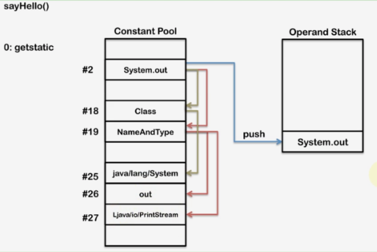

  

  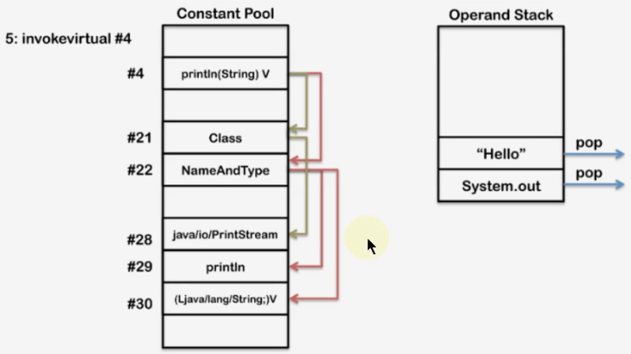

  另一个例子：

  ```java
  class Order {
      int id;
      static String name;
  }
  
  public class NewTest {
      public void setOrderId() {
          Order order = new Order();
          order.id = 1001;
          System.out.println(order.id);
  
          Order.name = "ORDER";
          System.out.println(Order.name);
      }
  }
  ```

  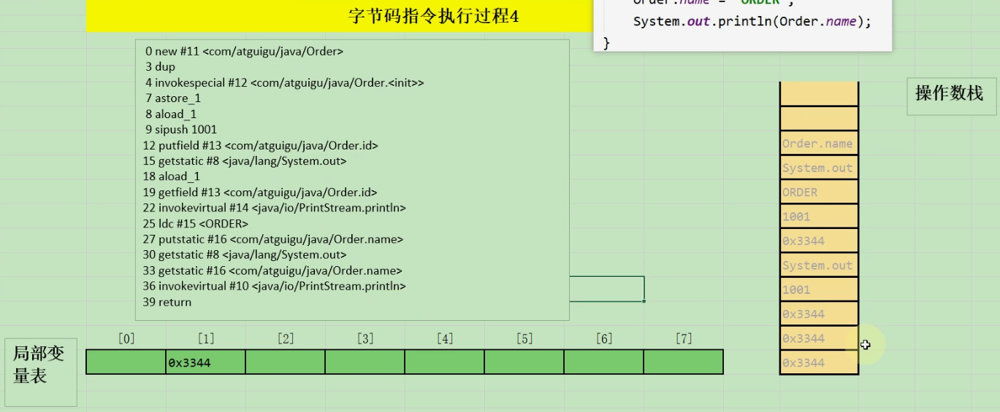

---

* 三、数组操作指令

  数组操作指令主要有：xastore和xaload。具体为

  * 把一个数组元素加载到操作数栈的指令：baload、caload、saload、iaload、laload、faload、daload、aaload
  * 将一个操作数栈的值存储到数组元素中的指令：bastore、castore、sastore、iastore、lastore、fastore、dastore、aastore（这里的store修改的是堆中数组中的某个值，之前讲到的store修改的都是局部变量表中的内容）

  即：

  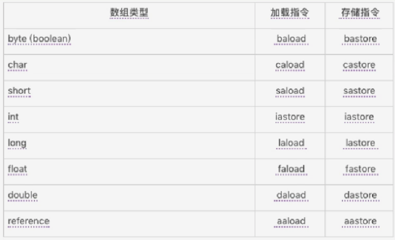

  * 数组长度的指令：arraylength

    * 该指令弹出栈顶的数组元素，获取数组的长度，将长度压入栈

    ```java
    public void arrLength() {
    
        double[] arr = new double[10];
        System.out.println(arr.length);
    }
    ```

    对应的字节码指令如下：

    ```
     0 bipush 10
     2 newarray 7 (double)
     4 astore_1
     5 getstatic #8 <java/lang/System.out>
     8 aload_1
     9 arraylength
    10 invokevirtual #14 <java/io/PrintStream.println>
    13 return
    ```

  **说明：**

  * 指令xaload表示将数组元素压栈，比如saload、caload分别表示压入short数组和char数组。指令xaload在执行时，要求操作数中栈顶元素为数组索引i，栈顶顺位第二个元素为数组引用a，该指令会弹出栈顶这两个元素，并将a[i] 重新压入栈。

  * xastore则专门针对数组操作，以iastore为例，它用于给一个 int 数组的给定索引赋值。在iastore执行前，操作数栈顶需要以此准备 3 个元素：值、索引、数组索引，iastore会弹出这 3 个值，并将值赋给数组中指定索引的位置。

    ```java
    // 3.数组操作指令
    public void setArray() {
        int[] intArray = new int[10];
        intArray[3] = 20;
        System.out.println(intArray[1]);
    }
    ```

    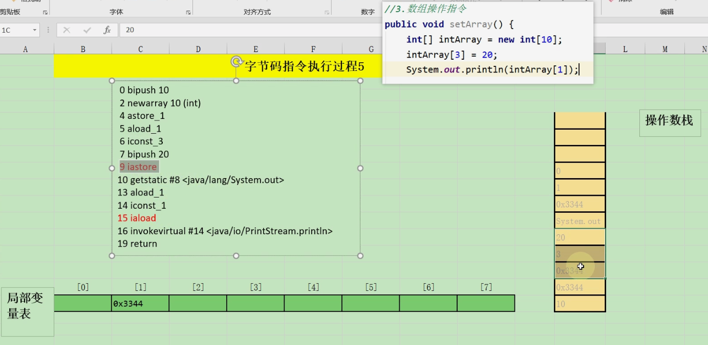

---

* 四、类型检查指令

  检查类实例或数组或数组类型的指令：instanceof、checkcast。

  * 指令checkcast用于检查类型强制转换是否可以进行。如果可以进行，那么checkcast指令不会改变操作数栈，否则它会抛出ClassCastException异常。
  * 指令instancdof用来判断给定对象是否是某一个类的实例，它会将判断结果压入操作数栈。

  ```java
  // 4.类型检查指令
  public String checkCast(Object obj) {
      if (obj instanceof String) {
          return (String) obj;
      } else {
          return null;
      }
  }
  ```

  对应的字节码指令如下：

  ```
   0 aload_1
   1 instanceof #17 <java/lang/String>
   4 ifeq 12 (+8)
   7 aload_1
   8 checkcast #17 <java/lang/String>
  11 areturn
  12 aconst_null
  13 areturn
  ```


## 6 方法调用与返回指令

* 方法调用指令：invokevirtual、invokeinterface、invokespecial、invokestatic、invokedynamic

  以下5条指令用于方法调用：

  * invokevirtual 指令用于调用对象的实例方法，根据对象的实际类型进行分派（虚方法分派），支持多态。这也是Java语言<font color=red>**最常见的方法分派方式**</font>。

    ```java
    // 方法调用指令:invokevirtual:动态分派
    public void invoke4() {
        System.out.println("hello");
    
        Thread t1 = null;
        t1.run();
    }
    ```

    ```
     0 getstatic #12 <java/lang/System.out>
     3 ldc #13 <hello>
     5 invokevirtual #14 <java/io/PrintStream.println>
     8 aconst_null
     9 astore_1
    10 aload_1
    11 invokevirtual #15 <java/lang/Thread.run>
    14 return
    ```

  * invokeinterface 指令用于<font color=red>**调用接口方法**</font>，它会在运行时搜索由特定对象所实现的这个接口方法，并找出适合的方法进行调用。

    ```java
    // 方法调用指令: invokeinterface
    public void invoke3() {
        Thread t1 = new Thread();
        ((Runnable) t1).run();
    
        Comparable<Integer> com = null;
        com.compareTo(123);
    }
    ```

    ```
     0 new #4 <java/lang/Thread>
     3 dup
     4 invokespecial #5 <java/lang/Thread.<init>>
     7 astore_1
     8 aload_1
     9 invokeinterface #9 <java/lang/Runnable.run> count 1
    14 aconst_null
    15 astore_2
    16 aload_2
    17 bipush 123
    19 invokestatic #10 <java/lang/Integer.valueOf>
    22 invokeinterface #11 <java/lang/Comparable.compareTo> count 2
    27 pop
    28 return
    ```

  * invokespecial 指令用于调用一些小特殊处理的实例方法，包括<font color=red>**实例初始化方法（构造器）、私有方法和父类方法**</font>（不能够重写）。这些方法都是静态类型绑定的，不会再调用时进行动态派发。

    ```java
    // 方法调用指令: invokespecial:静态分派
    public void invoke1() {
        // 情况1：类实例构造器方法：<init>()
        Date date = new Date();
        Thread t1 = new Thread();
        // 情况2：父类的方法
        super.toString();
        // 情况3：私有方法
        methodPrivate();
    }
    
    private void methodPrivate() {
    
    }
    ```

    ```
     0 new #2 <java/util/Date>
     3 dup
     4 invokespecial #3 <java/util/Date.<init>>
     7 astore_1
     8 new #4 <java/lang/Thread>
    11 dup
    12 invokespecial #5 <java/lang/Thread.<init>>
    15 astore_2
    16 aload_0
    17 invokespecial #6 <java/lang/Object.toString>
    20 pop
    21 aload_0
    22 invokespecial #7 <com/atguigu/java/MethodInvokeReturnTest.methodPrivate>
    25 return
    ```

  * invokestatic 指令用于调用<font color=red>**类中的类方法（static方法）**</font>。这是静态绑定的。

    ```java
    // 方法调用指令: invokestatic:静态分派
    public void invoke2() {
        methodStatic();
    }
    
    public static void methodStatic() {
    
    }
    ```

    ```
    0 invokestatic #8 <com/atguigu/java/MethodInvokeReturnTest.methodStatic>
    3 return
    ```

  * invokedynamic：调用动态绑定方法，这个是JDK 1.7后新加入的指令。用于在运行时动态解析出调用点限定符所引用的方法，并执行该方法。前面4条调用指令的分配逻辑都固话在java虚拟机内部，而invokedynamic 指令的分派逻辑是由用户所设定的引导方法决定的。

  一个注意点：

  ```java
  public class InterfaceMethodTest {
      public static void main(String[] args) {
          AA aa = new BB();
  
          aa.method2();
  
          AA.method1();
      }
  }
  
  
  interface AA {
      public static void method1() {
  
      }
  
      public default void method2() {
  
      }
  }
  
  class BB implements AA {
  
  }
  ```

  ```
   0 new #2 <com/atguigu/java/BB>
   3 dup
   4 invokespecial #3 <com/atguigu/java/BB.<init>>
   7 astore_1
   8 aload_1
   9 invokeinterface #4 <com/atguigu/java/AA.method2> count 1
  14 invokestatic #5 <com/atguigu/java/AA.method1>
  17 return
  ```

---

* 方法返回指令

  在方法调用结束之前，需要进行返回。方法返回指令是<font color=red>**根据返回值类型区分**</font>的。

  * 包括ireturn（当返回值是boolean、byte、char、short 和 int 类型时使用）、lreturn、dreturn和 areturn
  * 另外还有一条return指令供声明为 void的方法，实例初始化方法以及类和接口的初始化方法使用。

  | 返回类型                          | 返回指令 |
  | --------------------------------- | -------- |
  | void                              | return   |
  | int（boolean、byte、char、short） | ireturn  |
  | long                              | lreturn  |
  | float                             | freturn  |
  | double                            | dreturn  |
  | reference                         | areturn  |

  举例：

  通过ireturn指令，将当前函数操作数栈的栈顶元素弹出，并将这个元素压入调用者函数的操作栈中（因为调用者非常关心函数的返回值），所有在当前函数操作栈中的其他元素都会被丢弃。

  如果当前返回的是synchronized方法，那么还会执行一个隐含的monitorexit指令，退出临界区。

  最后，会丢弃当前方法的整个帧，恢复调用者的帧，并将控制权转交给调用者。

  ```java
  // 方法的返回指令
  public int returnInt() {
      int i = 500;
      return i;  // ireturn
  }
  
  public double returnDouble() {
      return 0.0;  // dreturn
  }
  
  public String returnString() {
      return "hello,world";  // areturn
  }
  
  public int[] returnArr() {
      return null;  // areturn
  }
  
  public float returnFloat() {
      int i = 10;
      return i;  // freturn
  }
  
  public byte returnByte() {
      return 0;  // ireturn
  }
  
  public void methodReturn() {
      int i = returnByte();
  }
  ```

  

## 7 操作数栈管理指令

* 如同操作一个普通数据结构中的堆栈那样，JVM提供的操作数栈管理指令，可以用于直接操作操作数栈的指令。

* 这类指令包括如下内容：

  * 将一个或两个元素从栈顶弹出，并且直接废弃：pop，pop2；
  * 赋值栈顶的一个或者两个数值并将复制值或双份的复制值重新压入栈顶：dup，dup2，dup_x1，dup2_x1，dup_x2，dup2_x2；
  * 将栈最顶端的两个slot数值位置交换：swap。Java虚拟机没有提供交换两个64位数据类型（long、double）数值的指令。
  * 指令nop，是一个非常特殊的指令，它的字节码为0x00。和汇编语言中的nop一样，它表示什么都不做，这条指令一般用于调试、占位等。

  这些指令属于通用型，对栈的压入或者弹出无需指明数据类型。

  **说明：**

  * 不带_x的指令是复制栈顶数据并压入栈顶。包括两个指令，dup和dup2。dup的系数代表要复制的slot个数。
    * dup开头的指令用于复制1个slot的数据。例如 1 个int或 1 个reference类型数据
    * dup2开头的指令用于复制 2 个slot的数据。例如一个long，或者 2 个int，或 1个int + 1个float类型的数据
  * 带\_x的指令是复制栈顶数据并插入栈顶以下的某个位置。供有 4 个指令，dup_x1，dup2_x1，dup_x2，dup2_x2。对于带\_x的复制插入指令，只要将指令的dup和x的系数相加，结果即为需要插入的位置。因此：
    * dup_x1插入位置：1+1=2，即栈顶 2 个slot下面
    * dup_x2插入位置：1+2=3，即栈顶 3 个slot下面
    * dup2_x1插入位置：2+1=3，即栈顶 3 个slot下面
    * dup2_x2插入位置：2+2=4，即栈顶 4 个slot下面
  * pop：将栈顶的 1 个slot数值出栈。例如 1 个short类型数值
  * pop2：将栈顶的 2 个slot数值出栈。例如 1 个double类型，或者 2 个int类型数据。

  ```java
  public void print() {
      Object obj = new Object();
      // String info = obj.toString();
      obj.toString();
  }
  ```

  ```
   0 new #3 <java/lang/Object>
   3 dup
   4 invokespecial #1 <java/lang/Object.<init>>
   7 astore_1
   8 aload_1
   9 invokevirtual #4 <java/lang/Object.toString>
  12 pop
  13 return
  ```

  ```java
  // 类似的
  public void foo() {
      bar();
  }
  
  public long bar() {
      return 0;
  }
  ```

  ```
  0 aload_0
  1 invokevirtual #5 <com/atguigu/java/StackOperateTest.bar>
  4 pop2
  5 return
  ```

  ```java
  public class StackOperateTest {
  
      public long nextIndex() {
          return index++;
      }
  
      private long index = 0;
  }
  ```

  ```
   0 aload_0
   1 dup
   2 getfield #2 <com/atguigu/java/StackOperateTest.index>
   5 dup2_x1
   6 lconst_1
   7 ladd
   8 putfield #2 <com/atguigu/java/StackOperateTest.index>
  11 lreturn
  ```

  

## 8 控制转移指令

* 条件跳转指令

  程序流程控制离不开条件控制，为了支持条件跳转，虚拟机提供了大量字节码指令，大体可以分为：

  （1）比较指令、（2）条件跳转指令、（3）比较条件跳转指令、（4）多条件分支跳转指令、（5）无条件跳转指令等。

---

* **比较指令的说明：**

  * 比较指令的作用是比较栈顶两个元素的大小，并将比较结果入栈。
  * 比较指令有：dcmpg、dcmpl、fcmpg、fcmpl、lcmp
    * 与前面讲解的指令类似，首字符d表示double类型，f表示float，l表示long。
  * 对于double和float类型的数字，由于NaN的存在，各有两个版本的比较指令。以float为例，有fcmpg、fcmpl两个指令，他们的区别在于数字比较时，若遇到NaN值，处理结果不同。
  * 指令dcmpg、dcmpl也是类似的，根据其命名可以推断其含义，在此不再赘述。
  * 指令lcmp针对long型整数，由于long型整数没有NaN值，故无需准备两套指令。

  举例：

  * 指令fcmpg、fcmpl都从栈中弹出两个操作数，并将它们做比较，设栈顶的元素为 v2，栈顶顺位第2位元素为 v1，若 v1 == v2，则压入0；若v1 > v2，则压入1；若v1 < v2，则压入-1。
  * 两个指令的区别之处在于，当遇到NaN值，fcmpg会压入 1， 而fcmpl 会压入 -1。

  数值类型的数据，才可以比较大小！（byte\short\char\int；long\float\double）

  boolean、引用数据类型不能比较大小。

---

* **条件跳转指令**

  条件跳转指令通常和比较指令结合使用。在条件跳转指令执行前，一般可以先用比较指令进行栈顶元素的准备，然后进行条件跳转。

  条件跳转指令有：ifeq，iflt，ifle，ifne，ifgt，ifge，ifnull，ifnonnull。这些指令都接受两个字节的操作数，用于计算跳转的位置（16位有符号整数作为当前位置的offset）。

  它们的统一含义为：<font color=red>**弹出栈顶元素，测试它是否满足某一条件，如果满足条件，则跳到给定位置。**</font>

  **具体说明：**

  |   指令    |               含义               |
  | :-------: | :------------------------------: |
  |   ifeq    |   当栈顶int类型数值等于0时跳转   |
  |   ifne    |  当栈顶int类型数值不等于0时跳转  |
  |   iflt    |   当栈顶int类型数值小于0时跳转   |
  |   ifle    | 当栈顶int类型数值小于等于0时跳转 |
  |   ifgt    |   当栈顶int类型数值大于0时跳转   |
  |   ifge    | 当栈顶int类型数值大于等于0时跳转 |
  |  ifnull   |           为null时跳转           |
  | ifnonnull |          不为null时跳转          |

  **注意：**

  1. 与前面运算规则一致：
     * 对于boolean、byte、char、short类型的条件分支比较指令，都是使用int类型的比较指令完成的
     * 对于long、float、double类型的条件分支指令比较操作，则会先执行相应类型的比较运算指令，运算指令会返回一个整数型值到操作数栈中，随后再执行int类型的条件分支比较操作来完成整个分支跳转。
  2. 由于各类型的比较操作最终都会转为 int 类型的比较操作，所以Java虚拟机提供的 int 类型的条件分支指令是最为丰富和强大的。

  ```java
  // 1.条件跳转指令
  public void compare1() {
      int a = 0;
      if (a != 0) {
          a = 10;
      } else {
          a = 20;
      }
  }
  ```

  ```
   0 iconst_0
   1 istore_1
   2 iload_1
   3 ifeq 12 (+9)
   6 bipush 10
   8 istore_1
   9 goto 15 (+6)
  12 bipush 20
  14 istore_1
  15 return
  ```

  

  ```java
  public boolean compareNull(String str) {
      if (str == null) {
          return true;
      } else {
          return false;
      }
  }
  ```

  ```
  0 aload_1
  1 ifnonnull 6 (+5)
  4 iconst_1
  5 ireturn
  6 iconst_0
  7 ireturn
  ```

  ```java
  // 结合比较指令
  public void compare2() {
      float f1 = 9;
      float f2 = 10;
      System.out.println(f1 < f2);//true
  }
  ```

  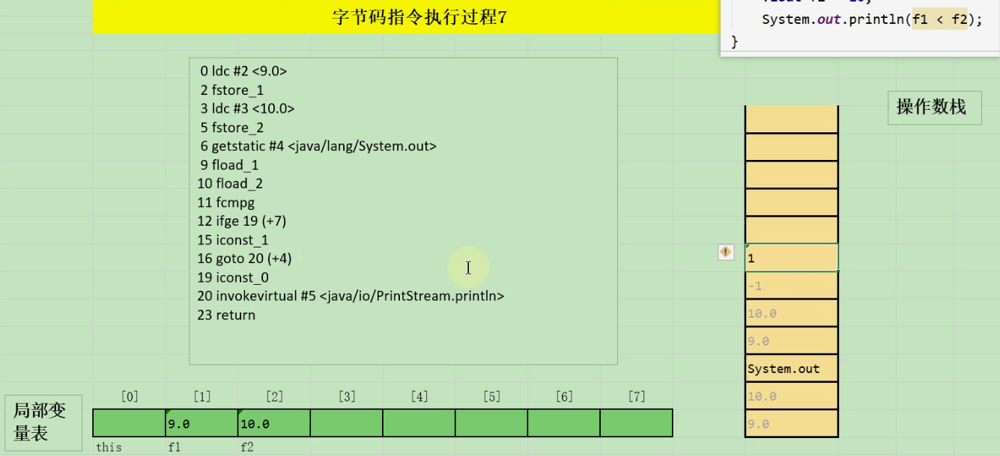

  

  ```java
  public void compare3() {
      int i1 = 10;
      long l1 = 20;
      System.out.println(i1 > l1);
  }
  ```

  ```
   0 bipush 10
   2 istore_1
   3 ldc2_w #6 <20>
   6 lstore_2
   7 getstatic #4 <java/lang/System.out>
  10 iload_1
  11 i2l
  12 lload_2
  13 lcmp
  14 ifle 21 (+7)
  17 iconst_1
  18 goto 22 (+4)
  21 iconst_0
  22 invokevirtual #5 <java/io/PrintStream.println>
  25 return
  ```

  ```java
  public int compare4(double d) {
      if (d > 50.0) {
          return 1;
      } else {
          return -1;
      }
  }
  ```

  ```
   0 dload_1
   1 ldc2_w #8 <50.0>
   4 dcmpl
   5 ifle 10 (+5)
   8 iconst_1
   9 ireturn
  10 iconst_m1
  11 ireturn
  ```

---

* **比较条件跳转指令**

  比较条件跳转指令类似于比较指令和条件指令的的结合体，它将比较和跳转两个步骤合二为一。

  这类指令有：if_icmpeq、if_icmpne、if_icmplt、if_icmpgt、if_icmple、if_icmpge、if_acmpeq 和 if_acmpne。其中指令助记符加上"if_"后，以字符"i"开头的指令针对 int 型整数操作（也包括short和byte类型），以字符"a"开头的指令表示对象引用的比较。

  **具体说明：**

  |   指令    |                             含义                             |
  | :-------: | :----------------------------------------------------------: |
  | if_icmpeq | 比较栈顶两 int 类型数值大小，当前者等于后者(栈顶对应元素)时跳转 |
  | if_icmpne |     比较栈顶两 int 类型数值大小，当前者不等于后者时跳转      |
  | if_icmplt |      比较栈顶两 int 类型数值大小，当前者小于后者时跳转       |
  | if_icmple |    比较栈顶两 int 类型数值大小，当前者小于等于后者时跳转     |
  | if_icmpgt |      比较栈顶两 int 类型数值大小，当前者大于后者时跳转       |
  | if_icmpge |    比较栈顶两 int 类型数值大小，当前者大于等于后者时跳转     |
  | if_acmpeq |           比较栈顶两引用类型数值，当结果相等时跳转           |
  | if_acmpne |          比较栈顶两引用类型数值，当结果不相等时跳转          |

  这些指令都接收两个字节的操作数作为参数，用于计算跳转的位置：同时在执行指令时，栈顶需要准备两个元素进行比较。指令执行完成后，栈顶的两个元素被清空，且没有任何数据入栈。<font color=red>**如果预设条件成立，则执行跳转，否则，继续执行下一条语句。**</font>

  ```java
  // 2.比较条件跳转指令
  public void ifCompare1() {
      int i = 10;
      int j = 20;
      System.out.println(i > j);
  }
  
  ```

  ```
   0 bipush 10
   2 istore_1
   3 bipush 20
   5 istore_2
   6 getstatic #4 <java/lang/System.out>
   9 iload_1
  10 iload_2
  11 if_icmple 18 (+7)
  14 iconst_1
  15 goto 19 (+4)
  18 iconst_0
  19 invokevirtual #5 <java/io/PrintStream.println>
  22 return
  ```

  ```java
  public void ifCompare2() {
      short s1 = 9;
      byte b1 = 10;
      System.out.println(s1 > b1);
  }
  ```

  ```
   0 bipush 9
   2 istore_1
   3 bipush 10
   5 istore_2
   6 getstatic #4 <java/lang/System.out>
   9 iload_1
  10 iload_2
  11 if_icmple 18 (+7)
  14 iconst_1
  15 goto 19 (+4)
  18 iconst_0
  19 invokevirtual #5 <java/io/PrintStream.println>
  22 return
  ```

  ```java
  public void ifCompare3() {
      Object obj1 = new Object();
      Object obj2 = new Object();
      System.out.println(obj1 == obj2);  // false
      System.out.println(obj1 != obj2);  // true
  }
  ```

  ```
   0 new #10 <java/lang/Object>
   3 dup
   4 invokespecial #1 <java/lang/Object.<init>>
   7 astore_1
   8 new #10 <java/lang/Object>
  11 dup
  12 invokespecial #1 <java/lang/Object.<init>>
  15 astore_2
  16 getstatic #4 <java/lang/System.out>
  19 aload_1
  20 aload_2
  21 if_acmpne 28 (+7)
  24 iconst_1
  25 goto 29 (+4)
  28 iconst_0
  29 invokevirtual #5 <java/io/PrintStream.println>
  32 getstatic #4 <java/lang/System.out>
  35 aload_1
  36 aload_2
  37 if_acmpeq 44 (+7)
  40 iconst_1
  41 goto 45 (+4)
  44 iconst_0
  45 invokevirtual #5 <java/io/PrintStream.println>
  48 return
  ```

---

* **多条件分支跳转指令**

  多条件分支跳转指令是专为 switch-case 语句设计的，主要有 tableswitch 和 lookupswitch。

  |   指令名称   |                描述                |
  | :----------: | :--------------------------------: |
  | tableswitch  |   用于switch条件跳转，case值连续   |
  | lookupswitch | 用于 switch 条件跳转，case值不连续 |

  从助记符上看，两者都是 switch 语句的实现，他们的区别：

  * tableswitch要求<font color=red>**多个条件分支是连续的**</font>，它内部只存放起始值和终止值，以及若干个跳转偏移量，通过给定的操作数index，可以立即定位到跳转偏移量位置，<font color=red>**因此效率比较高**</font>。
  * 指令lookupswitch内部<font color=red>**存放着各个离散的case-offset对**</font>，每次执行都要搜索全部的case-offset对，找到匹配的case值，并根据对应的offset计算跳转地址，<font color=red>**因此效率比较低**</font>。

  指令 tableswitch 的示意图如下图所示。由于 tableswitch 的 case值是连续的，因此只需要记录最低值和最高值，以及每一项对应的offset偏移量，根据给定的index值通过简单的计算即可定位到offset。

  

  指令lookupswitch处理的是离散的case值，但是出于效率考虑，<font color=red>**将case-offset对按照case值大小排序**</font>，给定index时，需要查找与index相等的case，获得其offset，如果找不到则跳转到default。指令lookupswitch如下图所示。

  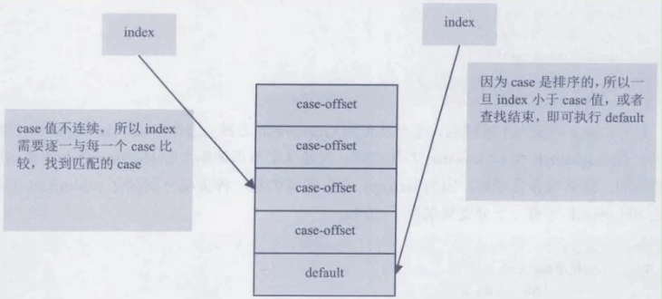

  * 

  ```java
  // 3.多条件分支跳转
  public void swtich1(int select) {
      int num;
      switch (select) {
          case 1:
              num = 10;
              break;
          case 2:
              num = 20;
              //break;
          case 3:
              num = 30;
              break;
          default:
              num = 40;
      }
  }
  ```

  ```
   0 iload_1
   1 tableswitch 1 to 3	1:  28 (+27)
  						2:  34 (+33)
                          3:  37 (+36)
                          default:  43 (+42)
  28 bipush 10
  30 istore_2
  31 goto 46 (+15)
  34 bipush 20
  36 istore_2
  37 bipush 30
  39 istore_2
  40 goto 46 (+6)
  43 bipush 40
  45 istore_2
  46 return
  ```

  

  ```java
  public void swtich2(int select) {
      int num;
      switch (select) {
          case 100:
              num = 10;
              break;
          case 500:
              num = 20;
              break;
          case 200:
              num = 30;
              break;
          default:
              num = 40;
      }
  }
  ```

  ```
   0 iload_1
   1 lookupswitch 3
  				100:  36 (+35)
  				200:  48 (+47)
  				500:  42 (+41)
  				default:  54 (+53)
  36 bipush 10
  38 istore_2
  39 goto 57 (+18)
  42 bipush 20
  44 istore_2
  45 goto 57 (+12)
  48 bipush 30
  50 istore_2
  51 goto 57 (+6)
  54 bipush 40
  56 istore_2
  57 return
  ```

  ```java
  // jdk7新特性：引入String类型
  public void swtich3(String season) {
      switch (season) {
          case "SPRING":
              break;
          case "SUMMER":
              break;
          case "AUTUMN":
              break;
          case "WINTER":
              break;
      }
  }
  ```

  ```
    0 aload_1
    1 astore_2
    2 iconst_m1
    3 istore_3
    4 aload_2
    5 invokevirtual #11 <java/lang/String.hashCode>
    8 lookupswitch 4
                  -1842350579:  52 (+44)
                  -1837878353:  66 (+58)
                  -1734407483:  94 (+86)
                  1941980694:  80 (+72)
                  default:  105 (+97)
   52 aload_2
   53 ldc #12 <SPRING>
   55 invokevirtual #13 <java/lang/String.equals>
   58 ifeq 105 (+47)
   61 iconst_0
   62 istore_3
   63 goto 105 (+42)
   66 aload_2
   67 ldc #14 <SUMMER>
   69 invokevirtual #13 <java/lang/String.equals>
   72 ifeq 105 (+33)
   75 iconst_1
   76 istore_3
   77 goto 105 (+28)
   80 aload_2
   81 ldc #15 <AUTUMN>
   83 invokevirtual #13 <java/lang/String.equals>
   86 ifeq 105 (+19)
   89 iconst_2
   90 istore_3
   91 goto 105 (+14)
   94 aload_2
   95 ldc #16 <WINTER>
   97 invokevirtual #13 <java/lang/String.equals>
  100 ifeq 105 (+5)
  103 iconst_3
  104 istore_3
  105 iload_3
  106 tableswitch 0 to 3	0:  136 (+30)
  						1:  139 (+33)
  						2:  142 (+36)
  						3:  145 (+39)
  						default:  145 (+39)
  136 goto 145 (+9)
  139 goto 145 (+6)
  142 goto 145 (+3)
  145 return
  ```

---

* **无条件跳转指令**

  目前主要的无条件跳转指令为goto。指令goto接收两个字节的操作数，共同组成功过一个带符号的整数，<font color=red>**用于指定指令的偏移量，指令执行的目的就是跳转到偏移量给定的为位置处**</font>。

  如果指令偏移量太大，超过双字节的带符号整数范围，则可以使用goto_w，它和goto有相同的作用，但是它接收4个字节的操作数，可以表示更大的范围。

  指令jsr、jsr_w、ret虽然也是无条件跳转，但主要用于 try-finally语句，且已经被虚拟机逐渐废弃，故不再这里介绍。

  | 指令名称 |                             描述                             |
  | :------: | :----------------------------------------------------------: |
  |   goto   |                          无条件跳转                          |
  |  got_w   |                     无条件跳转（宽索引）                     |
  |   jsr    |     跳转至指定16位offset位置，并将jsr下一条指令压入栈顶      |
  |  jsr_w   |    跳转至指定32位offset位置，并将jsr_w下一条指令压入栈顶     |
  |   ret    | 返回由指定的局部变量所给出的指令位置（一般与jsr、jsr_w联合使用） |

  ```java
  // 4.无条件跳转指令
  public void whileInt() {
      int i = 0;
      while (i < 100) {
          String s = "atguigu.com";
          i++;
      }
  }
  ```

  ```
   0 iconst_0
   1 istore_1
   2 iload_1
   3 bipush 100
   5 if_icmpge 17 (+12)
   8 ldc #17 <atguigu.com>
  10 astore_2
  11 iinc 1 by 1
  14 goto 2 (-12)
  17 return
  ```

  ```java
  public void whileDouble() {
      double d = 0.0;
      while (d < 100.1) {
          String s = "atguigu.com";
          d++;
      }
  }
  ```

  ```
   0 dconst_0
   1 dstore_1
   2 dload_1
   3 ldc2_w #18 <100.1>
   6 dcmpg
   7 ifge 20 (+13)
  10 ldc #17 <atguigu.com>
  12 astore_3
  13 dload_1
  14 dconst_1
  15 dadd
  16 dstore_1
  17 goto 2 (-15)
  20 return
  ```

  ```java
  public void printFor() {
      short i;
      for (i = 0; i < 100; i++) {
          String s = "atguigu.com";
      }
  }
  ```

  ```
   0 iconst_0
   1 istore_1
   2 iload_1
   3 bipush 100
   5 if_icmpge 19 (+14)
   8 ldc #17 <atguigu.com>
  10 astore_2
  11 iload_1
  12 iconst_1
  13 iadd
  14 i2s
  15 istore_1
  16 goto 2 (-14)
  19 return
  ```

  

## 9 异常处理指令

* 抛出异常指令

  athrow指令：

  * 在 Java 程序中显示抛出异常的操作（throw语句）都是由athrow指令来实现。
  * 除了使用throw语句显示抛出异常情况之外，<font color=red>**JVM规范还规定了许多运行时异常，这些异常会在其他Java虚拟机指令检测到异常状况时自动抛出。**</font>例如，在之前介绍的整数运算中，当除数为0时，虚拟机会在 idiv 或 ldiv指令中抛出 ArithmeticException异常。

  注意：

  * 正常情况下，操作数栈的压入弹出指令都是一条条指令完成的。唯一的例外情况是在<font color=red>**再抛异常时，Java虚拟机会清除操作数栈上的所有内容，而后将异常实例压入调用者操作栈上。**</font>

  ##########

  异常及异常的处理：

  * 过程1：异常对象的生成过程 ---> throw（手动 / 自动）   --->  指令：athrow
  * 过程2：异常的处理：抓抛模型。 try-catch-finally  ---> 使用异常表

  ```java
  public void throwZero(int i) {
      if (i == 0) {
          throw new RuntimeException("参数值为0");
      }
  }
  ```

  ```
   0 iload_1
   1 ifne 14 (+13)
   4 new #2 <java/lang/RuntimeException>
   7 dup
   8 ldc #3 <参数值为0>
  10 invokespecial #4 <java/lang/RuntimeException.<init>>
  13 athrow
  14 return
  ```

  ```java
  public void throwOne(int i) throws RuntimeException, IOException {
      if (i == 1) {
          throw new RuntimeException("参数值为1");
      }
  }
  ```

  ```
   0 iload_1
   1 iconst_1
   2 if_icmpne 15 (+13)
   5 new #2 <java/lang/RuntimeException>
   8 dup
   9 ldc #5 <参数值为1>
  11 invokespecial #4 <java/lang/RuntimeException.<init>>
  14 athrow
  15 return
  ```

  

  对于系统已经定义好的异常，JVM会自动抛出，如下的例子，我们在字节码中看不到 athrow

  ```java
  public void throwArithmetic() {
      int i = 10;
      int j = i / 0;
      System.out.println(j);
  }
  ```

  ```
   0 bipush 10
   2 istore_1
   3 iload_1
   4 iconst_0
   5 idiv
   6 istore_2
   7 getstatic #6 <java/lang/System.out>
  10 iload_2
  11 invokevirtual #7 <java/io/PrintStream.println>
  14 return
  ```

---

* 异常处理和异常表

  **异常处理：**

  * 在Java虚拟机中，<font color=red>**异常处理**</font>（catch语句）不是由字节码指令来实现的（早期使用jsr、ret指令），而是<font color=red>**采用异常表来完成的**</font>。

  **异常表：**

  * 如果在一个方法定义了一个try-catch 或者 try-finally 的异常处理，就会创建一个异常表。它包含了每个异常处理或者 finally 块的信息。异常表保存了每个异常处理信息。比如：
    * 起始位置
    * 结束位置
    * 程序计数器记录的代码处理的偏移地址
    * 被捕获的异常表在常量池中的索引

  <font color=red>**当一个异常被抛出时，JVM会在当前方法里寻找一个匹配的处理，如果没有找到，这个方法会强制结束并弹出栈帧**</font>，并且异常会重新抛给上层调用的方法（在调用方法栈帧）。如果在所有栈帧弹出前仍没有找到合适的异常处理，这个线程将终止。如果这个异常在最后一个非守护线程里抛出，将导致JVM字节终止，比如这个线程是main线程。

  <font color=red>**不管什么时候抛出异常。如果异常处理最终匹配了所有异常类型，代码就会继续执行**</font>。这种情况下，如果方法结束后没有抛出异常，仍然执行finally块，在return之前，它直接跳到finally块来完成目标。

  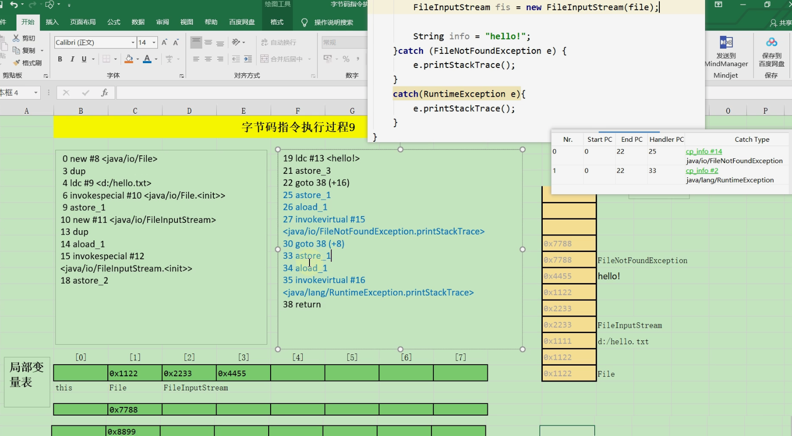

  * 面试题：

    ```java
    // 思考：如下方法返回结果为多少？   hello
    public static String func() {
        String str = "hello";
        try {
            return str;
        } finally {
            str = "atguigu";
        }
    }
    ```

    ```
     0 ldc #17 <hello>
     2 astore_0
     3 aload_0
     4 astore_1
     5 ldc #18 <atguigu>
     7 astore_0
     8 aload_1
     9 areturn
    10 astore_2
    11 ldc #18 <atguigu>
    13 astore_0
    14 aload_2
    15 athrow
    ```

    

## 10 同步控制指令

* **组成**

  Java虚拟机支持两种同步结构：<font color=red>**方法级的同步**</font> 和 <font color=red>**方法内部一段指令序列的同步**</font>，这两种同步都是使用monitor来支持的。

* **方法级的同步**

  方法级的同步是隐式的，即无需通过字节码指令来控制，它实现在方法调用和方法返回操作之中。虚拟机可以从方法常量池的方法表结构中的 ACC_SYNCHRONIZED 访问标志的值一个方法是否声明为同步方法；

  当调用方法时，调用指令将会检查方法ACC_SYNCHRONIZED访问标志是否设置。

  * 如果设置了，执行线程将先持有同步锁，然后执行方法。<font color=red>**最后**</font>在方法完成（无论是正常完成还是非正常完成）时<font color=red>**释放同步锁**</font>。
  * 在方法执行期间，执行线程持有同步锁，其他线程持有了同步锁，其他任何线程都无法再获得同一个锁。
  * 如果一个同步方法执行期间抛出了异常，并且在方法内部无法处理此异常，那这个同步方法所持有的锁将在异常抛出的同步方法之外时自动释放。

  举例：

  ```java
  private int i = 0;
  
  public synchronized void add() {
      i++;
  }
  ```

  ```
   0 aload_0
   1 dup
   2 getfield #2 <com/atguigu/java1/SynchronizedTest.i>
   5 iconst_1
   6 iadd
   7 putfield #2 <com/atguigu/java1/SynchronizedTest.i>
  10 return
  ```

  **说明：**

  这段代码和普通的无同步操作的代码没有什么不同，没有使用monitorenter和monitorexit进行同步区控制。这是因为，对于同步方法而言，<font color=red>**当虚拟机通过方法的访问标识符判断一个同步方法时，会自动在方法调用前进行加锁**</font>，当同步方法执行完毕后，不管方法时正常结束还是有异常抛出，均会由虚拟机释放这个锁。因此，对于同步方法而言，monitorenter和monitorexit 指令是隐式存在的，并未直接出现在字节码中。

---

* **方法内指定序列的同步**

  * 同步一段指令序列：通常由Java中的synchronized语句块来表示的。jvm的指令集有monitorenter和monitorexit 两条指令来支持 synchronized关键字的语义。

  * 当一个线程进入同步代码块时，它使用monitorenter指令请求进入。如果当前对象的监视器为0，则它会被允许进入，若为1，则判断持有当前监视器的线程是否为自己，如果是，则进入，否则进行等待，知道对象的监视器计数器为0，才会被允许进入同步块。

  * 当线程退出同步代码块时，需要使用monitorexit声明退出。在Java虚拟机中，任何对象都有一个监视器与之相关联，用来判断对象是否被锁定，当监视器被持有后，对象处于锁定状态。

  * 指令monitorenter和monitorexit 在执行时，都需要操作数栈顶压入对象，之后monitorenter和monitorexit 的锁定和释放都是针对这个对象的监视器进行的。

  * 下图展示了监视器如何保护临界区代码不同时被多个线程访问，只有当线程4离开临界区后，线程1、2、3才有可能进入。

  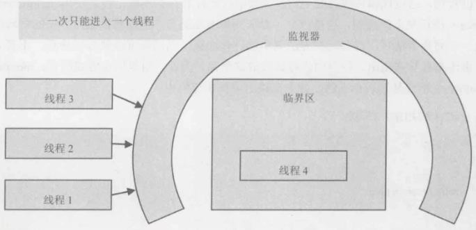

  举例：

  ```java
  public class SynchronizedTest {
  
      private int i = 0;
  
      public void subtract() {
          synchronized (obj) {
              i--;
          }
      }
  }
  ```

  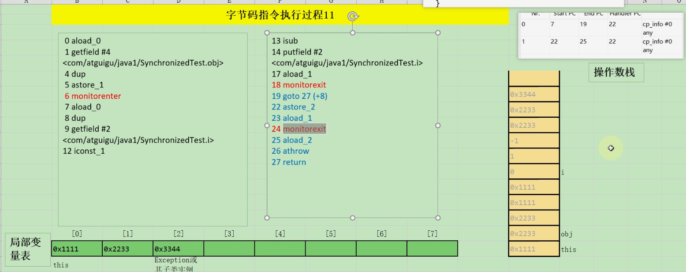

  * 编译器必须确保无论方法通过何种方式完成，方法中调用过的每条monitorenter指令都必须执行其对应的monitorexit指令，而无论这个方法是正常结束还是异常结束。
  * 为了保证在方法异常完成时monitorenter和monitorexit 指令依然可以正确配对执行，<font color=red>**编译器会自动产生一个异常处理器，这个异常处理器声明可处理所有的异常**</font>，它的目的就是用来执行monitorexit指令。


# 第20章 类的加载过程详解

## 1 概述

* 在Java中数据类型分为基本数据类型和引用数据类型。基本数据类型由虚拟机预先定义，引用数据类型则需要进行类的加载。

* 按照Java虚拟机规范，从class文件到加载到内存中的类，到类卸载出内存为止，它的整个生命周期包括7个阶段。

  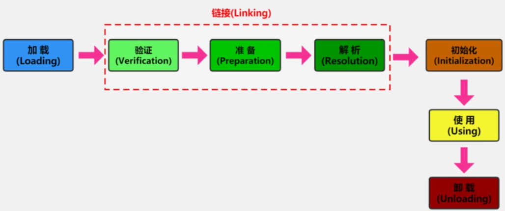

  其中，验证、准备、解析 3 个部分统称为链接（Linking）

* 从程序中类的使用过程看：

  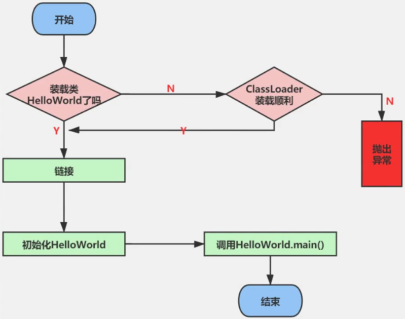

* 大厂面试题

  * 蚂蚁金服
    * 描述一下 JVM 加载 Class 文件的原理机制？
    * 一面：类加载过程
  * 百度
    * 类加载的时机
    * java类加载机制？
    * 简述 Java 类加载机制
  * 腾讯
    * JVM 中类的加载机制，类加载过程？
  * 滴滴
    * JVM类加载机制
  * 美团
    * Java类加载过程
    * 描述一下jvm加载class文件的原理机制
  * 京东
    * 什么是类的加载？
    * 哪些情况会出发类的加载？
    * 讲一下JVM加载一个类的过程
    * JVM的类加载机制是什么？


## 2 过程一：Loading（加载）阶段

* 加载完成的操作

  **加载的理解**

  <font color=red>**所谓加载，简而言之就是将Java类的字节码加载到机器内存中，并在内存中构建出Java的原型-------类模板对象**</font>。所谓类模板对象，其实就是Java类在JVM内存中的一个快照，JVM将字节码文件解析出的常量池、类字段、类方法等信息等信息存储到类模板中，这样JVM在运行期便能通过类模板而获取Java类中的任意信息，能够对Java类的成员变量进行遍历，也能进行Java方法的调用。

  反射的机制即基于这一基础。如果JVM没有将Java类的声明信息存储起来，则JVM在运行期也无法反射。

  **加载完成的操作**

  <font color=red>**加载阶段，简言之，查找并加载类的二进制文件，生成Class的实例。**</font>

  在加载类时，Java虚拟机必须完成以下 3 件事情：

  * 通过类的全名，获取类的二进制数据流。
  * 解析类的二进制数据流为方法区内的数据结构（Java类模型）
  * 创建java.lang.Class类的实例，表示该类型。作为方法区这个类的的各种数据的访问入口。

---

* 二进制流的获取方式

  对于类的二进制流数据，虚拟机可以通过多种途径产生或获得。（只要读取的字节码符合JVM规范即可）

  * 虚拟机可能通过文件系统读入一个class后缀的文件（<font color=red>**最常见**</font>）
  * 读入jar、zip等归档数据包，提取类文件。
  * 事先存放在数据库中的类的二进制数据
  * 使用类似于HTTP之类的协议通过网络进行加载
  * 在运行时生成一段Class的二进制信息等。

  在获取到类的二进制信息后，Java虚拟机就会处理这些数据，并最终转为一个java.lang.Class的实例。

  如果输入数据不是ClassFile的结构，则会抛出ClassFormatError。

---

* 类模板与Class实例的位置

  **类模板的位置：**

  加载的类在JVM中创建相应的类结构，类结构会存储在方法区（JDK1.8之前：永久代；JDK及以后：元空间）。

  **Class实例的位置：**

  类将.class文件加载至元空间后，会在堆中创建一个java.lang.Class对象，用来封装类位于方法区内的数据结构，该Class对象是在加载类的过程中创建的，每个类都对应一个Class类型的对象。（instanceKlass --> mirror: Class的实例）

  **图示：**

  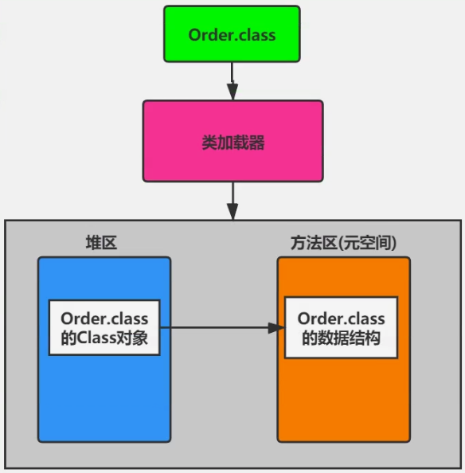

  外部可以通过访问代表Order类的Class对象来获取Order的类数据结构。

  **再说明：**

  Class类的构造方法是私有的，只有JVM能够创建。

  java.lang.Class实例时访问类型元数据的接口，也是实现反射的关键数据、入口。通过Class类提供的接口，可以获得目标类所关联的.class文件中具体的数据结构：方法、字段等信息。

  ```java
  // 通过Class类，获得了java.lang.String类的所有方法信息，并打印方法访问标识符、描述符
  public class LoadingTest {
      public static void main(String[] args) {
          try {
              Class clazz = Class.forName("java.lang.String");
              // 获取当前运行时类声明的所有方法
              Method[] ms = clazz.getDeclaredMethods();
              for (Method m : ms) {
                  // 获取方法的修饰符
                  String mod = Modifier.toString(m.getModifiers());
                  System.out.print(mod + " ");
                  // 获取方法的返回值类型
                  String returnType = m.getReturnType().getSimpleName();
                  System.out.print(returnType + " ");
                  // 获取方法名
                  System.out.print(m.getName() + "(");
                  // 获取方法的参数列表
                  Class<?>[] ps = m.getParameterTypes();
                  if (ps.length == 0) System.out.print(')');
                  for (int i = 0; i < ps.length; i++) {
                      char end = (i == ps.length - 1) ? ')' : ',';
                      // 获取参数的类型
                      System.out.print(ps[i].getSimpleName() + end);
                  }
                  System.out.println();
              }
          } catch (ClassNotFoundException e) {
              e.printStackTrace();
          }
      }
  }
  ```

---

* **数组类的加载：**

  创建数组类的情况稍微有些特殊，因为数组本身并不是由类加载器负责创建的，而是由JVM在运行时根据需要而直接创建，但数组的元素类型仍然需要依靠类加载器去创建。创建数组类（下述简称A）的过程：

  1. 如果数组的元素类型是引用类型，那么就遵循定义的加载过程递归加载和创建数组A的元素类型；
  2. JVM使用指定的元素类型和数组维度来创建新的数组类。

  如果数组的元素类型是引用类型，数组类的可访问性就由元素类型的可访问性决定。否则数组类的可访问性被定义为public。


## 3 过程二：Linking链接阶段

* **环节1：链接阶段之Verification（验证）**

  当类加载到系统后，就开始链接操作，验证是链接操作的第一步

  <font color=red>**它的目的是保证加载的字节码是合法、合理并且符合规范的。**</font>

  验证的步骤比较复杂，实际要验证的项目也很繁多，大体上java虚拟机需要做以下检查，如图所示：

  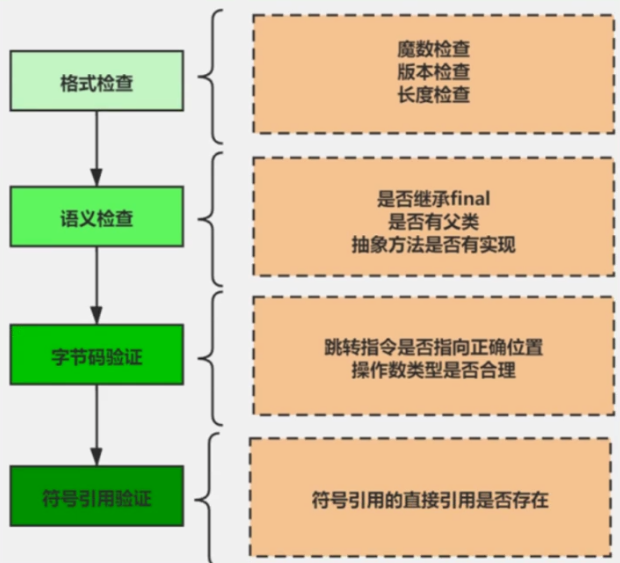

  **整体说明：**

  验证的内容则涵盖了类数据信息的格式验证、语义检查、字节码验证、符号引用验证等。

  * 其中<font color=red>**格式验证会和加载阶段一起执行。**</font>验证通过之后，类加载器才会成功将类的二进制数据信息加载到方法区中。
  * <font color=red>**格式验证之外的验证操作将会在方法区中进行。**</font>

  链接阶段的验证虽然拖慢了加载速度，但是避免了在字节码运行时还需要进行各种检查。（磨刀不误砍柴工）

  **具体说明：**

  1. <font color=red>**格式验证**</font>：是否以魔数0xcafebabe开头，主版本和副版本号是否在当前Java虚拟机的支持范围内，数据中的每一项是否都拥有正确的长度等。
  2. Java虚拟机会进行字节码的<font color=red>**语义检查**</font>，但凡在语义上不符合规范的，虚拟机也不会给予通过。比如：
     * 是否所有的类都有父类的存在（在Java里，除了Object外，其他类都应该有父类）
     * 是否一些被定义为final的方法或者类被重写或继承了
     * 非抽象类是否实心了所有抽象方法或接口方法
     * 是否存在不兼容的方法（比如方法的签名除了返回值不同，其他都一样，这种方法会让虚拟机无从下手调度：abstract情况下的方法，就不能是final的了）
  3. Java虚拟机还会进行<font color=red>**字节码验证**</font>，字节码验证也是<font color=red>**验证过程中最为复杂的一个过程**</font>。它试图通过字节码流的分析，判断字节码是否可以被正确的执行。比如：
     * 在字节码执行的过程中，是否会跳转到一条不存在的指令
     * 函数的调用是否传递了正确类型的参数
     * 变量的赋值是不是给了正确的数据类型等。

  栈映射帧（StackMapTable）就是这个阶段，用于检测在特定的字节码处，其局部变量表和操作数栈是否有着正确的数据类型。但遗憾的是，100%准确地判断一段字节码是否可以被安全之星是无法实现的，因此，该过程知识尽可能地检查出可以预知的明显的问题。如果在这个阶段无法通过检查，虚拟机也不会正确装在这个类。但是，如果通过了这个阶段的检查，也不能说明这个类是完全没有问题的。

  <font color=red>**在前面 3 次检查中，已经排除了文件格式错误、语义错误以及字节码的不正确性。但是依然不能保证类是没有问题的。**</font>

  4. 校验器还将进行<font color=red>**符号引用的验证**</font>。Class文件在其常量池会通过字符串记录自己将要使用的其他类或者方法。因此，在验证阶段，<font color=red>**虚拟机就会检查这些类或者方法确实是存在的**</font>，并且当前类有权限访问这些数据，如果一个需要使用类无法在系统中找到，则会抛出NoClassDefFoundError，如果一个方法无法被找到，如果一个方法无法被找到，则会抛出NoSuchMethodError。

     此阶段在解析环节才会执行。

---

* **环节2：链接阶段之Preparation（准备）**

  <font color=red>**准备阶段（Preparation），简言之，为类的静态变量分配内存，并将其初始化为默认值。**</font>

  当一个类验证通过时，虚拟机就会进入准备阶段。在这个阶段，虚拟机就会为这个类分配相应的内存空间，并设置默认初始值。

  Java虚拟机为各类型变量默认初始值如表所示：

  | 类型      | 默认初始值 |
  | --------- | ---------- |
  | byte      | (byte)0    |
  | short     | (short)0   |
  | int       | 0          |
  | long      | 0L         |
  | float     | 0.0f       |
  | double    | 0.0        |
  | char      | \u0000     |
  | boolean   | false      |
  | reference | null       |

  注意：Java并不支持boolean类型，内部实现是int，由于int的默认值是0，故对应的，boolean的默认值就是false。

  **注意：**

  1. <font color=red>**这里不包含基本数据类型的字段用static final修饰的情况，因为final在编译的时候就会分配了，准备阶段会显式赋值。**</font>
  2. 注意这里不会为实例变量初始化，类变量会分配在方法区中，而实例变量会随着对象一起分配到Java堆中。
  3. 在这个阶段并不会像初始化阶段中那样会有初始化或者代码执行。

  ```java
  /**
   * 过程二：链接阶段（以下都是针对static修饰的变量）
   * 基本数据类型：非 final 修饰的变量，在准备环节进行默认初始化赋值。
   *             final修饰以后，在准备环节直接进行显示赋值。
   * 
   * 拓展：如果使用字面量的方式定义一个字符串的常量的话，也是在准备环节直接进行显示赋值。
   */
  public class LinkingTest {
      private static long id;  // 默认初始化赋值
      private static final int num = 1;  // 显示赋值
  
      public static final String constStr = "CONST";  // 显示赋值
  //    public static final String constStr1 = new String("CONST");
  }
  ```

---

* **环节3：链接阶段之Reslution（解析）**

  <font color=red>**解析阶段（Resolution），简言之，将类、接口、字段和方法的符号引用转为直接引用。**</font>

  **具体描述：**

  符号引用就是一些字面量的引用，和虚拟机的内部数据结构和内存布局无关。比较容易理解的就是在Class类文件中，通过常量池进行大量的符号引用。但是在程序实际运行时，只有符号引用时不够的。比如当如下println()方法被调用时，系统需要明确知道该方法的位置。

  举例：输出操作System.out.println()对应的字节码：

  invokevirtual # 24 <java/io/PrintStrem.println>

  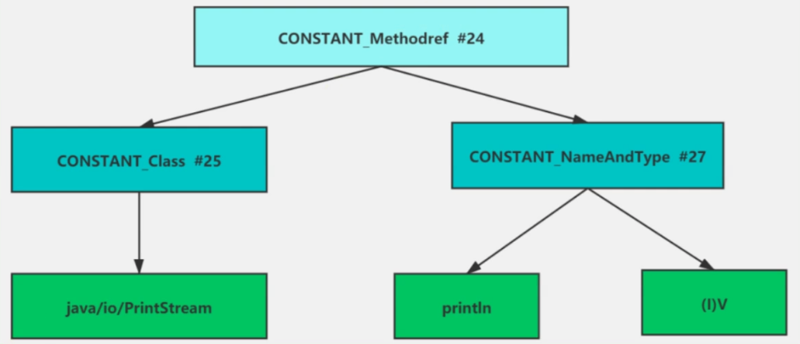

  以方法为例，Java虚拟机为每个类都准备了一张方法表，将其所有的方法都列在表中，当需要调用一个类的方法的时候，只要知道这个方法在方法表中的偏移量就可以直接调用该方法。<font color=red>**通过解析操作，符号引用就可以转变为目标方法在类中方法表中的位置，从而使得方法被成功调用。**</font>

  **小节：**

  所谓解析就是将符号引用转为直接引用，也就得到类、字段、方法在内存中的指针或者偏移量。因此，可以说，如果直接引用存在，那么可以肯定系统中存在该类、方法或者字段。但只存在符号引用，不能确定系统中一定存在存在该结构。

  不过Java虚拟机规范并没有明确要求解析阶段一定要按照顺序执行。在HotSpot VM中，加载、验证、准备和初始化会按照顺序有条不紊的执行，但链接阶段中的解析操作往往会伴随着JVM在执行完初始化之后再执行。

  **字符串的复习：**

  最后，再来看一下CONSTANT_String_info的解析。由于字符串在程序开发中有着重要的作用，因此，读者有必要了解一下String在Java虚拟机中的处理。<font color=red>**当在java代码中直接使用字符串常量时，就会在类中出现CONSTANT_String_info**</font>，它表示字符串常量，并且会引用一个CONSTANT_UTF8_info的常量项。<font color=red>**在Java虚拟机内部运行的常量池中，会维护一张字符串拘留表（intern），它会保存所有出现过的字符串常量，并且没有重复项。**</font>只要以CONSTANT_String形式出现的字符串都会在这张表中。使用String.intern()方法可以得到一个字符串在拘留表中的引用，因为该表中没有重复项，所以任何字面量相同的字符串的String.intern()方法返回总是相等的。


## 4 过程三：Initialzation（初始化）阶段

* <font color=red>**初始化阶段，简言之，为类的静态变量赋予正确的初始值。**</font>

* **具体描述：**

  类的初始化是类加载的最后一个阶段。如果前面的步骤都没有问题，那么便是类可以顺利装在到系统里。此时，类才会开始执行Java字节码。（即：到了初始化阶段，才真正开始执行类中定义的Java程序代码。）

  <font color=red>**初始化阶段的重要工作是执行类的初始化方法：\<clinit\>方法。**</font>

  * 该方法仅能由Java编译器生成并由JVM调用，程序开发者无法自定义一个同名的方法，更无法直接在Java程序中调用该方法。虽然该方法是由字节码指令组成的。

  * 它是由静态成员的赋值语句以及static语句块合并产生的。

    ```java
    /**
     * 过程三：初始化阶段
     */
    public class InitializationTest {
        public static int id = 1;
        public static int number;
    
        static {
            number = 2;
            System.out.println("father static{}");
        }
    }
    ```

    <clinit\> 中的内容：

    ```
     0 iconst_1
     1 putstatic #2 <com/atguigu/java/InitializationTest.id>
     4 iconst_2
     5 putstatic #3 <com/atguigu/java/InitializationTest.number>
     8 getstatic #4 <java/lang/System.out>
    11 ldc #5 <father static{}>
    13 invokevirtual #6 <java/io/PrintStream.println>
    16 return
    ```

* **说明：**

  在加载一个类之前，虚拟机总会试图加载该类的父类，因此父类的<clinit\> 总是在子类 <clinit\> 之前被调用。也就是说，父类的static块优先级高于子类。

  口诀：由父及子，静态先行

  ```java
  public class InitializationTest {
      public static int id = 1;
      public static int number;
  
      static {
          number = 2;
          System.out.println("father static{}");
      }
  }
  ```

  ```java
  public class SubInitialization extends InitializationTest {
      static {
          number = 4;  // number属性必须提前已经加载：一定会先加载父类。
          System.out.println("son static{}");
      }
  
      public static void main(String[] args) {
          System.out.println(number);
      }
  }
  ```

  **执行结果：**

  ​				father static{}

  ​				son static{}

  ​				4

  

  java编译器并不会为所有的类都产生<clinit\>()初始化方法。哪些类在编译为字节码后，字节码文件中将不会含有<clinit\>()方法呢？

  * 一个类中并没有声明任何的类变量，也没有静态代码块时
  * 一个类中声明类变量，但是没有明确使用类变量的初始化语句以及静态代码块来执行初始化操作时
  * 一个类中包含static final修饰的基本数据类型的字段，这些类字段初始化语句采用编译时常量表达式

  ```java
  /**
   * 哪些场景下，java编译器就不会生成<clinit>()方法
   */
  public class InitializationTest1 {
      // 场景1：对应非静态的字段，不管是否进行了显式赋值，都不会生成<clinit>()方法
      public int num = 1;
      // 场景2：静态的字段，没有显式的赋值，不会生成<clinit>()方法
      public static int num1;
      // 场景3：比如对于声明为static final的基本数据类型的字段，不管是否进行了显式赋值，都不会生成<clinit>()方法
      public static final int num2 = 1;
  }
  ```

---

* 关于 **链接的准备阶段** 和 **初始化阶段** 的显式赋值的情况：

  结论：<font color=red>**使用static + final修饰，且显示赋值中不涉及到方法或构造器调用的基本数据类型或String类型的显式赋值，是在链接阶段的准备环节进行。**</font>

  对于类变量来说，如果加了 final，才有可能在**链接的准备阶段** 被显式赋值；但是如果没加final，一定不可能在**链接的准备阶段** 被显式赋值，而是在**链接的准备阶段** 默认赋值，然后在初始化阶段显式赋值。

  ```java
  // 成员变量（非静态的）的赋值过程： ① 默认初始化 - ② 显式初始化 /代码块中初始化 - ③ 构造器中初始化 - ④ 有了对象之后，可以“对象.属性”或"对象.方法"
  public class InitializationTest2 {
      public static int a = 1;  // 在链接阶段的准备环节默认赋值，在初始化阶段<clinit>()中显式赋值
      public static final int INT_CONSTANT = 10;  // 在链接阶段的准备环节显式赋值
  
      public static final Integer INTEGER_CONSTANT1 = Integer.valueOf(100);  // 在初始化阶段<clinit>()中显式赋值
      public static Integer INTEGER_CONSTANT2 = Integer.valueOf(1000);  // 在初始化阶段<clinit>()中显式赋值
  
      public static final String s0 = "helloworld0";  // 在链接阶段的准备环节显式赋值
      public static final String s1 = new String("helloworld1");  // 在初始化阶段<clinit>()中显式赋值
  
      public static String s2 = "helloworld2";  // 在链接阶段的准备环节默认赋值，在初始化阶段<clinit>()中显式赋值
  
      public static final int NUM1 = new Random().nextInt(10);  // 在初始化阶段<clinit>()中显式赋值
  }
  ```

---

* <clinit\>() 的线程安全性

  对于<clinit\>() 方法的调用，也就是类的初始化，虚拟机会在内部确保其多线程环境中的安全性。

  虚拟机会保证一个类的<clinit\>() 方法在多线程中被正确地加锁、同步，如果多个线程去同时初始化一个类，那么只会有一个线程去执行这个类的<clinit\>() 方法，其他线程都需要阻塞等待，直到活动线程执行<clinit\>() 方法完毕。

  正是<font color=red>**因为函数<clinit\>() 带锁线程是安全的**</font>，因此，如果在一个类中<clinit\>() 方法中有耗时很长的操作，就可能造成多个线程阻塞，引发死锁。并且这种死锁是很难发现的，因为看起来它们并没有可用的锁信息。

  如果之前的线程成功加载了类，则等在队列中的线程就没有机会执行<clinit\>() 方法了。那么，当需要使用这个类时，虚拟机会直接返回给它已经准备好的信息。

  **例子（相互等待，死锁）：**

  ```java
  class StaticA {
      static {
          try {
              Thread.sleep(1000);
          } catch (InterruptedException e) {
          }
          try {
              Class.forName("com.atguigu.java1.StaticB");
          } catch (ClassNotFoundException e) {
              e.printStackTrace();
          }
          System.out.println("StaticA init OK");
      }
  }
  
  class StaticB {
      static {
          try {
              Thread.sleep(1000);
          } catch (InterruptedException e) {
          }
          try {
              Class.forName("com.atguigu.java1.StaticA");
          } catch (ClassNotFoundException e) {
              e.printStackTrace();
          }
          System.out.println("StaticB init OK");
      }
  }
  
  public class StaticDeadLockMain extends Thread {
      private char flag;
  
      public StaticDeadLockMain(char flag) {
          this.flag = flag;
          this.setName("Thread" + flag);
      }
  
      @Override
      public void run() {
          try {
              Class.forName("com.atguigu.java1.Static" + flag);
          } catch (ClassNotFoundException e) {
              e.printStackTrace();
          }
          System.out.println(getName() + " over");
      }
  
      public static void main(String[] args) throws InterruptedException {
          StaticDeadLockMain loadA = new StaticDeadLockMain('A');
          loadA.start();
          StaticDeadLockMain loadB = new StaticDeadLockMain('B');
          loadB.start();
      }
  }
  ```

---

* 类的初始化情况：主动使用 VS. 被动使用

  Java对类的使用分为两种：主动使用 和 被动使用

  主动使用会调用<clinit\>() 方法，被动使用不会

  **一.主动使用**

  Class只有在必须要首次使用的时候才会被装在，Java虚拟机不会无条件地装载Class类型。Java虚拟机规定，一个类或接口在初次使用前，必须进行初始化。这里的使用，是指主动使用，主动使用只有以下几种情况：（即：如果出现如下的情况，则会对类进行初始化操作。而初始化操作之前的加载、验证、准备已经完成。）

  1. 当创建一个类的实例时，比如使用new关键字，或者通过反射、克隆、反序列化。
  2. 当调用类的静态方法时，即当使用了字节码invokestatic指令。
  3. 当使用类、接口的静态字段时（final修饰特殊考虑），比如，使用getstatic或者putstatic指令。（对应访问变量、赋值变量操作）
  4. 当使用java.reflect包中的方法反射类的方法时。比如Class.forName("com.atguigu.java.Test")
  5. 当初始化子类时，如果发现其父类还没有进行初始化，则需要先触发其父类的初始化。
  6. 如果一个接口定义了default方法，那么直接实现或者间接实现该接口的类的初始化，该接口要在其之前被初始化。
  7. 当虚拟机启动时，用户需要指定一个要执行的主类（包含main()方法的那个类），虚拟机会先初始化这个主类。
  8. 当初次调用 MethodHandle 实例时，初始化该 MethodHandle 指向的方法所在的类。（涉及解析REF_getStatic、REF_putStatic、REF_invokeStatic方法句柄对应的类）

  针对5，补充说明：

  当Java虚拟机初始化一个类时，要求它的所有父类都已经被初始化，但是这条规则并不适用于接口。

  * 当初始化一个类时，并不会先初始化它所实现的接口
  * 在初始化一个接口时，并不会初始化它的负借口

  因此，一个父接口并不会因为它的子接口或者实现类的初始化而初始化。只有当程序首次使用特定的静态字段时，才会导致该接口的初始化。

  针对7，说明：

  JVM启动的时候通过引导类加载器加载一个初始类。这个类在调用 public static void main(String[] args)方法之前被链接和初始化。这个方法的执行将依次导致所需的类的加载，链接和初始化。

  **二.被动使用**

  除了以上的情况属于主动使用，其他情况均属于被动使用。<font color=red>**被动使用不会引起类的初始化。**</font>

  也就是说：<font color=red>**并不是在代码中出现的类，就一定被加载挥着初始化。如果不符合主动使用的条件，类就不会初始化。**</font>

  1. 当访问一个静态字段时，只有真正声明这个字段的类才会被初始化
     * 当通过子类引用父类的静态变量，不会导致子类的初始化
  2. 通过数组定义引用类，不会触发此类的初始化
  3. 引用常量不会触发此类或接口的初始化。因为常量在链接阶段就已经被显式赋值了。
  4. 调用ClassLoader类的loadClass()方法加载一个类，并不是对类的主动使用，不会导致类的初始化。

---

* 主动使用

  ```java
  /**
   * 测试类的主动使用：意味着会调用类的<clinit>()，即执行了类的初始化阶段
   * <p>
   * 1. 当创建一个类的实例时，比如使用new关键字，或者通过反射、克隆、反序列化。
   * 2. 当调用类的静态方法时，即当使用了字节码invokestatic指令。
   */
  public class ActiveUse1 {
      public static void main(String[] args) {
          Order order = new Order();  // 1
      }
  
      // 序列化的过程：
      @Test
      public void test1() {
          ObjectOutputStream oos = null;
          try {
              oos = new ObjectOutputStream(new FileOutputStream("order.dat"));
  
              oos.writeObject(new Order());
          } catch (IOException e) {
              e.printStackTrace();
          } finally {
              try {
                  if (oos != null)
                      oos.close();
              } catch (IOException e) {
                  e.printStackTrace();
              }
          }
      }
  
      // 反序列化的过程：（验证）  2
      @Test
      public void test2() {
          ObjectInputStream ois = null;
          try {
              ois = new ObjectInputStream(new FileInputStream("order.dat"));
  
              Order order = (Order) ois.readObject();
          } catch (Exception e) {
              e.printStackTrace();
          } finally {
              try {
                  if (ois != null)
                      ois.close();
              } catch (IOException e) {
                  e.printStackTrace();
              }
          }
      }
  
      @Test
      public void test3() {
          Order.method();
      }
  }
  
  class Order implements Serializable {
      static {
          System.out.println("Order类的初始化过程");
      }
  
      public static void method() {
          System.out.println("Order method()....");
      }
  }
  ```

  ```java
  /**
   * 3. 当使用类、接口的静态字段时(final修饰特殊考虑)，比如，使用getstatic或者putstatic指令。（对应访问变量、赋值变量操作）
   */
  public class ActiveUse2 {
      @Test
      public void test1() {
  //        System.out.println(User.num);  // 会导致 初始化
  //        System.out.println(User.num1);  // 不会导致 初始化，结合前面讲解的static final理解
          System.out.println(User.num2);  // 会导致 初始化
      }
  
      @Test
      public void test2() {
  //        System.out.println(CompareA.NUM1);  // 不会导致 初始化
          System.out.println(CompareA.NUM2);  // 会导致 初始化
      }
  }
  
  class User {
      static {
          System.out.println("User类的初始化过程");
      }
  
      public static int num = 1;
      public static final int num1 = 1;
      public static final int num2 = new Random().nextInt(10);
  }
  
  interface CompareA {
      public static final Thread t = new Thread() {
          {
              System.out.println("CompareA的初始化");
          }
      };
  
      public static final int NUM1 = 1;
      public static final int NUM2 = new Random().nextInt(10);
  }
  ```

  ```java
  /**
   * 4. 当使用java.lang.reflect包中的方法反射类的方法时。比如：Class.forName("com.atguigu.java.Test")
   * 5. 当初始化子类时，如果发现其父类还没有进行过初始化，则需要先触发其父类的初始化。
   * 6. 如果一个接口定义了default方法，那么直接实现或者间接实现该接口的类的初始化，该接口要在其之前被初始化。
   * 7. 当虚拟机启动时，用户需要指定一个要执行的主类（包含main()方法的那个类），虚拟机会先初始化这个主类。
   * 8. 当初次调用 MethodHandle 实例时，初始化该 MethodHandle 指向的方法所在的类。
   * （涉及解析REF_getStatic、REF_putStatic、REF_invokeStatic方法句柄对应的类）
   * <p>
   * <p>
   * 针对5，补充说明：
   * 当Java虚拟机初始化一个类时，要求它的所有父类都已经被初始化，但是这条规则并不适用于接口。
   * >在初始化一个类时，并不会先初始化它所实现的接口
   * >在初始化一个接口时，并不会先初始化它的父接口
   * 因此，一个父接口并不会因为它的子接口或者实现类的初始化而初始化。只有当程序首次使用特定接口的静态字段时，
   * 才会导致该接口的初始化。
   */
  public class ActiveUse3 {
      static {
          System.out.println("ActiveUse3的初始化过程");
      }
  
      @Test
      public void test1() {  // 4.
          try {
              Class clazz = Class.forName("com.atguigu.java1.Order");
          } catch (ClassNotFoundException e) {
              e.printStackTrace();
          }
      }
  
      @Test
      public void test2() {  // 5.
          System.out.println(Son.num);
      }
  
      @Test
      public void test3() {  // 5，补充说明
          System.out.println(CompareC.NUM1);
      }
  
      @Test
      public void test4() {  // 6.
          System.out.println(Son.num);
      }
  
      public static void main(String[] args) {  // 7.
          System.out.println("hello");
      }
  }
  
  class Father {
      static {
          System.out.println("Father类的初始化过程");
      }
  }
  
  class Son extends Father implements CompareB {
      static {
          System.out.println("Son类的初始化过程");
      }
  
      public static int num = 1;
  }
  
  interface CompareB {
      public static final Thread t = new Thread() {
          {
              System.out.println("CompareB的初始化");
          }
      };
  
      public default void method1() {
          System.out.println("你好！");
      }
  }
  
  interface CompareC extends CompareB {
      public static final Thread t = new Thread() {
          {
              System.out.println("CompareC的初始化");
          }
      };
  
      public static final int NUM1 = new Random().nextInt();
  }
  ```

---

* 被动使用

  ```java
  /**
   * 关于类的被动使用，即不会进行类的初始化操作，即不会调用<clinit>()
   * 
   * 1. 当访问一个静态字段时，只有真正声明这个字段的类才会被初始化。
   *      > 当通过子类引用父类的静态变量，不会导致子类初始化
   * 2. 通过数组定义类引用，不会触发此类的初始化
   * 
   * 说明：没有初始化的类，不意味着没有加载！
   */
  public class PassiveUse1 {
      @Test
      public void test1() {  // 1.
          System.out.println(Child.num);  // 不会初始化 Child
      }
  
      @Test
      public void test2() {  // 2.
          Parent[] parents = new Parent[10];
          System.out.println(parents.getClass());  // 不会初始化 Parent
          System.out.println(parents.getClass().getSuperclass());
  
          parents[0] = new Parent();
          parents[1] = new Parent();
      }
  }
  
  class Parent {
      static {
          System.out.println("Parent的初始化过程");
      }
  
      public static int num = 1;
  }
  
  class Child extends Parent {
      static {
          System.out.println("Child的初始化过程");
      }
  }
  ```

  ```java
  /**
   * * 3. 引用常量不会触发此类或接口的初始化。因为常量在链接阶段就已经被显式赋值了。
   * * 4. 调用ClassLoader类的loadClass()方法加载一个类，并不是对类的主动使用，不会导致类的初始化。
   */
  public class PassiveUse2 {
      @Test
      public void test1() {  // 3.
  //        System.out.println(Person.NUM);  // 不会 初始化
          System.out.println(Person.NUM1);  // 会 初始化
      }
  
      @Test
      public void test2() {  // 3.
  //        System.out.println(SerialA.ID);  // 不会 初始化
          System.out.println(SerialA.ID1);  // 会 初始化
      }
  
      @Test
      public void test3() {  // 4.
          try {
              Class clazz = ClassLoader.getSystemClassLoader().loadClass("com.atguigu.java1.Person");
          } catch (ClassNotFoundException e) {
              e.printStackTrace();
          }
      }
  }
  
  class Person {
      static {
          System.out.println("Person类的初始化");
      }
  
      public static final int NUM = 1;  // 在链接过程的准备环节就被赋值为1了。
      public static final int NUM1 = new Random().nextInt(10);  // 此时的赋值操作需要在<clinit>()中执行
  }
  
  interface SerialA {
      public static final Thread t = new Thread() {
          {
              System.out.println("SerialA的初始化");
          }
      };
  
      int ID = 1;
      int ID1 = new Random().nextInt(10);  // 此时的赋值操作需要在<clinit>()中执行
  }
  ```

  

## 5 过程四：类的Using（使用）

* 任何一个类型在使用之前都必须经历完整的加载、链接和初始化3个类加载步骤。一旦一个类型成功经历过这3个步骤之后，便“万事俱备，只欠东风”，就等着开发者使用了。
* 开发人员可以在程序中访问和调用它的静态类成员信息（比如：静态字段、静态方法），或者使用new关键字为其创建对象实例。


## 6 过程五：类的Unloading（卸载）

* 类、类的加载器、类的实例之间的引用关系

  在类加载器的内部实现中，用一个Java集合来存放所加载类的引用。另一方面，一个Class对象总是会引用它的类加载器，调用Class对象的getClassLoader()方法，就能获得它的类加载器。由此可见，代表某个类的Class实例与其类的加载器之间为双向关联关系。

  一个类的实例总是引用代表这个类的Class对象。在Object类中定义了getClass()方法。这个方法返回代表对象所属类的Class对象的引用。此外，所有的Java类都有一个人静态属性class，它代表这个类的Class对象

* 类的生命周期

  当Sample类被加载、连接和初始化后，它的生命周期就开始了。当代表Sample类的Class对象不再被引用，即不可触及时，Class对象就会结束生命周期，Sample类在方法区内的数据也会被卸载，从而结束Sample类的生命周期。

  <font color=red>**一个类何时结束生命周期，取决于代表它的Class对象何时结束生命周期。**</font>

* 具体例子

  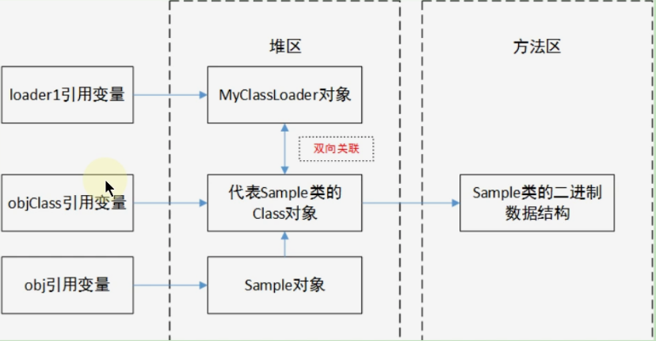

  loader1变量和obj变量间接引用代表Sample类的Class对象，而objClass变量则直接引用它。

  如果程序运行过程中，将上图左侧三个引用变量都置为null，此时Sample对象结束生命周期，MyClassLoader对象结束生命周期，代表Sample类的Class对象也结束生命周期，Sample类在方法区内的二进制数据被卸载。

  当再次有需要时，会检查Sample类的Class对象是否存在，如果存在会直接使用，不会重新加载；如果不存在Sample类会被重新加载，在Java虚拟机的堆空间会生成代表Sample类的Class实例（可以通过哈希码查看是否存在同一个实例）。

* 类的卸载

  （1）启动类加载器（引导类加载器）加载的类型在整个运行期间是不可能被卸载的（jvm和jls规范）。

  （2）被系统类加载器和扩展类加载器加载的类型在运行期间不太可能被卸载，因为系统类加载器实例或者扩展类加载器的实例基本上在整个运行期间总能直接或者间接访问的到，其达到unreachable的可能性极小。

  （3）被开发者自定义的类加载器实例加载的类型只有在很简单的上下文环境中才可能被卸载，畏怯一般还要借助强制调用虚拟机的垃圾收集功能才可以做到。可以预想，稍微复杂点的应用场景（比如：很多时候用户在开发自定义类加载器实例的时候采用缓存以提高系统性能），被加载的类型在运行期间也是几乎不太可能被卸载的（至少卸载的时间是不确定的）。

  总和以上三点，一个已经被加载的类型被卸载的几率很小至少被卸载的时间是不确定的。同时我们可以看得出来，开发者在开发代码的时候，不应该对虚拟机的类型卸载做任何价值社的前提，来实现系统特定功能。

---

* 方法区的垃圾回收

  方法区的垃圾回收主要回收两部分内容：常量池中废弃的常量 和 不再使用的类型。

  HotSpot虚拟机对常量池的回收策略是很明确的，只要常量池中的常量没有被人任何地方引用，就可以被回收。

  判定一个常量是否“废弃”还是相对简单的，而要判定一个类型是否属于“不再被使用的类”的条件就比较苛刻了。需要同时满足下面三个条件：

  * <font color=blue>**该类所有的实例都已经被回收。也就是说Java堆中不存在该类及其任何子类的实例。**</font>
  * <font color=blue>**加载该类的类加载器已经被回收。这个条件除非是经过精心设计的可替换类加载器的场景，如OSGi、JSP的重记载等，否则通常是很难达成的。**</font>
  * <font color=blue>**该类对应的java.lang.Class对象没有任何地方被引用，无法在任何地方通过反射访问该类的方法。**</font>

  Java虚拟机被允许对满足上述三个条件的无用类进行回收，这里说的仅仅是“被允许”，而并不是和对象一样，没有引用了就必然回收。


# 第21章 再谈类的加载器

## 1 概述

* 类加载器是JVM执行类加载机制的前提。

* **ClassLoader的作用：**

  ClassLoader是Java的核心组件，所有Class都是由ClassLoader进行加载的，ClassLoader负责通过各种方式将二进制数据流读入JVM内部，转换为一个与目标类对应的java.lang.Class对象实例。然后交给Java虚拟机进行链接、初始化等操作。因此，ClassLoader在整个装载阶段，只能影响到类的加载，而无法通过ClassLoader去改变类的链接和初始化行为。至于它是否可以运行，则由Execution Engine决定。

  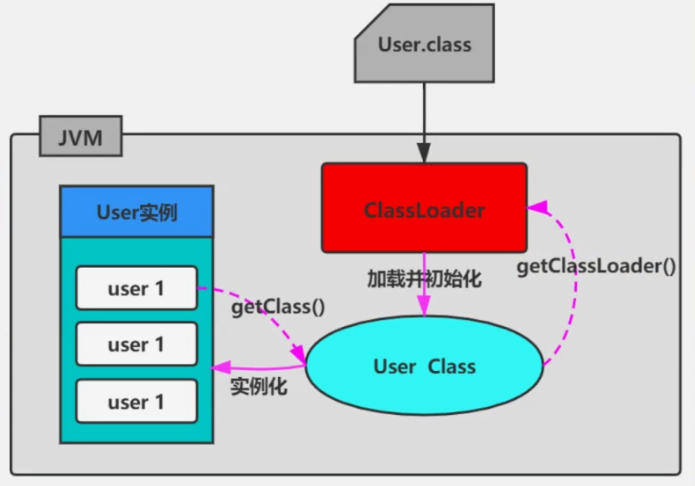

  类加载器最早出现在Java1.0版本中，那个时候只是为了单纯满足Java Applet应用而研发出来。但如今类加载器却在OSGi、字节码加密解密领域大放异彩。这主要归功于Java虚拟机的设计者们当初在设计类加载器的时候，并没有考虑将它绑定在JVM内部，这样做的好处就是能够更加灵活和动态执行类加载操作。

---

* 大厂面试题
  * ==蚂蚁金服​==
    * 深入分析ClassLoader，双亲委派机制
    * 类加载器的双亲委派模型是什么？
    * 一面：双亲委派机制及使用原因
  * ==百度==
    * 都有哪些类加载器，这些类加载器都加载哪些文件？
    * 手写一个类加载器Demo
    * Class的forName("java.lang.String") 和 Class的getClassLoader()的loadClass("java.lang.String")有什么区别？
  * ==腾讯==
    * 什么是双亲委派机制？
    * 类加载器有哪些？
  * ==小米==
    * 双亲委派机制介绍一下
  * ==滴滴==
    * 简单说一下你了解的类加载器
    * 一面：讲一下双亲委派模型，以及其优点
  * ==字节跳动==
    * 什么是类加载器，类加载器有哪些？
  * ==京东==
    * 类加载器的双亲委派模型是什么？
    * 双亲委派机制可以打破吗？为什么？

---

* **类的加载分类：显示加载 vs 隐式加载**

  class文件的显示加载与隐式加载的方式是 指JVM加载class文件到内存的方式。

  * 显示加载指的是在代码中通过调用ClassLoader加载class对象，如直接使用Class.forName(name)或this.getClass().getClassLoader().loadClass()加载class对象。
  * 隐式加载则不直接在代码中调用ClassLoader的方法加载class对象，而是通过虚拟机自动加载到内存中，如在加载某个类的class文件时，该类的class文件中引用了另一个类的对象，此时额外引用的类将通过JVM自动被加载到内存中。

  在日常开发以上两种方式一般会混合使用。

  ```java
  package com.atguigu.java;
  
  public class User {
      private int id;
  
      @Override
      public String toString() {
          return "User{" +
                  "id=" + id +
                  '}';
      }
  }
  ```

  ```java
  public class UserTest {
      public static void main(String[] args) {
          User user = new User();  // 隐式加载
  
          try {
              Class clazz = Class.forName("com.atguigu.java.User");  // 显式加载
              ClassLoader.getSystemClassLoader().loadClass("com.atguigu.java.User");  // 显式加载
          } catch (ClassNotFoundException e) {
              e.printStackTrace();
          }
      }
  }
  ```

---

* 类加载器的必要性

  一般情况下，Java开发人员并不需要在程序中显示地使用类加载器，但是了解类加载器的加载机制却显得至关重要。从以下几个方面说：

  * 避免在开发中遇到java.lang.ClassNotFoundException异常或java.lang.NoClassDefFoundError异常时手足无措。只有了解类加载器的加载机制才能够在出现异常的时候快速的根据错误日志定位问题和解决问题。
  * 需要支持类的动态加载或需要对编译后的字节码文件进行加密操作时，就需要与类加载器打交道了。
  * 开发人员可以在程序中编写自定义类加载器重新定义类的加载规则，一遍实现一些自定义的处理逻辑。

---

* **何为类的唯一性？**

  对于任意一个类，<font color=red>**都需要由加载它的类加载器和这个类本身一同确认其在Java虚拟机中的唯一性。**</font>每一个类加载器，都拥有一个独立的类名称空间：<font color=red>**比较两个类是否相等，只有在这两个类是由同一个类加载器加载的前提下才有意义。**</font>否则，即使这两个类源自于同一个Class文件，被同一个虚拟机加载，只要加载他们的类加载器不同，那么这两个类就肯定不相同。

* 命名空间

  * 每个类加载器都有自己的命名空间，命名空间由该加载器及及所有父加载器所加载的类组成
  * 在同一命名空间中，不会出现类的完整名字（包括类的包名）相同的两个类
  * 在不同的命名空间中，有可能出现类的完整名字（包括类的包名）相同的两个类

  在大型应用中，我们往往借助这一特性，来运行同一个类的不同版本。

  ```java
  public class UserClassLoader extends ClassLoader {
      private String rootDir;
  
      public UserClassLoader(String rootDir) {
          this.rootDir = rootDir;
      }
  
      /**
       * 编写findClass方法的逻辑
       */
      @Override
      protected Class<?> findClass(String name) throws ClassNotFoundException {
          // 获取类的class文件字节数组
          byte[] classData = getClassData(name);
          if (classData == null) {
              throw new ClassNotFoundException();
          } else {
              // 直接生成class对象
              return defineClass(name, classData, 0, classData.length);
          }
      }
  
      /**
       * 编写获取class文件并转换为字节码流的逻辑 * @param className * @return
       */
      private byte[] getClassData(String className) {
          // 读取类文件的字节
          String path = classNameToPath(className);
          try {
              InputStream ins = new FileInputStream(path);
              ByteArrayOutputStream baos = new ByteArrayOutputStream();
              byte[] buffer = new byte[1024];
              int len = 0;
              // 读取类文件的字节码
              while ((len = ins.read(buffer)) != -1) {
                  baos.write(buffer, 0, len);
              }
              return baos.toByteArray();
          } catch (IOException e) {
              e.printStackTrace();
          }
          return null;
      }
  
      /**
       * 类文件的完全路径
       */
      private String classNameToPath(String className) {
          return rootDir + "\\" + className.replace('.', '\\') + ".class";
      }
  
      public static void main(String[] args) {
          String rootDir = "D:\\code\\workspace_idea5\\JVMDemo1\\chapter04\\src\\";
  
          try {
              // 创建自定义的类的加载器1
              UserClassLoader loader1 = new UserClassLoader(rootDir);
              Class clazz1 = loader1.findClass("com.atguigu.java.User");
  
              // 创建自定义的类的加载器2
              UserClassLoader loader2 = new UserClassLoader(rootDir);
              Class clazz2 = loader2.findClass("com.atguigu.java.User");
  
              System.out.println(clazz1 == clazz2);  // clazz1 与 clazz2对应了不同的类模板结构。
              System.out.println(clazz1.getClassLoader());
              System.out.println(clazz2.getClassLoader());
  
              //######################
              Class clazz3 = ClassLoader.getSystemClassLoader().loadClass("com.atguigu.java.User");
              System.out.println(clazz3.getClassLoader());
  
              System.out.println(clazz1.getClassLoader().getParent());
  
          } catch (ClassNotFoundException e) {
              e.printStackTrace();
          }
      }
  }
  ```

---

* 类加载机制的基本特征

  通常类加载机制有三个基本特征

  * 双亲委派模型。但不是所有类加载器都遵循这个模型，有的时候，启动类加载器所加载的类型，是可能要加载用户代码的，比如JDK内部的ServiceProvider/ServiceLoader机制，用户可以在标准API框架上，提供自己的实现，JDK也需要提供这些默认的参考实现。例如Java中的 JNDI、JDBC、文件系统、Cipher等很多方面，都是利用这种机制，这种情况就不会用双亲委派机制，而是利用所谓的上下文加载器。
  * 可见性，子类加载器可以访问父类加载器加载的类型，但是反过来是不允许的。不然，因为缺少必要的隔离，我们就没有办法利用类加载器实现容器的逻辑。
  * 单一性。由于父加载器的类型对于子加载器时可见的，所以父加载器加载过的类型，就不会在子加载器中重复加载。但是注意，类加载器“邻居”间，同一类型仍然可以被加载多次，因为相互并不可见。


## 2 类的加载器

* 类的加载器分类

  * JVM支持两种类型的类加载器，分别是<font color=red>**引导类加载器（Bootstrap ClassLoader）**</font>和<font color=red>**自定义类加载器（User-Defined ClassLoader）**</font>

  * 从概念上讲，自定义类加载器是指程序中由开发人员自定义的一类加载器，然而Java虚拟机规范却并没有这么定义，而是<font color=red>**将所有派生与抽象类ClassLoader的类加载器都划分为自定义类加载器**</font>。

  * 无论类加载器的类型如何划分，在程序中我们最常见的类加载器始终只有三个，如下图：

    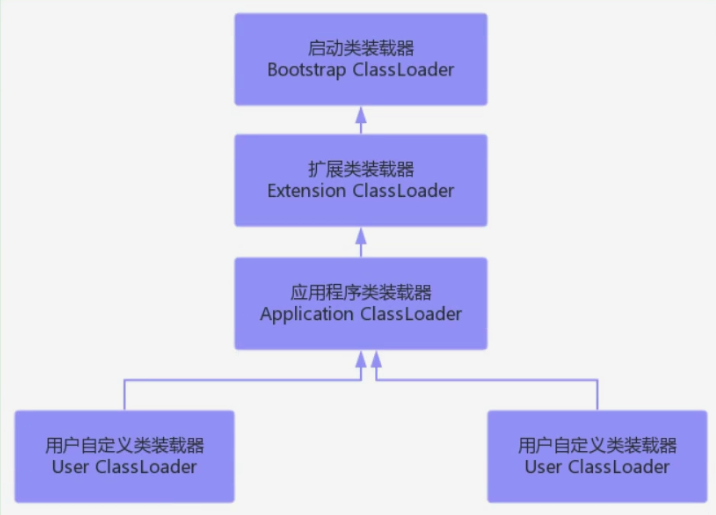

    * 除了顶层的启动类加载器外，其余的类加载器都应该有自己的“父类”加载器。

    * 不同类加载器看似继承（Inheritance）关系，实际上是包含关系。在下层加载器中，包含着上层加载器的引用。类似于下面的方式：

      ```java
      class ClassLoader {
          ClassLoader parent;  // 父类加载器
          
          public ClassLoader(ClassLoader parent) {
              this.parent = parent;
          }
      }
      class ParentClassLoader extends ClassLoader{
          public ParentClassLoader(ClassLoader parent) {
              super(parent);
          }
      }
      
      class ChildClassLoader extends ClassLoader{
          public ChildClassLoader(ClassLoader parent) {  // parent = new ParentClassLoader();
              super(parent);
          }
      }
      ```

---

* ==启动类加载器（引导类加载器，Bootstrap ClassLoader）==

  * 这个类加载使用<font color=red>**C/C++语言实现的**</font>，嵌套在JVM内部
  * 它用来加载Java核心类库(JAVA_HOME/jre/lib/rt.jar、resources.jar或sun.boot.class.path路径下的内容)，用于提供JVM自身需要的类
  * 并不继承自java.lang.ClassLoader，没有父加载器
  * 加载扩展类和应用程序加载器，并指定为他们的父类加载器
  * 出于安全考虑，Bootstrap启动类加载器只加载包名为java、javax、sun等开头的类

  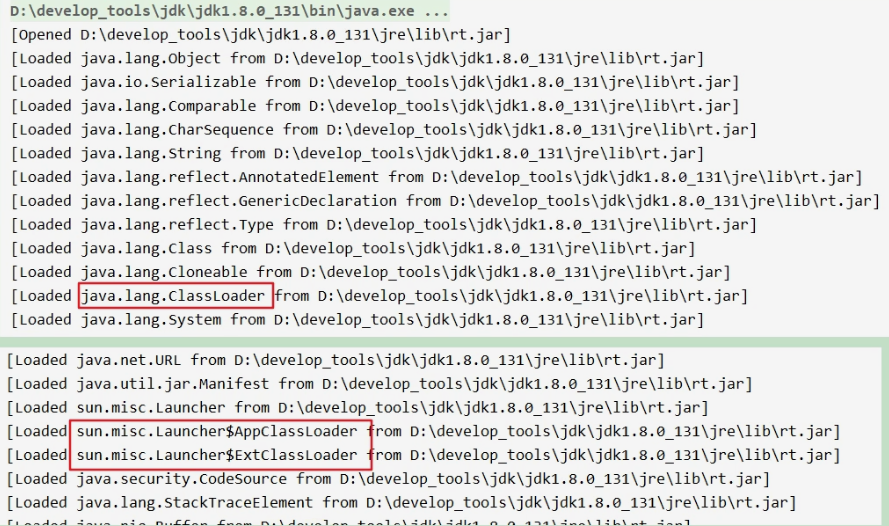

  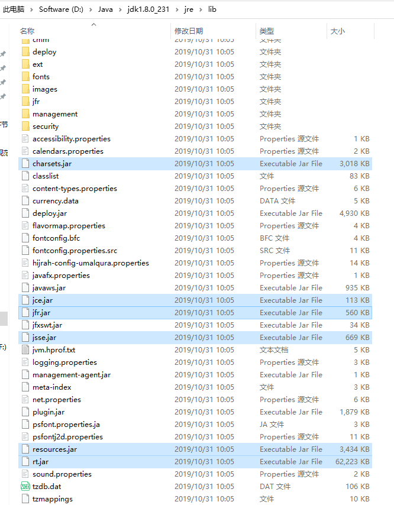

  使用-XX:+TraceClassLoading参数得到。

  * 启动类加载器使用C++编写的？Yes!
    * C/C++：指针函数&函数指针、C++支持多继承、更加高效
    * Java：由C++演变而来，(C++)--版，单继承

---

* ==扩展类加载器（Extension ClassLoader）==

  * <font color=red>**Java语言编写**</font>，由sun.misc.Launcher$ExtClassLoader实现。

  * <font color=red>**派生于ClassLoader类**</font>

  * 父类加载器为启动类加载器

  * 从java.ext.dirs系统属性所指定的目录加载类库，或从JDK安装目录的jre/lib/ext子目录（扩展目录）下加载类库。<font color=red>**如果用户创建的JAR放在此目录下，也会自动由扩展类加载器加载**</font>。

    

    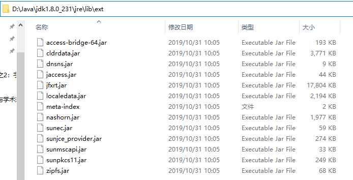

---

* ==应用程序类加载器（系统类加载器，AppClassLoader）==
  * java语言编写，由sun.misc.Launcher$AppClassLoader实现。
  * <font color=red>**派生于ClassLoader类**</font>
  * 父类加载器为启动类加载器
  * 它负责加载环境变量classpath或系统属性java.class.path指定路径下的类库
  * <font color=red>**该类加载是程序中默认的类加载器**</font>，一般来说，Java应用的类都是由它来完成加载
  * 通过ClassLoader.getSystemClassLoader()方法可以获取到该类加载器

---

* ==用户自定义类加载器==
  * 在Java日常应用程序开发中，类的加载几乎是由上述3种加载器相互配合执行的，在必要时，我们还可以自定义类加载器，来定制类的加载方式。
  * 体现Java语言强大生命力和巨大魅力的关键因素之一便是：Java开发者可以自定义类加载器来实现类库的动态加载，加载源可以是本地的JAR包，也可以是网络上的远程资源。
  * <font color=red>**通过类加载器可以实现非常绝妙的插件机制**</font>，这方面的实际应用举不胜举。例如，著名的OSGI组件框架，再如Eclipse的插件机制。类加载器为应用程序提供了一种动态增加新功能的机制，这种机制无需重新打包发布应用程序就能实现。
  * 同时，<font color=red>**自定义加载器能够实现应用隔离**</font>，例如Tomcat，Spring等中间件和组件框架都在内部实现了自定义的加载器，并通过自定义加载器隔离不同的组件模块。这种机制比C/C++程序要好太多，想不修改C/C++程序就能为其新增功能，几乎是不可能的，仅仅一个兼容性便能阻挡住所有美好的设想。
  * 自定义类加载器通常需要继承于ClassLoader（但是注意自定义类加载器.getParent()是系统类加载器AppClassLoader）。


## 3 测试不同的类加载器

* 每个Class对象都会包含一个定义它的ClassLoader的一个引用

* 获取ClassLoader的途径：

  * 获得当前类的ClassLoader：

    ```java
    clazz.getClassLoader();
    ```

  * 获得当前线程上下文的ClassLoader：

    ```java
    Thread.currentThread().getContextClassLoader();
    ```

  * 获得系统的ClassLoader：

    ```java
    ClassLoader.getSystemClassLoader();
    ```

  **说明：**

  站在程序员的角度看，引导加载器与另外两种类加载器（系统类加载器 和 扩展类加载器）并不是同一个层次意义上的加载器，引导类加载器是使用C++语言编写的，而另外两类加载器则是使用Java语言编写的。由于引导类加载器压根儿就不是一个Java类，因此Java程序中只能打印出空值（null）。

* 数组类的Class对象，不是由类加载器去创建的。对于数组类的类加载器来说，是通过Class.getClassLoader()返回的，与数组当中元素类型的类加载器时一样的；如果数组当中的元素类型是基本数据类型，数组类是没有加载器的。

```java
public class ClassLoaderTest1 {
    public static void main(String[] args) {
        // 获取系统该类加载器
        ClassLoader systemClassLoader = ClassLoader.getSystemClassLoader();
        System.out.println(systemClassLoader);  // sun.misc.Launcher$AppClassLoader@18b4aac2
        // 获取扩展类加载器
        ClassLoader extClassLoader = systemClassLoader.getParent();
        System.out.println(extClassLoader);  // sun.misc.Launcher$ExtClassLoader@1540e19d
        // 试图获取引导类加载器：失败
        ClassLoader bootstrapClassLoader = extClassLoader.getParent();
        System.out.println(bootstrapClassLoader);  // null

        // ###########################
        try {
            ClassLoader classLoader = Class.forName("java.lang.String").getClassLoader();
            System.out.println(classLoader);
            // 自定义的类默认使用系统类加载器
            ClassLoader classLoader1 = Class.forName("com.atguigu.java.ClassLoaderTest1").getClassLoader();
            System.out.println(classLoader1);

            // 关于数组类型的加载:使用的类的加载器与数组元素的类的加载器相同
            String[] arrStr = new String[10];
            System.out.println(arrStr.getClass().getClassLoader());  // null:表示使用的是引导类加载器

            ClassLoaderTest1[] arr1 = new ClassLoaderTest1[10];
            System.out.println(arr1.getClass().getClassLoader());  // sun.misc.Launcher$AppClassLoader@18b4aac2

            int[] arr2 = new int[10];
            System.out.println(arr2.getClass().getClassLoader());  // null:不需要类的加载器


            System.out.println(Thread.currentThread().getContextClassLoader());
        } catch (ClassNotFoundException e) {
            e.printStackTrace();
        }
    }
}
```


## 4 ClassLoader源码解析

* ClassLoader与现有类加载器的关系

  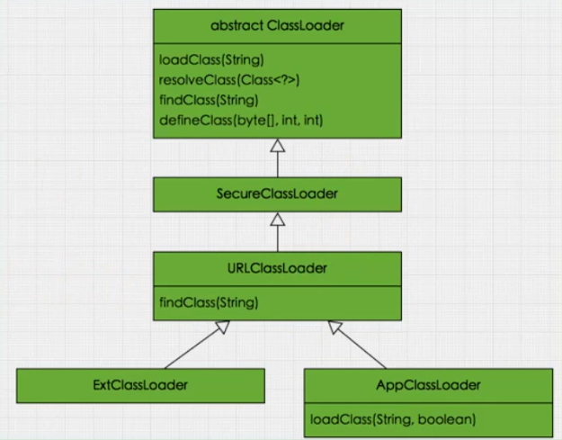

  除了以上虚拟机自带的加载器外，用户还可以定制自己的类加载器。Java提供了抽象类java.lang.ClassLoader，所有用户自定义的类加载器都应该继承ClassLoader类。

---

* 抽象类ClassLoader的主要方法

  * ```java
    public final ClassLoader getParent();
    ```

    返回该类的超类加载器

  * ```java
    public Class<?> loadClass(String name) throws ClassNotFoundException
    ```

    加载名称为name的类，返回结果为java.lang.Class类的实例。如果找不到类，则返回ClassNotFoundException异常。==该方法中的逻辑就是双亲委派模式的实现==。

    测试代码：

    ```java
    ClassLoader.getSystemClassLoader().loadClass("com.atguigu.java.User");
    ```

    源码剖析：

    ```java
    public Class<?> loadClass(String name) throws ClassNotFoundException {
        return loadClass(name, false);
    }
    
    protected Class<?> loadClass(String name, boolean resolve)  // resolve: true-加载class的同时进行解析操作
        throws ClassNotFoundException
    {
        synchronized (getClassLoadingLock(name)) {  // 同步操作，保证只能加载一次
            // 首先，在缓存中判断是否已经加载过同名的类
            Class<?> c = findLoadedClass(name);
            if (c == null) {
                long t0 = System.nanoTime();
                try {
                    // 获取当前类的父类加载器
                    if (parent != null) {
                        // 如果存在父类加载器，则调用父类加载器进行类的加载
                        c = parent.loadClass(name, false);
                    } else {  // parent为null：父类加载器时引导（启动）类加载器
                        c = findBootstrapClassOrNull(name);
                    }
                } catch (ClassNotFoundException e) {
                    // ClassNotFoundException thrown if class not found
                    // from the non-null parent class loader
                }
    
                if (c == null) {  // 当前类的加载器的父类加载器未加载此类 or 当前类的加载器未加载此类
                    // 调用当前ClassLoader 的 findClass()
                    long t1 = System.nanoTime();
                    c = findClass(name);
    
                    // this is the defining class loader; record the stats
                    sun.misc.PerfCounter.getParentDelegationTime().addTime(t1 - t0);
                    sun.misc.PerfCounter.getFindClassTime().addElapsedTimeFrom(t1);
                    sun.misc.PerfCounter.getFindClasses().increment();
                }
            }
            if (resolve) {  // 是否解析
                resolveClass(c);
            }
            return c;
        }
    }
    ```

  * ```java
    protected Class<?> findClass(String name) throws ClassNotFoundException
    ```

    该类在URLClassLoader中被重写，作用是查找二进制名称为name的类，返回结果为java.lang.Class类的实例。这是一个受保护的方法，JVM鼓励我们重写此方法，需要自定义加载器遵循双亲委派机制，该方法会在检查完父类加载器之后被loadClass()方法调用。

    在JDK1.2之前，在自定义类加载时，总会去继承ClassLoader类并重写loadClass方法，从而实现自定义的类加载类。但是在JDK1.2之后不再建议用户去覆盖loadClass()方法，而是建议把自定义的类加载逻辑写在findClass()方法中，从前面的分析可知，findClass()方法是在loadClass()方法中被调用的，当loadClass()方法中的父类加载器失败之后，则会调用自己的findClass()方法来完成类加载，这样就可以保证自定义的类加载器也符合双亲委托模式。

    需要注意的是ClassLoader类中并没有实现findClass()方法的具体代码逻辑，取而代之的是抛出ClassNotFoundException异常，同时应该知道的是findClass方法通常是和defineClass方法一起使用的。<font color=red>**一般情况下，在自定义类加载器时，会直接覆盖ClassLoader的findClass()方法并编写加载规则，取得要加载类的字节码后转换成流，然后调用defineClass()方法生成类的Class对象**</font>。

    URLClassLoader中被重写findClass源码：

    ```java
    protected Class<?> findClass(final String name)
        throws ClassNotFoundException
    {
        final Class<?> result;
        try {
            result = AccessController.doPrivileged(
                new PrivilegedExceptionAction<Class<?>>() {
                    public Class<?> run() throws ClassNotFoundException {
                        String path = name.replace('.', '/').concat(".class");
                        Resource res = ucp.getResource(path, false);
                        if (res != null) {
                            try {
                                return defineClass(name, res);
                            } catch (IOException e) {
                                throw new ClassNotFoundException(name, e);
                            }
                        } else {
                            return null;
                        }
                    }
                }, acc);
        } catch (java.security.PrivilegedActionException pae) {
            throw (ClassNotFoundException) pae.getException();
        }
        if (result == null) {
            throw new ClassNotFoundException(name);
        }
        return result;
    }
    ```

  * ```java
    protected final Class<?> defineClass(String name, byte[] b, int off, int len)
    ```

    根据给定的字节数组 b 转换为Class的实例，off和len参数表示实际Class信息在byte数组中的位置和长度，其中byte数组 b 是ClassLoader从外部获取的。这是受保护的方法，只有在自定义ClassLoader子类中可以使用。

    defineClass() 方法是用来将byte字节流解析成JVM能够识别的Class对象（ClassLoader中已经实现该方法的逻辑），通过这个方法不仅能够通过class文件实例化class对象，也可以通过其他方式实例化class对象，如通过网络接收一个类的字节码，然后转换为byte字节流创建对应的Class对象。

    <font color=red>**defineClass()方法通常与findClass()方法一起适用，一般情况下，在自定义类加载器时，会直接覆盖ClassLoader的findClass()方法并编写加载规则，取得要加载类的字节码后转换成流，然后调用defineClass()方法生成类的Class对象**</font>。

  * ```java
    protected final void resolveClass(Class<?> c)
    ```

    链接指定的一个Java类。适用该方法可以使类的Class对象创建完成的同时也被解析

  * ```java
    protected final Class<?> findLoadedClass(String name)
    ```

    查找名称为name的已经被加载过的类，返回结果为java.lang.Class类的实例。这个方法是final方法，无法被修改。

  * ```java
    private final ClassLoader parent;
    ```

    它也是一个ClassLoader的实例，这个字段所表示的ClassLoader也称为这个ClassLoader的双亲。在类加载的过程中，ClassLoader可能会将某些请求交予自己的双亲处理。

---

* **SecureClassLoader 与 URLClassLoader**

  * 接着SecureClassLoader 扩展了 ClassLoader，新增了几个与使用相关的代码源（对代码源的位置及其整数的验证）和权限定义类验证（主要指对class源码的访问权限）的方法，一般我们不会直接跟这个类打交道，更多的是与它的子类URLClassLoader有所关联。

  * 前面说过，ClassLoader是一个抽象类，很多方法是空的没有实现，比如 findClass()、findResource()等。而URLClassLoader这个实现类提供了具体的实现。并且新增了URLClassPath类协助取得Class字节码流等功能。<font color=red>**在编写自定义类加载器时，如果没有太过于复杂的需求，可以直接继承URLClassLoader类，**</font>这样就可以避免自己去编写findClass()方法及其获取字节流的方式，使自定义类加载器编写更加简洁。

    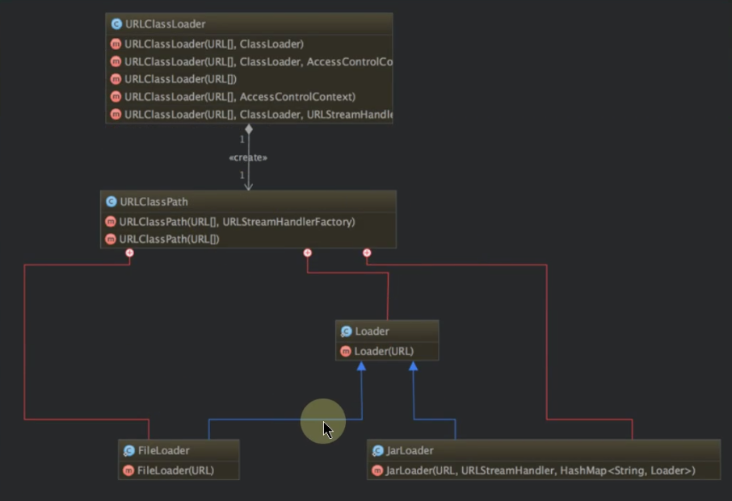

---

* **ExtClassLoader 与 AppClassLoader**

  * 了解完URLClassLoader后接着看看剩余的两个类加载器，即扩展类加载器ExtClassLoader和系统类加载器AppClassLoader，这两个类都继承自URLClassLoader，是sun.misc.Launcher的静态内部类。sun.misc.Launcher主要被系统用于启动主应用程序，ExtClassLoader和AppClassLoader都是由sun.misc.Launcher创建的，其类主要类结构如下：

    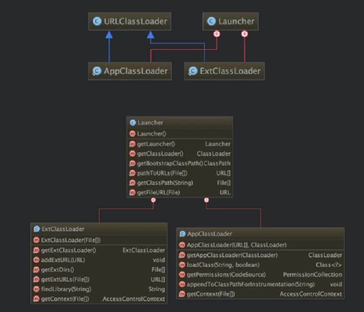

    我们发现ExtClassLoader并没有重写loadClass()方法，这足以说明其遵循双亲委派模式，而AppClassLoader重载了loadClass()方法，但是最终调用的还是父类loadClass()方法，因此依然遵守双亲委派模式。

---

* Class.forName() 与 ClassLoader.loadClass()：
  * Class.forName()：是一个静态方法，最宠用的是Class.forName(String className); 根据传入的类的全限定名返回一个Class对象。<font color=red>**该方法在将Class文件加载到内存的同时，会执行类的初始化（主动使用）。**</font>如：Class.forName("com.atguigu.java.helloWorld");
  * ClassLoader.loadClass()：这是一个实例方法，需要一个ClassLoader对象来调用该方法。<font color=red>**该方法在将Class文件加载到内存的同时，并不会执行类的初始化（被动使用），直到这个类第一次使用时才进行初始化。**</font>该方法因为需要得到一个ClassLoader对象，所以可以根据需要制定使用哪个类加载器，如ClassLoader cl = ......; cl.loadClass("com.atguigu.java.helloWorld");


## 5 双亲委派模型

类加载器用来把类加载到Java虚拟机中。从JDK1.2版本开始，类的加载过程采用双亲委派机制，这种机制能更好地保证Java平台的安全。

* **定义**

  如果一个类加载器在接到加载类的请求时，它首先不会自己尝试去加载这个类，而是把这个请求任务委托给父类加载器去完成，一次递归，如果父类加载器可以完成类加载任务，就成功返回。只有父类加载器无法完成此加载任务时，才自己去加载。

* **本质**

  规定了类加载的顺序是：引导类加载器，若加载不到，由扩展类加载器加载，若还加载不到，才会由系统类加载器或自定义的类加载器进行加载。

  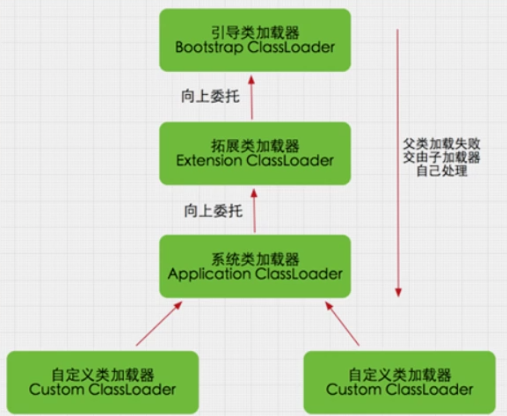

  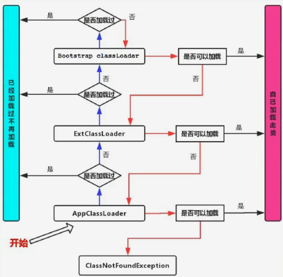

---

* **双亲委派机制的优势**

  * 避免类的重复加载，确保一个类的全局唯一性

    <font color=red>**Java类随着它的类加载器一起具备了一种带有优先级的层次关系，通过这种层次关系可以避免类的重复加载，**</font>当父类已经加载了该类时，就没有必要子ClassLoader再加载一次。

  * 保护程序安全，防止核心API被随意篡改

* **代码支持**

  双亲委派机制在java.lang.ClassLoader.loadClass(String, boolean)接口中体现。该接口的逻辑如下：

  （1）先在当前加载器的缓存中查找有无目标类，如果有，直接返回。

  （2）判断当前加载器的父加载器是否为空，如果不为空，则调用parent.loadClass(name, false)接口进行加载。

  （3）反之，如果当前加载器的父类加载器为空，则调用findBootstrapClassOrNull(name)接口，让引导类加载器进行加载。

  （4）如果通过以上3条路径都没能成功加载，则调用findClass(name)接口进行加载。该接口最终会调用java.lang.ClassLoader接口的defineClass系列的native接口加载目标类。

  双亲委派模型就隐藏在这第 2 和第 3 步中。

* **举例**

  假设当前加载的是java.lang.Object这个类，很显然，该类属于JDK中核心的不能再核心的一个类，因此一定只能由引导类加载器进行加载。当JVM准备加载java.lang.Object时，JVM默认会使用系统类加载器去加载，按照上面4步加载的逻辑，在第1 步从系统类的缓存中肯定查找不到该类，于是进入第 2 步。由于从系统类加载器的父加载器是扩展类加载器，于是扩展类加载器继续从第 1 步开始重复。由于扩展类加载器的缓存中也一定查不到该类。因此进入第 2 步。扩展类的加载器是null，因此系统调用findClass(String)，最终通过引导类加载器进行加载。

* **思考**

  如果在自定义的类加载器中重写java.lang.ClassLoader.loadClass(String)或java.lang.ClassLoader.loadClass(String， boolean)方法，抹去其中的双亲委派机制，仅保留上面这 4 步中的第 1 步和第 4 步，那么是不是就能够加载核心类库了呢？

  这也不行！因为JDK还未核心类库提供了一层保护机制。不管是自定义的类加载器，还是系统类加载器亦或是扩展类加载器，最终都必须调用java.lang.ClassLoader.defineClass(String, byte[], int, int, ProtectionDomin)方法，而该方法会执行<font color=red>**preDefineClass()接口**</font>，该接口中提供了对JDK核心类库的保护。

* **双亲委派机制的弊端**

  检查类是否加载的委托过程是单向的，这个方式虽然从结构上说比较清晰，使各个ClassLoader的职责非常明确，但是同时会带来一个问题，即顶层的ClassLoader无法访问底层的ClassLoader所加载的类。

  通常情况下，启动类加载器中的类为系统核心类，包括一些重要的系统接口，而在应用类加载器中，为应用类。按照这种模式，<font color=red>**应用类访问系统类自然没有问题，但是系统类访问应用类就会出现问题。**</font>比如在系统类中提供了一个接口，该接口需要在应用类中得以实现，该接口需要在应用类中得以实现，改接口还绑定一个工厂方法，用于创建改接口的实例，而接口和工厂方法都在启动类加载器中。这是，就会出现该工厂方法无法创建由应用（系统）类加载器加载的应用实例的问题。

* **结论**

  <font color=red>**由于Java虚拟机规范并没有明确要求类加载器的加载一定要使用双亲委派模型，只是建议采用这种方式而已。**</font>

  比如在Tomcat中，类加载器所采用的加载机制和传统的双亲委派模型有一定区别，当缺省的类加载器接收到一个类的加载任务时，首先会由它自行加载，当它加载失败时，才会将类的加载任务委派给它的超类加载器去执行，这同时也是Servlet规范推荐的一种做法。

---

* **破坏双亲委派机制**

  双亲委派模型并不是一个具有强制性约束的模型，而是Java设计者推荐给开发者们的类加载器实现方式。

  在Java的世界中大部分的类加载器都遵循这个模型，但也有例外的情况，知道Java模块化出现为止，双亲委派模型主要出现过 3 次较大规模“被破坏”的情况。

  * 破坏双亲委派机制1

    双亲委派模型的第一次“被破坏”其实发生在双亲委派模型出现之前------即JDK1.2面世以前的“远古”时代。

    由于双亲委派模型在JDK1.2之后才被引入，但是类加载器的概念和抽象类java.lang.ClassLoader则在Java的第一个版本中就已经存在，面对已经存在的用户自定义类加载器的代码，Java设计者们引入双亲委派机制模型时不得不做出一些妥协，<font color=red>**为了兼容这些已有代码，无法再以技术手段避免loadClass()被子类覆盖的可能性**</font>，只能在JDK1.2之后的java.lang.ClassLoader中添加一个新的protected方法findClass()，并引导用户编写的类加载器逻辑时尽可能去重写这个方法，而不是在loadClass()中编写代码。上节我们已经分析过loadClass()方法，双亲委派的具体逻辑就实现在这里面，按照loadClass()方法的逻辑，如果父类加载失败，会自动调用自己的findClass()方法来完成加载，这样既不影响用户按照自己的意愿去加载类，又可以保证新写出的类加载器时符合双亲委派规则的。

  * 破坏双亲委派机制2：线程上下文类加载器

    双亲委派模型的第二次“被破坏”是由这个模型的缺陷导致的，双亲委派很好的解决了各个类加载器协作时基础类型的一致性问题（<font color=red>**越基础的类由越上层的加载器加载**</font>），基础类型之所以被称为“基础”，是因为他们总是作为被用户代码继承、调用的Api存在，但程序设计往往没有绝对不变的完美规则，<font color=red>**如果有基础类型又要调用用户的代码，那该怎么办呢？**</font>

    这并非是不可能出现的事情，一个典型的例子便是JNDI服务，JNDI现在已经是Java的标准服务，它的代码由启动类加载器完成加载（在JDK1.3时加入到rt.jar的），肯定属于Java很基础的类型了。但JNDI存在的目的就是对资源进行查找和集中管理，它需要调用由其他厂商实现并部署在应用程序的ClassPath下的JNDI服务提供者接口（Service Provider Interface，SPI）的代码，现在问题来了，<font color=red>**启动类加载器是绝不可能认识、加载这些代码的，那该怎么办？**</font>（SPI：在Java平台中，通常把核心类rt.jar中提供外部服务、可由应用层自行实现的接口称为SPI）

    为了解决这个困境，Java设计团队只好引入一个不太优雅的设计：<font color=red>**线程上下文类加载器（Thread Context ClassLoader）**</font>。这个类加载器可以通过java.lang.Thread类的setContextClassLoader()方法进行设置，如果创建线程时还未设置，它将会从父类线程中继承一个，如果在应用程序的全局范围内都没有设置的话，那这个类加载器默认就是应用程序类加载器。

    有了线程上下文类加载器，程序就可以做一些“舞弊”的事情了：JNDI服务使用这个线程上下文类加载器去加载所需要的SPI服务代码，<font color=red>**这是一种父类加载器去请求子类加载器完成类加载的行为，这种行为实际上是打通了双亲委派模型的层次结构来你想使用类加载器，已经违背了双亲委派模型的一般性原则**</font>，但也是无可奈何的事情。Java中涉及SPI的加载基本上都采用这种方式来完成，例如JNDI、JDBC、JCE、JAXB和JBI等。不过，当SPI的服务提供者多于一个的时候，代码就只能根据具体提供者的类型来硬编码判断，为了消除这种极不优雅的实现方式，在JDKK 6 时，JDK提供了一种相对合理的解决方案。

    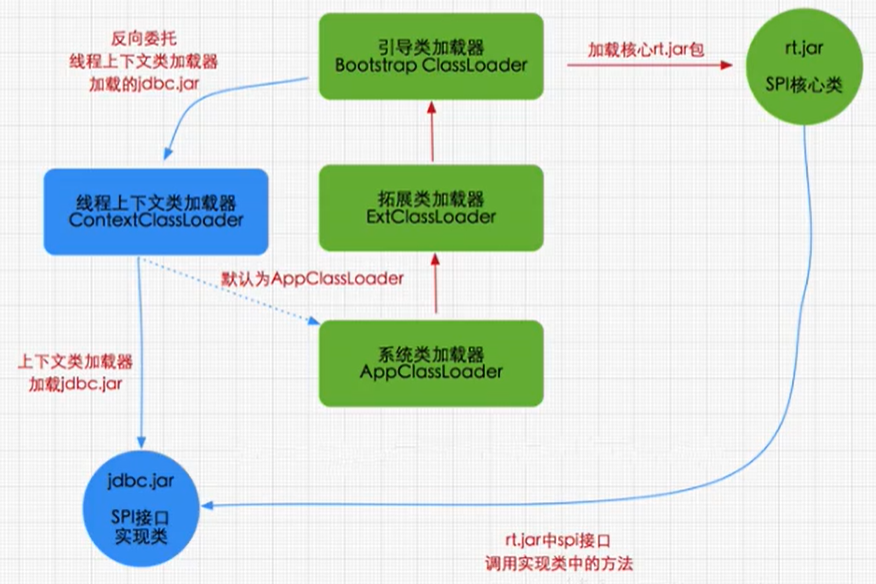

    默认上下文加载器就是应用（系统）类加载器，这样以上下文加载器为终结，使得启动类加载器中的代码就可以访问应用（系统）类加载器中的类。

  * 破坏双亲委派机制3

    实现代码的热替换。在OSGi环境下，类加载器不再是双亲委派模型推进的树状结构，而是进一步发展为更加复杂的<font color=red>**网状结构**</font>。

    当收到类加载请求时，OSGi将按照下面的顺序进行类搜索：

    <font color=red>**1）将以java.*开头的类，委派给父类加载器加载。**</font>

    <font color=red>**2）否则，将委派列表名单中的类，委派给父类加载器加载。**</font>

    3）否则，将Import列表中的类，委派给Export这个类的Bundle的类加载器加载。

    4）否则，查找当前Bundle的ClassPath，使用自己的类加载器加载。

    5）否则，查找类是否在自己的Fragment Bundle中，如果在，则委派给Fragment Bundle的类加载器加载。

    6）否则，查找Dynamic Import列表中的Bundle，委派给对应Bundle的类加载器加载。

    7）否则，类查找失败

    说明：这里开头两点仍然符合双亲委派模型原则的行为，其余的类查找都是在平级的类加载器中进行的。

* 小节：

  这里，我们使用了“被破坏”这个词来形容上述不符合双亲委派模型原则的行为，但<font color=red>**这里“被破坏”并不一定是带有贬义的。只要有明确的目的和充分的理由，突破就有原则无疑是一种创新。**</font>

  正如：OSGi中的类加载器的设计不符合传统的双亲委派模型的类加载器架构，且业界对其为了实现热部署而带来的额外的高复杂度还存在不少争议，但对这方面有了解的技术人员基本还能达成一个共识，认为**OSGi中对类加载器的运用是值得学习的，完全弄懂了OSGi的实现，就算掌握了类加载器的精髓**。

---

* **热替换的实现**

  热替换是指程序在运行过程中，不停止服务，只通过替换程序文件来修改程序的行为。<font color=red>**热替换的关键需求在于服务不能中断，修改必须立即表现在运行的系统之中。**</font>基本上大部分脚本语言都是天生支持热替换的，比如：PHP，只要替换了PHP文件，这种改动就会立即生效，无需重启Web服务器。

  但是对于Java来说，热替换并非天生就支持，如果一个类已经加载到系统中，通过修改类文件，并无法让系统再来加载并重新定义这个类。因此，在Java中实现这一功能的一个可行的方法就是灵活运用ClassLoader。

  注意：由不同ClassLoader加载的同名类属于不同的类型，不能相互转换和兼容。即两个不同的ClassLoader加载同一个类，在虚拟机内部，会认为这 2 个类是完全不同的。

  根据这个特点，可以用来模拟热替换的实现，基本思路如下图所示：

  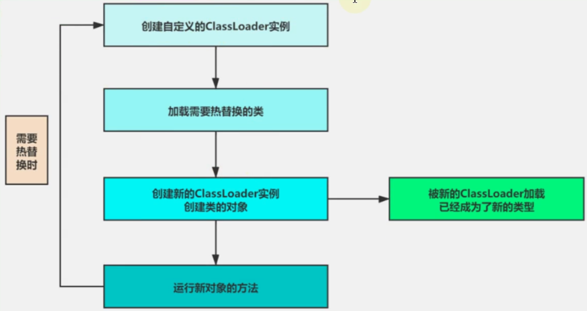

  例子：

  ```java
  // 自定义类的加载器
  public class MyClassLoader extends ClassLoader {
      private String rootDir;
  
      public MyClassLoader(String rootDir) {
          this.rootDir = rootDir;
      }
  
      protected Class<?> findClass(String className) throws ClassNotFoundException {
          Class clazz = this.findLoadedClass(className);
          FileChannel fileChannel = null;
          WritableByteChannel outChannel = null;
          if (null == clazz) {
              try {
                  String classFile = getClassFile(className);
                  FileInputStream fis = new FileInputStream(classFile);
                  fileChannel = fis.getChannel();
                  ByteArrayOutputStream baos = new ByteArrayOutputStream();
                  outChannel = Channels.newChannel(baos);
                  ByteBuffer buffer = ByteBuffer.allocateDirect(1024);
                  while (true) {
                      int i = fileChannel.read(buffer);
                      if (i == 0 || i == -1) {
                          break;
                      }
                      buffer.flip();
                      outChannel.write(buffer);
                      buffer.clear();
                  }
  
                  byte[] bytes = baos.toByteArray();
                  clazz = defineClass(className, bytes, 0, bytes.length);
  
  
              } catch (FileNotFoundException e) {
                  e.printStackTrace();
              } catch (IOException e) {
                  e.printStackTrace();
              } finally {
                  try {
                      if (fileChannel != null)
                          fileChannel.close();
                  } catch (IOException e) {
                      e.printStackTrace();
                  }
                  try {
                      if (outChannel != null)
                          outChannel.close();
                  } catch (IOException e) {
                      e.printStackTrace();
                  }
              }
          }
          return clazz;
      }
  
      /**
       * 类文件的完全路径
       */
      private String getClassFile(String className) {
          return rootDir + "\\" + className.replace('.', '\\') + ".class";
      }
  }
  ```

  ```java
  public class Demo1 {
      public void hot() {
          System.out.println("OldDemo1---->newDemo1");
      }
  }
  ```

  ```java
  public class LoopRun {
      public static void main(String args[]) {
          while (true) {
              try {
                  // 1. 创建自定义类加载器的实例
                  MyClassLoader loader = new MyClassLoader("D:\\code\\workspace_idea5\\JVMDemo1\\chapter04\\src\\");
                  // 2. 加载指定的类
                  Class clazz = loader.findClass("com.atguigu.java1.Demo1");
                  // 3. 创建运行时类的实例
                  Object demo = clazz.newInstance();
                  // 4. 获取运行时类中指定的方法
                  Method m = clazz.getMethod("hot");
                  // 5. 调用指定的方法
                  m.invoke(demo);
                  Thread.sleep(5000);
              } catch (Exception e) {
                  System.out.println("not find");
                  try {
                      Thread.sleep(5000);
                  } catch (InterruptedException ex) {
                      ex.printStackTrace();
                  }
              }
          }
      }
  }
  ```

  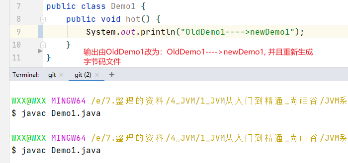

  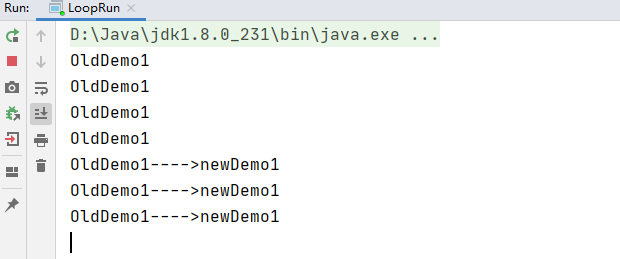


## 6 沙箱安全机制

* 沙箱安全机制

  * 保护程序安全
  * 保护Java原生的JDK代码

  <font color=red>**Java安全模型的核心就是Java沙箱（sandbox）**</font>。什么是沙箱？沙箱是一个限制程序运行的环境。

  沙箱机制就是将Java代码<font color=red>**限定在虚拟机（JVM）特定的运行范围中，并且严格限制代码对本地资源的访问。**</font>通过这样的措施来保证对代码的有限隔离，防止对本地系统造成破坏。

  沙箱主要限制系统资源访问，那系统资源包括什么？CPU、内存、文件系统、网络。不同级别的沙箱对这些资源访问的限制也可以不一样。

  所有的Java程序都可以指定沙箱，可以指定安全策略。

* JDK1.0时期

  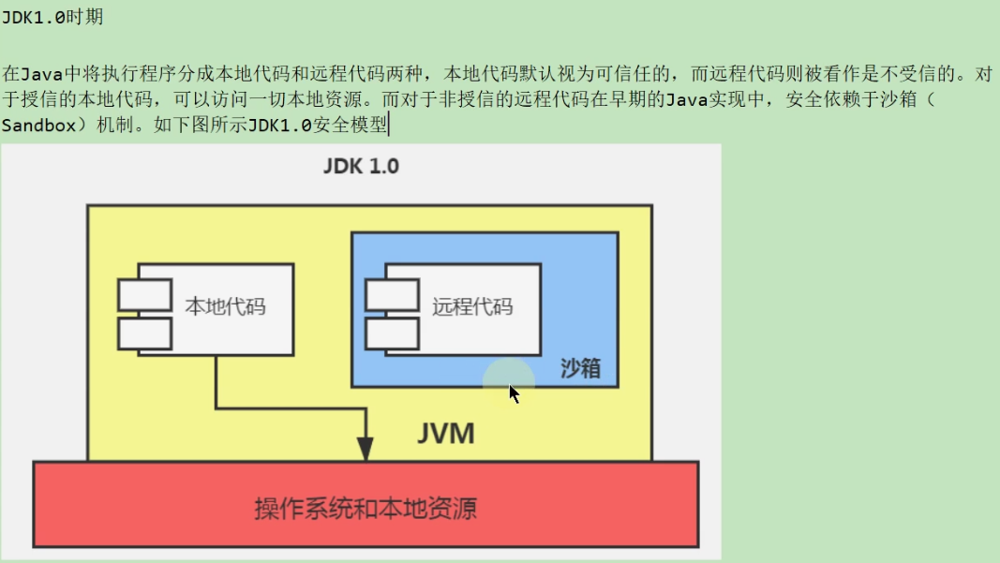

* JDK1.1时期

  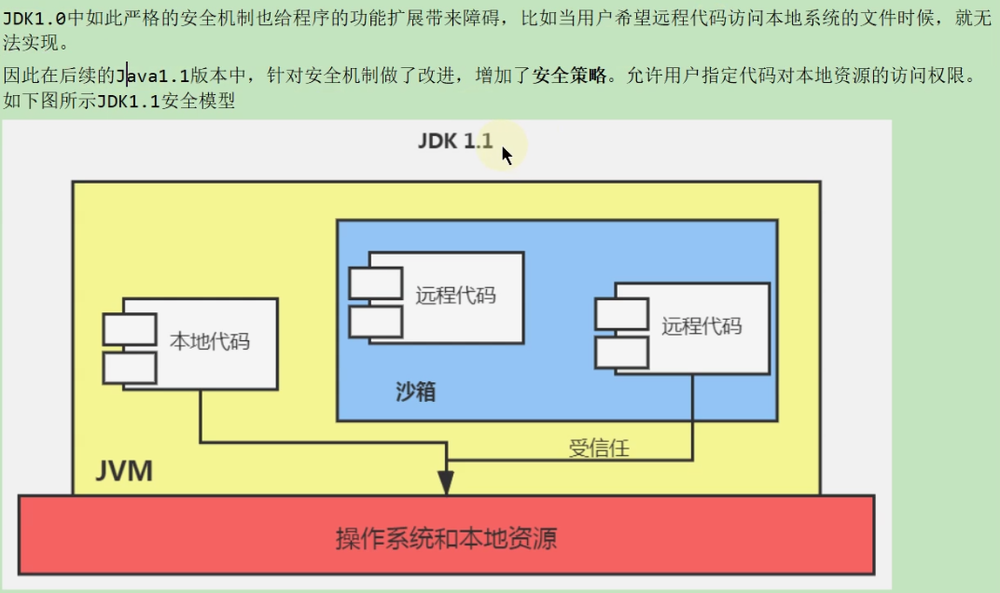

* JDK1.2时期

  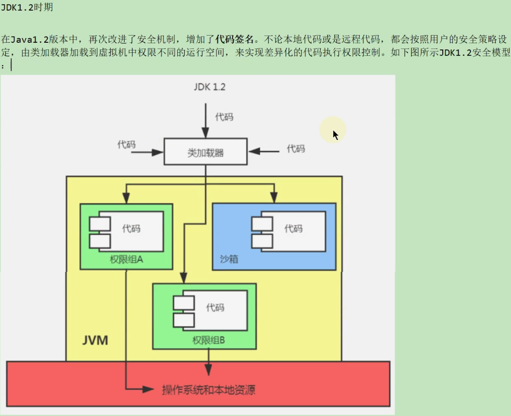

* JDK1.6时期

  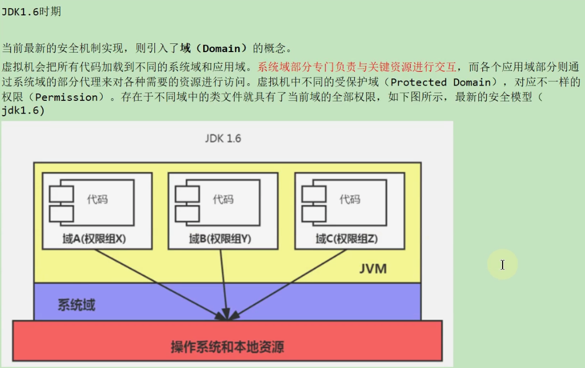


## 7 自定义类的加载器

* **为什么需要自定义类加载器？**

  * <font color=red>**隔离加载类**</font>

    在某些框架内进行中间件与应用模块隔离，把类加载到不同的环境。比如：阿里内某容器框架通过自定义类加载器确保**应用中**依赖的jar包不会影响到**中间件**运行时使用的jar包。再比如：Tomcat这类Web应用服务器，内部自定义了好几种类加载器，用于隔离同一个Web应用服务器上不同应用程序。（类的仲裁---->类冲突）

  * <font color=red>**修改类加载的方式**</font>

    类的加载模型并非强制，除Bootstrap外，其他的加载并非一定要引入，或者根据实际情况在某个时间点按需进行动态加载。

  * <font color=red>**扩展加载源**</font>

    比如从数据库、网络、甚至是电视机顶盒进行加载

  * <font color=red>**防止源码泄露**</font>

    Java代码容易被编译和篡改，可以进行编译加密，那么类加载也需要自定义，还原加密的字节码。

* **常见的场景**

  * 实现类似进程内隔离，类加载实际上用作不同的命名空间，以提供类似容器、模块化的效果。例如，两个模块依赖于某个类库的不同版本，如果分别被不同的容器加载，就可以互不干扰。这方面的集大成者是Java EE和OSGi、JPMS等框架。
  * 应用需要从不同的数据源获取类定义信息，例如网络数据源，而不是本地文件系统。或者是需要自己操纵字节码，动态修改或者生成类型。

* **注意：**

  在一般情况下，使用不同的类加载器去加载不同的功能模块，会提高应用程序的安全性。但是，如果涉及Java类型转换，则加载器反而容易产生不美好的事情。在做Java类型转换时，只有两个类型都是由同一个加载器所加载，才能进行进行类型转换，否则转换时会发生异常。

---

用户通过定制自己的类加载器，这样可以重新定义类的加载规则，以便实现一些自定义的处理逻辑。

* **实现方式**

  * Java提供了抽象类java.lang.ClassLoader，所有用户自定义的类加载器都应该继承ClassLoader类。
  * 在自定义 ClassLoader 的子类的时候，我们常见的会有两种做法：
    * 方式一：重写loadClass()方法
    * 方式二：重写findClass()方法  ----> **推荐**

* **对比**

  这两种方法本质上差不多，毕竟loadClass()也会调用findClass()，但是从逻辑上讲我们最好不要直接修改loadClass()的内部逻辑。建议的做法是只在findClass()里重写自定义类的加载方法，根据参数指定类的名字，返回对应的Class对象的引用。

  * loadClass()这个方法是实现双亲委派模型逻辑的地方，擅自修改这个方法会导致模型结构被破坏，容易造成问题。<font color=red>**因此我们最好是在双亲委派模型框架内进行小范围改动，不破坏原有的稳定结构。**</font>同时，也避免了自己重写loadClass()方法的过程中必须写双亲委派的重复代码，从代码的复用性来看，不直接修改这个方法始终是比较好的选择。
  * 当编写好自定义的类加载器后，便可以在程序中调用loadClass()方法来实现类加载操作。

* **说明**

  * 其父类加载器是系统类加载器
  * JVM中的所有类加载都会使用java.lang.ClassLoader.loadClass(String)接口（自定义类加载器并重写java.lang.ClassLoader.loadClass(String)接口的除外），连JDK的核心类库也不能例外。

* 例子

  ```java
  /**
   * 自定义ClassLoader
   */
  public class MyClassLoader extends ClassLoader {
      private String byteCodePath;
  
      public MyClassLoader(String byteCodePath) {
          this.byteCodePath = byteCodePath;
      }
  
      public MyClassLoader(ClassLoader parent, String byteCodePath) {
          super(parent);
          this.byteCodePath = byteCodePath;
      }
  
      @Override
      protected Class<?> findClass(String className) throws ClassNotFoundException {
          BufferedInputStream bis = null;
          ByteArrayOutputStream baos = null;
          try {
              // 获取字节码文件的完整路径
              String fileName = byteCodePath + className + ".class";
              // 获取一个输入流
              bis = new BufferedInputStream(new FileInputStream(fileName));
              // 获取一个输出流
              baos = new ByteArrayOutputStream();
              // 具体读入数据并写出的过程
              int len;
              byte[] data = new byte[1024];
              while ((len = bis.read(data)) != -1) {
                  baos.write(data, 0, len);
              }
              // 获取内存中的完整的字节数组的数据
              byte[] byteCodes = baos.toByteArray();
              // 调用defineClass()，将字节数组的数据转换为Class的实例。
              Class clazz = defineClass(null, byteCodes, 0, byteCodes.length);
              return clazz;
          } catch (IOException e) {
              e.printStackTrace();
          } finally {
              try {
                  if (baos != null)
                      baos.close();
              } catch (IOException e) {
                  e.printStackTrace();
              }
              try {
                  if (bis != null)
                      bis.close();
              } catch (IOException e) {
                  e.printStackTrace();
              }
          }
          return null;
      }
  }
  ```

  ```java
  public class MyClassLoaderTest {
      public static void main(String[] args) {
          MyClassLoader loader = new MyClassLoader("d:/");
  
          try {
              Class clazz = loader.loadClass("Demo1");
              System.out.println("加载此类的类的加载器为：" + clazz.getClassLoader().getClass().getName());
  
              System.out.println("加载当前Demo1类的类的加载器的父类加载器为：" + clazz.getClassLoader().getParent().getClass().getName());
          } catch (ClassNotFoundException e) {
              e.printStackTrace();
          }
      }
  }
  ```

  结果：

  加载此类的类的加载器为：com.atguigu.java2.MyClassLoader
  加载当前Demo1类的类的加载器的父类加载器为：sun.misc.Launcher$AppClassLoader


## 9 Java9新特性

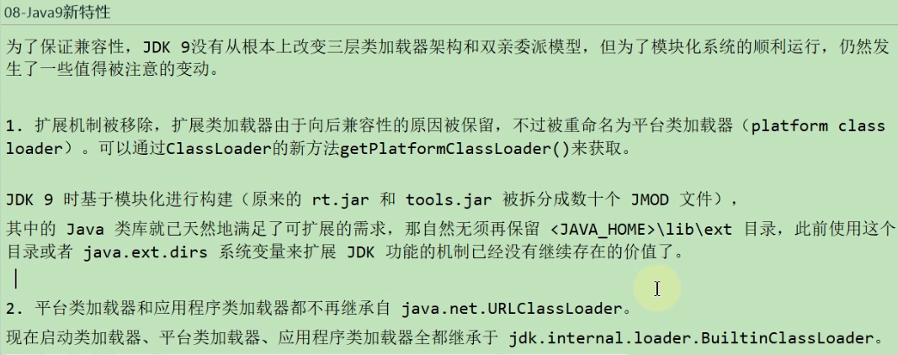

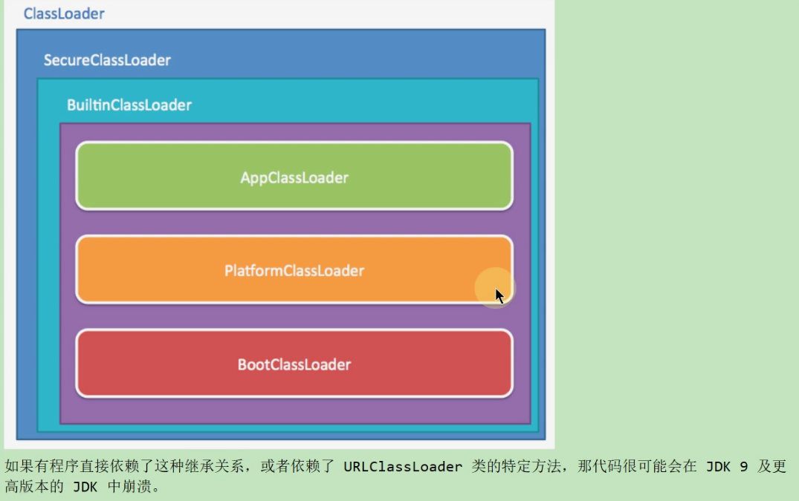

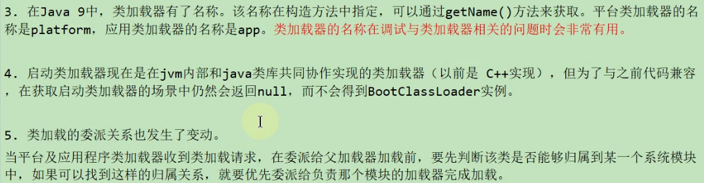

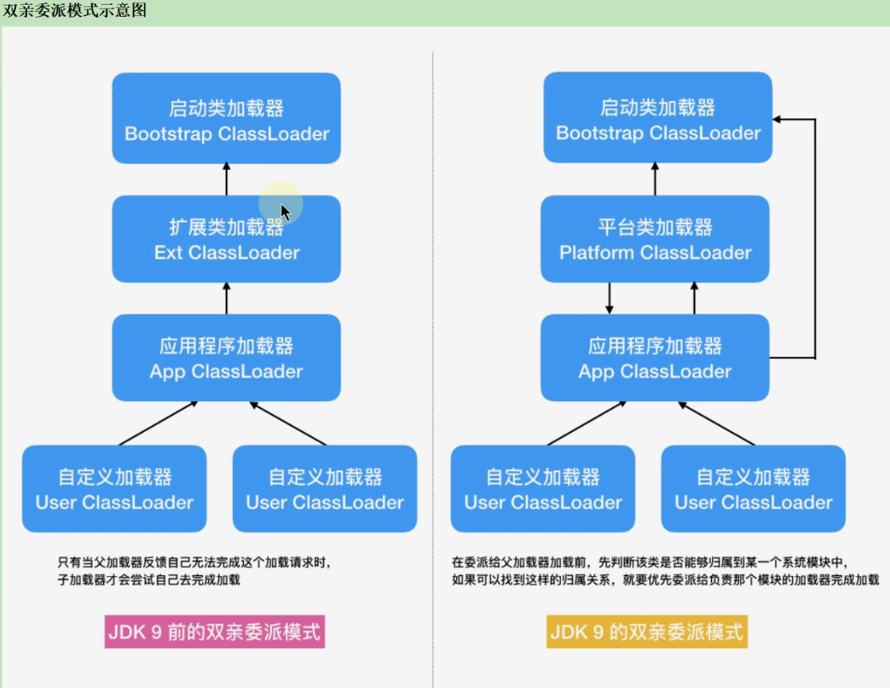

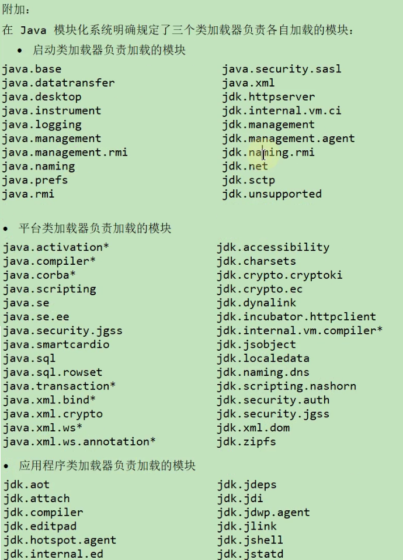

