# 第23章 JVM监控及诊断工具-命令行篇

> 来自尚硅谷宋红康老师讲解的JVM：[bilibili链接](https://www.bilibili.com/video/BV1PJ411n7xZ)


## 1 概述

* 性能诊断是软件工程师在日常工作中经常面对和解决的问题，在用户体验至上的今天，解决好应用软件的性能问题能带来非常大的收益。
* Java作为最流行的编程语言之一，其应用性能诊断一直受到业界广泛关注。可能造成Java应用出现性能问题的因素非常多，例如线程控制、磁盘读写、数据库访问、网络I/O、垃圾收集等。想要定位这些问题，一款优秀的性能诊断工具必不可少。
* ==体会1：使用数据说明问题，使用知识分析问题，使用工具处理问题==
* ==体会2：无监控、不调优！==

---

* 简单命令行工具

  在我们刚接触java学习的时候，大家肯定最先了解的两个命令就是 javac，java，那么除此之外，还有没有其他的命令可供我们使用呢？我们进入jdk的bin目录，发现还有一系列辅助工具。这些辅助工具用来获取目标JVM不同方面、不同层次的信息，帮助开发人员很好的解决Java应用程序的一些疑难杂症。

  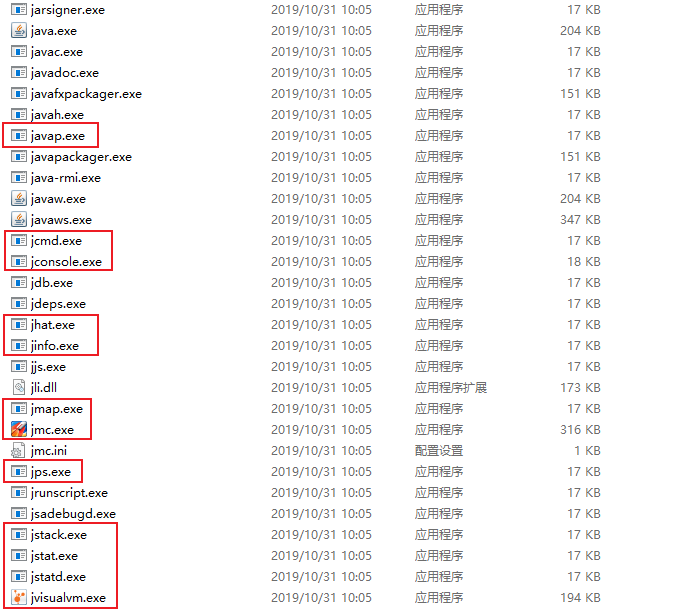

  这些命令对应的源码地址：[源码](https://hg.openjdk.java.net/jdk/jdk11/file/1ddf9a99e4ad/src/jdk.jcmd/share/classes/sun/tools) 

  

## 2 jps：查看正在运行的Java进程

### 2.1 基本情况

* jps：Java Process Status

  显示指定系统内所有的HotSpot虚拟机进程（查看虚拟机进程信息），可用于查询正在运行的虚拟机进程。

  说明：对于本地虚拟机进程来说，进程的本地虚拟机ID与操作系统的进程ID是一致的，是唯一的。

### 2.2 测试

```java
public class ScannerTest {
    public static void main(String[] args) {
        Scanner scanner = new Scanner(System.in);
        String info = scanner.next();
    }
}
```


另外注意：每次jps执行都是一个新的进程

### 2.3 基本语法

* jps的进本语法：jps [options] [hostid]

  <font color=red>**[options]：**</font>

  * -q：仅仅显示LVMID（local virtual machine id），即本地虚拟机唯一id。不显示主类的名称等。
  * -l：输出应用程序主类的全类名 或 如果执行的是jar包，则输出jar包的完整路径
  * -m：输出虚拟机进程启动时传递给主类main()的参数
  * -v：列出虚拟机进程启动时的JVM参数。比如：-Xms100m -Xmx100m是启动程序指定的JVM参数

  说明：以上参数可以综合使用。

  补充：如果某Java进程关闭了默认开启的UsePerfData参数（即使用参数-XX:-UsePerfData），那么jps命令（以及下面介绍的jstat）将无法探知该Java进程

  ---

  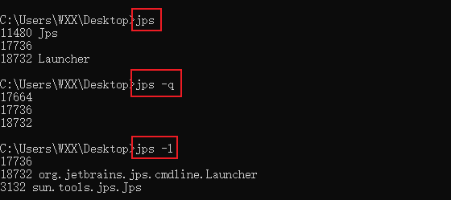

  在IDEA中配置参数如下：

  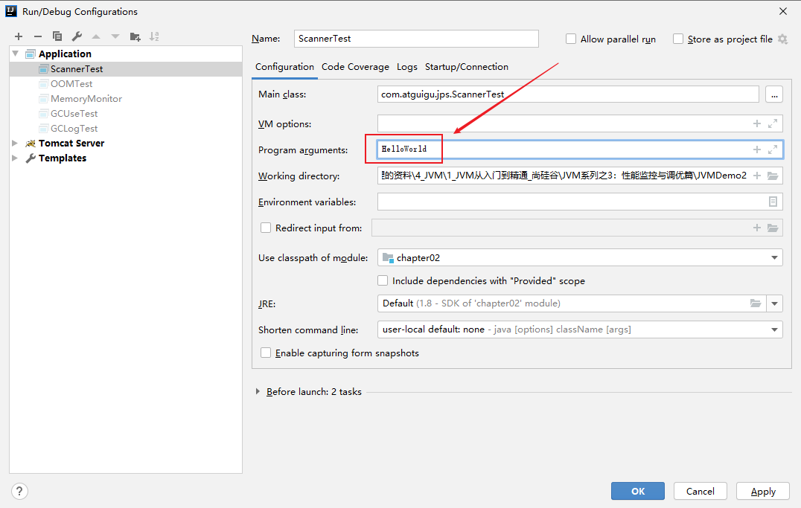

  执行：

  ```shell
  jps -m > a.txt
  ```

  生成文件的内容如下，可以看到刚才输入的参数

  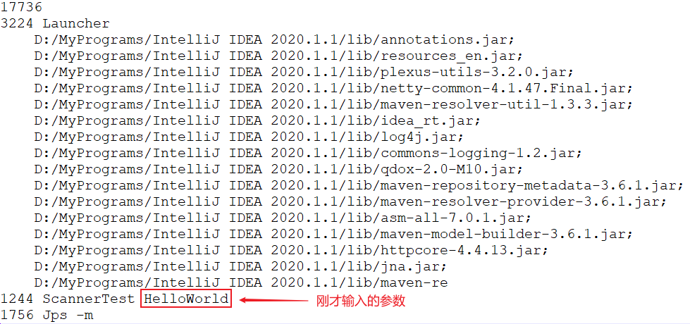

  ---

  在IDEA中配置参数如下：

  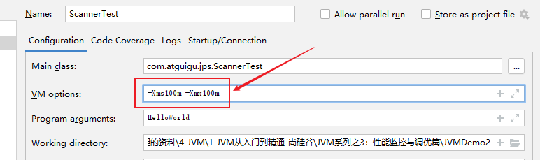

  执行：

  ```shell
  jps -v > b.txt
  ```

  生成文件的内容如下，可以看到刚才输入的参数

  

  <font color=red>**[hostid]：**</font>

  * RMI注册表中注册的主机名
  * 如果想要远程监控主机上的java程序，需要安装jstatd
  * 对于具有更严格的安全实践的网络场所而言，可以使用一个自定义的策略文件来显式对特定的可信主机或网络的访问，尽管**这种技术很容易受到IP地址欺诈攻击**。
  * 如果安全问题无法使用一个定制的策略文件来处理，那么最安全的操作是不运行jstatd服务器，而是本地使用jstat和jps工具。


## 3 jstat：查看JVM的统计信息

### 3.1 基本情况

* jstat（JVM Statistics Monitoring Tool）：用于监视虚拟机各种运行状态信息的命令工具。它可以显示本地或者远程虚拟机中的类装载、内存、垃圾收集、JIT编译等运行数据。
* 在没有GUI图形界面，只提供了纯文本控制台环境的服务器上，它将是运行期间定位虚拟机性能问题的首选工具。常用于检测**垃圾回收**问题以及**内存泄露**问题。
* [官方文档](https://docs.oracle.com/javase/8/docs/technotes/tools/unix/jstat.html)

### 3.2 基本语法

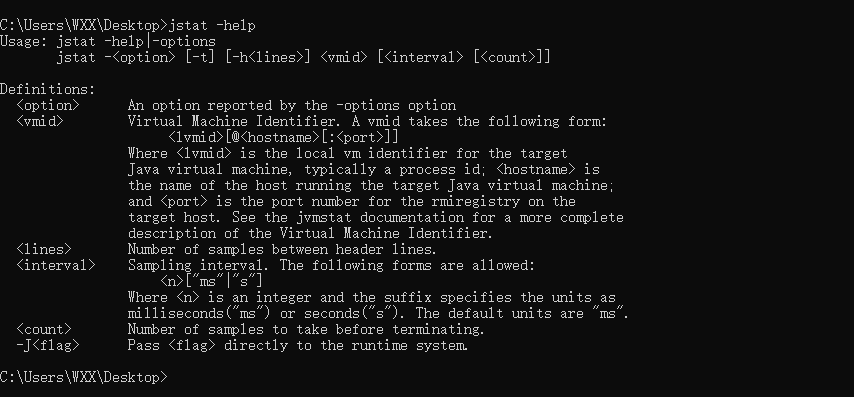

```shell
jstat -<option> [-t] [-h<lines>] <vmid> [<interval> [<count>]]
```

测试命令所用代码：

```java
public class ScannerTest {
    public static void main(String[] args) {
        Scanner scanner = new Scanner(System.in);
        String info = scanner.next();
    }
}
```

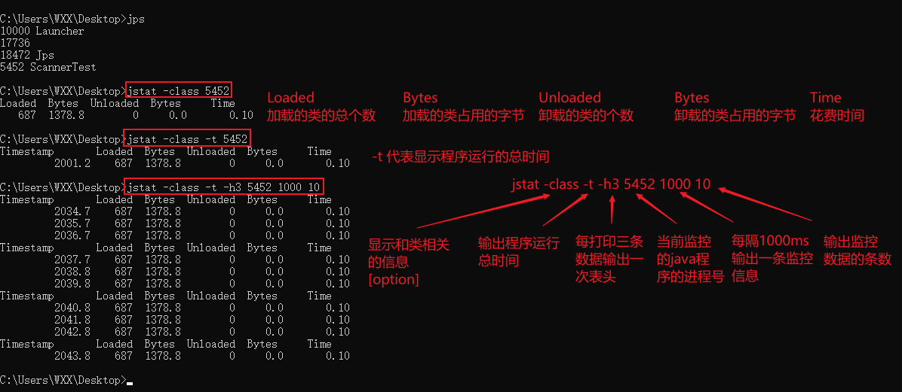

* option参数

  选项option可以由以下值构成：

  * <font color=red>**类装载相关的**</font> 

    * -class：显示ClassLoader的相关信息：类的装载、卸载数量、总空间、类装载所消耗的时间等

  * <font color=red>**垃圾回收相关的 **</font> 

    测试代码：

    ```java
    /**
     * -Xms60m -Xmx60m -XX:SurvivorRatio=8
     */
    public class GCTest {
        public static void main(String[] args) {
            ArrayList<byte[]> list = new ArrayList<>();
    
            for (int i = 0; i < 1000; i++) {
                byte[] arr = new byte[1024 * 100];  // 100KB
                list.add(arr);
                try {
                    Thread.sleep(120);
                } catch (InterruptedException e) {
                    e.printStackTrace();
                }
            }
        }
    }
    ```

    * -gc：显示与GC相关的堆信息。包括Eden区，两个Survivor区、老年代、永久代的用量、已用空间、GC时间合计等信息。

      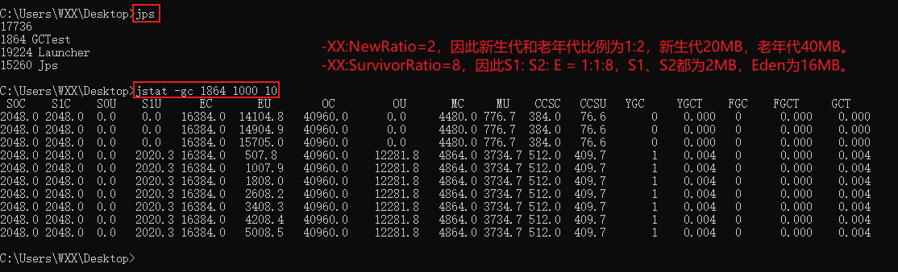

      各参数含义如下：

      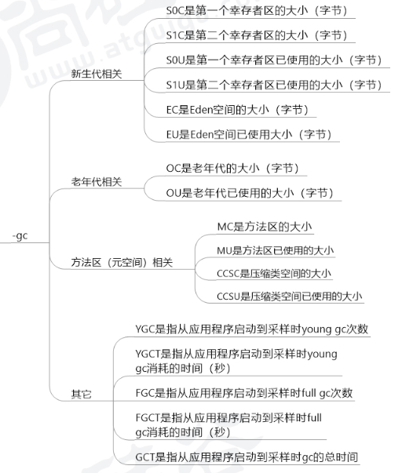

    * -gccapacity：显示内容与-gc基本相同，但输出主要关注Java堆各个区域使用的最大、最小空间。

    * -gcutil：显示内容与-gc基本相同，但输出主要关注已使用空间占总空间的百分比。

      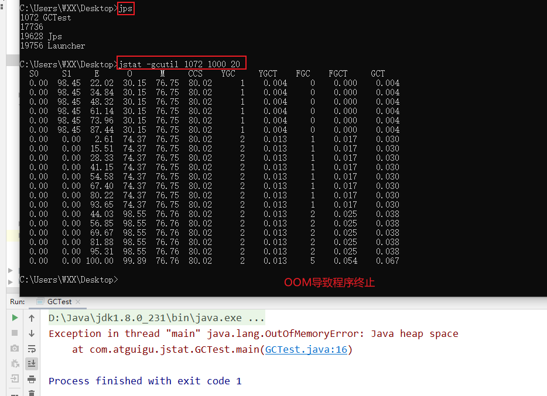

    * -gccause：与-gcutil功能一样，但是会额外输出导致最后一次或当前正在发生的GC产生的原因。

      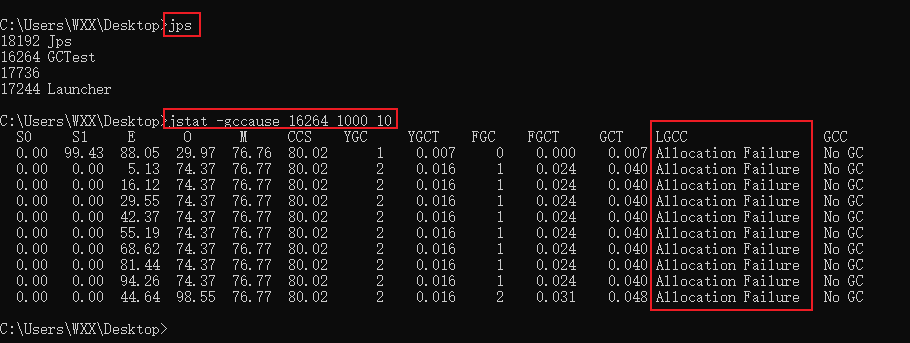

    * -gcnew：显示新生代GC状况

    * -gcnewcapacity：显示内容与-gcnew基本相同，输出主要关注使用到的最大、最小空间。

    * -gcold：显示老年代GC状况

    * -gcoldcapacity：显示内容与-gcold基本相同，输出主要关注使用到的最大、最小空间。

    * -gcpermcapacity：显示永久代用到的最大、最小空间。

  * <font color=red>**JIT相关的 **</font> 

    * -compiler：显示JIT编译器编译过的方法、耗时等信息
    * -printcompilation：输出已被JIT编译的方法

    

* interval参数

  用于指定输出统计数据的周期，单位为毫秒。即：查询间隔

* count参数

  用于指定查询的总次数

* -t参数

  * 可以在输出信息前面加上一个Timestamp列，显示程序的运行时间。单位：秒
  * 经验：我们可以比较Java进程的启动时间以及总GC时间（GCT列），或者两次测量的时间间隔以及总GC时间的增量，来得出GC时间栈运行时间的比例。如果该比例超过20%，则说明目前堆的压力较大；如果该比例超过90%，则说明堆里几乎没有可用空间，随时都可能抛出OOM异常。

* -h参数

  可以在周期性数据输出时，输出多少行数据后输出一个表头信息

### 3.3 补充

> jstat还可以用来判断是否出现内存泄漏。

* 第1步：在长时间运行的Java程序中，我们可以运行jstat命令连续获取多行性能数据，并取这几行数据中的OU列（即已占用的老年代内存）的最小值。

* 第2步：然后，我们每隔一段较长的时间重复一次上述操作，来获取多组OU最小值。如果这些值呈现上涨趋势，则说明该Java程序的老年代内存已使用量不断上涨，这意味着无法回收的对象在不断增加，因此有可能存在内存泄露。


## 4 jinfo：实时查看和修改JVM配置参数

### 4.1 基本情况

* jinfo（Configuration Info For Java）：查看虚拟机配置参数信息，也可以用于调整虚拟机的配置参数
* 在很多情况下，Java应用程序不会指定所有的Java虚拟机参数。而此时，开发人员可能不知道某一个具体的Java虚拟机参数默认值。在这种情况下，可能需要查找文档获取某个参数的默认值。这个查找过程可能是非常艰难的。但是有了jinfo工具，开发人员可以很方便地找到Java虚拟机参数的当前值。

* [官方文档](https://docs.oracle.com/en/java/javase/11/tools/jinfo.html)

### 4.2 基本语法

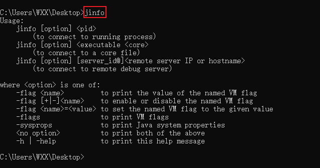

```shell
jinfo [option] pid  # pid：进程的ID，必须加上
```

* [option]：

  | 选项             | 选项说明                                                     |
  | ---------------- | ------------------------------------------------------------ |
  | no option        | 输出全部参数和系统属性                                       |
  | -flag name       | 输出对应名称的参数                                           |
  | -flag [+-]name   | 开启或者关闭对应名称的参数，只有被标为manageable的参数才可以被动态修改 |
  | -flag name=value | 设置对应名称的参数                                           |
  | -flags           | 输出全部的参数                                               |
  | -sysprops        | 输出系统属性                                                 |

  测试代码：

  ```java
  public class ScannerTest {
      public static void main(String[] args) {
          Scanner scanner = new Scanner(System.in);
          String info = scanner.next();
      }
  }
  ```

  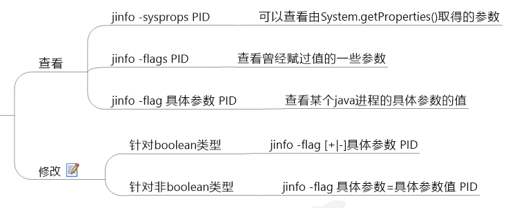

  * 查看：

  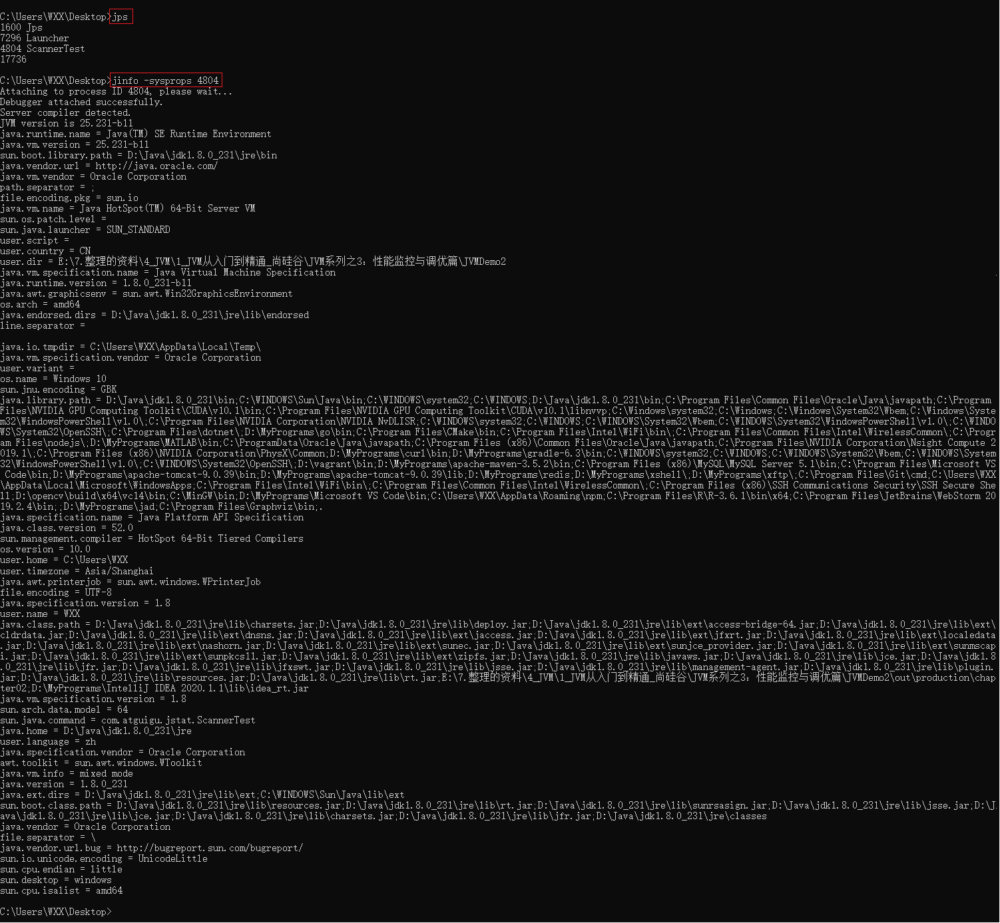

  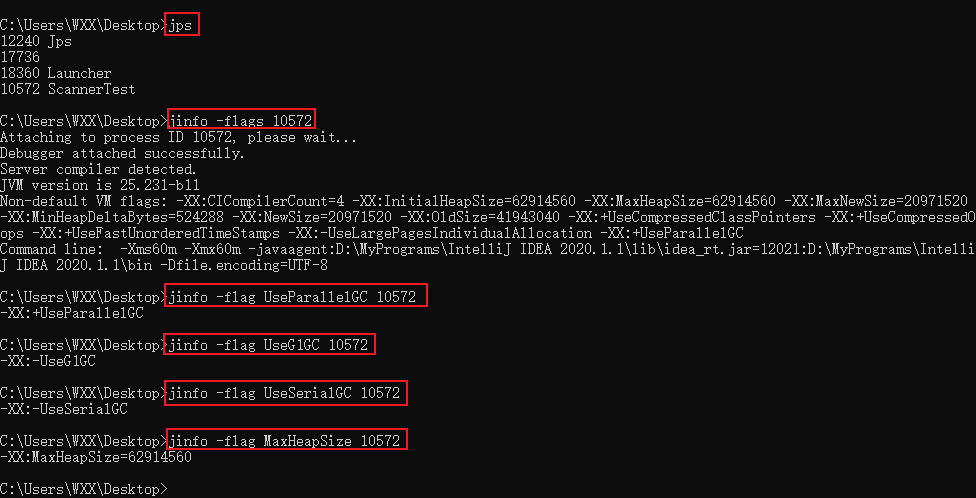

  * 修改

    jinfo不仅可以查看运行时某一个Java虚拟机的实际取值，甚至可以在运行时修改部分参数，并使之立即生效。

    但是，并非所有的参数都支持动态修改。参数只有被标记为manageable的flag可以实时修改。其实，这个修改能力是极其有限的。

    ```shell
    # 可以查看被标记为manageable的参数
    java -XX:+PrintFlagsFinal -version | grep manageable
    ```

    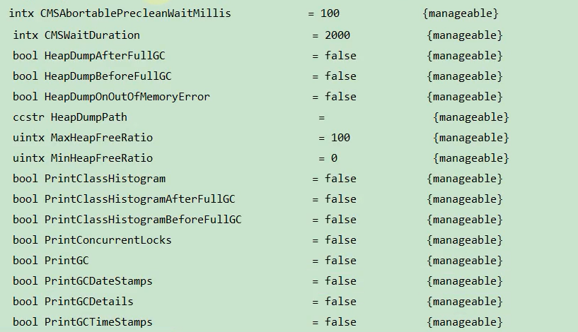

    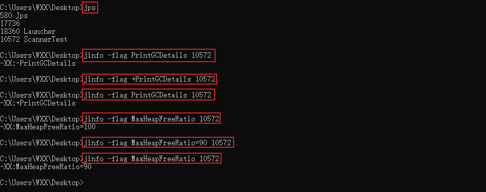

### 4.3 拓展

```shell
# 查看所有JVM参数启动的初始值
java -XX:+PrintFlagsInitial
# 查看所有JVM参数的最终值
java -XX:+PrintFlagsFinal
# 查看哪些已经被用户或者JVM设置过的详细的XX参数的名称和值
java -XX:+PrintCommandLineFlags
```


## 5 jmap：导出内存映像文件&内存使用情况

### 5.1 基本情况

* jmap（JVM Memory Map）：作用一方面是获取dump文件（堆转储快照文件，二进制文件），它还可以获取目标Java进程的内存相关信息，包括Java堆各区域的使用情况、堆中对象的统计信息、类加载信息等。
* 开发人员可以在控制台中输入命令`jmap -help`查阅jmap工具的具体使用方式和一些标准选项配置
* [官方文档](https://docs.oracle.com/en/java/javase/11/tools/jmap.html)

### 5.2 基本语法

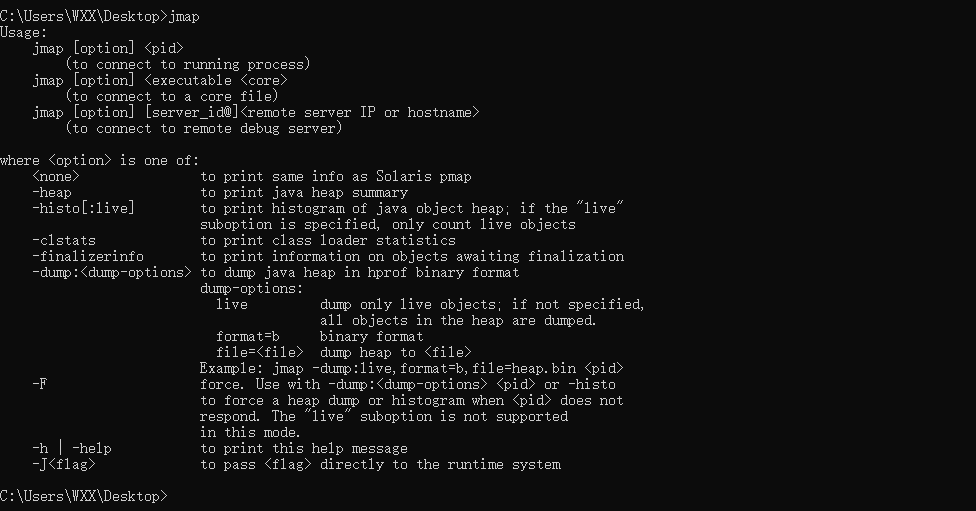

```shell
jmap [option] <pid>
jmap [option] <executable <core>
jmap [option] [server_id@]<remote server IP or hostname>
```

* [option]

  | 选项           | 作用                                                         |
  | -------------- | ------------------------------------------------------------ |
  | -dump          | 生成dump文件                                                 |
  | -finalizerinfo | 以ClassLoader为统计口径输出永久代的内存状态信息              |
  | -heap          | 输出整个堆空间的统计信息，包括GC的使用、堆配置信息，以及内存的使用信息等 |
  | -histo         | 输出堆空间中的对象的统计信息，包括类、实例数量和合计容量     |
  | -permstat      | 以ClassLoader为统计口径输出永久代的内存状态信息              |
  | -F             | 当虚拟机进程对-dump选项没有任何响应时，强制执行生成dump文件  |

  说明：这些参数和linux下输入显示的命令多少会有些不同，包括也受jdk版本的影响。

  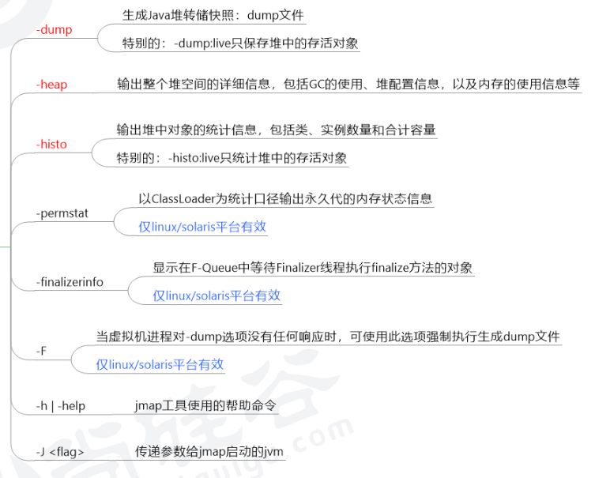

### 5.3 使用1：导出内存映像文件

* 内存的映像文件

  一般来说，使用jmap指令生成dump文件的操作算得上是最常用的jmap命令之一，将堆中所有存活对象导出至一个文件之中。

  Heap Dump又叫做堆存储文件，至一个Java进程在某个时间点的内存快照。Heap Dump在触发内存快照的时候会保存此刻的信息如下：

  * All Objects

    Class, fields, primitive values and references

  * All Classes

    ClassLoader, name, super class, static fields

  * Garbage Collection Roots

    Objects defined to be reachable by JVM

  * Thread Stacks and local Variables

    The call-stacks of threads at the moment of the snapshot, and per-frame information about local objects

  说明：

  （1）通常在写Heap Dump文件前会触发一次Full GC，所以heap dump文件里保存的都是Full GC后留下的对象信息。

  （2）由于生成dump文件比较耗时，因此大家需要耐心等待，尤其是大内存镜像生成的dump文件则需要耗费更长的时间来完成。

* 演示代码

  ```java
  /**
   * -Xms60m -Xmx60m -XX:SurvivorRatio=8
   */
  public class GCTest {
      public static void main(String[] args) {
          ArrayList<byte[]> list = new ArrayList<>();
  
          for (int i = 0; i < 1000; i++) {
              byte[] arr = new byte[1024 * 100];  // 100KB
              list.add(arr);
              try {
                  Thread.sleep(60);
              } catch (InterruptedException e) {
                  e.printStackTrace();
              }
          }
      }
  }
  ```

* 分为两种导出的方式

  * 手动的方式

    ```shell
    jmap -dump:format=b,file=<filename.hprof> <pid>
    jmap -dump:live,format=b,file=<filename.hprof> <pid>
    ```

    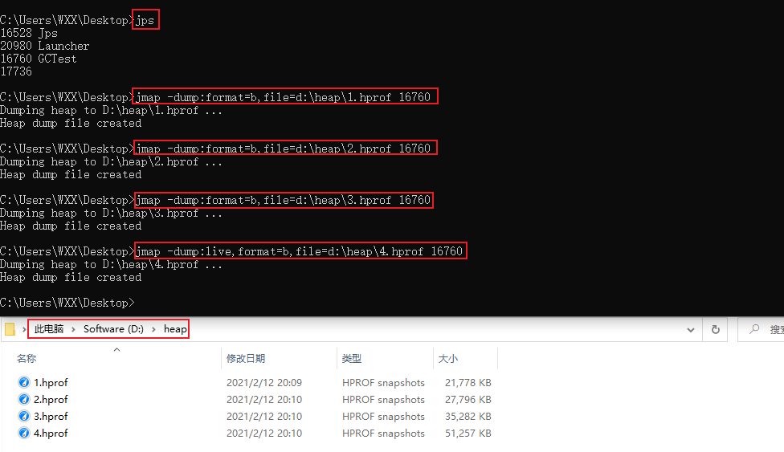

  * 自动的方式

    当程序发生OOM退出系统时，一些瞬时信息都随着程序的终止而消失，而OOM问题往往比较困难或者耗时。此时若能在OOM时，自动导出dump文件就显得非常迫切。这里介绍一种比较常用的取得堆快照文件的方法，即：

    ```shell
    # 当程序发生OOM时，导出应用程序的当前堆快照
    -XX:+HeapDumpOnOutOfMemoryError
    # 可以指定堆快照的保存位置
    -XX:HeapDumpPath=<filename.hprof>
    ```

    比如：

    ```shell
    -Xms60m -Xmx60m -XX:SurvivorRatio=8 -XX:+HeapDumpOnOutOfMemoryError -XX:HeapDumpPath=d:\heap\oom.hprof
    ```

    在IDEA中配置参数如下，执行程序，等到OOM是则会自动生成dump文件

    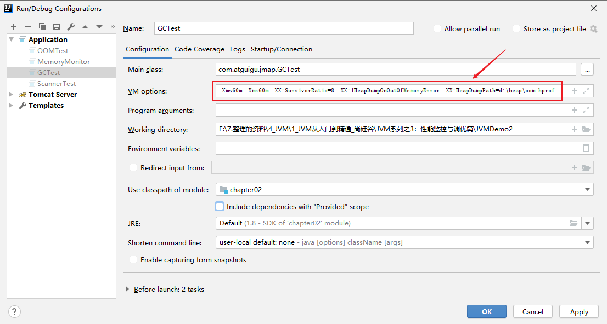

    生成的oom.hprof文件如下：

    

### 5.4 使用2：显示堆内存相关信息

```shell
# 获取某一时刻整个堆空间的统计信息，包括GC的使用、堆配置信息，以及内存的使用信息等
jmap -heap pid
# 获取某一时刻堆空间中的对象的统计信息，包括类、实例数量和合计容量
jmap -histo pid
```

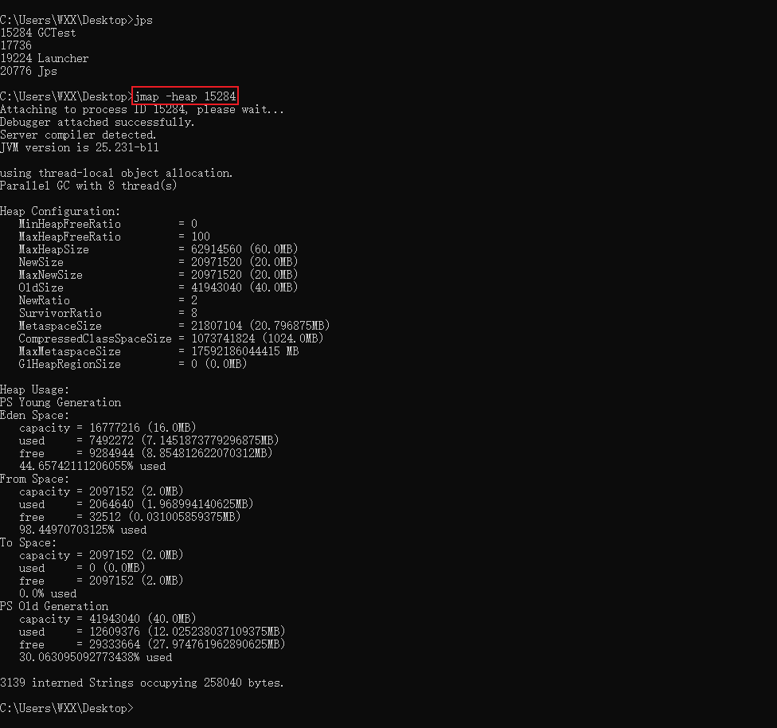

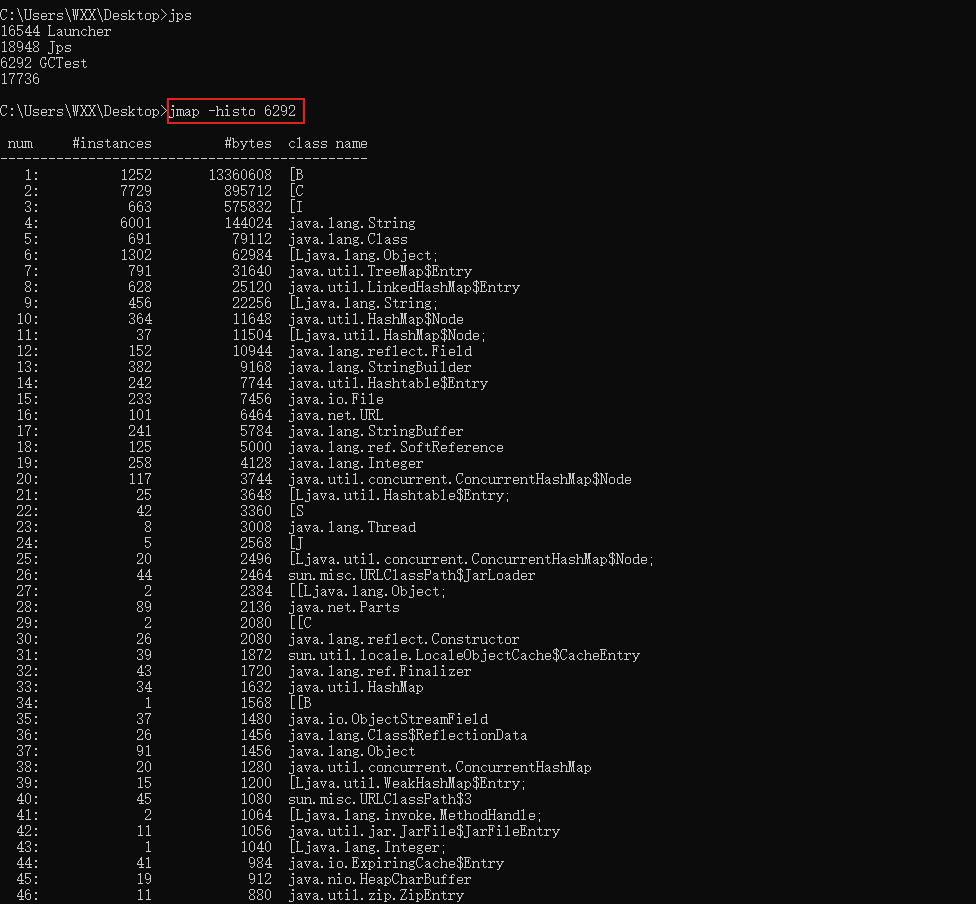

### 5.5 使用3：其他作用

```shell
# 查看系统的ClassLoader信息
jmap -permstat pid
# 查看堆积在finalizer队列中的对象
jmap -finalizerinfo
```


### 5.6 小节

* 由于jmap将访问堆中的所有对象，为了保证在此过程中不被应用线程干扰，jmap需要借助安全点机制，让所有线程都停留在不改变堆中数据的状态。也就是说，由jmap导出的堆快照必定是安全点位置的。这可能导致基于该堆快照的分析结果存在偏差。
* 举个例子，假设在编译生成的机器码中，某些对象的生命周期在两个安全点之间，那么:live选项将无法探知到这些对象。
* 另外，如果某个线程长时间无法跑到安全点，jmap将一直等下去。与前面将的jstat则不同，垃圾回收器会主动将jstat所需要的数据保存至固定位置之中，而jstat只需直接读取即可。


## 6 jhat：JDK自带堆分析工具

### 6.1 基本情况

* jhat（JVM Heap Analysis Tool）：Sun JDK提供的jhat命令与jmap命令搭配使用，用于分析jmap生成的heap dump文件（堆转储快照）。jhat内置了一个微型的HTTP/HTML服务器，生成dump文件的分析结果后，用户可以在浏览器中分析查看结果（分析虚拟机转储快照信息）。
* 使用了jhat命令，就启动了一个http服务，端口是7000，即`http://localhost:7000/`，既可以在服务器里分析。
* 说明：jhat命令在JDK9，JDK10中已经被删除，官方建议使用VisualVM代替。

### 6.2 基本语法

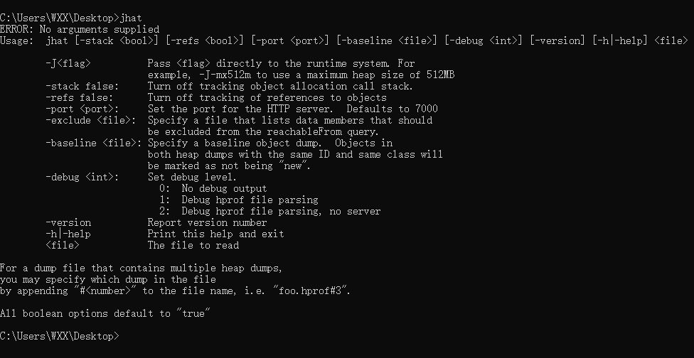

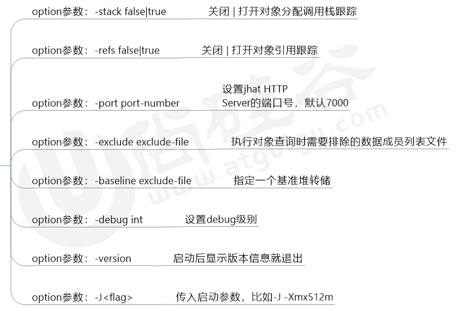

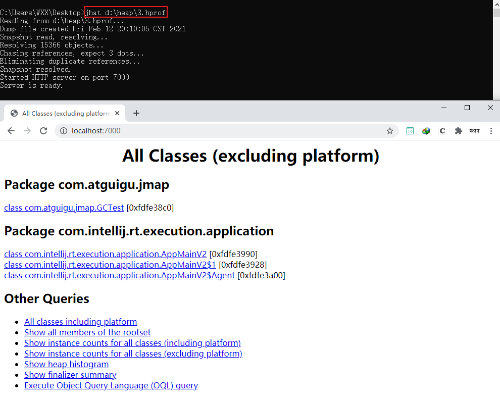

关于OQL语句：


## 7 jstack：打印JVM中线程快照

### 7.1 基本情况

* jstack（JVM Stack Trace）：用于生成虚拟机指定进程当前时刻的线程快照（虚拟机堆栈跟踪）。线程快照就是当前虚拟机内指定进程的每一条线程正在执行的方法堆栈的集合。
* 生成线程快照的作用：可用于定位线程出现长时间停顿的原因，如线程间死锁、死循环、请求外部资源导致的长时间等待问题。这些都是导致线程长时间停顿的常见原因。当线程出现停顿时，就可以用jstack显示各个线程调用的堆栈情况。
* [官方文档](https://docs.oracle.com/en/java/javase/11/tools/jstack.html)
* 在thread dump中，要留意下面几种状态
  * <font color=red>**死锁，Deadlock（重点关注）**</font> 
  * <font color=red>**等待资源，Waiting on condition（重点关注）**</font> 
  * <font color=red>**等待获取监视器，Waiting on monitor entry（重点关注）**</font> 
  * <font color=red>**阻塞，Blocked（重点关注）**</font> 
  * 执行中，Runnable
  * 暂停，Suspended

### 7.2 基本语法

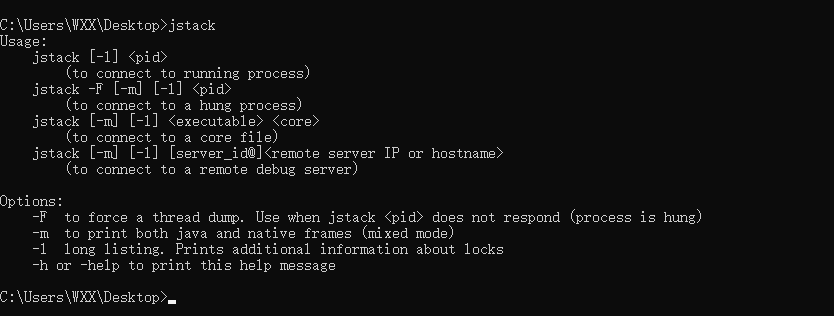

```shell
jstack option pid
```

* jstack远程管理的话，需要在远程程序的启动参数中增加：

  ```shell
  -Djava.rmi.server.hostname=......
  -Dcom.sun.management.jmxremote
  -Dcom.sun.management.jmxremote.port=8888
  -Dcom.sun.management.jmxremote.authenticate=false
  -Dcom.sun.management.jmxremote.ssl=false
  ```

* 演示1

  ```java
  /**
   * 演示线程的死锁问题
   */
  public class ThreadDeadLock {
  
      public static void main(String[] args) {
  
          StringBuilder s1 = new StringBuilder();
          StringBuilder s2 = new StringBuilder();
  
          new Thread() {
              @Override
              public void run() {
  
                  synchronized (s1) {
                      s1.append("a");
                      s2.append("1");
                      try {
                          Thread.sleep(100);
                      } catch (InterruptedException e) {
                          e.printStackTrace();
                      }
                      synchronized (s2) {
                          s1.append("b");
                          s2.append("2");
                          System.out.println(s1);
                          System.out.println(s2);
                      }
                  }
  
              }
          }.start();
  
          new Thread(new Runnable() {
              @Override
              public void run() {
  
                  synchronized (s2) {
                      s1.append("c");
                      s2.append("3");
                      try {
                          Thread.sleep(100);
                      } catch (InterruptedException e) {
                          e.printStackTrace();
                      }
                      synchronized (s1) {
                          s1.append("d");
                          s2.append("4");
                          System.out.println(s1);
                          System.out.println(s2);
                      }
                  }
              }
          }).start();
  
          try {
              Thread.sleep(1000);
          } catch (InterruptedException e) {
              e.printStackTrace();
          }
      }
  }
  ```

  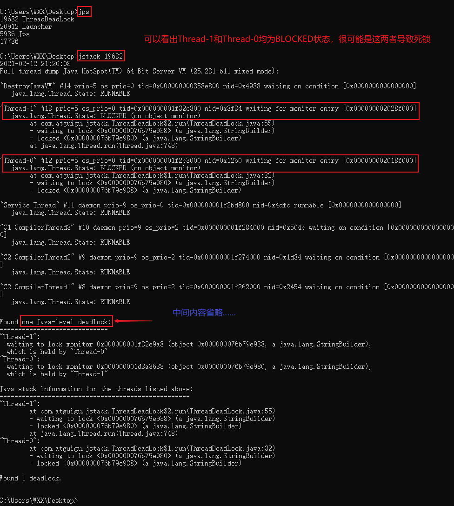

* Java层面追踪当前进程中的所有的线程

  ```java
  public class AllStackTrace {
      public static void main(String[] args) {
          Map<Thread, StackTraceElement[]> all = Thread.getAllStackTraces();
          Set<Map.Entry<Thread, StackTraceElement[]>> entries = all.entrySet();
          for (Map.Entry<Thread, StackTraceElement[]> en : entries) {
              Thread t = en.getKey();
              StackTraceElement[] v = en.getValue();
              System.out.println("【Thread name is :" + t.getName() + "】");
              for (StackTraceElement s : v) {
                  System.out.println("\t" + s.toString());
              }
          }
      }
  }
  ```


## 8 jcmd：多功能的命令行

### 8.1 基本情况

* 在JDK1.7以后，新增了一个命令行工具jcmd
* 它是一个多功能的工具，可以用来实现前面除了jstat之外所有命令的功能。比如：用它来导出堆，内存使用，查看Java进程、导出线程信息、执行GC、JVM运行时间等。
* [官方文档](https://docs.oracle.com/en/java/javase/11/tools/jcmd.html)
* jcmd拥有jmap的大部分功能，并且在Oracle的官方网站上页推荐使用jcmd命令代替jmap命令。

### 8.2 基本语法

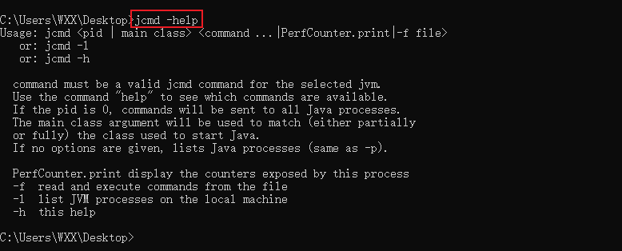

```shell
# 使用如下命令可以替换jps，即列出所有的JVM进程，加不加-l运行结果一样
jcmd -l
# 针对指定的进程，列出支持的所有命令
jcmd pid help
# 显示指定进程的指令命令的数据
jcmd pid 具体命令
```

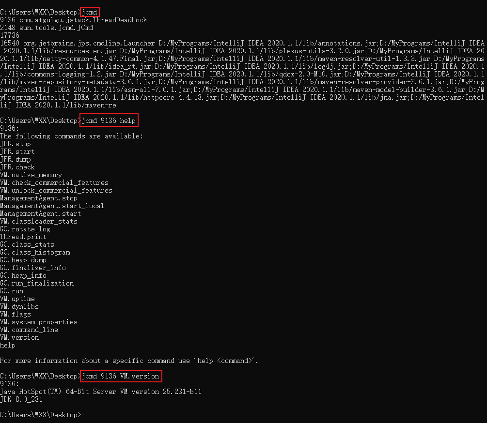


## 9 jstatd：远程主机信息收集

* 之前的命令值涉及到监控本机的Java应用程序，而在这些工具中，一些监控工具也支持对远程计算机的监控（如jps、jstat）。为了启用远程监控，则需要配合使用jstatd工具。
* 命令jstatd是一个RMI服务端程序，它的作用相当于代理服务器，建立本地计算机与远程监控工具的通信。jstatd服务器将本机的Java应用程序传递到远程计算机。

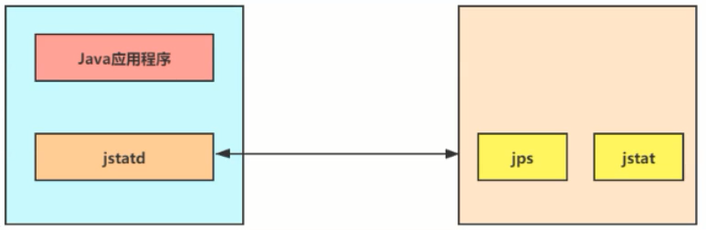

