# 第24章 JVM监控及诊断工具-GUI篇

> 来自尚硅谷宋红康老师讲解的JVM：[bilibili链接](https://www.bilibili.com/video/BV1PJ411n7xZ)


## 1 工具概述

* 使用上一张命令行工具或组合能帮您获取目标Java应用性能相关的基础信息，但他们存在下列局限：

  （1）无法获取方法级别的分析数据，如方法间的调用关系、各方法的调用次数和调用时间（这对定位应用性能瓶颈至关重要）。

  （2）要求用户登录到目标Java应用所在的宿主机上，使用起来不方便。

  （3）分析数据通过终端输出，结果展示不够直观。

* 为此，JDK提供了一些内存泄露的分析工具，如jconsole，jvisualvm等，用于辅助开发人员定位问题，但是这些工具很多时候并不足以满足快速定位的需求。所以这里我们介绍的工具相对多一些、丰富一些。

---

* **图形化综合诊断工具**

  * **JDK自带的工具**

    * jconsole：JDK自带的可视化监视工具。查看Java应用程序的运行概况、监控堆信息、永久代（元空间）使用情况、类加载情况等。

      位置：jdk\bin\jconsole.exe

    * Visual VM：Visual VM是一个工具，它提供了一个可视化界面，用于查看Java虚拟机上运行的基于Java技术的应用程序的详细信息。

      位置：jdk\bin\jvisualvm.exe，也可以单独安装

    * JMC：Java Mission Control，内置Java Flight Recorder。能够以极低的性能开销收集Java虚拟机的性能数据。

  * **第三方工具**

    * MAT：MAT（Memory Analyzer Tool）是基于Eclipse的内存分析工具，是一个快速、功能丰富的Java heap分析工具，它可以帮助我们查找内存泄露和减少内存消耗。

      Eclipse的插件形式，也可以单独安装

    * JProfiler：商业软件，需要付费，功能强大。

      可以单独安装，然后集成到IDEA中

    * Arthas：Alibaba开源的Java诊断工具。深受开发者喜爱。

    * Btrace：Java运行时追踪工具。可以在不停机的情况下，跟踪执行的方法调用、构造函数和系统内存等信息。


## 2 jConsole

### 2.1 基本概述

* 从Java5开始，是JDK中自带的java监控和管理控制台。
* 用于对JVM中内存、线程和类等的监控，是一个基于JMX（java management extensions）的GUI性能监控工具。
* [官方教程](https://docs.oracle.com/javase/7/docs/technotes/guides/management/jconsole.html)

### 2.2 启动

* 两种方式：

  * jdk/bin下，双击jconsole.exe即可
  * 在cmd命令行中数据，jconsole解

  如下是启动初始界面：

  

### 2.3 三种连接方式

* Local

  使用 jConsole连接一个正在本地系统运行的JVM，并且执行程序和运行 jConsole的需要时同一个用户。jConsole使用文件系统的授权通过RMI连接器连接到平台的MBean服务器上。这种从本地连接的监控能力只有Sun的JDK具有。

* Remote

  使用下面的URL通过RMI连接器连接到一个JMX代理：service:jmx:rmi:///jndi/rmi://hostName:portNum/jmsrmi。jConsole为建立连接，需要在环境变量中设置mx.remote.credentials来指定用户名和密码，从而进行授权。

* Advanced

  使用一个特殊的URL链接JMX代理。一般情况使用自己定制的连接器而不是RMI提供的连接器来连接JMX代理，或者是一个使用JDK1.4的实现了JMX和JMX Remote的应用。


### 2.4 主要作用

* 监控内存、监控线程、监控死锁、类加载与虚拟机信息

演示代码：

```java
/**
 * -Xms600m -Xmx600m -XX:SurvivorRatio=8
 */
public class HeapInstanceTest {
    byte[] buffer = new byte[new Random().nextInt(1024 * 100)];

    public static void main(String[] args) {
        try {
            Thread.sleep(3000);
        } catch (InterruptedException e) {
            e.printStackTrace();
        }
        ArrayList<HeapInstanceTest> list = new ArrayList<HeapInstanceTest>();
        while (true) {
            list.add(new HeapInstanceTest());
            try {
                Thread.sleep(10);
            } catch (InterruptedException e) {
                e.printStackTrace();
            }
        }
    }
}
```


## 3 Visual VM

### 3.1 基本概述

* Visual VM是一个功能强大的多合一故障诊断和性能监控的可视化工具。

* 它集成了多个JDK命令行工具，使用Visual VM可用于显示虚拟机进程及进程的配置和环境信息（jps，jinfo），监视应用程序的CPU、GC、堆、方法区及线程的信息（jstat、jstack），可以取代jConsole。

* 在JDK 6 Update 7之后，Visual VM便作为JDK的一部分发布（VIsualVM在JDK/bin目录下，jvisualvm），即：它完全免费。

* 此外，Visual VM也可以作为独立的软件安装。

* Visual VM 和 JDK/bin目录下的 jvisualvm是一个东西。

* [Visual VM网址](https://visualvm.github.io/index.html)

  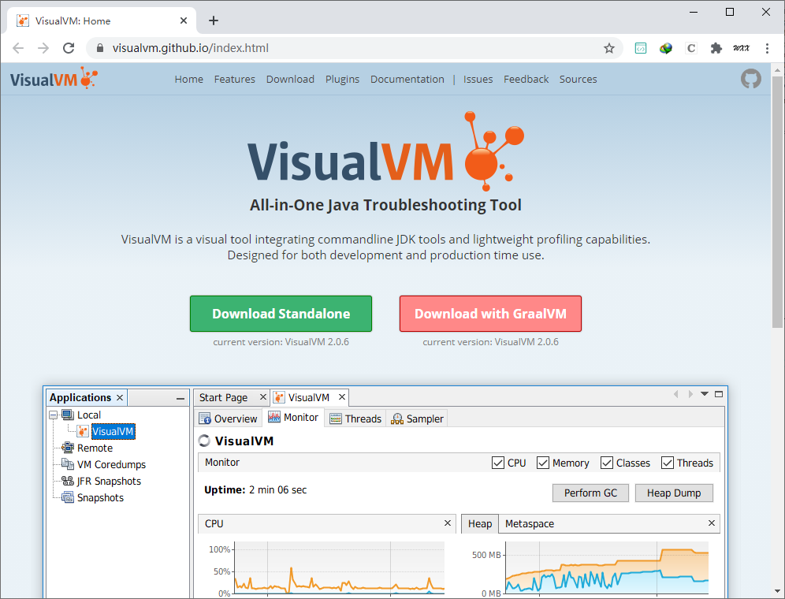

### 3.2 插件的安装

* Visual VM的一大特点是支持插件扩展，并且插件安装非常方便。我们既可以通过离线下载文件*.nbm，然后再Plugin对话框的已下载页面下，添加已下载的插件。也可以在可用插件页面下，在线安装插件。<font color=red>**（这里建议安装上：VisualGC）**</font>

* [插件地址](https://visualvm.github.io/pluginscenters.html)

  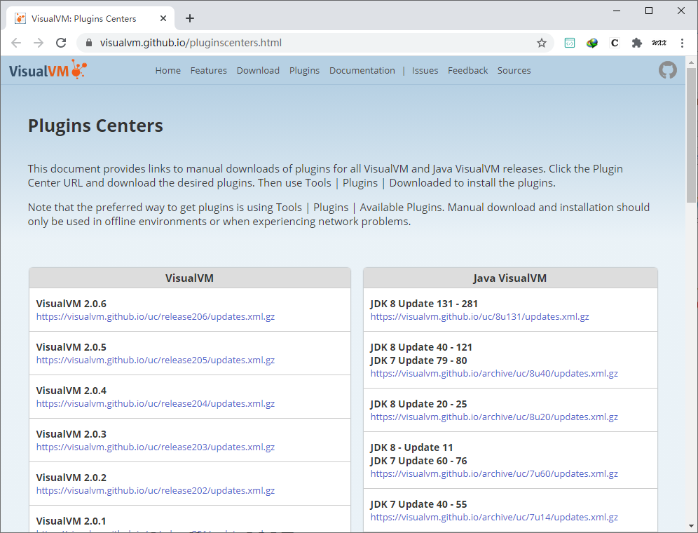

---

* IDEA安装VisualVM Launcher插件

  Preferences ---> Plugins ----> 搜索Visual VM Launcher，安装

  

  重启后还需要做如下设置：

  

### 3.3 连接方式

* 有两种连接方式

  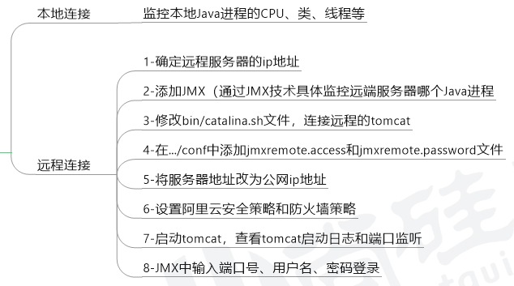

### 3.4 主要功能

（1）生成/读取堆内存快照

（2）查看JVM参数和系统属性

（3）查看运行中的虚拟机进程

（4）生成/读取线程快照

（5）程序资源的实时监控

（6）其他功能：JMX代理连接、远程环境监控、CPU分析和内存分析

* 演示代码

  ```java
  /**
   * -Xms600m -Xmx600m -XX:SurvivorRatio=8
   */
  public class OOMTest {
      public static void main(String[] args) {
          ArrayList<Picture> list = new ArrayList<>();
          while (true) {
              try {
                  Thread.sleep(5);
              } catch (InterruptedException e) {
                  e.printStackTrace();
              }
              list.add(new Picture(new Random().nextInt(100 * 50)));
          }
      }
  }
  
  class Picture {
      private byte[] pixels;
  
      public Picture(int length) {
          this.pixels = new byte[length];
      }
  }
  ```

---

* <font color=red>**概览**</font>


---

* <font color=red>**生成和查看堆dump文件**</font>

  

  然后在快照上右键即可将快照（.hprof文件）保存到磁盘：

  

  通过选择：文件---->装入，可以导入刚才保存的.hprof文件：

  

  分析堆dump文件

  

* <font color=red>**生成和查看线程dump文件**</font>

  类似于堆dump文件，通过VisualVM可以检测到程序是否死锁，有如下测试程序：

  ```java
  /**
   * 演示线程的死锁问题
   */
  public class ThreadDeadLock {
  
      public static void main(String[] args) {
  
          StringBuilder s1 = new StringBuilder();
          StringBuilder s2 = new StringBuilder();
  
          new Thread() {
              @Override
              public void run() {
  
                  synchronized (s1) {
                      s1.append("a");
                      s2.append("1");
                      try {
                          Thread.sleep(100);
                      } catch (InterruptedException e) {
                          e.printStackTrace();
                      }
                      synchronized (s2) {
                          s1.append("b");
                          s2.append("2");
                          System.out.println(s1);
                          System.out.println(s2);
                      }
                  }
              }
          }.start();
  
          new Thread(new Runnable() {
              @Override
              public void run() {
  
                  synchronized (s2) {
                      s1.append("c");
                      s2.append("3");
                      try {
                          Thread.sleep(100);
                      } catch (InterruptedException e) {
                          e.printStackTrace();
                      }
                      synchronized (s1) {
                          s1.append("d");
                          s2.append("4");
                          System.out.println(s1);
                          System.out.println(s2);
                      }
                  }
              }
          }).start();
  
          try {
              Thread.sleep(1000);
          } catch (InterruptedException e) {
              e.printStackTrace();
          }
      }
  }
  ```

  

* <font color=red>**CPU抽样和内存抽样**</font>

  

  


## 4 eclipse MAT

### 4.1 基本概述

* MAT（Memory Analyzer Tool）工具是一款功能强大的Java堆内存分析工具。可以用于查找内存泄露以及查看内存消耗情况。

* MAT是基于Eclipse开发的，不仅可以单独使用，还可以作为插件的形式嵌入在Eclipse中使用。是一款免费的性能分析工具，使用起来非常方便。

* [下载地址](https://www.eclipse.org/mat/downloads.php)，下载之后解压可以直接使用，不用安装

  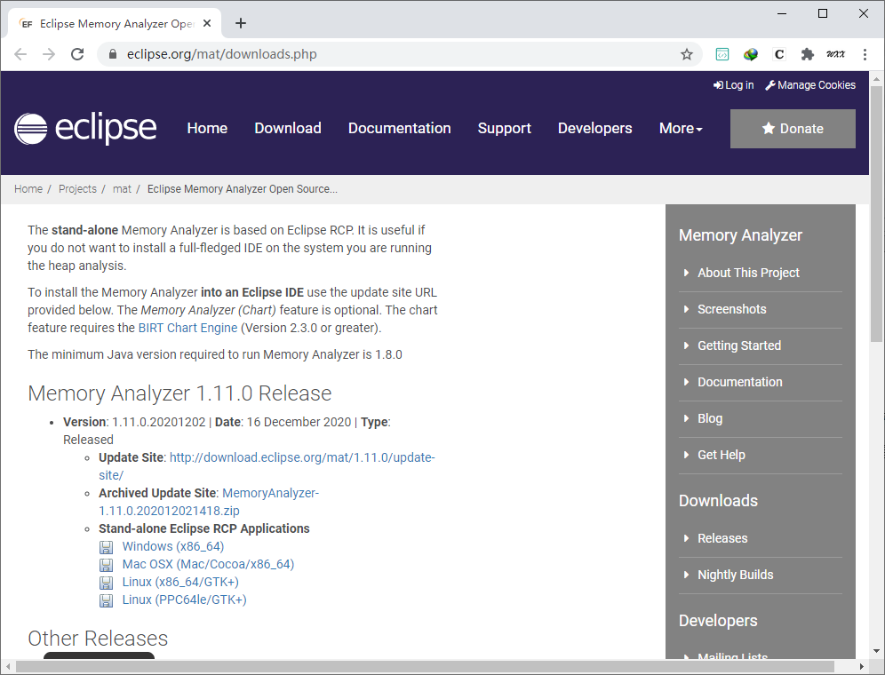

  打开软件后的界面：

  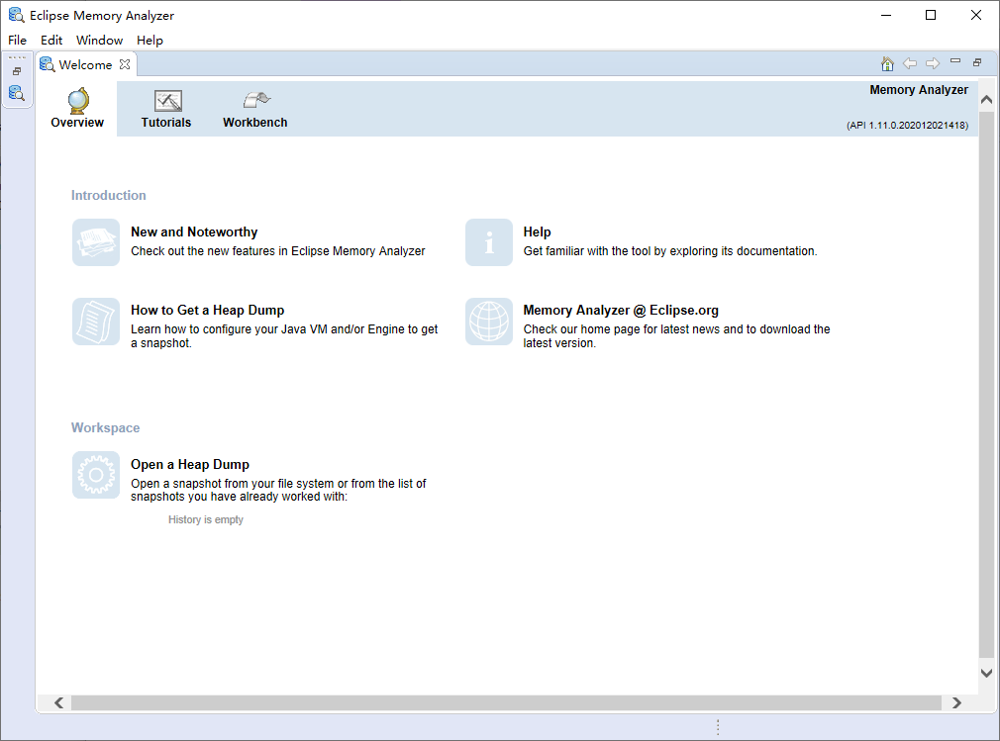

### 4.2 获取堆dump文件

* dump文件内容

  MAT可以分析heap dump文件。进行内存分析时，只要获得了反应当前设备内存映像的hprof文件，通过MAT打开就可以直观的看到当前的内存信息。

  一般来说，这些内存信息包含：

  * 所有的对象信息，包括对象实例、成员变量、存储于栈中的基本数据类型值和存储于堆中的其他对象的引用值。
  * 所有的类信息，包括classloader、类名称、父类、静态变量等。
  * GCRoot到所有的这些对象的引用路径
  * 线程信息，包括线程的调用栈以及此线程的线程局部变量（TLS）

* 两点说明

  * 说明1：MAT不是一个万能工具，它并不能处理所有类型的堆转储文件。但是比较主流的厂家和格式，例如Sun，HP，SAP所采用的HPROF二进制堆转储文件，以及IBM的PHD堆转储文件等都能被很好的解析。
  * 说明2：MAT最吸引人的还是能够快速地为开发人员生成<font color=red>**内存泄露报表**</font>，方便定位问题和分析问题。虽然MAT有如此强大的功能，但是内存分析也没有简单到一键完成的程度，很多内存问题还是需要我们从MAT展现给我们的信息中通过经验和直觉来判断才能发现。

* 如何获取dump文件

  * 方法一：通过前一章介绍的jmap工具生成，可以生成任意一个java进程的dump文件；

  * 方法二：通过配置JVM参数生成。

    （1）选项`-XX:+HeapDumpOnOutOfMemoryError`或`-XX:+HeapDumpBeforeFullGC`

    （2）选项`-XX:HeapDumpPath`所代表的含义就是当程序出现OutofMemory时，将会在相应的目录下生成一份dump文件。如果不指定选项`-XX:HeapDumpPath`则在当前目录下生成dump文件。

  * 方法三：使用VisualVM可以导出堆dump文件

  * 方法四：使用MAT既可以打开一个已有的快照，也可以通过MAT直接从活动Java程序中导出堆快照。该功能将借助jps列出当前正在运行的Java进程，以供选择并获取快照。

    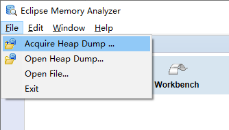

* 通过方法一和方法四生成.hprof文件用于后面的分析，程序代码如下：

  ```java
  /**
   * -Xms600m -Xmx600m -XX:SurvivorRatio=8
   */
  public class OOMTest {
      public static void main(String[] args) {
          ArrayList<Picture> list = new ArrayList<>();
          while (true) {
              try {
                  Thread.sleep(5);
              } catch (InterruptedException e) {
                  e.printStackTrace();
              }
              list.add(new Picture(new Random().nextInt(100 * 50)));
          }
      }
  }
  
  class Picture {
      private byte[] pixels;
  
      public Picture(int length) {
          this.pixels = new byte[length];
      }
  }
  ```

  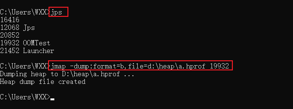

  ---

  

  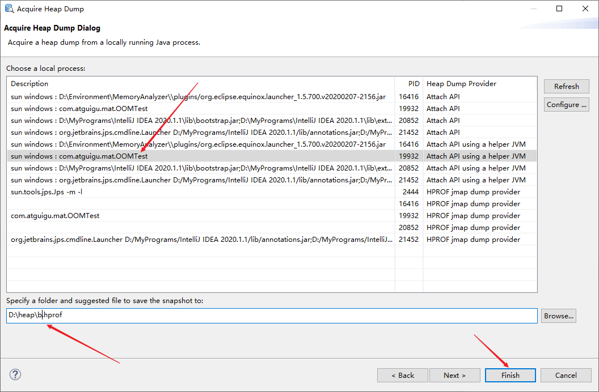

### 4.3 分析堆dump文件

* 在MAT中导入刚才生成的.hprof文件，默认勾选第一项，生成<font color=red>**内存泄露报表**</font>，点击Finish即可

  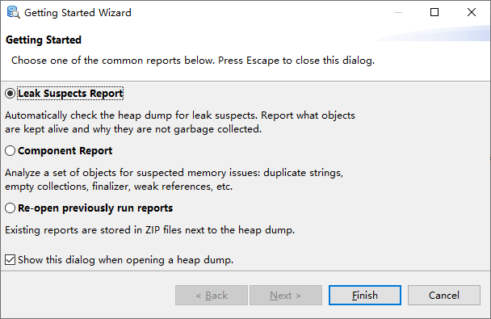

  显示如下：

  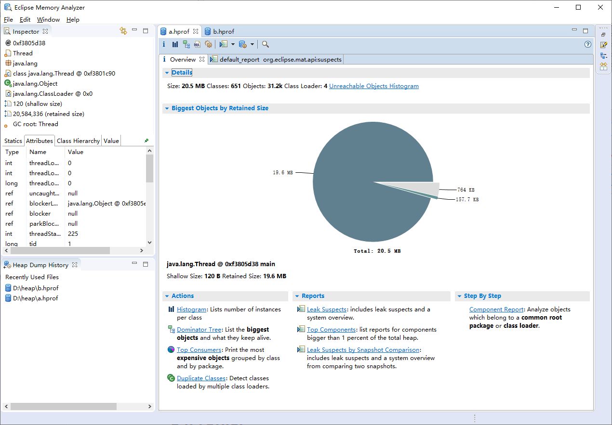

---

* 分析dump文件

  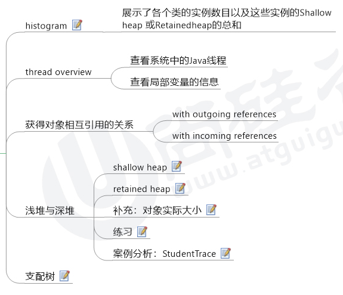

* <font color=red>**histogram**</font>

  展示了各个类的实例数目以及这些实例的Shallow heap或Retainedheap的总和

  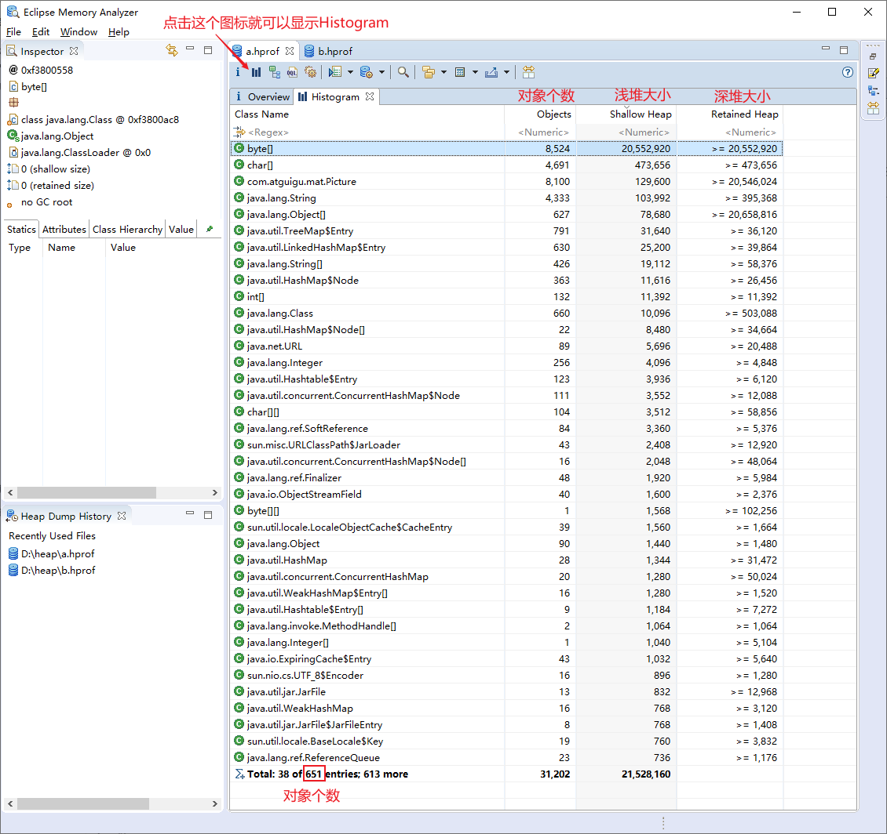

  在这个界面可以进行：分组，排序，写正则表达式，两个.hprof的对比，查看对象被谁引用，......

  例如：查看对象被谁引用，可以进行如下操作：

  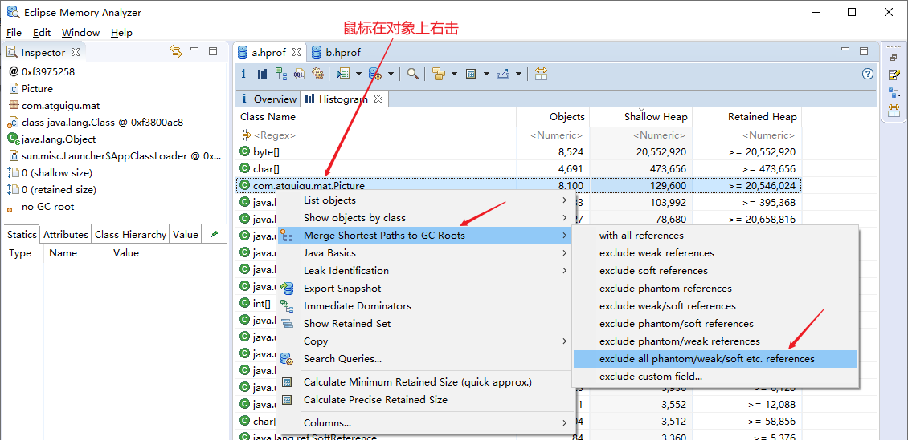

  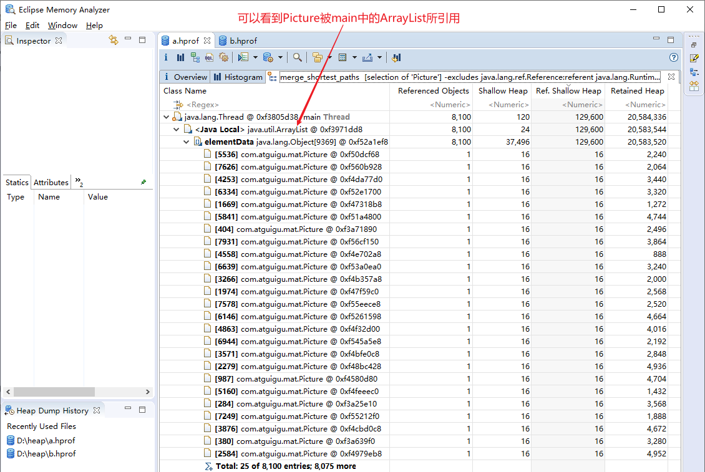

* <font color=red>**thread overview**</font>

  查看系统中的Java线程、查看局部变量的信息。获取对象相互引用关系

  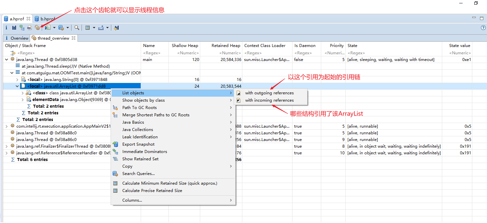

* <font color=red>**深堆与浅堆**</font>

  上面在histogram中提到了浅堆和深堆，下面介绍一些这两者。

  **浅堆：**

  * 浅堆（Shallow Heap）是指一个对象所消耗的内存。在32位系统中，一个对象引用会占据4个字节，一个int类型会占据4个字节，long型变量占据8个字节。根据堆快照格式不同，对象的大小可能会向8字节进行对齐。

  * 以String为例：2个int值共占8个字节，对象引用占用4字节，对象头占8字节，合计20字节，向8字节对齐，故占24字节。（jdk7中）

    | int  | hash32 | 0     |
    | ---- | ------ | ----- |
    | int  | hash   | 0     |
    | ref  | value  | hello |

    这24字节为String对象的浅堆大小。它与String的value实际取值无关，无论字符串长度如何，**浅堆大小始终是24字节**。

  **深堆：**

  * ==保留集（Retained Set）==：

    对象A的保留集指当对象A被垃圾回收后，可以被释放的所有对象集合（包括对象A本身），即对象A的保留集可以被认为是<font color=red>**只能通过**</font>对象A被直接或者间接访问到的所有对象的集合。通俗的说，就是指仅被对象A所持有的对象的集合。

  * ==深堆（Retained Heap）==：

    深堆是指对象的保留集中所有的对象的浅堆大小之和。

  注意：浅堆是指对象本身占用的内存，不包括其内部引用对象的大小。一个对象的深堆指只能通过该对象访问到的（直接或者间接）所有对象的浅堆之和，即对象被回收后，可以释放的真实空间。

  **补充：对象的实际大小**

  * 另外一个常用的概念是对象的实际大小。这里，对象的实际大小定义为一个对象<font color=red>**所能触及的**</font>所有对象的浅堆大小之和，也就是通常意义上我们所说的对象的大小。与深堆相比，似乎这个在日常开发中更为直观和被人接收，<font color=red>**但实际上，这个概念和垃圾回收无关**</font>。

  * 下图显示了一个简单的对象引用关系图。那么对象**A的浅堆大小**只是A本身，不包含C和D，而**A的实际大小**为A、C、D三者之和。而**A的深堆大小**为A和D之和，这是因为由于对象C还可以通过对象B访问到，因此不再对象A的深堆范围内。

    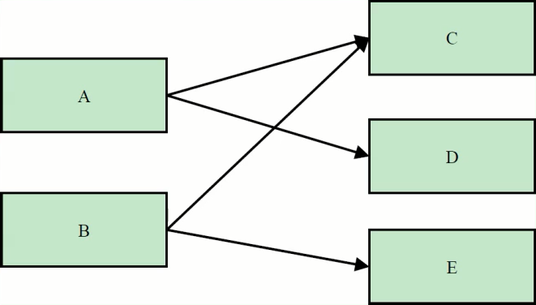

  **例子：看图理解深堆（Retained Size）**

  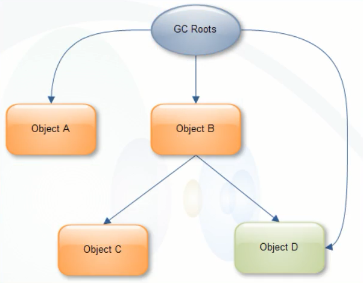

  上图中，GC Roots直接引用了A和B两个对象。

  A对象的深堆大小 = A对象的浅堆大小

  B对象的深堆大小 = B对象的浅堆大小 + C对象的浅堆大小

  如果不包括GC Roots指向D对象这个引用呢？

  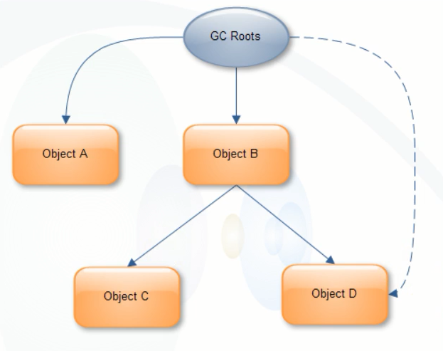

  B对象的深堆大小 = B对象的浅堆大小 + C对象的浅堆大小 + D对象的浅堆大小

* 通过案例分析深堆和浅堆的大小

  案例代码：

  ```java
  /**
   * 有一个学生浏览网页的记录程序，它将记录 每个学生访问过的网站地址。
   * 它由三个部分组成：Student、WebPage和StudentTrace三个类
   * -XX:+HeapDumpBeforeFullGC -XX:HeapDumpPath=d:\student.hprof
   */
  public class StudentTrace {
      
      static List<WebPage> webpages = new ArrayList<>();
      
      public static void createWebPages() {
          for (int i = 0; i < 100; i++) {
              WebPage wp = new WebPage();
              wp.setUrl("http://www." + Integer.toString(i) + ".com");
              wp.setContent(Integer.toString(i));
              webpages.add(wp);
          }
      }
  
      public static void main(String[] args) {
          
          createWebPages();  // 创建了100个网页
          // 创建3个学生对象
          Student st3 = new Student(3, "Tom");
          Student st5 = new Student(5, "Jerry");
          Student st7 = new Student(7, "Lily");
  
          for (int i = 0; i < webpages.size(); i++) {
              if (i % st3.getId() == 0) st3.visit(webpages.get(i));
              if (i % st5.getId() == 0) st5.visit(webpages.get(i));
              if (i % st7.getId() == 0) st7.visit(webpages.get(i));
          }
          webpages.clear();
          System.gc();
      }
  }
  
  // Student浅堆大小：4B(id) + 4B(name) + 4B(history) + 8B(对象头) = 20B --> 填充4B --> 24B
  class Student {
      private int id;
      private String name;
      private List<WebPage> history = new ArrayList<>();
  
      public Student(int id, String name) {
          super();
          this.id = id;
          this.name = name;
      }
  
      public int getId() { return id; }
      public void setId(int id) { this.id = id; }
      public String getName() { return name; }
      public void setName(String name) { this.name = name; }
      public List<WebPage> getHistory() { return history; }
      public void setHistory(List<WebPage> history) { this.history = history; }
      public void visit(WebPage wp) { if (wp != null) history.add(wp); }
  }
  
  class WebPage {
      private String url;
      private String content;
  
      public String getUrl() { return url; }
      public void setUrl(String url) { this.url = url; }
      public String getContent() { return content; }
      public void setContent(String content) { this.content = content; }
  }
  ```

  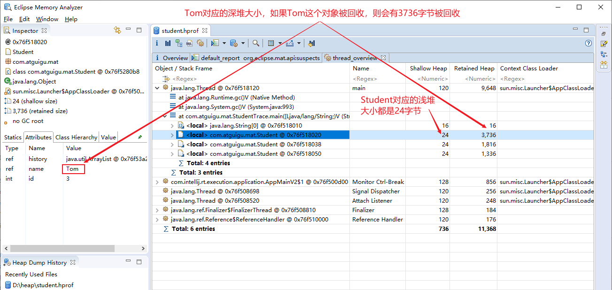

  下面以Lily为例分析深堆的大小是如何计算出来的

  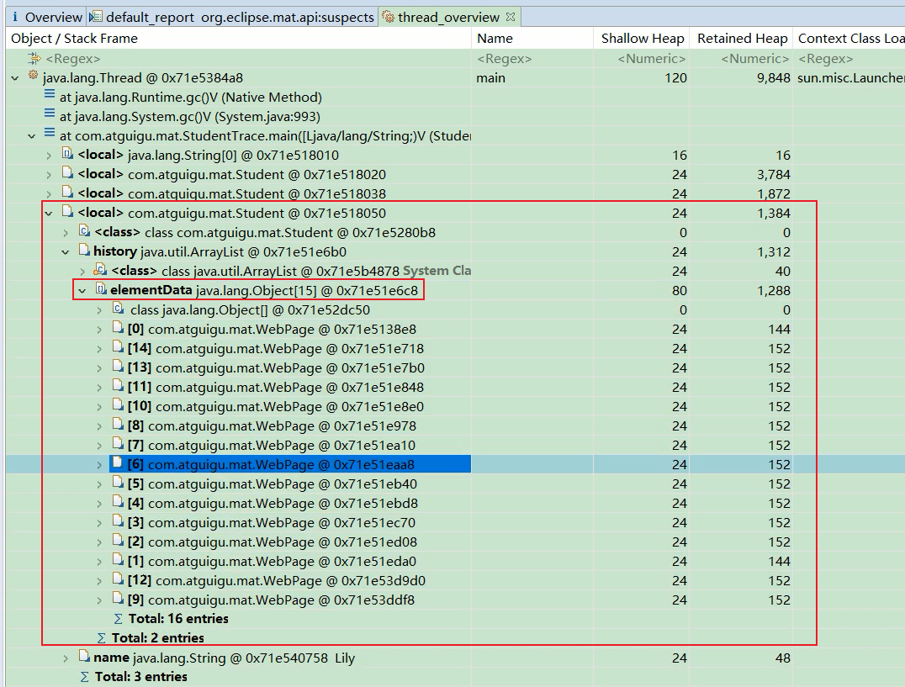

  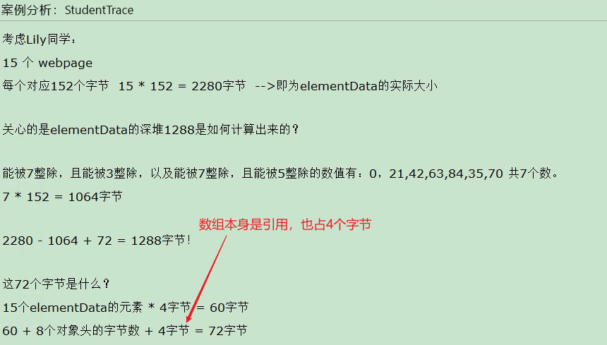

* <font color=red>**支配树**</font>

  支配树的概念来自于图论。

  MAT提供了一个称为支配树（Dominator Tree）的对象图。支配树体现了对象实例间的支配关系。在对象引用图中，所有指向对象B的路径都经过对象A，则认为<font color=red>**对象A支配对象B**</font>。如果对象A是离对象B最近的一个支配对象，则认为对象A为对象B的<font color=red>**直接支配者**</font>。支配树是基于对象间的引用图所建立的，它有以下基本性质：

  * 对象A的子树（所有被对象A支配的对象的集合）表示对象A的保留集（retained set），即深堆。
  * 如果对象A支配对象B，那么对象A的直接支配者也支配对象B。
  * 支配树的边与对象引用图的边不直接对应。

  如下图所示：左图表示对象引用图，由图表示左图所对应的支配树。对象A和B由根对象直接支配，由于在到对象C的路径中，可以经过A，也可以经过B，因此对象C的直接支配者也是根对象。对象F和对象D相互引用，因为到对象F的所有路径必然经过对象D，因此，对象D是对象F的直接支配者。而到对象D的所有路径中，必然经过对象C，即使是从对象F到对象D的引用，从根节点出发，也是经过对象C的，所以，对象D的直接支配者为对象C。

  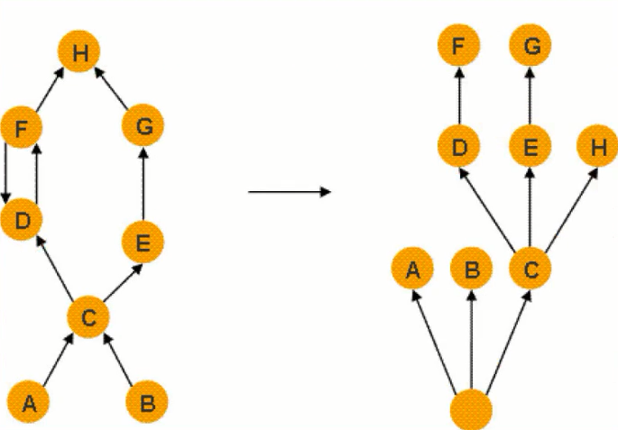

  同理，对象E支配对象G。到达对象H可以通过对象D，也可以通过对象E，因此对象D和E都不能支配对象H，而经过对象C既可以到达对象D也可以到达E，因此对象C为对象H的直接支配者。

  在MAT中，单击工具栏上的对象支配按钮，可以打开对象支配树视图。

  

  下图显示了对象支配树的部分视图。该截图显示部分学生Lily的history队列的直接支配对象。即当Lily对象被回收，也会一并回收的所有对象。显然能被3或者5整除的网页不会出现在该列表中，因为他们同时被另外两名学生对象所引用。

  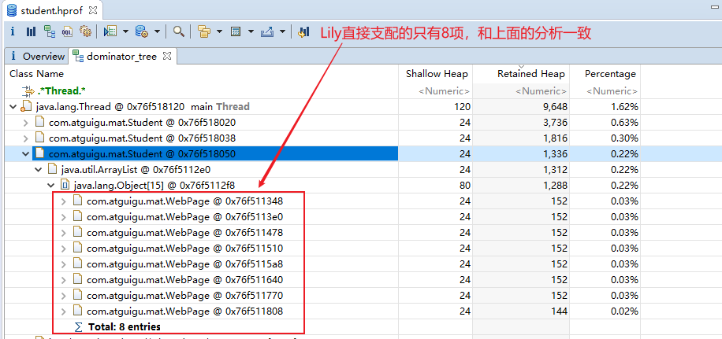

### 4.4 案例：Tomcat堆溢出分析

* Tomcat是最常用的Java Servlet容器之一，同时也可以当做单独的Web服务器使用。Tomcat本身使用Java实现，并运行与Java虚拟机之上，Tomcat有可能会因为无法承受压力而发生内存溢出错误。这里根据一个被压垮的Tomcat的堆快照文件，来分析Tomcat在崩溃时的内部情况。

---

案例分析：

图1：

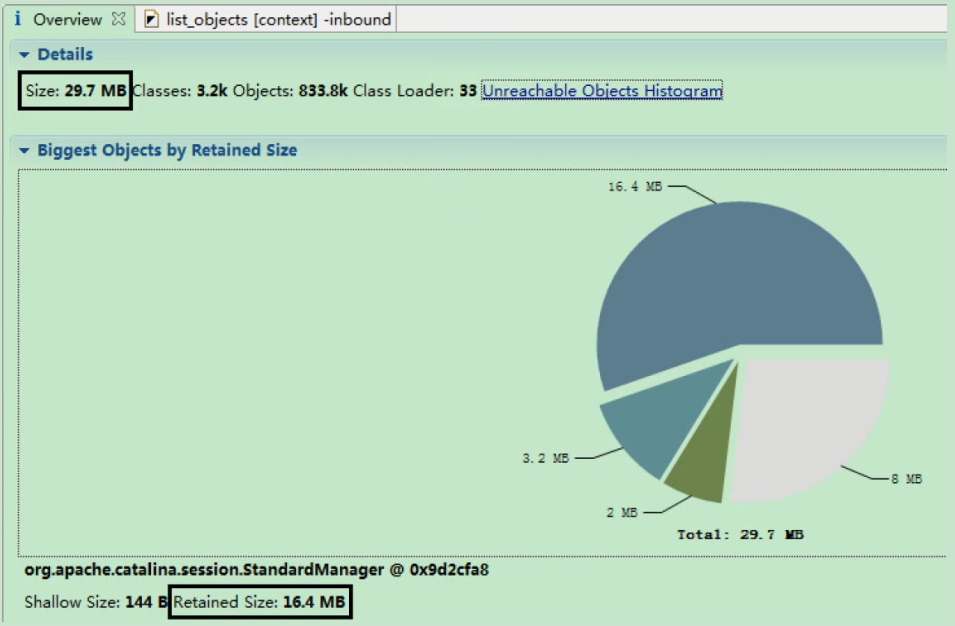

图2：

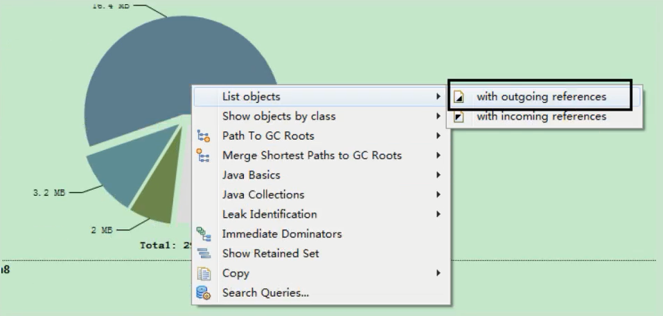

图3：session对象，它占用了17MB空间

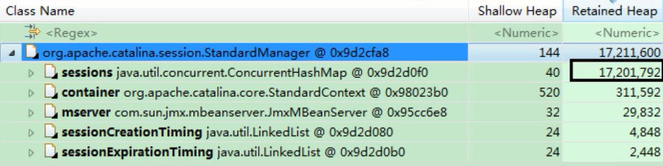

图4：可以看到sessions对象为ConcurrentHashMap，其内部分为16个Segment。从深堆大小看，每个Segment都比较平均，大约为1MB，合计17MB。

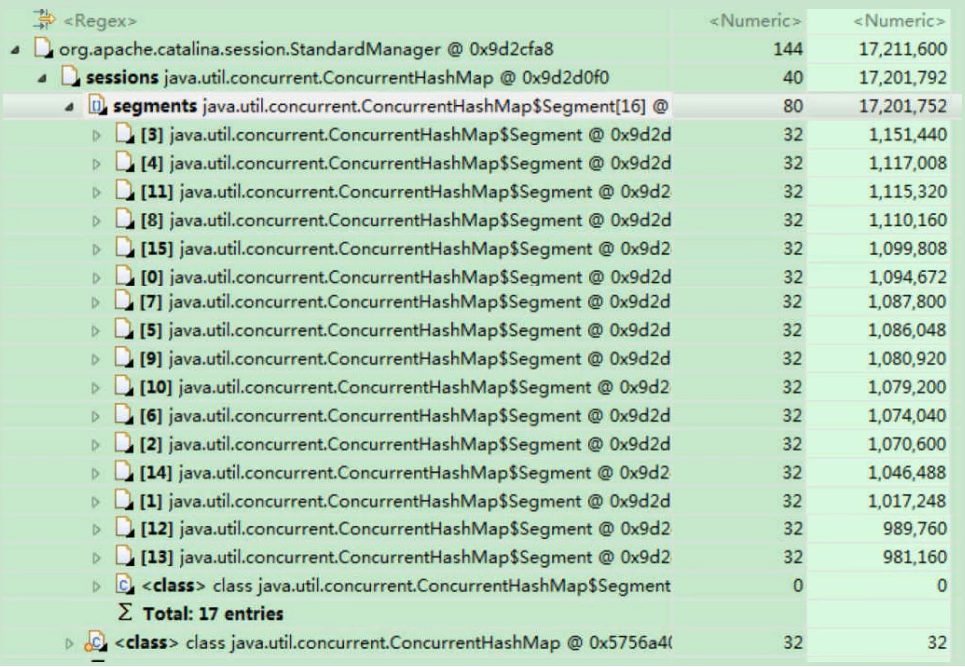

图5：

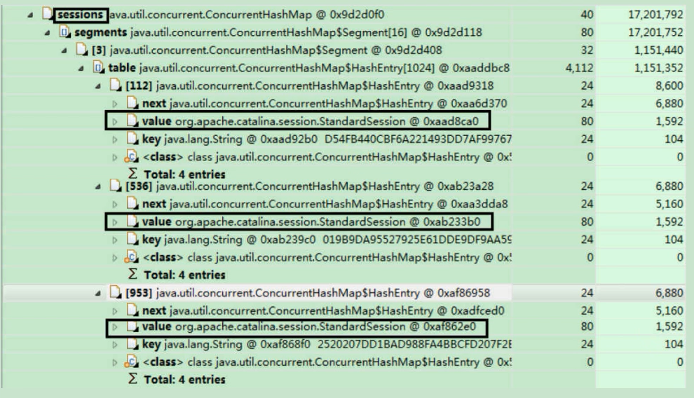

图6：当前堆中含有9941个session，并且每一个session的深堆为1592字节，合计越15MB，达到当前堆大小爱哦的50%。

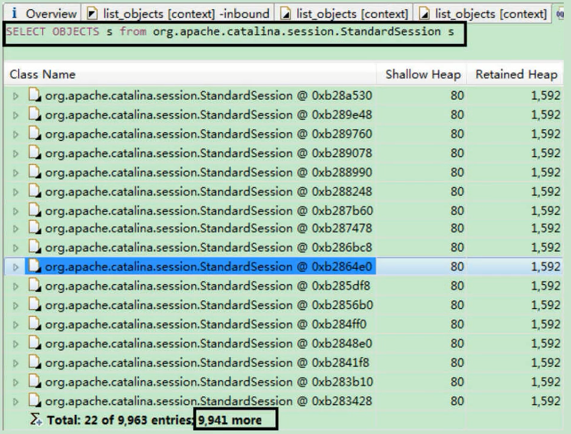

图7：

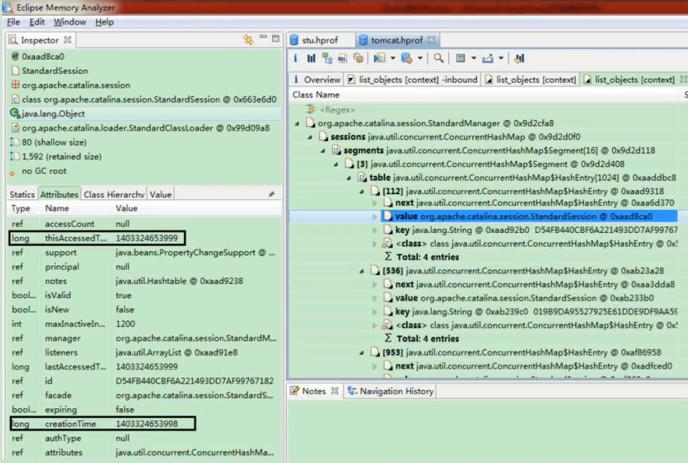

图8：

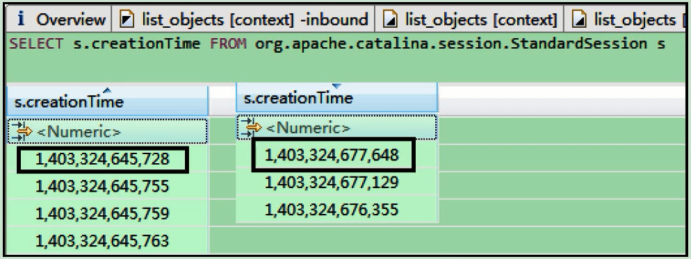

根据当前的session综述，可以计算每秒的平均压力：9941/((1403324677648-1403324645728)/1000) = 311次/秒。

由此推断，在发生Tomcat堆溢出时，Tomcat在连续的30秒的时间内，平均接收了约311次不同客户端的请求，创建了合计9941个session。


### 补充1：再谈内存泄露

> 内存泄露的理解与分类

* ==何为内存泄露（memory leak）==

  

  可达性分析算法来判断对象是否是不再使用的对象，本质上是判断一个对象是否还被引用。那么对于这种情况，由于代码的实现不同就会出现很多内存泄露问题（让JVM误认为此对象还在引用中，无法回收，造成内存泄露）。

  * 是否还被使用？
  * 是非还被需要？

* ==内存泄露（memory leak）的理解==

  <font color=red>**严格来说，**</font><font color=blue>**只有对象不会再被程序用到了，但是GC用不能回收它们的情况，才叫内存泄露。**</font>

  但实际情况很多时候一些不太好的实践（或疏忽）会导致对象的生命周期变得很长甚至导致OOM，也可以叫做<font color=red>**宽泛意义上的“内存泄露”。**</font>

  

  对象X引用对象Y，X的生命周期比Y的生命周期长；

  那么当Y生命周期结束的时候，X依然引用着Y，这时候，垃圾回收是不会回收对象Y的；

  如果对象X还引用着生命周期比较短的A、B、C，对象A又引用着对象a、b、c，这样就可能造成大量无用的对象不能被回收，进而占据了内存资源，造成内存泄露，直至内存溢出。

* ==内存泄露与内存溢出的关系：==

  * 内存泄露（memory leak）

    申请了内存用完了不释放，比如一共1024MB的内存，分配了512MB的内存一致不回收，那么可用的内存只有512MB了，仿佛泄露了一部分；通俗一点讲的话，内存泄露就是【占着茅坑不拉shi】。

  * 内存溢出（out of memory）

    申请内存时，没有足够的内存可以使用；

    通俗一点讲，一个厕所就三个坑，有两个占着茅坑不走的（内存泄露），剩下最后一个坑，厕所表示接待压力很大，这时候一下子来了两个人，坑位（内存）就不够了，内存泄露变成内存溢出了。

  可见，内存泄露和内存溢出的关系：内存泄露的增多，最终导致内存溢出。

* ==泄露的分类==

  * **经常发生**：发生内存泄露的代码会被多次执行，每次执行，泄露一块内存；
  * **偶然发生**：在某些特定情况下才会发生；
  * **一次性**：内存泄露的方法只会被执行一次；
  * **隐式泄露**：一直占着内存不释放，知道执行结束；严格的说这个不算内存泄露，因为最终释放掉了，但是如果执行时间特别长，也可能导致内存耗尽。

---

> Java中内存泄露的8种情况

1. **静态集合类**

   静态集合类，如HashMap、LinkedList等等。如果这些容器为静态的，那么他们的生命周期与JVM程序一直，则容器中的对象在程序结束之前不会被释放，从而造成内存泄露。简单而言，长生命周期的对象持有短生命周期对象的引用，尽管短生命周期的对象不再被使用，但是因为长生命周期对象持有它的引用而导致不能被回收。

   ```java
   public class MemeoryLeak {
       static List list = new ArrayList<>();
       
       public void oomTest() {
           Object obj = new Object();  // 局部变量
           list.add(obj);
       }
   }
   ```

2. **单例模式**

   单例模式，和静态集合导致内存泄露的原因类似，因为单例的静态特性，它的生命周期和JVM的生命周期一样长，所以如果单例对象如果持有外部对象的引用，那么这个外部对象也不会被回收，那么就会造成内存泄露。

3. **内部类持有外部类**

   内部持有外部类，如果一个外部类的实例对象的方法返回了一个内部类的实例对象。这个内部类对象被长期引用了，即使那个外部类实例不再被使用，但是由于内部类持有外部类的实例对象，这个外部类对象将不会被垃圾回收，这也造成内存泄露。

4. **各种连接，如数据库连接、网络连接和IO连接等**

   在对数据库进行操作的过程中，首先需要建立数据库的链接，当不再使用时，需要调用close方法来释放与数据库的连接。只有连接被关闭后，垃圾回收器才会回收对应的对象。

   否则，如果在访问数据库的过程中，对Connection、Statement或ResultSet不显性地关闭，将会造成大量对象无法被回收，从而引起内存泄露。

   ```java
   public static void main(String[] args) {
       try {
           Connection conn = null;
           Class.forName("com.mysql.jdbc.Driver");
           conn = DriverManager.getConnection("url", "", "");
           Statement stmt = conn.createStatement();
           ResultSet rs = stmt.executeQuery("...");
       } catch (Exception e) {  // 异常日志
           
       } finally {
           // 1.关闭结果集
           // 2.关闭声明的对象
           // 3.关闭连接
       }
   }
   ```

5. **变量不合理的作用域**

   一般而言，一个变量的定义的作用范围大于其使用范围，很有可能造成内存泄露。另一方面没有及时地把对象设置为null，很有可能导致内存泄露的发生。

   ```java
   public class UsingRandom {
       private String msg;
       public void receiveMsg() {
           readFromNet();  // 从网络上接收数据保存到msg中
           saveDB();  // 把msg保存到数据库中
       }
   }
   ```

   如上面这个伪代码，通过readReomNet方法把接收的消息保存在变量msg中，然后调用saveDB方法把msg的内容保存到数据库中，此时msg已经就没有用了，由于msg的生命周期与对象的生命周期相同，此时msg还不能被回收，因此造成了内存泄露。

   实际上这个msg变量可以放在receiveMsg方法内部，当方法使用完，那么msg的生命周期也就结束，此时就可以回收了。还有另一种方法，在使用完msg后，把msg设置为null，这样垃圾回收也会回收msg的内存空间。

6. **改变哈希值**

   当一个对象被存储进HashSet集合以后，就不能修改这个对象中那些参与计算的哈希值字段了。否则，对象修改后的哈希值与最初存储进HashSet集合中的哈希值就不同了，在这种情况下，即使contains方法使用该对象的当前引用作为参数去HashSet集合中检索对象，也将返回找不到对象结果，这也会导致无法从HashSet集合中单独删除当前对象，造成内存泄露。

   这也是String为什么被设置为了不可变类型，我们可以放心地把String存入HashSet，或者把String当做HashMap的key值。

   当我们想把自己自定义的类保存到散列表的时候，需要保证对象的hashCode不可变。

   例一：

   ```java
   /**
    * 演示内存泄漏
    */
   public class ChangeHashCode {
       public static void main(String[] args) {
           HashSet set = new HashSet();
           Person p1 = new Person(1001, "AA");
           Person p2 = new Person(1002, "BB");
   
           set.add(p1);
           set.add(p2);
   
           p1.name = "CC";  // 导致了内存的泄漏
           set.remove(p1);  // 删除失败
           // [Person{id=1002, name='BB'}, Person{id=1001, name='CC'}]
           System.out.println(set);  
   
           set.add(new Person(1001, "CC"));
           // [Person{id=1002, name='BB'}, Person{id=1001, name='CC'}, Person{id=1001, name='CC'}]
           System.out.println(set);
   
           set.add(new Person(1001, "AA"));
           // [Person{id=1002, name='BB'}, Person{id=1001, name='CC'}, Person{id=1001, name='CC'}, Person{id=1001, name='AA'}]
           System.out.println(set);
       }
   }
   
   class Person {
       int id;
       String name;
   
       public Person(int id, String name) {
           this.id = id;
           this.name = name;
       }
   
       @Override
       public boolean equals(Object o) {
           if (this == o) return true;
           if (!(o instanceof Person)) return false;
           Person person = (Person) o;
           if (id != person.id) return false;
           return name != null ? name.equals(person.name) : person.name == null;
       }
   
       @Override
       public int hashCode() {
           int result = id;
           result = 31 * result + (name != null ? name.hashCode() : 0);
           return result;
       }
   
       @Override
       public String toString() {
           return "Person{" + "id=" + id + ", name='" + name + '\'' + '}';
       }
   }
   ```

   例二：

   ```java
   /**
    * 演示内存泄漏
    *
    * @author shkstart
    * @create 14:47
    */
   public class ChangeHashCode1 {
       public static void main(String[] args) {
           HashSet<Point> hs = new HashSet<Point>();
           Point cc = new Point();
           cc.setX(10);  // hashCode = 41
           hs.add(cc);
   
           cc.setX(20);  // hashCode = 51  此行为导致了内存的泄漏
   
           System.out.println("hs.remove = " + hs.remove(cc));  // false
           hs.add(cc);
           System.out.println("hs.size = " + hs.size());  // size = 2
   
           System.out.println(hs);  // [Point{x=20}, Point{x=20}]
       }
   
   }
   
   class Point {
       int x;
   
       public int getX() {
           return x;
       }
   
       public void setX(int x) {
           this.x = x;
       }
   
       @Override
       public int hashCode() {
           final int prime = 31;
           int result = 1;
           result = prime * result + x;
           return result;
       }
   
       @Override
       public boolean equals(Object obj) {
           if (this == obj) return true;
           if (obj == null) return false;
           if (getClass() != obj.getClass()) return false;
           Point other = (Point) obj;
           if (x != other.x) return false;
           return true;
       }
   
       @Override
       public String toString() {
           return "Point{" + "x=" + x + '}';
       }
   }
   ```

7. **缓存泄露**

   内存泄露的另一个常见来源是缓存，一旦你把对象放入到缓存中，他就容易遗忘。比如：之前项目在一次上线的时候，应用启动奇慢直到夯死，就是因为代码中会加载一个表中的数据到缓存（内存）中，测试环境只有几百条数据，但是生产环境有几百万的数据。

   对于此问题，可以使用WeakHashMap代表缓存，此种Map的特点是，当除了自己有对key的引用外，此key没有其他引用那么此map会自动丢弃此值。

   ```java
   /**
    * 演示内存泄漏
    */
   public class MapTest {
       static Map wMap = new WeakHashMap();
       static Map map = new HashMap();
   
       public static void main(String[] args) throws Exception {
           init();
           System.out.println("---------------------------");
           testWeakHashMap();
           System.out.println("---------------------------");
           testHashMap();
       }
   
       public static void init() {
           String ref1 = new String("obejct1");
           String ref2 = new String("obejct2");
           String ref3 = new String("obejct3");
           String ref4 = new String("obejct4");
           wMap.put(ref1, "cacheObject1");
           wMap.put(ref2, "cacheObject2");
           map.put(ref3, "cacheObject3");
           map.put(ref4, "cacheObject4");
           System.out.println("String引用ref1，ref2，ref3，ref4 消失");
   
       }
   
       public static void testWeakHashMap() throws InterruptedException {
           System.out.println("WeakHashMap GC之前");
           for (Object o : wMap.entrySet()) System.out.println(o);
           System.gc();
           TimeUnit.SECONDS.sleep(2);
           System.out.println("WeakHashMap GC之后");
           for (Object o : wMap.entrySet()) System.out.println(o);
       }
   
       public static void testHashMap() throws InterruptedException {
           System.out.println("HashMap GC之前");
           for (Object o : map.entrySet()) System.out.println(o);
           System.gc();
           TimeUnit.SECONDS.sleep(2);
           System.out.println("HashMap GC之后");
           for (Object o : map.entrySet()) System.out.println(o);
       }
   
   }
   /**
    * 结果
    * String引用ref1，ref2，ref3，ref4 消失
    * ---------------------------
    * WeakHashMap GC之前
    * obejct2=cacheObject2
    * obejct1=cacheObject1
    * WeakHashMap GC之后
    * ---------------------------
    * HashMap GC之前
    * obejct4=cacheObject4
    * obejct3=cacheObject3
    * HashMap GC之后
    * obejct4=cacheObject4
    * obejct3=cacheObject3
    **/
   ```

   

   上面代码和图示主要演示了WeakHashMap如何自动释放缓存对象，当init函数执行完成后，局部变量字符串引用obejct1，obejct2，obejct3，obejct4都会消失，此时只有静态map中保存了对字符串对象的引用，可以看到，调用gc之后，HashMap没有被回收，而WeakHashMap里面的缓存被回收了。

8. **监听器和回调**

   内存泄露的另一个常见来源是监听器和其他回调，如果客户端在你实现的API中注册回调，却没有显式的取消，那么就会聚集。需要确保回调立即被当做垃圾回收的最佳方法是只保存它的弱引用，例如将它们保存成为WeakHashMap中的键。

---

> 内存泄露案例分析

* ==案例1==

  **案例代码：**

  ```java
  public class Stack {
      private Object[] elements;
      private int size = 0;
      private static final int DEFAULT_INITIAL_CAPACITY = 16;
  
      public Stack() {
          elements = new Object[DEFAULT_INITIAL_CAPACITY];
      }
  
      public void push(Object e) {  // 入栈
          ensureCapacity();
          elements[size++] = e;
      }
      // 存在内存泄漏
      public Object pop() {  // 出栈
          if (size == 0) throw new EmptyStackException();
          return elements[--size];
      }
  
      /*public Object pop() {
          if (size == 0) throw new EmptyStackException();
          Object result = elements[--size];
          elements[size] = null;
          return result;
      }*/
  
      private void ensureCapacity() {
          if (elements.length == size) elements = Arrays.copyOf(elements, 2 * size + 1);
      }
  }
  ```

  **分析：**

  假设这个栈一致增长，增长后如下图所示：

  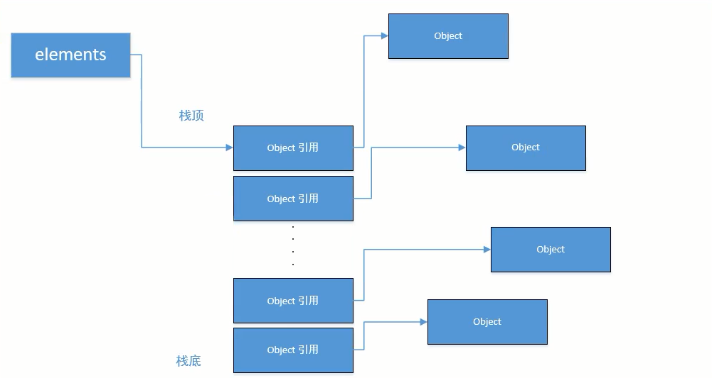

  当进行大量的pop操作时，由于引用未进行置空，gc是不会释放的，如下图所示：

  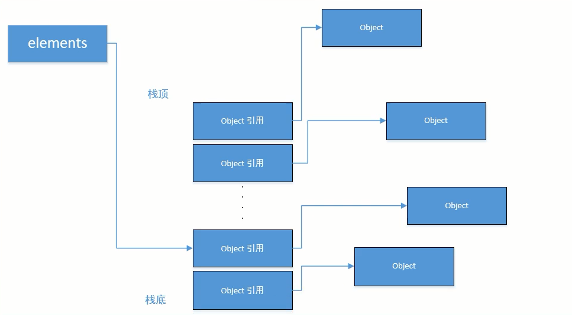

  从上图可以看出，如果栈先增长，后收缩，那么从栈中弹出的对象将不会被当做垃圾被回收，即使程序不再使用栈中的这些对象，我们也不会回收，因为栈中仍然保存这些对象的引用，俗称<font color=red>**引用过期**</font>，这个内存泄露很隐蔽。

  **解决办法：**

  将pop()这个函数该如如下函数即可：

  ```java
  public Object pop() {
      if (size == 0) throw new EmptyStackException();
      Object result = elements[--size];
      elements[size] = null;
      return result;
  }
  ```

* ==案例2==

  **案例代码：**

  ```java
  public class TestActivity extends Activity {
      private static final Object key = new Object();
      
      @Override
      protected void onCreate(Bundle savedInstanceState) {
          super.onCreate(savedInstanceState);
          setContentView(R.layout.activity_main);
          
          new Thread() {  // 匿名线程，退出页面是导致内存泄露
              public void run() {
                  synchronized (key) {
                      try {
                          key.wait();
                      } catch (InterruptedException e) {
                          e.printStackTrace();
                      }
                  }
              }
          }.start();
      }
  }
  ```

  **分析：**

  上面的代码是Android开发中的一个界面，当退出这个界面时，因为TestActivity中中存在未结束的线程，导致无法回收该类，造成内存泄露。

  **解决办法：**

  （1）使用线程时，一定要确保线程在周期性对象（如Activity）销毁时能正常结束，如能正常结束，但是Activity销毁后还需要执行一段时间，也可能造成内存泄露，此时可采用WeakReference方法来解决，另外在使用Hanlder的时候，如存在Delay操作，也可采用WeakReference；

  （2）使用Handler+HandlerThread时，记住在周期性对象销毁时调用looper.quit()方法。


### 补充2 支持使用OQL语言查询对象信息

MAT支持一种类似于SQL的查询语言OQL（Object Query Language）。OQL使用类SQL语法，可以在堆中进行对象的查找和筛选。

* SELECT子句

  在MAT中，Select子句的格式与SQL基本一致，用于指定要显示的列。Select子句中可以使用"*"，查看结果对象的引用实例（相当于outgoing references）。

  ```sql
  SELECT * FROM java.util.Vector v
  ```

  使用"OBJECTS"关键字，可以将返回结果集中的项以对象的形式显示。

  ```sql
  SELECT objects v.elementData FROM java.util.Vector v
  SELECT OBJECTS s.value FROM java.util.String s
  ```

  在Select子句中，使用"AS RETAINED SET"关键字可以得到所得对象的保留集。

  ```sql
  SELECT AS RETAINED SET * FROM com.atguigu.mat.Student
  ```

  "DISTINCT"关键字用于在结果集中去除重复对象。

  ```sql
  SELECT DISTINCT OBJECTS classof(s) FROM java.lang.String s
  ```

* FROM子句

  From子句用于指定查询范围，它可以指定类名、正则表达式或者对象地址。

  ```sql
  SELECT * FROM java.lang.String s
  ```

  下列使用正则表达式，限定搜索范围，输出所有com.atguigu包下所有类的实例

  ```sql
  SELECT * FROM "com\.atguigu\..*"
  ```

  也可以直接使用类的地址进行搜索。使用类的地址的好处是可以区分被不同ClassLoader加载的同一种类型。

  ```sql
  select * from 0x37a0b4d
  ```

* WHERE子句

  Where子句用于指定OQL的查询条件。OQL查询将只返回满足Where子句指定条件的对象。

  Where子句的格式和传统的SQL极为相似。

  下例返回长度大于10的char数组。

  ```sql
  SELECT * FROM char[] s WHERE s.@length>10
  ```

  下例返回包含"java"子字符串的所有字符串，使用"LIKE"操作符，"LIKE"操作符的操作参数为正则表达式。

  ```sql
  SELECT * FROM java.lang.String s WHERE toString(s) LIKE ".*java.*"
  ```

  下例返回所有value域不为null的字符串，使用"="操作符

  ```sql
  SELECT * FROM java.lang.String s where s.value!=null
  ```

  Where子句支持多个条件的AND、OR运算。下例返回数组长度大于15，并且深堆大于1000字节的所有Vector对象

  ```sql
  SELECT * FROM java.util.Vector v WHERE v.elementData.@length>15 AND v.@retainedHeapSize>1000
  ```

* 内置对象和方法

  OQL中可以访问堆内对象的属性，也可以访问堆内代理对象的属性。访问堆内对象的属性时，格式如下：

  ```sql
  # alias为对象名称
  [ <alias>. ] <field> . <field> . <field>
  ```

  访问`java.io.File`对象的path属性，并进一步访问path的value属性：

  ```sql
  SELECT toString(f.path.value) FROM java.io.File f
  ```

  下例显示了String对象的内容、objectid和objectAddress。

  ```sql
  SELECT s.toString(), s.@objectId, s.@objectAddress FROM java.lang.String s
  ```

  下例显示`java.util.Vector`内部数组的长度

  ```sql
  SELECT v.elementData.@length FROM java.util.Vector v
  ```

  下例显示了所有的`java.util.Vector`对象及其子类型

  ```sql
  select * from INSTANCEOF java.util.Vector
  ```


## 5 JProfiler

### 5.1 基本概述

* 介绍

  * 在运行Java的时候有时候想测试运行时占用内存情况，这时候就需要使用测试工具查看了。在eclipse里面有Eclipse Memory Analyer tool（MAT）插件可以测试，而在IDEA中也有这么一个插件，就是JProfiler。

  * JProfiler是由ej-technologies公司开发的一款Java应用性能诊断工具。功能强大，但是收费。

  * [官方下载地址](https://www.ej-technologies.com/products/jprofiler/overview.html)

    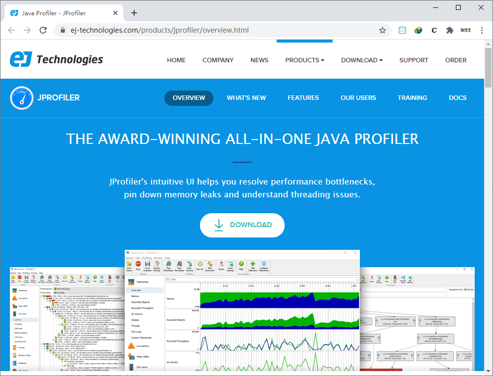

* 特点

  * 使用方便、界面操作友好（简单为强大）

  * 对被分析的应用影响小（提供模板）

  * CPU，Thread，Memory分析功能尤其强大

  * 支持对jdbc，noSql，jsp，servlet，socket等进行分析

  * 支持多种模式（离线，在线）的分析

  * 支持监控本地、远程的JVM

  * 跨平台，拥有多种操作系统的安装版本

    

* 主要功能

  （1）方法调用：对方法调用的分析可以帮助您了解应用程序正在做什么，并找到提高其性能的方法

  （2）内存分配：通过分析堆上对象、引用链和垃圾收集能帮你修复内存泄露问题，优化内存使用

  （3）线程和锁：JProfiler提供多种针对线程和锁的分析视图助您发现多线程问题

  （4）高级子系统：许多性能问题都发生在更高的语义级别上。例如，对JDBC调用，您可能希望找出执行最慢的SQL语句。JProfiler支持对这些子系统进行集成分析

### 5.2 安装与配置

* 下载和安装

  [下载地址](https://www.ej-technologies.com/download/jprofiler/files)

  下载之后安装即可

  

  启动界面：

  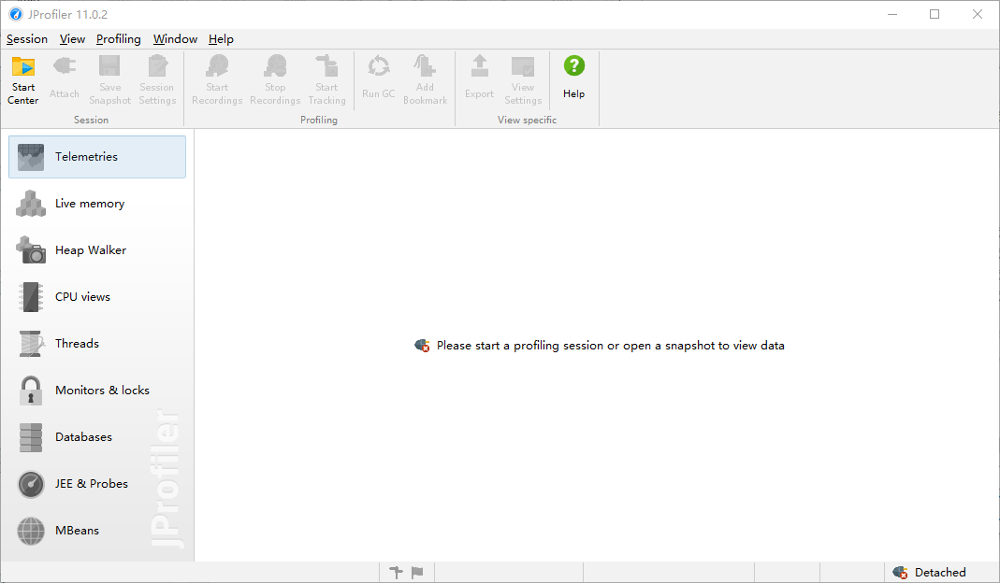

* JProfiler中配置IDEA

  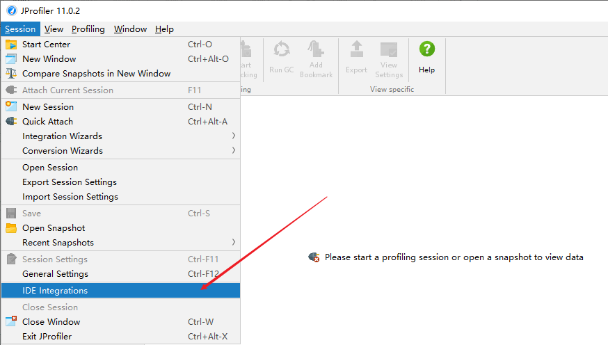

  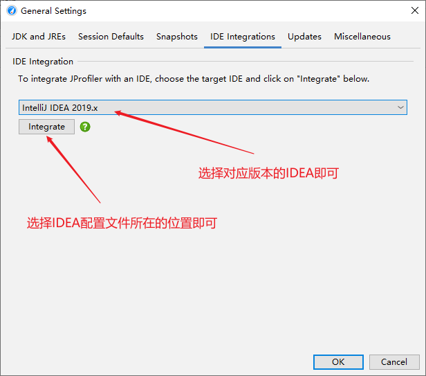

* IDEA集成JProfiler

  分为两步：（1）IDEA中安装jprofiler插件；（2）在Tools中的JProfiler中选择jprofiler.exe所在的位置

  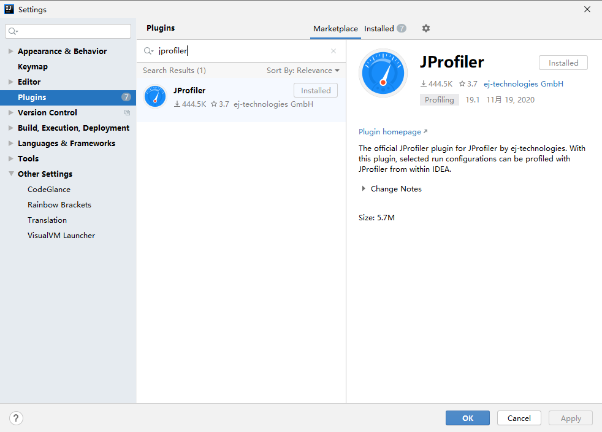

  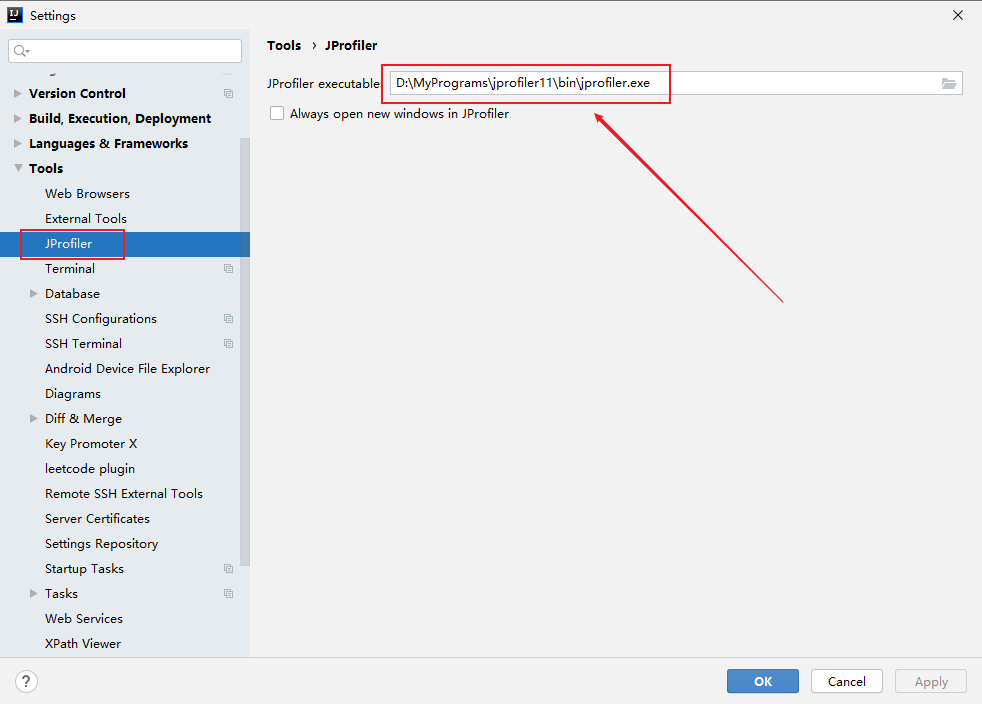

### 5.3 具体使用

测试程序如下：

```java
/**
 * -Xms600m -Xmx600m -XX:SurvivorRatio=8
 */
public class OOMTest {
    public static void main(String[] args) {
        ArrayList<Picture> list = new ArrayList<>();
        while (true) {
            try {
                Thread.sleep(5);
            } catch (InterruptedException e) {
                e.printStackTrace();
            }
            list.add(new Picture(new Random().nextInt(100 * 50)));
        }
    }
}

class Picture {
    private byte[] pixels;

    public Picture(int length) {
        this.pixels = new byte[length];
    }
}
```

> 数据采集方式

* 刚打开JProfiler时，会弹出四个选项，如下：

  

  我们选择第二项可以打开当前正在运行的Java程序，之后会弹出一个窗口，让选择数据采集方式，选择默认后点击OK即可。

  

* JProfiler数据采集方式分为两种：Sampling（样本采集）和Instrumentation（重构模式）

  * Instrumentation：这是JProfiler全功能模式。在class加载之前，JProfiler把相关功能代码写入到需要分析的class的bytecode中，对正在运行的jvm有一定的影响。
    * 优点：功能强大。在此设置中，调用堆栈信息是准确的。
    * 缺点：若要分析的class较多，则对应的性能影响比较大，CPU开销可能很高（取决于Filter的控制）。因此使用此模式一般配合Filter使用，只对特定的类或包进行分析。
  * Sampling：类似于样本统计，每隔一定时间（5ms）将每个线程栈中方法的信息统计出来。
    * 优点：对CPU的开销非常低，对应用影响小（即使你不配置任何Filter）
    * 缺点：一些数据/特性不能提供（例如：方法的调用次数、执行时间）

  注：JProfilter本身没有指出数据的采集类型，这里的采集类型是针对方法调用的采集类型。因为JProfiler的绝大数核心功能都依赖方法调用采集的数据，所以可以直接认为是JProfiler的数据采集类型。

> 遥感检测Telemetries

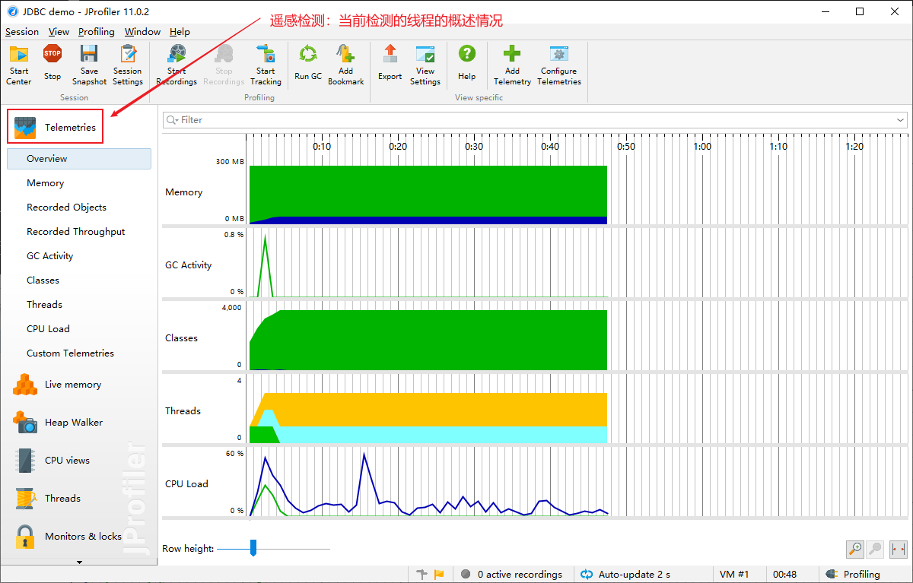

>内存视图Live Memory

class/class instance的相关信息。例如对象的个数，大小，对象创建的方法执行栈，对象创建的热点。

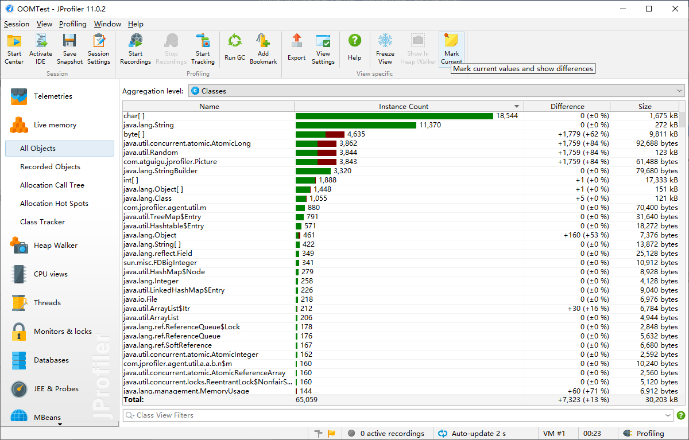

* All Objects ----> 所有对象

  显示所有加载的类的列表和在堆上分配的实例数。只有Java 1.5（JVMTI）才会显示此图。

* Record Objects ----> 记录对象

  查看特定时间段对象的分配，并记录分配的调用堆栈。

* Allocation Call Tree ----> 分配访问树

  显示一颗请求树或者方法、类、包或对已选择类有待注释的分配信息的J2EE组件。

* Allocation Hot Spots ----> 分配热点

  显示一个列表，包括方法、类、包或已分配已选类的J2EE组件。你可以标注当前值并且显示差异值。对于每个热点都可以显示它的跟踪记录树。

* Class Tracker ----> 类追踪器

  类跟踪视图可以包含任意数量的图标，显示选定的类和包的实例和时间。

分析：内存中的对象的情况
（1）频繁创建的Java对象：死循环、循环次数过多

（2）存在大的对象：读取文件时，byte[]应该边读边写。---->如果长时间不写出的话，导致byte[]过大

（3）存在内存泄露

> 堆遍历heap walker

......

> cpu视图 cpu views

......

> 线程视图threads

.....

> 监视器&锁 Monitors&locks

......

### 5.4 案例分析

* 案例1：

  ```java
  /**
   * 功能演示测试
   * 不存在内存泄露的程序
   */
  public class JProfilerTest {
      public static void main(String[] args) {
          while (true) {
              ArrayList list = new ArrayList();
              for (int i = 0; i < 500; i++) {
                  Data data = new Data();
                  list.add(data);
              }
              try {
                  TimeUnit.MILLISECONDS.sleep(500);
              } catch (InterruptedException e) {
                  e.printStackTrace();
              }
          }
      }
  }
  
  class Data {
      private int size = 10;
      private byte[] buffer = new byte[1024 * 1024];//1mb
      private String info = "hello,atguigu";
  }
  ```

* 案例2：

  ```java
  /**
   * 存在内存泄露
   */
  public class MemoryLeak {
  
      public static void main(String[] args) {
          while (true) {
              ArrayList beanList = new ArrayList();
              for (int i = 0; i < 500; i++) {
                  Bean data = new Bean();
                  data.list.add(new byte[1024 * 10]);//10kb
                  beanList.add(data);
              }
              try {
                  TimeUnit.MILLISECONDS.sleep(500);
              } catch (InterruptedException e) {
                  e.printStackTrace();
              }
          }
      }
  
  }
  
  class Bean {
      int size = 10;
      String info = "hello,atguigu";
      // ArrayList list = new ArrayList();
      static ArrayList list = new ArrayList();  // 会存在内存泄露问题
  }
  ```


## 6 Arthas

### 6.1 基本概述

* 背景：

  前面，我们介绍了jdk自带的jvisualvm等免费工具，以及商业化工具JProfiler。这两款工具在业界知名度也比较高，他们的优点是可以在图形化界面上看到各个维度的性能数据，使用者根据这些数据进行综合分析，然后判断哪里出现了性能问题。

  但是这两款工具也有缺点，都必须在服务端项目进程中配置相关监控参数。然后工具通过远程连接到项目进程，获取相关数据。这样就带来一些不便，比如线上环境的网络是隔离的，本地的监控工具根本连不上线上环境。并且类似于Jprofiler这样的商业工具，是需要付费的。

  那么有没有一款工具不需要远程连接，也不需要配置监控参数，同时提供了丰富的性能监控数据呢？

  这就是下面要介绍的一款**阿里巴巴开源的性能分析神器Arthas（阿尔萨斯）**

* 概述

  `Arthas` 是Alibaba开源的Java诊断工具，深受开发者喜爱。

  当你遇到以下类似问题而束手无策时，`Arthas`可以帮助你解决：

  1. 这个类从哪个 jar 包加载的？为什么会报各种类相关的 Exception？
  2. 我改的代码为什么没有执行到？难道是我没 commit？分支搞错了？
  3. 遇到问题无法在线上 debug，难道只能通过加日志再重新发布吗？
  4. 线上遇到某个用户的数据处理有问题，但线上同样无法 debug，线下无法重现！
  5. 是否有一个全局视角来查看系统的运行状况？
  6. 有什么办法可以监控到JVM的实时运行状态？
  7. 怎么快速定位应用的热点，生成火焰图？

  `Arthas`支持JDK 6+，支持Linux/Mac/Windows，采用命令行交互模式，同时提供丰富的 `Tab` 自动补全功能，进一步方便进行问题的定位和诊断。

* 基于哪些工具开发而来

  * greys-anatomy：**Arthas代码基于Greys二次开发而来**，非常感谢Greys之前所有的工作，以及Greys原作者对Arthas提出的意见和建议。
  * termd：**Arthas的命令行基于termd开发**，是一款优秀的命令行程序开发框架，感谢termd提供了优秀的框架。
  * crash：**Arthas的文本渲染功能基于crash中的文本渲染功能开发**，可以从这里看到源码，感谢crash在这方面所做的优秀工作。
  * cli：**Arthas的命令行界面**基于vert.x提供的cli库进行开发，感谢vert.x在这方面做的优秀的工作。
  * complier Arthas里的**内存编辑器代码**来源
  * Apache Commons Net Arthas里的Telnet Client代码来源
  * JavaAgent：运行在main方法之前的拦截器，它内定的方法名叫permain，也就是说先执行permain然后再执行main方法
  * ASM：一个通用的Java字节码操作和分析框架。他可以用于修改现有的类或直接以二进制形式动态生成类。ASM提供了一些常见的字节码转换和分析算法，可以从他们构建定制的复杂转换和代码分析工具。ASM提供了与其他Java字节码框架类似的功能，但是主要关注性能。因为它被设计和实现得尽可能小和块，所以非常适合在动态系统中使用（当然也可以以静态方式使用，例如在编译器中）。

* 官方使用文档：[网址](https://arthas.aliyun.com/zh-cn)

  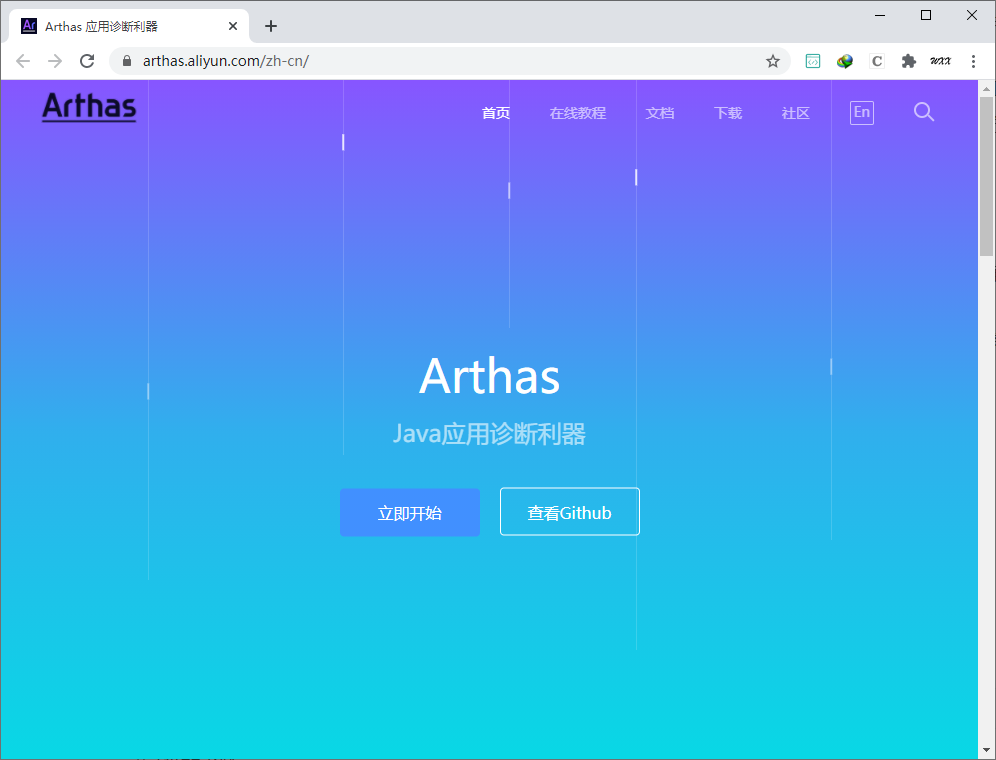

### 6.2 安装与使用

> 安装

* **安装方式一**：可以直接在Linux上通过命令下载

  可以在官方Github上进行下载，如果下载碎度较慢，可以尝试国内的码云Gitee下载。

  * Github下载

    ```shell
    wget https://alibaba.github.io/arthas/arthas-boot.jar
    ```

  * Gitee下载

    ```shell
    wget https://arthas.gitee.io/arthas-boot.jar
    ```

* **安装方式二**

  也可以在浏览器中直接访问 [网址](https://alibaba.github.io/arthas/arthas-boot.jar)，等到下载成功后，上传到Linux服务器上。

> 卸载

* 在Linux/Unix/mac平台，删除下面文件：

  ```shell
  rm -rf ~/.arthas/
  rm -rf ~/logs/arthas
  ```

* Windows平台直接删除user home下面的.arthas和logs/arthas目录

> 工程目录

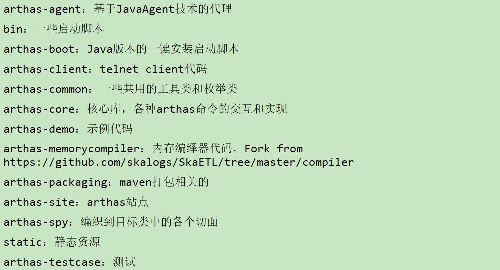

> 启动

```shell
# 方式一：检测当前服务器上的Java进程，并将进程列表展示出来，用户输入对应的编号进行选择，然后回车
java -jar arthas-boot.jar
# 方式二：运行时选择Java进程PID
java -jar arthas-boot.jar [PID]
```

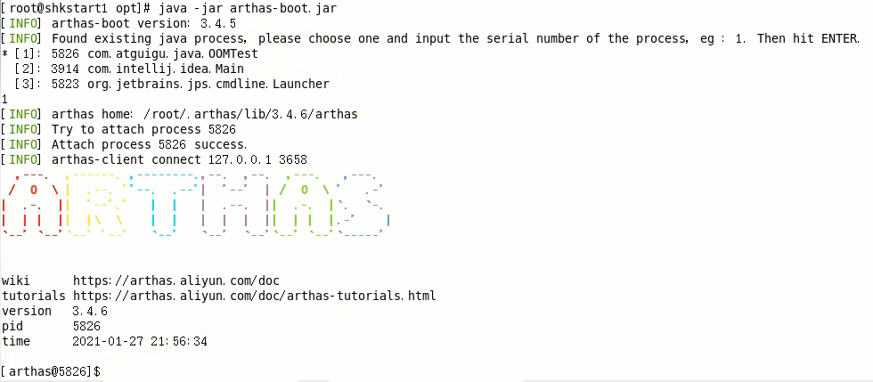

> web console

* 除了在命令行查看外，Arthas目前还支持Web Console。在成功启动连接进程之后就已经启动，可以直接访问：http://127.0.0.1:8563/ 访问，页面上的操作模式和控制台完全一样。

  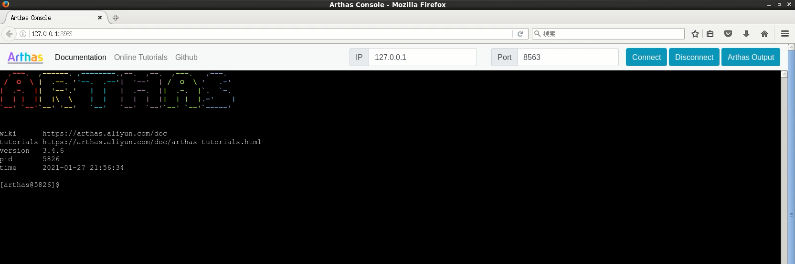

> 其他

```shell
# 查看日志
cat ~/logs/arthas/arthas.lg
# 查看帮助
java -jar arthas-boot.jar -h
# 退出
quit\exit  # 退出当前客户端
stop\shutdown  # 关闭arthas服务端，并退出所有客户端
```

### 6.3 相关诊断命令

[命令帮助网址](https://arthas.gitee.io/advanced-use.html)

> 基础指令

```shell
help    	# 查看帮助命令信息
cat    		# 打印文件内容，和linux里的 cat 命令类似
echo		# 打印参数，和linux里的 echo 命令类似
grep 		# 匹配查找，和linux里的 grep 命令类似
tee			# 复制标准输入到标准输出和指定文件，和linux里的 tee 命令类似
pwd			# 返回当前的工作目录，，和linux里的 pwd 命令类似
cls			# 清空当前屏幕区域
session		# 查看当前会话的信息
reset		# 重置增强类，将被Arthas增强过的类全部还原，Arthas服务端关闭时会重置所有增强过的类
version		# 输出当前目标Java进程所加载的Arthas版本号
history		# 打印历史命令
quit		# 退出当前Arthas客户端，其他Arthas客户端不受影响
stop		# 关闭Arthas服务端，所有Arthas客户端不受影响
keymap		# Arthas快捷键列表及自定义快捷键
```

> jvm相关

- [dashboard](https://arthas.gitee.io/dashboard.html)——当前系统的实时数据面板
- [thread](https://arthas.gitee.io/thread.html)——查看当前 JVM 的线程堆栈信息
- [jvm](https://arthas.gitee.io/jvm.html)——查看当前 JVM 的信息
- [sysprop](https://arthas.gitee.io/sysprop.html)——查看和修改JVM的系统属性
- [sysenv](https://arthas.gitee.io/sysenv.html)——查看JVM的环境变量
- [vmoption](https://arthas.gitee.io/vmoption.html)——查看和修改JVM里诊断相关的option
- [perfcounter](https://arthas.gitee.io/perfcounter.html)——查看当前 JVM 的Perf Counter信息
- [logger](https://arthas.gitee.io/logger.html)——查看和修改logger
- [getstatic](https://arthas.gitee.io/getstatic.html)——查看类的静态属性
- [ognl](https://arthas.gitee.io/ognl.html)——执行ognl表达式
- [mbean](https://arthas.gitee.io/mbean.html)——查看 Mbean 的信息
- [heapdump](https://arthas.gitee.io/heapdump.html)——dump java heap, 类似jmap命令的heap dump功能

> class/classloader相关

- [sc](https://arthas.gitee.io/sc.html)——查看JVM已加载的类信息
- [sm](https://arthas.gitee.io/sm.html)——查看已加载类的方法信息
- [jad](https://arthas.gitee.io/jad.html)——反编译指定已加载类的源码
- [mc](https://arthas.gitee.io/mc.html)——内存编译器，内存编译`.java`文件为`.class`文件
- [retransform](https://arthas.gitee.io/retransform.html)——加载外部的`.class`文件，retransform到JVM里
- [redefine](https://arthas.gitee.io/redefine.html)——加载外部的`.class`文件，redefine到JVM里
- [dump](https://arthas.gitee.io/dump.html)——dump 已加载类的 byte code 到特定目录
- [classloader](https://arthas.gitee.io/classloader.html)——查看classloader的继承树，urls，类加载信息，使用classloader去getResource

> monitor/watch/trace相关

请注意，这些命令，都通过字节码增强技术来实现的，会在指定类的方法中插入一些切面来实现数据统计和观测，因此在线上、预发使用时，请尽量明确需要观测的类、方法以及条件，诊断结束要执行 `stop` 或将增强过的类执行 `reset` 命令。

- [monitor](https://arthas.gitee.io/monitor.html)——方法执行监控
- [watch](https://arthas.gitee.io/watch.html)——方法执行数据观测
- [trace](https://arthas.gitee.io/trace.html)——方法内部调用路径，并输出方法路径上的每个节点上耗时
- [stack](https://arthas.gitee.io/stack.html)——输出当前方法被调用的调用路径
- [tt](https://arthas.gitee.io/tt.html)——方法执行数据的时空隧道，记录下指定方法每次调用的入参和返回信息，并能对这些不同的时间下调用进行观测

> 其他

profiler/火焰图


## 7 Java Mission Control

### 7.1 历史

* 在Oracle收购Sun之前，Oracle的Jrocket虚拟机提供了一款叫做JRocket Mission Control的虚拟机诊断工具。
* 在Oracle收购Sun之后，Oracle公司同时拥有了Sun Hotspot和JRocket两款虚拟机。根据Oracle对于Java的战略，在今后的发展中，会将JRocket的优秀特性移植到Hotspot上，其中，一个重要的改进就是在Sun的JDK中加入了JRocket的支持。
* 在Oracle JDK 7u40之后，Mission Control这款工具已经绑定在Oracle JDK中发布。
* 自Java 11开始，本节介绍的JFR已经开源。但是之前的Java版本，JFR属于Commercial Feature，需要通过Java虚拟机参数`-XX:+UnlockCommercialFeatures`开启。
* 如果你有兴趣请可以查看OpenJDK的Mission Control项目：[网址](https://github.com/JDKMissionControl/jmc)

### 7.2 启动

* Mission Control位于`%JAVA_HOME%/bin/jmc.exe`，打开这款软件。

  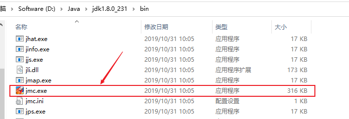

  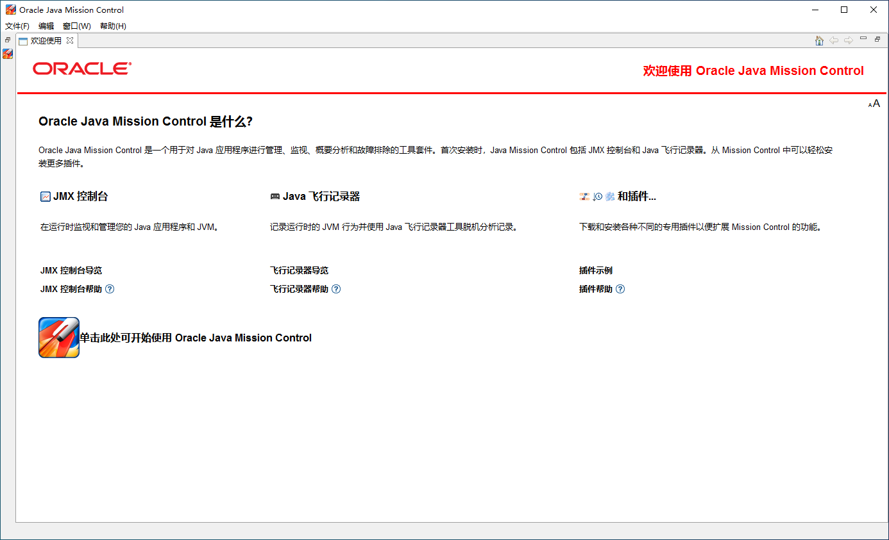

### 7.3 概述

* Java Mission Control（简称JMC），Java官方提供的性能强劲的工具。是一个用于对Java应用程序进行管理、监视、概要分析和故障排除的工具套件。
* 它包含一个GUI客户端，以及众多用来收集Java虚拟机性能数据的插件，如JMX Console（能够访问用来存放虚拟机各个子系统运行数据的MXBeans），以及虚拟机内置的高效profiling工具Java Flight Recorder（JFR）。
* JMC的另一个优点就是：采用取样，而不是传统的代码置入技术，对应用性能的影响非常非常小，完全可以开着JMC来做压测（唯一影响可能是full gc多了）。

### 7.4 功能：实时监控JVM运行时的状态

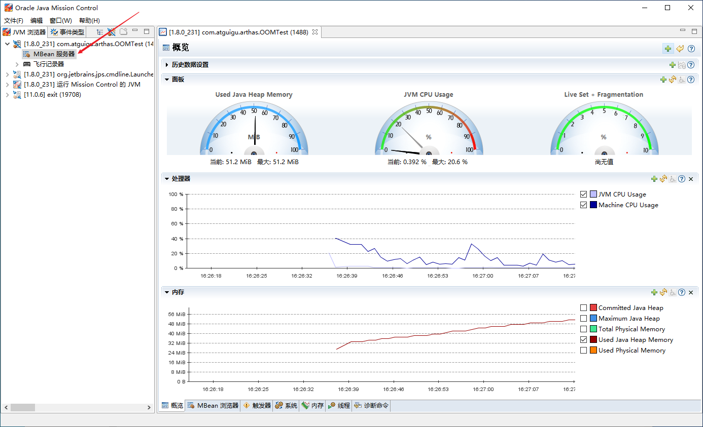

### 7.5 Java Flight Recorder

Java Flight Recorder是JMC其中的一个组件。

Java Flight Recorder能够以**极低的性能开销收集Java**虚拟机的性能数据。

JFR的性能开销小，在默认配置下平均低于1%，与其他工具相比，JFR能够直接访问虚拟机内的数据，并且不会影响虚拟机的优化。因此，**它非常适用于生产环境下满负荷运行下的Java程序**。

JFR和JMC共同创建了一个完整的工具链。JDK Mission Control可对Java Flight Recorder连续收集低水平和详细的运行时信息进行高效详细的分析。

> 事件的类型

* 当启用时，JFR将记录运行过程中发生的一系列事件。其中包括Java层面的事件，如线程事件、锁事件，以及Java虚拟机内部的事件，如新建对象、垃圾回收和即时编译时间。

* 按照事件发生时机以及持续时间来划分，JFR的事件供有四种类型，他们分别为以下四种。

  （1）瞬时事件（Instant Event）：用户关心的是它们发生与否，例如异常、线程启动事件。

  （2）持续事件（Duration Event）：用户关心的是它们的运行时间，例如垃圾回收事件。

  （3）计时事件（Timed Event）：是时长超出指定阈值的持续事件。

  （4）取样事件（Sample Event）：是周期性取样的事件。

* 取样事件的其中一个常见例子便是方法抽样（Method Sampling），即每隔一段时间统计各个线程的栈轨迹。如果在这些抽样取得的栈轨迹中存在一个反复出现的方法，那么我们可以推断该方法是热点方法。

> 启动方式

* 方式1：在运行目标Java程序中添加`-XX:StartFlightRecording=参数`。

  比如：下面命令中，JFR将会在Java虚拟机启动5s后（对应delay=5s）收集数据，持续20s（对应duration=20s）。当收集完毕后，JFR会将收集到的数据保存至指定的文件中（对应filename=myrecording.jar）

  ```shell
  java -XX:StartFlightRecording=delay=5s,duration=20s,filename=myrecording.jar,settings=profile MyApp
  ```

  由于JFR将持续收集数据，如果不加以限制，那么JFR可能会填满硬盘的所有空间。因此，我们有必要对这种模式下所收集的数据进行限制。比如：

  ```shell
  java -XX:StartFlightRecording=maxage=10m,maxsize=100m,name=SomeLabel MyApp
  ```

* 方式2：通过jcmd来让JFR开始收集数据、停止收集数据，或者保存所收集的数据，对应的子命令分别为

  ```shell
  JFR.start
  JFR.stop
  JFR.dump
  ```

  运行如下命令，可以让目标进程中的JFR开始收集数据

  ```shell
  jcmd <PID> JFR.start settings=profile maxage=10m maxsize=150m name=SomeLabel
  ```

  此时，我们可以通过如下命令来导出已经收集到的数据：

  ```shell
  jcmd <PID> JFR.dump name=SomeLabel filename=myrecording.jfr
  ```

  最后，我们可以通过下述命令关闭目标进程中的JFR：

  ```shell
  jcmd <PID> JFR.stop name=SomeLabel
  ```

* 图形界面方式：jdk自带的 飞行记录仪

> Java Flight Recorder取样分析

* 要采用取样，必须先添加参数

  ```shell
  -XX:+UnlockCommercialFeatures
  -XX:+FlightRecorder
  ```

  否则：

  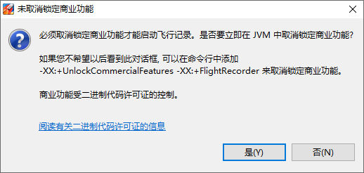


## 8其他工具

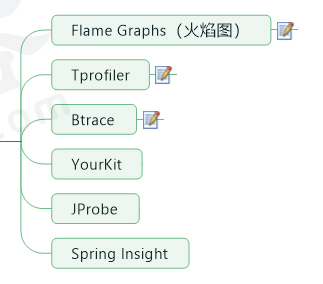

* 火焰图

  通过Arthas可以生成火焰图。

  在追求极致性能的场景下，了解你的程序运行过程中CPU在干什么很重要，火焰图就是一种非常直观的展示CPU在程序整个生命周期过程中时间分配的工具。

  现代程序员对于火焰图不应该陌生，这个工具可以非常直观的显示出调用栈中的CPU消耗瓶颈。

  网上关于java火焰图的讲解大部分来自于Brendan Gregg的博客：[网址](http://www.brendangregg.com/flamegraphs.html)

* Tprofiler

  * 案例：

    使用JDK自身提供的工具进行JVM调优可以将TPS由2.5提升到了20（提升了7倍），并准确定位系统瓶颈。

    系统瓶颈有：应用里静态对象太多、有大量的业务线程在频繁创建一些生命周期很长的临时对象，代码里有问题。

    那么，如何在海量业务代码里边准确定位这些性能代码？这里使用了阿里开源工具TProfiler来定位这些性能代码，成功解决掉GC过于频繁的性能瓶颈，并最终在上次优化的基础上将TPS再提升4倍，即提升到100。

  * TProfiler 配置部署、远程操作、日志阅读都不复杂，操作还是很简单的。但是其却能够起到一阵见血、立杆见影的效果，帮我们解决了GC过于频繁的性能瓶颈。

  * TProfiler最重要的特性就是能够统计出你指定时间段内JVM的top method，这些top method极有可能就是造成JVM性能瓶颈的元凶。这是其他大多数JVM调优工具所不具备的，包括JRocket Mission Control。JRocket首席开发者Marcus Hirt在其私人博客《Low Overhead Method Profilering with Java Mission Control》下的评论中层明确指出JRMC并不支持TOP方法的统计。

  * TProfiler下载：[网址](https://github.com/alibaba/TProfiler)


