# 第25章 JVM运行时参数

> 来自尚硅谷宋红康老师讲解的JVM：[bilibili链接](https://www.bilibili.com/video/BV1PJ411n7xZ)


## 1 JVM参数选项类型

### 1.1 类型一：标准参数选项

* 特点：比较稳定，后续版本基本不会变化，<font color=red>**以-开头**</font>

* 各种选项：运行java或者java -help可以看到所有的标准选项

  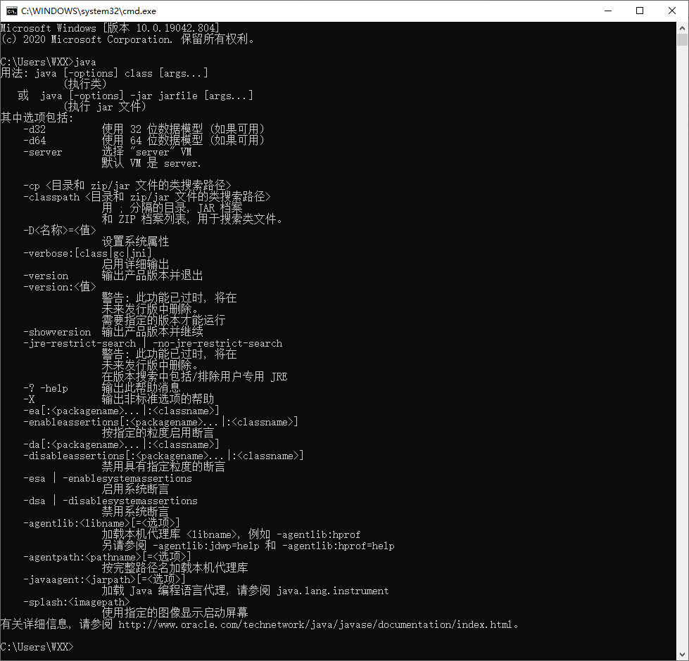

* 补充内充：-server与-client

  Hotspot JVM有两种模式，分别是server和client，分别通过-server和-client模式设置

  * 在32位Windows系统上，默认使用Client类型的JVM。要想使用Server模式，则机器配置至少有2个以上的CPU和2G以上的物理内存。client模式适用于对内存较小的桌面应用程序，默认使用Serial串行垃圾收集器。
  * 64位机器上只支持server模式的JVM，使用于需要大内存的应用程序，默认抵用并行垃圾收集器

* 关于server和client的官网介绍：[网址](https://docs.oracle.com/javase/8/docs/technotes/guides/vm/server-class.html)

### 1.2 类型二：-X参数

* 特点：非标准化参数，功能还是比较稳定的。但官方说后续版本可能会变更，<font color=red>**以-X开头**</font>

* 各种选项：运行java -X命令可以看到所有的X选项

  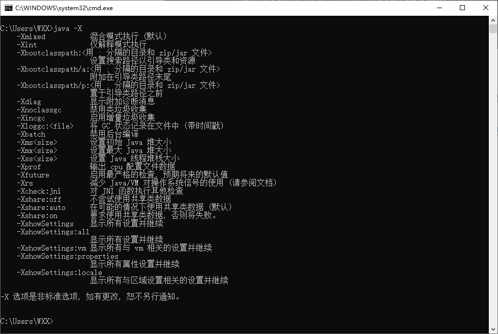

* JVM的JIT编译模式相关的选项

  -Xint    禁用JIT，所有字节码都被解释执行，这个模式的速度是最慢的

  -Xcomp    所有字节码第一次使用都被编译成本地代码，然后再执行

  -Xmixed    混合模式，默认模式，让JIT根据程序运行的情况，有选择地将某些代码编译成本地代码

* 特别的

  **-Xms -Xmx -Xss属于XX参数**

  * -Xms\<size>    设置初始Java堆大小，等价于-XX:InitialHeapSize
  * -Xmx\<size>    设置最大Java堆大小，等价于-XX:MaxHeapSize
  * -Xss\<size>    设置Java线程堆栈大小，等价于-XX:ThreadStackSize

### 1.3 类型三：-XX参数

* 特点：非标准化参数，<font color=red>**使用最多的参数选项**</font>，这类选项属于实验性，不稳定。<font color=red>**以-XX开头**</font>

* 作用：用于开发和调试JVM

* **分类**：

  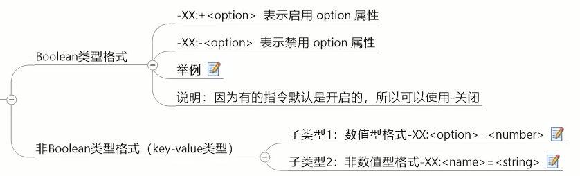

  例子：

  ```shell
  # Boolean类型格式
  -XX:+UseParallelGC			# 选择垃圾收集器为并行收集器
  -XX:+UseG1GC				# 表示启用G1收集器
  -XX:+UseAdaptiveSizePolicy	# 自动选择年轻代区大小和响相应的Survivor区比例
  
  # 非Boolean类型格式(key-value类型)
  # 子类型1：数值型格式 -XX:<option>=<number>
  # number表示数值，可带上单位：(兆：'m','M'),(KB：'k', 'K'), (GB：'g','G')
  -XX:NewSize=1024m			# 表示设置新生代初始大小为1024兆
  -XX:MaxGCPauseMills=500		# 表示设置GC停顿时间：500毫秒
  -XX:GCTimeRatio=19			# 表示设置吞吐量
  -XX:NewRatio=2				# 表示老年代和新生代的比例为2
  # 子类型1：非数值型格式 -XX:<option>=<string>
  -XX:HeapDumpPath=/usr/local/heapdump.hprof		# 用于指定heap转存文件的存储路径
  ```

  

* 特别地：

  ```shell
  -XX:+PrintFlagsFinal
  ```

  * 输出所有参数的名称和默认值
  * 默认不包括Diagnositc和Experiment的参数
  * 可以配合`-XX:+UnlockDiagnosticVMOptions`和`-XX:UnlockExperimentVMOptions`使用

## 2 添加JVM参数选项

> eclipse

......

> IDEA

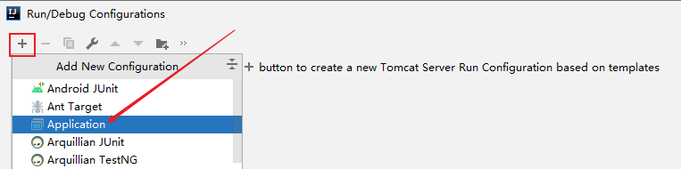

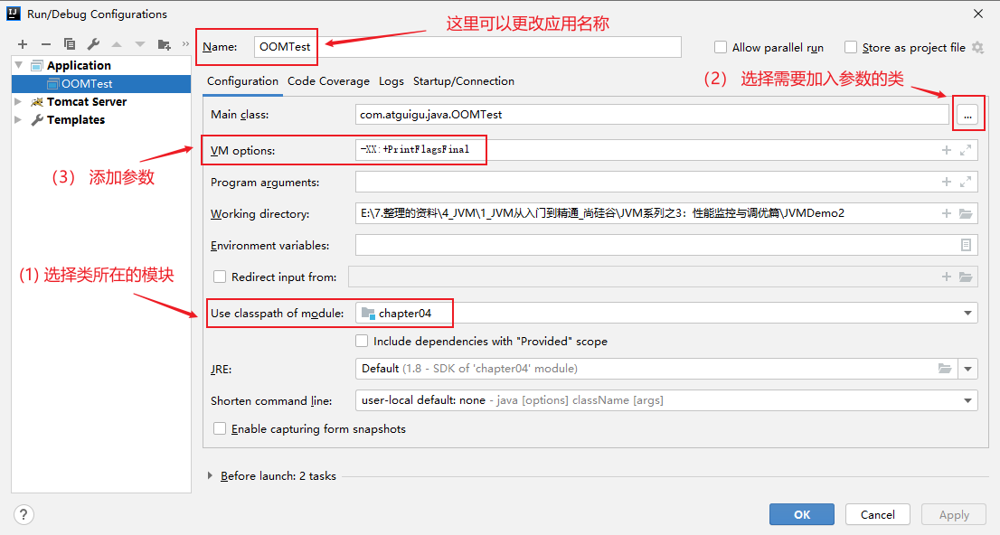

> 运行jar包

```shell
java -Xms50m -Xmx50m -XX:+PrintGCDetails -XX:+PrintGCTimeStamps -jar demo.jar
```

> 通过Tomcat运行war包

* Linux系统下可以在tomcat/bin/catalina.sh中添加如下配置：`JAVA_OPTS="-Xms512M -Xmx1024M"`
* Windows系统下在catalina.bat中添加类似如下配置：`set "JAVA_OPTS=-Xms512M -Xmx1024M"`

> 程序运行过程中

* 使用`jinfo -flag <name>=<value> <pid>`设置非Boolean类型参数
* 使用`jinfo -flag [+|-]<name> <pid>`设置Boolean类型参数


## 3 常用的JVM参数选项

> [命令参数官方网址](https://docs.oracle.com/javase/8/docs/technotes/tools/unix/java.html)

### 3.1 打印设置的XX选项及值

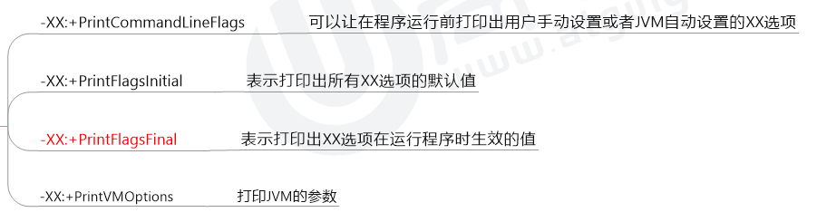

### 3.2 堆、栈、方法区等内存大小设置

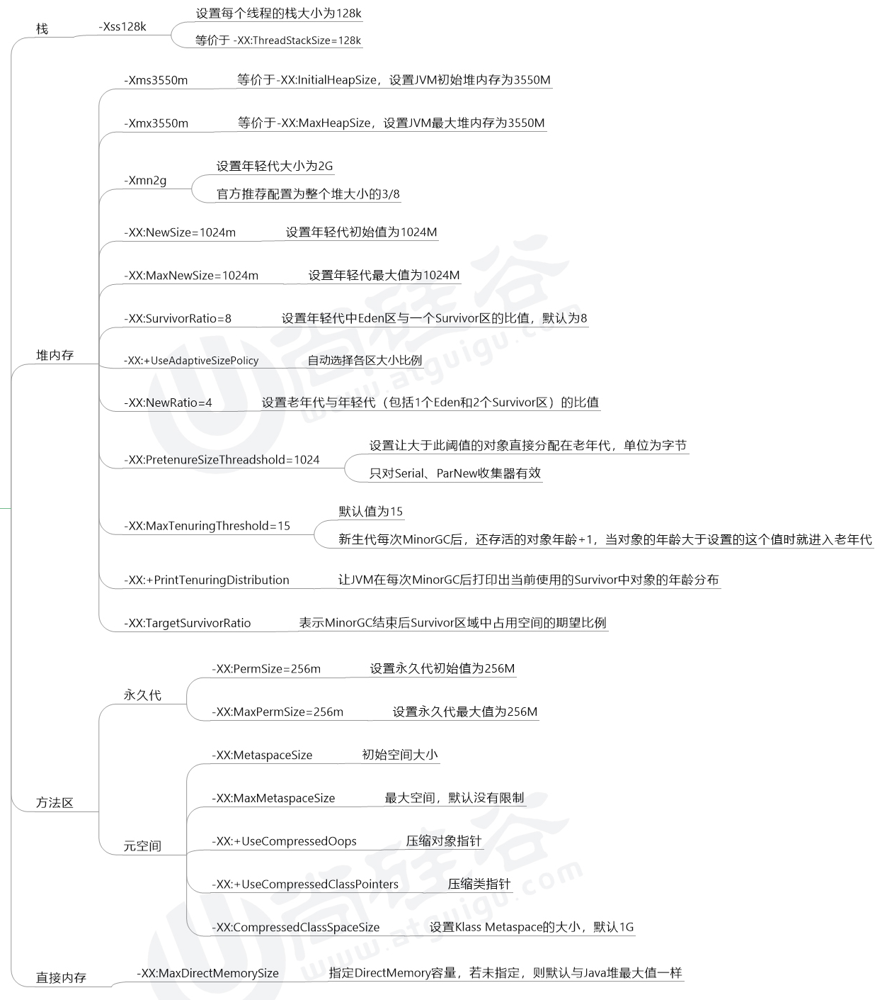

* 注意点：虽然默认参数`-XX:SurvivorRatio=8`，但是如果不显式设置，实际上Eden : S0 : S1 = 6 : 1 : 1（默认情况下，`-XX:+UseAdaptivePolicy`是开启的，即使关闭该选项，但显式未设置`-XX:SurvivorRatio=8`，实际比例仍是 6 : 1 : 1）。只要显式设置`-XX:SurvivorRatio=8`，则Eden : S0 : S1 = 8 : 1 : 1。

### 3.3 OutofMemory相关的选项

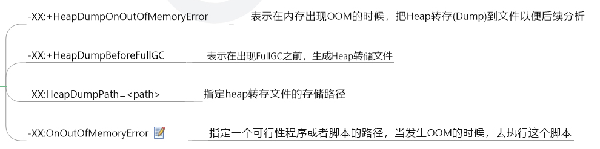

* 对OnOutOfMemoryError的运维处理

  以部署在linux系统/opt/Server目录下的Server.jar为例

  （1）在run.sh启动脚本中添加jvm参数

  ```shell
  -XX:OnOutOfMemoryError=/opt/Server/restart.sh
  ```

  （2）restart.sh脚本

  linux环境

  ```bash
  #!/bin/bash
  pid=$(pf -ef | grep Server.jar | awk '{if($8=="java"){print $2}}')
  kill -9 $pid
  cd /opt/Server/;sh run.sh
  ```

  windows环境

  ```shell
  echo off
  wmic process where Name='java.exe' delete
  cd D:\Server
  start run.bat
  ```

### 3.4 垃圾收集器相关选项

* 7款经典垃圾收集器与垃圾分代之间的关系

  

* 垃圾收集器的组合关系

  

  * 该图已经更新到JKD14

    * 如果把图中的虚线均看做实线，这是JDK8（不包含JDK8）之前垃圾收集器的组合关系
    * 对CMS和MSC之间的线是指如果CMS失败，启动MSC（MSC相当于后备方案）
    * 在JDK8中废弃了两条<font color=red>**红色虚线**</font>的组合（JEP 173），在JDK9中这两根红色虚线做了移除（JEP 214）。
    * 在JDK14中，弃用了<font color=gree>**绿色虚线**</font>的组合（JEP 366）。
    * 在JDK14中，删除了<font color=cyan>**青色虚线框**</font>中的CMS垃圾回收器（JEP 363）。

  * JDK8中默认的垃圾回收器是：Parallel Scavenge GC + Parallel Old GC

  * 为什么Parallel Scanvenge GC不能和CMS搭配使用？

    * Parallel Scanvenge GC底层用的框架和其他不同，不兼容。

* 思维导图

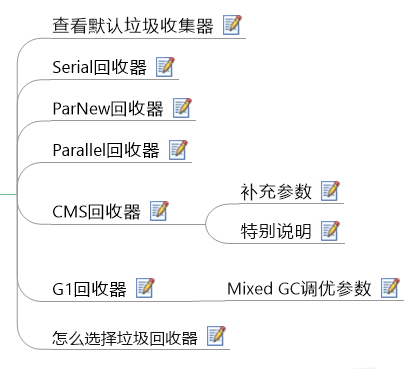

> 查看默认垃圾收集器

```shell
-XX:+PrintCommandLineFlags  # 查看命令行相关参数(包含使用的垃圾收集器)
```

使用命令行指令：

```shell
jinfo -flag 相关垃圾收集器参数 进程ID
```

> Serial回收器

Serial收集器作为HotSpot中Client模式下的默认新生代垃圾收集器。Serial Old是运行在Client模式下默认的老年代垃圾回收器。

```shell
-XX:+UseSerialGC
```

指定年轻代和老年代都是用串行收集器。等价于新生代使用Serial GC，老年代用Serial Old GC。可以获得最高的单线程收集效率。

> ParNew回收器

```shell
-XX:UseParNewGC
```

手动指定使用ParNew收集器执行内存回收任务。它表示年轻代使用并行收集器，不影响老年代。

```shell
-XX:ParallelGCThreads=N
```

限制线程数量，默认开启和CPU数据相同的线程数。

> Parallel回收器（吞吐量优先）

* 参数配置
  * <font color=blue>**-XX:+UseParallelGC**</font>  手动指定新生代用Parallel并行收集器执行内存回收任务。
  * <font color=blue>**-XX:UseParallelOldGC**</font>  手动指定老年代使用并行会收收集器。
    *  分别适用于新生代和老年代，默认jdk8是开启的。
    *  上面两个参数，默认开启一个，另一个也会被开启。（相互激活）
  * <font color=blue>**-XX:ParallelGCThreads**</font>  设置新生代并行收集器的线程数，一般的，最好与CPU数量相等，以避免过多的线程影响垃圾收集的性能。
    * 默认情况下，当CPU数量小于等于8个，ParallelGCThreads的值等于CPU数量。
    * 当CPU数量大于8个，ParallelGCThreads的值等于3+[5*CPU_count/8]。
  * <font color=blue>**-XX:MaxGCPauseMillis**</font>  设计垃圾收集器的最大停顿时间（即STW的时间）。单位是毫秒。
    * 为了尽可能把停顿时间控制在MaxGCPauseMillis以内，收集器在工作时会调整Java堆大小或者其他一些参数。
    * 对于用户来说，停顿时间越短体验越好，但是在服务器端，我们注重高并发，整体的吞吐量。所以服务器端适合Parallel，进行控制。
    * <font color=red>**该参数使用需谨慎。**</font>
  * <font color=blue>**-XX:GCTimeRatio**</font>  垃圾收集时间占总时间的比例（=1/（N+1））。用于衡量吞吐量的大小。
    * 取值范围（0，100）。默认99，也就是垃圾回收时间不超过1%。
    * 与前一个-XX:MaxGCPauseMillis参数有一定矛盾性。暂停时间越短，Ratio参数就越容易超过设定的比例。
  * <font color=blue>**-XX:+UseAdaptiveSizePolicy**</font>  设置Parallel Scavenge收集器具有**自适应调节策略**。
    * 在这种模式下，新生代的大小，Eden和Survivor的比例，晋升老年代的对象年龄等参数会被自动调整，以达到在堆大小、吞吐量和停顿时间之间的平衡点。
    * 在手动调优比较困难的场合，可以直接使用这种自适应的方式，仅指定虚拟机的最大堆、目标吞吐量（GCTimeRatio）和停顿时间（MaxGCPauseMillis），让虚拟机自己完成调优工作。

> CMS回收器（低延迟）

* 参数配置
  * <font color=blue>**-XX:UseConcMarkSweepGC**</font>  手动指定使用CMS收集器执行内存回收任务。
    * 开启该参数后会自动将-XX:+UseParNewGC打开。即ParNew（Young区用）+CMS（Old区用）+Serial Old的组合。
  * <font color=blue>**-XX:CMSInitiatingOccupanyFraction**</font>  设置堆内存使用率的阈值，一旦达到阈值，便开始回收。
    * JDK5及以前的版本的默认值为68，即当老年代的利用率达到68%时，会执行一次CMS回收。<font color=blue>**JDK6及以上版本默认值为92%**</font>。
    * 如果内存增长缓慢，这可以设置一个较大的值，大的阈值可以有效降低CMS的出发频率，减少老年代回收的次数可以较为明显地改善应用程序性能。反之，如果内存使用率增长很快，则应该降低这个阈值，以避免频繁触发老年代串行收集器。因此<font color=blue>**通过该选项可以有效降低Full GC的执行次数**</font>。
  * <font color=blue>**-XX:UseCMSCompactAtFullCollection**</font>  用于指定在执行完Full GC后对内存进行压缩整理，以此避免内存碎片的产生。不过由于内存压缩整理过程无法并发执行，所带来的问题就是停顿时间变得更长了。
  * <font color=blue>**-XX:CMSFullGCsBeforeCompaction**</font>  设置在执行多少次Full GC后对内存空间进行压缩整理。
  * <font color=blue>**-XX:ParallelCMSThreads**</font>  设置CMS的线程数量。
    * CMS默认启用的线程数是（ParallelGCThreads+3）/4，ParallelGCThreads是新生代并行收集器的线程数，当CPU资源比较紧张时，收到CMS收集器的影响，应用程序的性能在垃圾回收阶段可能会非常糟糕。

* 补充参数

  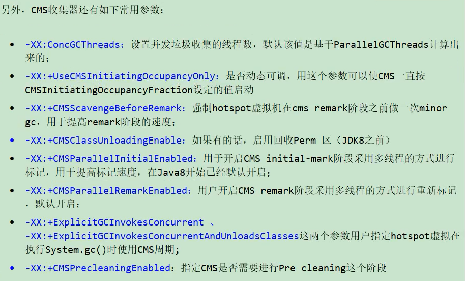

* 特殊说明

  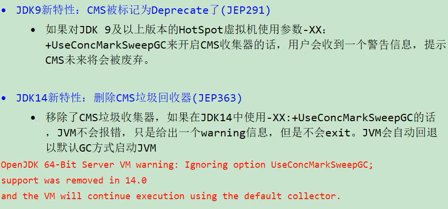

> G1回收器

* 参数设置

  * <font color=blue>**-XX:UseG1GC**</font>    手动指定使用G1收集器执行内存回收任务。
  * <font color=blue>**-XX:G1HeapRegionSize**</font>    设置每个Region的大小。值是2的幂，范围是1MB到32MB之间，目标是根据最小的Java堆大小划分出2048个区域。Region默认是堆内存的1/2000。
  * <font color=blue>**-XX:MaxGCPauseMillis**</font>    设置期望达到的最大GC停顿时间指标（JVM会尽力实现，但不保证达到）。默认是200ms。
  * <font color=blue>**-XX:ParallelGCThread**</font>    设置STW时GC线程数的值。最多设置为8。
  * <font color=blue>**-XX:ConcGCThreads**</font>    设置并发标记的线程数，建议将该参数设置为并行垃圾回收线程（ParallelGCThreads）的1/4左右。
  * <font color=blue>**-XX:InitiatingHeapOccupancyPercent**</font>    设置触发并发GC周期的Java堆占用阈值。超过此值，就触发GC。默认是45.
  * <font color=blue>**-XX:G1NewSizePercent、-XX:G1MaxNewSizePercent**</font>    新生代占整个堆内存的最小百分比（默认5%）、最大百分比（默认60%）
  * <font color=blue>**-XX:G1ReservePercent**</font>    保留内存区域，防止to space（Survivor中的to区）溢出

* Mixed GC调优参数

  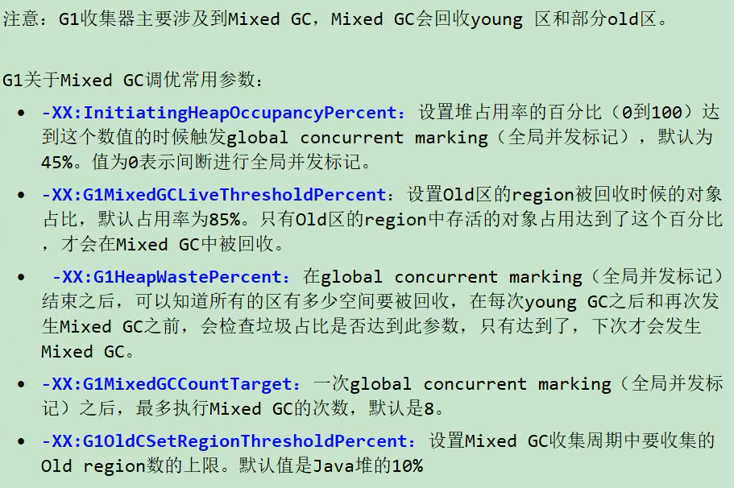

> 怎么选择垃圾回收器

Java垃圾回收器的配置对于JVM优化来说是一个很重要的选择，选择合适的垃圾回收器可以让JVM的性能有一个很大的提升。

1. 优先调整堆的大小让JVM自适应完成
2. 如果内存小于100MB，使用串行收集器
3. 如果单核、单机程序，并且没有停顿时间的要求，串行收集器
4. 如果是多CPU、需要高吞吐量、允许停顿时间超过1秒，选择并行或者JVM自行选择
5. 如果是多CPU、追求地停顿时间，需要快速响应（比如延迟不能超高1秒，如互联网应用），使用并发收集器；官方推荐G1，性能高。<font color=blue>**现在互联网的项目，基本都是使用G1**</font>。

* **最后明确一个观点**
  * 没有最好的收集器，更没有万能的收集器；调优永远针对特定场景、特定需求，不存在一劳永逸的收集器。

### 3.5 GC日志相关选项


### 3.6 其他参数

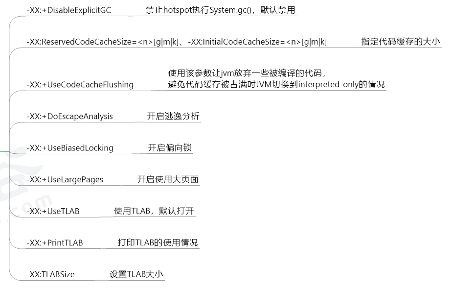

## 4 通过Java代码获取JVM参数

* Java提供了java.lang.management包用于监视和管理Java虚拟机和Java运行时中的其他组件，它允许本地和远程监控和管理运行Java虚拟机。其中ManagementFactory这个类还是挺常用的。另外还有Runtime类也可以获取一些内存、CPU核数等相关数据。
* 通过这些api可以监控我们的应用服务器堆内存的使用情况，设置一些阈值进行报警处理。

```java
/**
 * 监控我们的应用服务器的堆内存使用情况，设置一些阈值进行报警等处理
 */
public class MemoryMonitor {
    public static void main(String[] args) {
        MemoryMXBean memorymbean = ManagementFactory.getMemoryMXBean();
        MemoryUsage usage = memorymbean.getHeapMemoryUsage();
        System.out.println("INIT HEAP: " + usage.getInit() / 1024 / 1024 + "m");
        System.out.println("MAX HEAP: " + usage.getMax() / 1024 / 1024 + "m");
        System.out.println("USE HEAP: " + usage.getUsed() / 1024 / 1024 + "m");
        System.out.println("\nFull Information:");
        System.out.println("Heap Memory Usage: " + memorymbean.getHeapMemoryUsage());
        System.out.println("Non-Heap Memory Usage: " + memorymbean.getNonHeapMemoryUsage());

        System.out.println("=======================通过java来获取相关系统状态============================ ");
        System.out.println("当前堆内存大小totalMemory " + (int) Runtime.getRuntime().totalMemory() / 1024 / 1024 + "m");// 当前堆内存大小
        System.out.println("空闲堆内存大小freeMemory " + (int) Runtime.getRuntime().freeMemory() / 1024 / 1024 + "m");// 空闲堆内存大小
        System.out.println("最大可用总堆内存maxMemory " + Runtime.getRuntime().maxMemory() / 1024 / 1024 + "m");// 最大可用总堆内存大小
    }
}
/*
 INIT HEAP: 256m
 MAX HEAP: 3614m
 USE HEAP: 5m
 
 Full Information:
 Heap Memory Usage: init = 268435456(262144K) used = 5383480(5257K) committed = 257425408(251392K) max = 3790077952(3701248K)
 Non-Heap Memory Usage: init = 2555904(2496K) used = 4789360(4677K) committed = 8060928(7872K) max = -1(-1K)
 =======================通过java来获取相关系统状态============================ 
 当前堆内存大小totalMemory 245m
 空闲堆内存大小freeMemory 240m
 最大可用总堆内存maxMemory 3614m
 */
```


