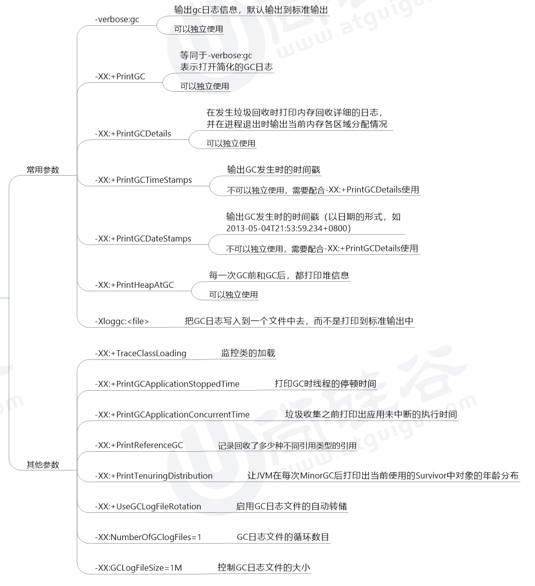

# 第26章 分析GC日志

> 来自尚硅谷宋红康老师讲解的JVM：[bilibili链接](https://www.bilibili.com/video/BV1PJ411n7xZ)


## 1 GC日志参数




## 2 GC日志格式

### 2.1 GC分类

针对HotSpot VM的实现，它里面的GC按照回收区域又可分为辆大众类型：一种是部分收集（Partial GC），一种是整堆收集（Full GC）

* 部分收集：不是完整收集整个Java堆的垃圾收集。其中又分为
  * 新生代收集（Minor GC / Young GC）：只有新生代（Eden\S0,S1）的垃圾收集
  * 老年代收集（Major GC / Old GC）：只有老年代的垃圾收集。
    * 目前，只有CMS GC会有单独收集老年代的行为。
    * <font color=red>**注意，很多时候Major GC会和Full GC混淆使用，需要具体分辨是老年代还是整堆回收。**</font>
  * 混合收集（Mixed GC）：收集整个新生代以及部分老年代的垃圾收集
    * 目前，只有G1 GC会有这种行为
* 整堆收集（Full GC）：收集整个Java堆和方法区的垃圾收集。

---

* 哪些情况会出发Full GC？
  * 老年代空间不足
  * 方法区空间不足
  * 显式调用System.gc()
  * Minor GC进入老年代的数据的平均大小 大于 老年代的可用内存
  * 大对象直接进入老年代，而老年代的可用空间不足

### 2.2 GC日志分类

* Minor GC

  

* Full GC

  

### 2.3 GC日志结构剖析

> 垃圾收集器

* 使用Serial收集器在新生代的名字是Default New Generation，因此显示的是"[DefNew"
* 使用ParNew收集器在新生代的名字会变成"[ParNew"，意思是："Parallel New Generation"
* 使用Parallel Scavenage收集器在新生代的名字是"[PSYoungGen"，这里的JDK1.7使用的就是PSYoungGEN
* 使用Parallel Old Generation收集器在老年代的名字是"[ParOldGen"
* 使用G1收集器的话，会显示"garbage-fisrt heap"

**Allocation Failure**：表明本次引起GC的原因是因为在**新生代中没有足够的空间能够存储新的数据了**

> GC前后情况

* 通过图示，我们可以发现GC日志的规律一般都是：GC前内存占用---->GC后内存占用（该区域内存总大小）

  ```shell
  [PSYoungGen:5986K->696K(8704K)]5986K->704K(9216K)
  ```

  中括号内：GC回收前新生代占用内存大小，回收后大小（新生代堆总大小）

  中括号外：GC回收前新生代和老年代占用内存大小，回收后大小（新生代和老年代总大小）

> GC时间

GC日志中有三个时间：user，sys和real

* user：进程执行用户态代码（核心之外）所使用的时间。<font color=red>**这是执行此进程所使用的实际CPU时间**</font>，其他进程和此进程阻塞的时间并不包括在内。在垃圾收集的情况下，表示GC线程执行所使用的CPU总时间。
* sys：进程在内核态消耗的CPU时间，即<font color=red>**在内核执行系统调用或等待系统事件所使用的的CPU时间**</font>。
* real：程序从开始到结束所用的时钟时间。这个时间包括其他进程使用的时间片和进程阻塞的时间（比如等待I/O完成）。对于并行gc，这个数字应该接近（用户时间+系统时间）/ 垃圾收集器使用的线程数。

由于多核的原因，一般的GC事件中，real time是小于sys+user time的，因为一般是多个线程并发去做GC，所以rea time是要小于sys+user time的。如果real>sys+user time的话，则你的应用可能存在下列问题：IO负载非常重或者CPU不够用。

### 2.4 Minor GC日志解析

```shell
2020-11-20T17:19:43.265-0800:0.822:[GC (ALLOCATION FAILURE)[PSYOUNGGEN:76800K->8843k(89600K)]76800K->8449K(29400K), 0.008371 SECS] [TIMES:USER=0.02 SYS=0.01, REAL=0.01 SECS]
```


### 2.4 Full GC日志解析

```shell
2020-11-20T17:19:43.794-0800:1.352:[FULL GC (METADATA GC THREADHOLD)[PSYOUNGGEN:10082K->0K(89600K)][PAROLDGEN]:32K->9638K(204800K)]10114K->9638K(294400K),[METASPACE:20158K->20156K(1067008K)], 0.0285388 SECS][TIMES:USER=0.11 SYS=0.00, REAL=0.03 SECS]
```


## 3 GC日志分析工具

* 上节介绍了GC日志的打印含义，但是GC日志看起来比较麻烦，本节会介绍一下GC日志可视化分析工具GCEasy和GCViewer等。通过GC日志可视化分析工具，我们可以方便的看到JVM各个分代的内存使用情况、垃圾回收次数、垃圾收集原因、垃圾回收占用的时间、吞吐量等，这些指标在我们进行JVM调优的时候还是很有用的。

* 如果想把GC日志存到文件的话，是下面这个参数：

  ```shell
  -Xloggc:/path/to/gc.log
  ```

  然后就可以用一些工具去分析这些gc日志。

### 3.1 GCEasy

* GCEasy-------一款超好用的在线分析GC日志的网站

* GCEasy可以通过GC日志分析进行内存泄露检测、GC展厅原因分析、JVM配置建议优化等功能，而且是可以免费使用的（有一些服务是收费的）

* [官方网站](https://gceasy.io/)

  

### 3.2 GCViewer

* 这是一款离线版的GC日志分析工具

* GCViewer是一个免费的、开源的分析小工具，可用于可视化查看由SUN/Oracle，IBM，HP和BEA Java虚拟机产生的垃圾收集器的日志。

* GCViewer可用于可视化Java VM选项-verbose:gc 和.NET生成的数据-Xloggc:\<file>。它还计算与垃圾回收相关的性能指标（吞吐量，累积的暂停，最长的暂停等）。当通过更改世代大小或设置初始堆大小来调整特定应用程序的垃圾回收时，此功能非常有用。

* 下载GCViewer工具

  * 源码下载：[网址](https://github.com/chewiebug/GCViewer)
  * 运行版本下载：[网址](https://github.com/chewiebug/GCViewer/wiki/Changelog)

  只需要双击gcviewer-1.3x.jar或运行java -jar gcviewer-1.3x.jar（它需要运行java 1.8 vm），即可启动GCViewer（gui）

### 3.3 其他工具


